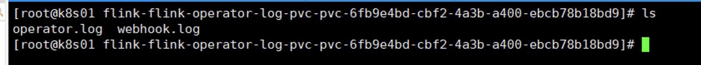

# Flink on Kubernetes - Kubernetes Operator - 配置 Operator 日志持久化   

>Operator version: 1.8    

## 引言   
“我们 需要 Operator Log”，Flink Kubernetes Operator 部署后，并没有将 Log 持久化在 Pod 内部文件目录中，可访问 Operator 官网 `https://nightlies.apache.org/flink/flink-kubernetes-operator-docs-main/docs/operations/metrics-logging/#logging`，了解关于 Logging 的介绍，内容如下：     

>The Operator controls the logging behaviour for Flink applications and the Operator itself using configuration files mounted externally via ConfigMaps. Configuration files(https://github.com/apache/flink-kubernetes-operator/tree/main/helm/flink-kubernetes-operator/conf) with default values are shipped in the Helm chart. It is recommended to review and adjust them if needed in the values.yaml file before deploying the Operator in production environments.       

### 查看 log4j-operator.properties 配置 
了解可知，Operator 的 log 是通过 ConfigMaps 下的 `log4j-operator.properties` 配置的。 可访问 https://github.com/apache/flink-kubernetes-operator/tree/main/helm/flink-kubernetes-operator/conf 下的 `log4j-operator.properties` 也可使用 `kubectl -n flink describe configmap flink-operator-config` 命名，查看 `log4j-operator.properties:` 内容。       

**查看 Operator configmaps：**      
```shell
[root@k8s01 ~]# kubectl get configmaps -n flink        
NAME                    DATA   AGE
flink-operator-config   3      62m
kube-root-ca.crt        1      44d
```

**log4j-operator.properties 内容如下：**   
```bash   
################################################################################
#  Licensed to the Apache Software Foundation (ASF) under one
#  or more contributor license agreements.  See the NOTICE file
#  distributed with this work for additional information
#  regarding copyright ownership.  The ASF licenses this file
#  to you under the Apache License, Version 2.0 (the
#  "License"); you may not use this file except in compliance
#  with the License.  You may obtain a copy of the License at
#
#      http://www.apache.org/licenses/LICENSE-2.0
#
#  Unless required by applicable law or agreed to in writing, software
#  distributed under the License is distributed on an "AS IS" BASIS,
#  WITHOUT WARRANTIES OR CONDITIONS OF ANY KIND, either express or implied.
#  See the License for the specific language governing permissions and
# limitations under the License.
################################################################################

rootLogger.level = INFO
rootLogger.appenderRef.console.ref = ConsoleAppender

# Log all infos to the console
appender.console.name = ConsoleAppender
appender.console.type = CONSOLE
appender.console.layout.type = PatternLayout
appender.console.layout.pattern = %style{%d}{yellow} %style{%-30c{1.}}{cyan} %highlight{[%-5level]%notEmpty{[%X{resource.namespace}/}%notEmpty{%X{resource.name}]} %msg%n%throwable}

# Do not log config loading
logger.conf.name = org.apache.flink.configuration.GlobalConfiguration
logger.conf.level = WARN

# Avoid logging fallback key INFO messages
logger.conf.name = org.apache.flink.configuration.Configuration
logger.conf.level = WARN

# Flink Operator Logging Overrides
# rootLogger.level = DEBUG
# logger.operator.name= org.apache.flink.kubernetes.operator
# logger.operator.level = DEBUG
```

`log4j-operator.properties` 只定义了 `ConsoleAppender`, 这显然对一个Java 程序来说是远远不够的, `它会让 Operator log 使用 kubectl logs`查看 。         

* 当 Flink Job 部署以及运行过程中，可能出现的异常，Operator Log 需排查      
* 当 `Custom Operator Plugins` 部署以及运行过程中，可能出现的异常，Operator Log 需排查     
>可访问官网 `https://nightlies.apache.org/flink/flink-kubernetes-operator-docs-main/docs/operations/plugins/#custom-operator-plugins` 了解更多 Plugins细节(其含义，我们开发 jar，托管给 Operator 执行)， `后续在实践 “Custom Flink Resource Listeners” 监听 Flink Job状态, Log 也特别重要`  ...      

## 配置 log4j-operator.properties   


当 Flink Job 部署异常时，我们首要查看的是 Flink Kubernetes Operator POD 的 log，


1.编写日志 operator-log-pvc.yaml    
vim operator-log-pvc.yaml   

```yaml
#flink-kubernetes-operator log 持久化存储pvc
apiVersion: v1
kind: PersistentVolumeClaim
metadata:
  name: flink-operator-log-pvc  # operator log pvc名称
  namespace: flink   # 指定归属的名命空间
spec:
  storageClassName: nfs-storage   #sc名称，更改为实际的sc名称
  accessModes:
    - ReadWriteMany   #采用ReadWriteMany的访问模式
  resources:
    requests:
      storage: 1Gi    #存储容量，根据实际需要更改
```


2.创建日志pvc
kubectl apply -f operator-log-pvc.yaml  

3.查看pvc   
kubectl get pvc -n flink    

4.查看pv 
kubectl get pv | grep flink 

5.修改helm/values.yaml文件，添加log4j配置信息   
cd /root/flink-operator/helm    
vim values.yaml 

```yaml
defaultConfiguration:
  log4j-operator.properties: |+
    # Flink Operator Logging Overrides
    # rootLogger.level = DEBUG
    # logger.operator.name= org.apache.flink.kubernetes.operator
    # logger.operator.level = DEBUG
    rootLogger.appenderRef.file.ref = LogFile
    appender.file.name = LogFile
    appender.file.type = File
    appender.file.append = false
    appender.file.fileName = ${sys:log.file}
    appender.file.layout.type = PatternLayout
    appender.file.layout.pattern = %d{yyyy-MM-dd HH:mm:ss,SSS} %-5p %-60c %x - %m%n
  log4j-console.properties: |+
    # Flink Deployment Logging Overrides
    # rootLogger.level = DEBUG

# ** Set the jvm start up options for webhook and operator
jvmArgs:
  webhook: "-Dlog.file=/opt/flink/log/webhook.log"
  operator: "-Dlog.file=/opt/flink/log/operator.log"
```


6.修改helm/templates/flink-operator.yaml，挂载flink-operator-log-pvc    
cd /root/flink-operator/helm/templates
vim flink-operator.yaml 

>修改 挂载点 flink-operator-log  

```yaml
spec:
  securityContext:
    {{- toYaml .Values.podSecurityContext | nindent 8 }}
  {{- with .Values.imagePullSecrets }}
  imagePullSecrets:
    {{- toYaml . | nindent 8 }}
  {{- end }}
  serviceAccountName: {{ include "flink-operator.serviceAccountName" . }}
  containers:
    - name: {{ .Chart.Name }}
      image: "{{ .Values.image.repository }}:{{ .Values.image.tag | default .Chart.AppVersion }}"
      imagePullPolicy: {{ .Values.image.pullPolicy }}
      command: ["/docker-entrypoint.sh", "operator"]
      {{- if .Values.metrics.port }}
      ports:
        - containerPort: {{ .Values.metrics.port }}
          name: metrics
          protocol: TCP
      {{- end }}
      env:
        - name: TZ
          value: Asia/Shanghai
        - name: OPERATOR_NAMESPACE
          value: {{ .Release.Namespace }}
        - name: OPERATOR_NAME
          value: {{ include "flink-operator.name" . }}
        - name: FLINK_CONF_DIR
          value: /opt/flink/conf
        - name: FLINK_PLUGINS_DIR
          value: /opt/flink/plugins
        - name: LOG_CONFIG
          value: -Dlog4j.configurationFile=/opt/flink/conf/log4j-operator.properties
        - name: JVM_ARGS
          value: {{ .Values.jvmArgs.operator }}
        {{- range $k, $v := .Values.operatorPod.env }}
        - name: {{ $v.name }}
          value: {{ $v.value }}
        {{- end }}
      securityContext:
        {{- toYaml .Values.operatorSecurityContext | nindent 12 }}
      volumeMounts:
        - name: flink-operator-log
          mountPath: /opt/flink/log
        - name: flink-operator-config-volume
          mountPath: /opt/flink/conf
        {{- if .Values.operatorVolumeMounts.create }}
        {{- toYaml .Values.operatorVolumeMounts.data | nindent 12 }}
        {{- end }}
    {{- if eq (include "webhook-enabled" .) "true" }}
    - name: flink-webhook
      image: "{{ .Values.image.repository }}:{{ .Values.image.tag | default .Chart.AppVersion }}"
      imagePullPolicy: {{ .Values.image.pullPolicy }}
      command: ["/docker-entrypoint.sh", "webhook"]
      env:
        - name: TZ
          value: Asia/Shanghai
        - name: WEBHOOK_KEYSTORE_PASSWORD
          valueFrom:
            secretKeyRef:
            {{- if .Values.webhook.keystore.useDefaultPassword }}
            name: flink-operator-webhook-secret
            key: password
            {{- else }}
            {{- with .Values.webhook.keystore.passwordSecretRef }}
            {{- toYaml . | nindent 18 }}
            {{- end }}
            {{- end }}
        - name: WEBHOOK_KEYSTORE_FILE
          value: "/certs/keystore.p12"
        - name: WEBHOOK_KEYSTORE_TYPE
          value: "pkcs12"
        - name: WEBHOOK_SERVER_PORT
          value: "9443"
        - name: LOG_CONFIG
          value: -Dlog4j.configurationFile=/opt/flink/conf/log4j-operator.properties
        - name: JVM_ARGS
          value: {{ .Values.jvmArgs.webhook }}
        - name: FLINK_CONF_DIR
          value: /opt/flink/conf
        - name: FLINK_PLUGINS_DIR
          value: /opt/flink/plugins
        - name: OPERATOR_NAMESPACE
          value: {{ .Release.Namespace }}
      securityContext:
        {{- toYaml .Values.webhookSecurityContext | nindent 12 }}
      volumeMounts:
        - name: flink-operator-log
          mountPath: /opt/flink/log
        - name: keystore
          mountPath: "/certs"
          readOnly: true
        - name: flink-operator-config-volume
          mountPath: /opt/flink/conf
    {{- end }}
  volumes:
    - name: flink-operator-log
      persistentVolumeClaim:
        claimName: flink-operator-log-pvc
    - name: flink-operator-config-volume
      configMap:
        name: flink-operator-config
        items:
          - key: flink-conf.yaml
            path: flink-conf.yaml
          - key: log4j-operator.properties
            path: log4j-operator.properties
          - key: log4j-console.properties
            path: log4j-console.properties
```


7.卸载现有的Flink Kubernetes Operator   
helm uninstall flink-kubernetes-operator -n flink   

kubectl -n flink delete configmap kube-root-ca.crt; kubectl -n flink delete svc --all; kubectl -n flink delete secret --all; kubectl -n flink delete serviceaccount --all; kubectl -n flink delete role --all; kubectl -n flink delete rolebinding --all;   

8.重新安装Flink Kubernetes Operator     
cd /root/flink-operator/helm    
helm install -f values.yaml flink-kubernetes-operator . --namespace flink --create-namespace    

>检查 Operator log  
  

9.测试，提交作业    
kubectl apply -f application-deployment-with-hostalises.yaml     

10.查看作业Pod  
kubectl get all -n flink    

11.网页查看 
http://flink.k8s.io:32469/flink/application-deployment-with-hostalises/#/overview

https://k8s01:32469/#/login 

12.删除作业     
kubectl delete-f application-deployment-with-hostalises.yaml    


refer     
1.https://nightlies.apache.org/flink/flink-kubernetes-operator-docs-main/docs/operations/metrics-logging/#logging     
