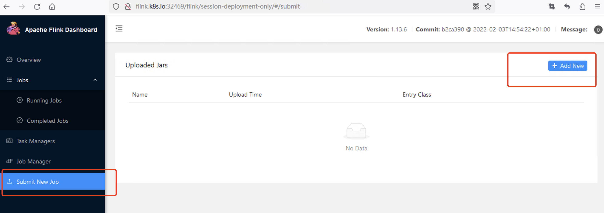
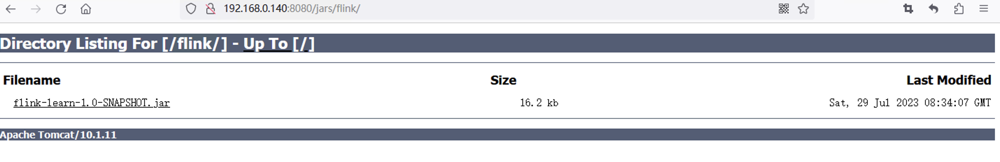

## Flink on K8s Jar 包的管理模式  

### Flink UI 上传 Jar 
此处就不多做介绍，Flink on K8s Session 集群的Flink UI 可上传Jar，并执行作业。   
    

### HTTP 方式下载 Jar   

#### 安装Tomcat 
将作业jar包放到tomcat服务器，使用http方式下载jar包  
1.下载tomcat，上传到k8s01并解压  

2.修改web.xml  
将tomcat的web.xml内listings改为true属性(默认是false)，使tomcat支持文件下载   
```xml
<servlet>
    <servlet-name>default</servlet-name>
    <servlet-class>org.apache.catalina.servlets.DefaultServlet</servlet-class>
    <init-param>
        <param-name>debug</param-name>
        <param-value>0</param-value>
    </init-param>
    <init-param>
        <param-name>listings</param-name>
        <param-value>true</param-value>
    </init-param>
    <load-on-startup>1</load-on-startup>
</servlet>
```

3.将jar包上传到 webapps/jars/flink目录下    

4.启动tomcat  
```
./startup.sh
``` 

5.在浏览器访问 http://192.168.0.140.:8080/jars/flink/   
  

#### 编写 session-job-only.yaml 
1.vim session-job-only.yaml 
```yaml
apiVersion: flink.apache.org/v1beta1
kind: FlinkSessionJob
metadata:
  namespace: flink
  name: session-job-only
spec:
  deploymentName: session-deployment-only  # 需要与创建的集群名称一致
  job:
    jarURI: http://192.168.0.140:8080/jars/flink/flink-learn-1.0-SNAPSHOT.jar # 使用http方式下载jar包
    entryClass: com.yzhou.job.StreamWordCount
    args:
    parallelism: 1  # 并行度
    upgradeMode: stateless
``` 

2.提交  
```
kubectl apply -f session-job-only.yaml
```

3.查看作业创建情况  
```
kubectl get all -n flink  
```

4.访问 Flink UI 
http://flink.k8s.io:32469/flink/session-deployment-only/#/overview  


### 将 Jar 打包进镜像   
1.vim Dockerfile  

```shell
FROM flink:1.13.6
WORKDIR /opt/flink
COPY flink-learn-1.0-SNAPSHOT.jar /opt/flink/flink-learn-1.0-SNAPSHOT.jar
ENTRYPOINT ["/docker-entrypoint.sh"]
EXPOSE 6123 8081
CMD ["help"]
``` 

2.在所有k8s worker节点打包镜像到本地（因没有使用horbar）  
```
docker build -f Dockerfile -t flink-wc:1.13.6 . 
```

3.编写 Application 模式作业 
vim application-deployment.yaml     
```yaml  
# Flink Application集群
apiVersion: flink.apache.org/v1beta1
kind: FlinkDeployment
metadata:
  namespace: flink
  name: application-deployment
spec:
  image: flink-wc:1.13.6
  flinkVersion: v1_13
  imagePullPolicy: IfNotPresent   # 镜像拉取策略，本地没有则从仓库拉取
  ingress:   # ingress配置，用于访问flink web页面
    template: "flink.k8s.io/{{namespace}}/{{name}}(/|$)(.*)"
    className: "nginx"
    annotations:
      nginx.ingress.kubernetes.io/rewrite-target: "/$2"
  flinkConfiguration:
    taskmanager.numberOfTaskSlots: "2"
  serviceAccount: flink
  jobManager:
    replicas: 1
    resource:
      memory: "1024m"
      cpu: 1
  taskManager:
    replicas: 1
    resource:
      memory: "1024m"
      cpu: 1
  job:
    jarURI: local:///opt/flink/flink-learn-1.0-SNAPSHOT.jar
    entryClass: com.yzhou.job.StreamWordCount
    args:
    parallelism: 1
    upgradeMode: stateless
```

4.提交  
```
kubectl apply -f  application-deployment.yaml 
```

5.访问 Flink UI 
http://flink.k8s.io:32469/flink/application-deployment/#/overview


### 将 Jar 放入 PVC+PV 并挂在 Pod   

1.创建 JAR 包的 PVC  flink-jar-pvc.yaml
vim flink-jar-pvc.yaml  
```xml
#  Flink 作业jar 持久化存储pvc
apiVersion: v1
kind: PersistentVolumeClaim
metadata:
  name: flink-jar-pvc  # jar pvc名称
  namespace: flink
spec:
  storageClassName: nfs-storage   #sc名称
  accessModes:
    - ReadOnlyMany   #采用ReadOnlyMany的访问模式
  resources:
    requests:
      storage: 1Gi    #存储容量，根据实际需要更改
```
      


2.将 JAR 包放到 PV 的实际路径
kubectl get pvc
kubectl get pv -n flink

3.编写 application-deployment-with-pv.yaml
vim application-deployment-with-pv.yaml 
```yaml
# Flink Application集群
apiVersion: flink.apache.org/v1beta1
kind: FlinkDeployment
metadata:
  namespace: flink
  name: application-deployment-with-pv
spec:
  image: flink:1.13.6
  flinkVersion: v1_13
  imagePullPolicy: IfNotPresent   # 镜像拉取策略，本地没有则从仓库拉取
  ingress:   # ingress配置，用于访问flink web页面
    template: "flink.k8s.io/{{namespace}}/{{name}}(/|$)(.*)"
    className: "nginx"
    annotations:
      nginx.ingress.kubernetes.io/rewrite-target: "/$2"
  flinkConfiguration:
    taskmanager.numberOfTaskSlots: "2"
  serviceAccount: flink
  jobManager:
    replicas: 1
    resource:
      memory: "1024m"
      cpu: 1
  taskManager:
    replicas: 1
    resource:
      memory: "1024m"
      cpu: 1
  podTemplate:
    spec:
      containers:
        - name: flink-main-container
          volumeMounts:
            - name: flink-jar  # 挂载nfs上的jar
              mountPath: /opt/flink/jar
      volumes:
        - name: flink-jar
          persistentVolumeClaim:
            claimName: flink-jar-pvc
  job:
    jarURI: local:///opt/flink/jar/flink-learn-1.0-SNAPSHOT.jar
    entryClass: com.yzhou.job.StreamWordCount
    args:
    parallelism: 1
    upgradeMode: stateless
```

4.提交yaml
kubectl -f application-deployment-with-pv.yaml  

5.查看  
kubectl get all -n flink  

6.网页查看  
http://flink.k8s.io:32469/flink/application-deployment-with-pv/#/overview 


