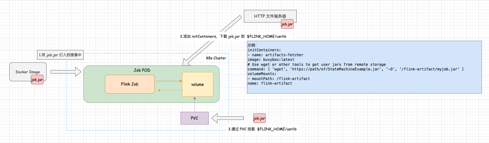

# Flink on Kubernetes - Native Kubernetes - 基础环境配置    

>Flink version: 1.17, Kubernetes version: 1.23.16     

## 引言 
在 Flink on Kubernetes 环境中，Job 部署方式分为2种：    
1.Native Kubernetes         
2.Kubernetes Operator               

判断Job 是哪种方式部署，其主要特征是 Job YAML 的 kind。 例如，Native Kubernetes 的 YAML中的 kind 是 Deployment (Deployment 是 Kubernetes中 已有的资源类型), 在后面`Native Kubernetes`的实战会详细介绍它的具体使用， 而 Kubernetes Operator 的 YAML中的 kind 是 `FlinkDeployment`。      

>该篇 Blog的用意从以下几个方面阐述：        
1.了解 Native Kubernetes Job 部署过程，可深刻体会`Kubernetes Operator机制` 给Flink Job部署带来哪些优势？            
2.了解 底层运作，我们才更有可能学习到 "TRUTH"              

>接下来，一起探索 Native Kubernetes 方式的 Job 部署。   

若你还不太了解，可访问 https://nightlies.apache.org/flink/flink-docs-release-1.19/docs/deployment/resource-providers/native_kubernetes/ 。            

## 配置 Native Kubernetes 环境       

根据官网的 `Preparation` 章节信息，还需对环境做一些准备。           

> ### Preparation       
>The Getting Started section assumes a running Kubernetes cluster fulfilling the following requirements:         
    Kubernetes >= 1.9.
    KubeConfig, which has access to list, create, delete pods and services, configurable via ~/.kube/config. You can verify permissions by running kubectl auth can-i <list|create|edit|delete> pods.
    Enabled Kubernetes DNS.
    default service account with RBAC permissions to create, delete pods.
   
### 1.查看 Kubernetes version               
```shell        
kubectl version --short

# output log:
Client Version: v1.23.16
Server Version: v1.23.16
```

### 2.检查 ~/.kube/config 下的 list，create，delete，edit pods和services的权限满足权限(本人是在 k8s 集群中的 192.168.0.140 执行)              
```shell
kubectl auth can-i list pods
yes
kubectl auth can-i create pods
yes
kubectl auth can-i edit pods
yes
kubectl auth can-i delete pods
yes
kubectl auth can-i list services
yes
kubectl auth can-i create services
yes
kubectl auth can-i edit services
yes
kubectl auth can-i delete services
yes
```

### 3.Enabled Kubernetes DNS ？         
使用 `kubectl cluster-info` 查看 CoreDNS信息。            
```shell
[root@k8s01 ~]# kubectl cluster-info 
Kubernetes control plane is running at https://master.k8s.io:16443
CoreDNS is running at https://master.k8s.io:16443/api/v1/namespaces/kube-system/services/kube-dns:dns/proxy

To further debug and diagnose cluster problems, use 'kubectl cluster-info dump'.        
```   

### 4.具有创建、删除pod的RBAC权限的默认服务账号     
请参考: https://nightlies.apache.org/flink/flink-docs-master/docs/deployment/resource-providers/native_kubernetes/#rbac        

需创建 namespace、serviceaccount、clusterrolebinding;           
为了保障与 Kubernetes Operator 隔离，我创建新的命名空间为`flink-native`                 
```shell
kubectl create namespace flink-native     

kubectl create serviceaccount flink-native-sa -n flink-native       

kubectl create clusterrolebinding flinknative-role-binding-flinknative -n flink-native --clusterrole=edit --serviceaccount=flink-native:flink-native-sa           
```          

## 部署 Application Mode Job         
请参考 `https://nightlies.apache.org/flink/flink-docs-release-1.17/docs/deployment/resource-providers/native_kubernetes/#application-mode` 根据官网给的示例， 将 Flink 作为 base Docker image，将 `my-flink-job` COPY到 指定的用户自定义jar 目录下， 这样在启动 Job时，只需手动指定 jar 路径。  当然这个测试 case，操作简单，但`无法做到一劳永逸`, 即使是我在开发或者测试阶段都不愿意尝试的方式；            

在开发和测试阶段， `job.jar`是会频繁更新的，所以我们可以参考下图中的其他2种方式做一些改进，降低我们调试 Job的时间成本。     
                    

1.将 job.jar 打入 Docker Image，只要 job.jar 变动，都得打包镜像，那是次次都麻烦；                        
2.将 job.jar 上传 HTTP 服务器，利用 initContainers 生命周期阶段，下载 job.jar, 不过它麻烦的是，需部署一个HTTP 文件服务器；              
3.将 job.jar 上传 Flink Job 挂载的 PVC 路径下，这样在 Pod 的 volume中直接存在路径，不过它麻烦的是，将 job.jar 上传到 PVC较麻烦，你需要单独部署一个工具 Pod，挂载 这个PVC， 在再上传，否则，独立的 PVC是无法管理文件的;             

针对 第2，第3种实现方式，从代码实现实现的复杂度来看，第2种是较简单, 接下来，开始通过 Docker 搭建 Nginx HTTP 服务器（So Easy）                   


### 使用 Docker 搭建 Nginx HTTP 服务器     

1.拉取 nginx 镜像       
```shell
docker pull nginx 
```     

2.编写一个 nginx.conf 配置，内容如下：              
```bash
user  root;
worker_processes  auto;
error_log  /var/log/nginx/error.log info;
pid        /var/run/nginx.pid;

events {
    worker_connections  1024;
}

http {
    include       /etc/nginx/mime.types;
    default_type  application/octet-stream;

    log_format  main  '$remote_addr - $remote_user [$time_local] "$request" '
                      '$status $body_bytes_sent "$http_referer" '
                      '"$http_user_agent" "$http_x_forwarded_for"';

    access_log  /var/log/nginx/access.log  main;

    sendfile        on;
    #tcp_nopush     on;
    keepalive_timeout  65;

    server {
        listen 886 default_server;
        listen [::]:886 default_server;
        server_name _;
        charset utf-8;
        root    /home/all_packages;                  # 文件存放目录
        autoindex on;

        # 下载
        location / {
            autoindex_format html;                # 首页格式为HTML
            autoindex_exact_size off;             # 文件大小自动换算
            autoindex_localtime on;               # 按照服务器时间显示文件时间

            default_type application/octet-stream;# 将当前目录中所有文件的默认MIME类型设置为
                                                # application/octet-stream

            if ($request_filename ~* ^.*?\.(txt|doc|pdf|rar|gz|zip|docx|exe|xlsx|ppt|pptx)$){
                # 当文件格式为上述格式时，将头字段属性Content-Disposition的值设置为"attachment"
                add_header Content-Disposition: 'attachment;';
            }
            sendfile on;                          # 开启零复制文件传输功能
            sendfile_max_chunk 1m;                # 每个sendfile调用的最大传输量为1MB
            tcp_nopush on;                        # 启用最小传输限制功能

    #       aio on;                               # 启用异步传输
            directio 5m;                          # 当文件大于5MB时以直接读取磁盘的方式读取文件
            directio_alignment 4096;              # 与磁盘的文件系统对齐
            output_buffers 4 32k;                 # 文件输出的缓冲区大小为128KB

    #       limit_rate 1m;                        # 限制下载速度为1MB
    #       limit_rate_after 2m;                  # 当客户端下载速度达到2MB时进入限速模式
            max_ranges 4096;                      # 客户端执行范围读取的最大值是4096B
            send_timeout 20s;                     # 客户端引发传输超时时间为20s
            postpone_output 2048;                 # 当缓冲区的数据达到2048B时再向客户端发送
            chunked_transfer_encoding on;         # 启用分块传输标识
        }
    }
}
```     

3.启动镜像              
```bash 
docker run -d --name nginx_files_server -p 886:886 -v /root/yzhou/nginx/TMP:/home/all_packages -v /root/yzhou/nginx/nginx.conf:/etc/nginx/nginx.conf nginx
```     

* -v /root/yzhou/nginx/TMP 是节点存放要下载文件的目录（所以，后续我只需将 job.jar 放入 /root/yzhou/nginx/TMP 目录在即可）                              
* 端口开放 886                  
* -v /root/yzhou/nginx/nginx.conf                  

>我选在非 Kubernetes集群节点安装 nginx （192.168.0.201），独立服务还是尽可能与 K8s集群分开。       

访问：192.168.0.201:886    

    

>以上就完成了 Native Kubernetes 基础环境配置                    

refer   
1.https://nightlies.apache.org/flink/flink-docs-release-1.19/docs/deployment/resource-providers/native_kubernetes/                   
