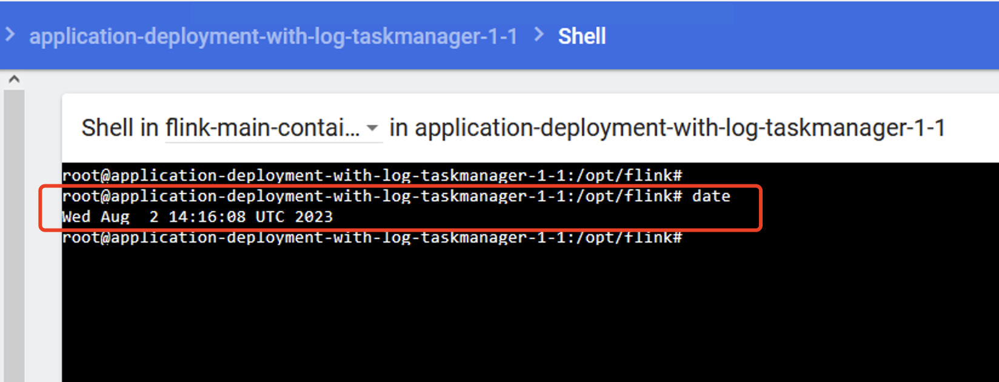

## Flink on K8s 时区设置   

### 时区设置
#### 设置容器时区 
flink容器和flink kubernetes operator容器的默认时区是UTC，与我们的北京时区相差8小时    
进入容器内部，运行date命令查看当前时区  
  

1.设置flink容器时区   
vim application-deployment-with-tz.yaml     

>重点是 时区配置    
```yaml
env:
- name: TZ  # 设置容器运行的时区
    value: Asia/Shanghai
```

```yaml
# Flink Application集群
apiVersion: flink.apache.org/v1beta1
kind: FlinkDeployment
metadata:
  namespace: flink
  name: application-deployment-with-tz
spec:
  image: flink:1.13.6
  flinkVersion: v1_13
  imagePullPolicy: IfNotPresent   # 镜像拉取策略，本地没有则从仓库拉取
  ingress:   # ingress配置，用于访问flink web页面
    template: "flink.k8s.io/{{namespace}}/{{name}}(/|$)(.*)"
    className: "nginx"
    annotations:
      nginx.ingress.kubernetes.io/rewrite-target: "/$2"
  flinkConfiguration:
    taskmanager.numberOfTaskSlots: "2"
  serviceAccount: flink
  jobManager:
    replicas: 1
    resource:
      memory: "1024m"
      cpu: 1
  taskManager:
    replicas: 1
    resource:
      memory: "1024m"
      cpu: 1
  podTemplate:
    spec:
      containers:
        - name: flink-main-container
          env:
            - name: TZ  # 设置容器运行的时区
              value: Asia/Shanghai
          volumeMounts:
            - name: flink-jar  # 挂载nfs上的jar
              mountPath: /opt/flink/jar
            - name: flink-log  # 挂载log
              mountPath: /opt/flink/log
      volumes:
        - name: flink-jar
          persistentVolumeClaim:
            claimName: flink-jar-pvc
        - name: flink-log
          persistentVolumeClaim:
            claimName: flink-log-pvc
  job:
    jarURI: local:///opt/flink/jar/flink-learn-1.0-SNAPSHOT.jar
    entryClass: com.yzhou.job.StreamWordCount
    args:
    parallelism: 1
    upgradeMode: stateless  
```     

2.提交作业  
kubectl apply -f application-deployment-with-tz.yaml    

3.查看作业Pod   
kubectl get all -n flink    

4.打开网页，查看日志
http://flink.k8s.io:32469/flink/application-deployment-with-tz/#/overview

#### 设置flink operator容器时区（使用Dashboard查看flink operator日志）
1.修改flink-kubernetes-operator-helm目录下 flink-kubernetes-operator\templates\flink-operator.yaml文件，在2处containers:下添加时区环境变量      

containers:
- name: flink-webhook
  image: {{ include "flink-operator.imagePath" . }}
  imagePullPolicy: {{ .Values.image.pullPolicy }}
  command: ["/docker-entrypoint.sh", "webhook"]
  env:
    - name: TZ
      value: Asia/Shanghai


2.卸载Flink Operator
```shell
helm uninstall flink-kubernetes-operator -n flink

kubectl -n flink delete configmap kube-root-ca.crt; kubectl -n flink delete svc --all; kubectl -n flink delete secret --all; kubectl -n flink delete serviceaccount --all; kubectl -n flink delete role --all; kubectl -n flink delete rolebinding --all;  
``` 

3.重新安装Flink Operator
```shell
cd /root/flink-operator/helm
helm install -f values.yaml flink-kubernetes-operator . --namespace flink --create-namespace  
```      