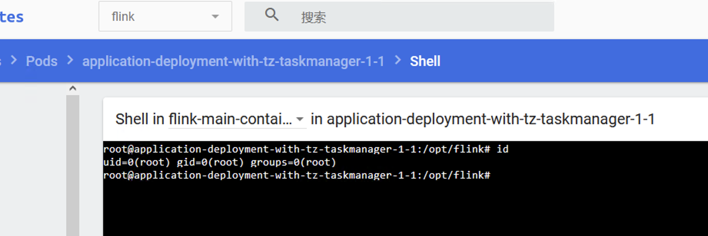
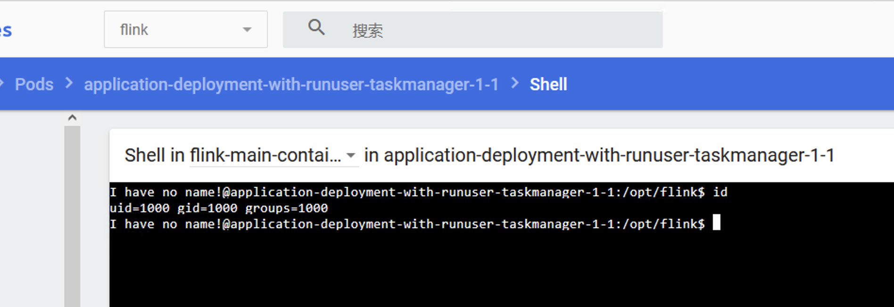

## Flink on K8s runUser配置 

### 修改 pod runUser 用户
进入容器内部，运行id命令查看当前运行用户        
  

1.设置flink容器runUser，在podTemplate.spec下添加securityContext 
vim application-deployment-with-runuser.yaml  

>主要配置 securityContext
```
      securityContext:  # 设置容器运行用户和组
        runAsUser: 1000
        runAsGroup: 1000
```
```yaml
# Flink Application集群
apiVersion: flink.apache.org/v1beta1
kind: FlinkDeployment
metadata:
  namespace: flink
  name: application-deployment-with-runuser
spec:
  image: flink:1.13.6
  flinkVersion: v1_13
  imagePullPolicy: IfNotPresent   # 镜像拉取策略，本地没有则从仓库拉取
  ingress:   # ingress配置，用于访问flink web页面
    template: "flink.k8s.io/{{namespace}}/{{name}}(/|$)(.*)"
    className: "nginx"
    annotations:
      nginx.ingress.kubernetes.io/rewrite-target: "/$2"
  flinkConfiguration:
    taskmanager.numberOfTaskSlots: "2"
  serviceAccount: flink
  jobManager:
    replicas: 1
    resource:
      memory: "1024m"
      cpu: 1
  taskManager:
    replicas: 1
    resource:
      memory: "1024m"
      cpu: 1
  podTemplate:
    spec:
      securityContext:  # 设置容器运行用户和组
        runAsUser: 1000
        runAsGroup: 1000
      containers:
        - name: flink-main-container
          env:
            - name: TZ  # 设置容器运行的时区
              value: Asia/Shanghai
          volumeMounts:
            - name: flink-jar  # 挂载nfs上的jar
              mountPath: /opt/flink/jar
            - name: flink-log  # 挂载log
              mountPath: /opt/flink/log
      volumes:
        - name: flink-jar
          persistentVolumeClaim:
            claimName: flink-jar-pvc
        - name: flink-log
          persistentVolumeClaim:
            claimName: flink-log-pvc
  job:
    jarURI: local:///opt/flink/jar/flink-learn-1.0-SNAPSHOT.jar
    entryClass: com.yzhou.job.StreamWordCount
    args:
    parallelism: 1
    upgradeMode: stateless
```

2.提交作业  
kubectl apply -f application-deployment-with-runuser.yaml     

3.查看作业Pod   
kubectl get all -n flink   

    

### 设置flink operator runUser  
修改flink-kubernetes-operator-helm目录下 flink-kubernetes-operator\values.yaml文件，修改podSecurityContext，例如将9999改为1000  
```yaml
podSecurityContext:
  runAsUser: 1000
  runAsGroup: 1000
```

