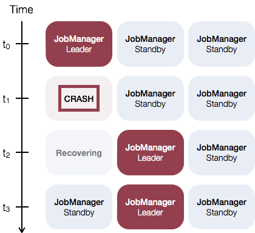

## Flink on K8s HA 介绍 

Flink HA: https://nightlies.apache.org/flink/flink-docs-release-1.17/docs/deployment/ha/overview/

Flink on K8s HA: 
https://nightlies.apache.org/flink/flink-kubernetes-operator-docs-release-1.4/docs/concepts/overview/#jobmanager-high-availability
https://nightlies.apache.org/flink/flink-kubernetes-operator-docs-release-1.3/docs/concepts/overview/#jobmanager-high-availability

概览
JobManager 高可用（HA）模式加强了 Flink 集群防止 JobManager 故障的能力。 此特性确保 Flink 集群将始终持续执行你提交的作业。

JobManager 高可用
JobManager 协调每个 Flink 的部署。它同时负责 调度 和 资源管理。

默认情况下，每个 Flink 集群只有一个 JobManager 实例。这会导致 单点故障（SPOF）：如果 JobManager 崩溃，则不能提交任何新程序，运行中的程序也会失败。

使用 JobManager 高可用模式，你可以从 JobManager 失败中恢复，从而消除单点故障。你可以为每个集群部署配置高可用模式。 有关更多信息，请参阅 高可用服务。

如何启用集群高可用
JobManager 高可用一般概念是指，在任何时候都有 一个领导者 JobManager，如果领导者出现故障，则有多个备用 JobManager 来接管leader。这保证了 不存在单点故障，只要有备用 JobManager 担任leader，程序就可以继续运行。

如下是一个使用三个 JobManager 实例的例子：

Flink 的 高可用服务 封装了所需的服务，使一切可以正常工作：

领导者选举：从 n 个候选者中选出一个领导者
服务发现：检索当前领导者的地址
状态持久化：继承程序恢复作业所需的持久化状态（JobGraphs、用户代码jar、已完成的检查点）

高可用服务
Flink 提供了两种高可用服务实现：

ZooKeeper：每个 Flink 集群部署都可以使用 ZooKeeper HA 服务。它们需要一个运行的 ZooKeeper 复制组（quorum）。
Kubernetes：Kubernetes HA 服务只能运行在 Kubernetes 上。

高可用数据生命周期
为了恢复提交的作业，Flink 持久化元数据和 job 组件。高可用数据将一直保存，直到相应的作业执行成功、被取消或最终失败。当这些情况发生时，将删除所有高可用数据，包括存储在高可用服务中的元数据。

JobResultStore
JobResultStore 用于存档达到全局终端状态（即已完成、取消或失败）的作业的最终结果。数据存储在文件系统上（请参见 job-result-store.storage-path）。只要未正确清理相应的作业，此存储中的条目就会被标记为脏（在高可用性.storageDir 的作业子文件夹中可以找到项目）。

脏条目需要清理，即相应的作业要么由 Flink 立即清理，要么作为恢复的一部分进行清理。清理成功后，将立即删除这些条目。检查 HA 配置选项下的 JobResultStore 配置参数，以获取有关如何调整行为的更多详细信息。

