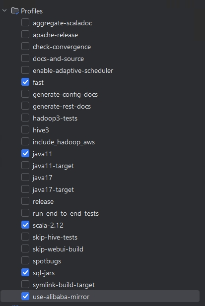

# Flink 源码 - 源码编译 - 编译步骤 

参考 `https://nightlies.apache.org/flink/flink-docs-master/zh/docs/flinkdev/building/`  

## 只修改 lib 
```shell
mvn clean install -DskipTests -Dfast -Pskip-webui-build -T 1C

mvn clean package -DskipTests -Dfast
```

## 选择 profile 
  

## 修改代码后 编译  
-Dcheckstyle.skip=true

```shell
mvn clean install -DskipTests -Dcheckstyle.skip=true -Dspotless.check.skip=true -Pfast -Pscala-2.12 -Puse-alibaba-mirror #使用该命令
mvn clean install -DskipTests -Pfast -Pscala-2.12 -Dcheckstyle.skip=true -Dspotless.check.skip=true -Dnpm.proxy=https://registry.npmmirror.com 
```  

```shell
tar -zcvf flink-1.15.4-bin-scala_2.12.tgz flink-1.15.4
```

https://github.com/apache/flink  