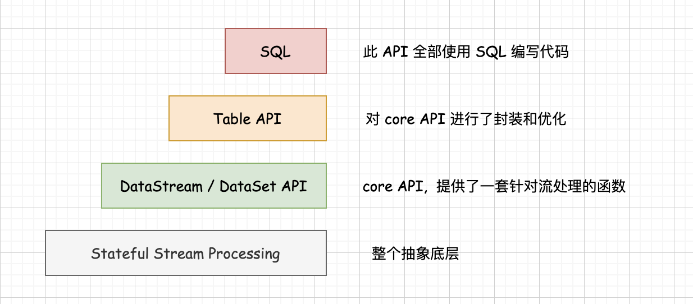

## 理解 Flink 数据流编程模型        

### 引言    
数据流编程模型与 Flink API 之间是什么关系呢？为什么我们在寻找 Flink API 的一些文档资料的时候都会跟数据流编程模型这个概念扯上关系呢？  

### 基于流式数据的编程模型  
对于数据流编程模型的概念，我们换一种说法可能大伙会更好理解一些就是基于流式数据的编程模型,这里有两个方面：第一个方面是这个编程模型,第二个方面是这个编程模型它是基于流式数据的;   

稍微解释一下"数据流编程模型"概念：      
我们的应用产生了大量的数据,在过去对于这些海量的数据的主流处理方式是离线批处理，主要的框架就是 hadoop和 spark，它们是非常典型的批处理框架, 那么现在我们对数据实时分析的需求是越来越普遍，对流式数据的处理技术逐渐成为主流。          

什么是流式数据，就是源源不断的流动的数据，这里要注重说明一下是: 批处理和流式数据的处理是两种不同的技术, 现在流式数据处理的主流技术是数据流模型,数据流模型是什么大伙可以不用知晓，只需要知道通过数据流模型提供的接口,我们能够很方便的处理对流式数据进行处理和计算。`数据流模型它有两个层面`，第一个层面是编程模型,编程模型提供的接口是面向应用的, 它是对流式数据的业务逻辑进行计算, 第二个层面是执行模型,执行模型提供的接口是面向底层的,它主要描述的是流式数据的一个计算过程。   

### Flink core API (DataStream API, DataSet API)
Flink 提供了好几个类别的 API 供我们调用来对流式数据进行处理，提供了不同抽象层次的数据流编程 API, 换个角度描述是 Flink 提供了封装程度不同的 API, 现在使用最主流最广泛的 API,我们叫做 `core API`, core API 包含了 DataStream API 以及 DataSet API, `大家要注意的是 Flink 从 1.14 版本之后是不建议再使用 DataSet API`, 在 1.14 版本之后，Flink 只用一套的 API 就能够处理流式数据也能够进行批处理, 因为在之以前进行流式数据的处理，需要一套的API，在进行批处理的时候又需要再写另外的一套 API, `DataSet API 它的核心类在 flink-java 这个模块里面`, `DataStream API 它的核心类是在 flink-streaming-java 这个包里面`。      

DataStream API 和 DataSet API 都分别提供了很丰富的函数供我们调用,而且这两种 API 所提供的函数都是非常类似的，例如这两种 API 它们都提供了转换函数 map, 也提供了过滤函数 filter 以及连接函数 join。            

### Flink Table API, SQL
Flink 除了提供 core API 之外, 还提供两种关系型的 API Table API 以及 SQL, 通常我们将 Table API 和 SQL 是合并一起来说的, 因为 Table API 和 SQL 有 80% 的代码是可以共用的, 通过下面示例可以了解到 Table API 和 SQL，它们的一些不同之处, 例如对于查询: Table API 提供了一个 select()函数,而 SQL 就直接写一条 SQL 语句就可以了，所以 Table API 是一种类SQL的函数,而 SQL 是 Flink API 之中封装程度最高,抽象等级最高的 API。 
```java
// Table API Query
TableEnv.scan("table1").select(...)

// SQL Query 
TableEnv.sqlQuery("select ... from table1 ...")
```

SQL 有非常严格的语法和规范, 我们不需要关心它底层的实现,只需要写上几条 SQL 语句,就可以对数据进行数据处理,上手非常的简单。  


### 小结    
DataStream API 和 DataSet API 这两种 API是属于 core API, core API 是封装了系列的针对流式数据处理的函数，其实 core API 的底层还有一层`Stateful Stream Processing`, 它封装了一系列的过程函数嵌入到 DataStream API 或者 DataSet API。  

Table API 是对 core API 进行了进一步的封装和优化, SQL 相对于 Table API, 它的封装程度更好,抽象层级更高。     

        

Flink 在1.9版本之前只有两种 API,DataStream API以及DataSet API,在 1.9版本之后是逐步的弃用DataSet API 到 1.14 版本就完全不建议使用 DataSet API。  

所以 Flink 从1.9版本之后建议使用的是 DataStream API、Table API和SQL。       

>思考：为什么 Flink 要弃用 DataSet API呢 ？     
`因为Flink 的使命：成为流批统一的计算引擎`。(这也是Flink 与Spark的不同之处。)， Flink 之所以要弃用 DataSet API, 是因为 DataSet API 它只适用于批处理, 而不能够针对流式数据进行处理。 DataStream API 既能够对流式数据进行处理也能够进行批处理；同样的Table API以及SQL 也是既能够对流式数据进行处理也能够进行批处理；所以这三种API被保留了下来, 而 DataSet API 被弃用。        
