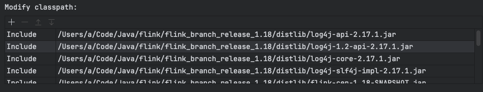
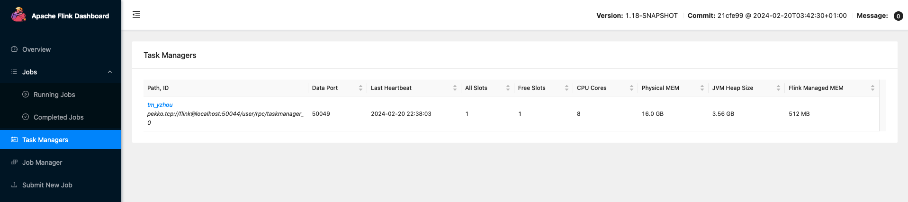

## Flink 源码搭建   

>Flink version: 1.18.0

### 1. 源码导入

#### 1.1 下载源码  
```shell
git clone git@github.com:apache/flink.git   
```

#### 1.2 导入 IDEA     
参考以下配置：  
* 1.配置项目 JDK版本为 1.8 
* 2.配置Scala SDK版本为 2.12.x (大版本保持一致即可)  
* 3.配置 Idea Maven Profiles 为 “fast” 
* 4.配置 Idea Maven 跳过测试    

#### 1.3 编译打包     
```shell
mvn clean package 
```

### 2. 启动准备工作 
* 在项目根目录下创建 `conf`,`distlib` 两个文件夹       
* 将编译后  `flink-dist/target/flink-1.18-SNAPSHOT-bin/flink-1.18-SNAPSHOT` 目录下的 conf，lib 分别拷贝到 创建好的 conf，distlib 两个文件夹下。    

### 2. 启动 Stadnalone 集群的 JobManager 
配置启动类：`org.apache.flink.runtime.entrypoint.StandaloneSessionClusterEntrypoint`  

#### 2.1配置以下启动参数:   
* **JDK**: 1.8    
* **Module**: `flink-runtime`   
* **VM options**:   
```   
-Dlog.file=./log/flink-jobmanager-1.local.log 
-Dlog4j.configuration=./conf/log4j.properties 
-Dlog4j.configurationFile=./conf/log4j.properties 
-Dlogback.configurationFile=./conf/logback.xml  
```
* **Main class**: org.apache.flink.runtime.entrypoint.StandaloneSessionClusterEntrypoint   
* **Program arguments**:  -c conf   
* **Modify classpath**: 选择 `Include` 且指定 distlib 的目录下的`jar`。   
需特别注意, 选择目录无效，需分别添加 jar。例如下图：    
  

### 3. 配置控制台打印 log 
注意，此时 jobmanager已可在 idea 中启动，但经过测试，log无法在 idea 控制台打印，而是在`项目根目录下会自动创建一个log 文件夹`打印 log。         

需在 `conf/log4j.properties` 添加 `ConsoleAppender`, 添加内容如下： 
```shell
... 省略
rootLogger.appenderRef.stdout.ref = ConsoleAppender

... 省略

appender.console.name = ConsoleAppender
appender.console.type = CONSOLE
appender.console.layout.type = PatternLayout
appender.console.layout.pattern = %d{yyyy-MM-dd HH:mm:ss,SSS} %-5p %-60c %x - %m%n

```

### 3. 启动 Stadnalone 集群的 TaskManager   
配置启动类：`org.apache.flink.runtime.taskexecutor.TaskManagerRunner`       

#### 3.1配置以下启动参数:   
* **JDK**: 1.8    
* **Module**: `flink-runtime`   
* **VM options**:   
```shell 
-Dlog.file=./log/flink-taskmanager-1.local.log 
-Dlog4j.configuration=./conf/log4j.properties 
-Dlog4j.configurationFile=./conf/log4j.properties 
-Dlogback.configurationFile=./conf/logback.xml    
```
* **Main class**: org.apache.flink.runtime.taskexecutor.TaskManagerRunner     
* **Program arguments**:  -c conf   
* **Modify classpath**: 选择 `Include` 且指定 distlib 的目录下的`jar`。   
需特别注意, 选择目录无效，需分别添加 jar。例如下图：    
  

#### 3.2修改 conf/flink-conf.yaml 配置文件  
>注意：TaskManager 启动比 JobManager 不同点， 需修改项目根目录下 conf/flink-conf.yaml 文件，添加内容如下：  
```shell
# 添加如下配置（主要就是taskmanager的各项内存配置，可根据⾃⼰的情况进⾏修改）  
# resource-id 参数较特殊，为了兼容 Windows系统 
taskmanager.resource-id: tm_yzhou
taskmanager.cpu.cores: 1
taskmanager.memory.task.heap.size: 512m
taskmanager.memory.managed.size: 512m
taskmanager.memory.network.min: 128m
taskmanager.memory.network.max: 128m
taskmanager.memory.task.off-heap.size: 0m
taskmanager.memory.framework.heap.size: 256m
taskmanager.memory.framework.off-heap.size: 128m
taskmanager.memory.jvm-metaspace.size: 128m
taskmanager.memory.jvm-overhead.max: 128m
taskmanager.memory.jvm-overhead.min: 128m
```

### 访问 Flink Web UI
JobManager，TaskManager 启动完成后，访问 `http://localhost:8081/#/overview` ,查看 `Task Managers` 菜单，若看到名为 `tm_yzhou` 的 taskmanager，则表示注册成功。  
     


>注意，Idea 启动并不会影响你调整 JobManager，TaskManager 的 flink-conf.yaml 配置项   

refer   
1.https://nightlies.apache.org/flink/flink-docs-master/zh/docs/flinkdev/building/   
