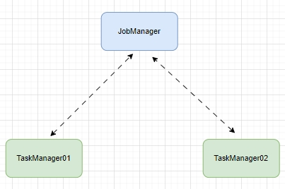
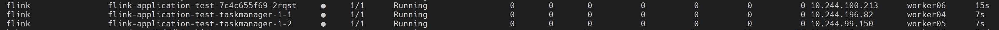
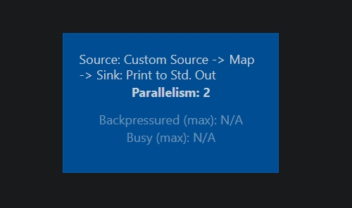
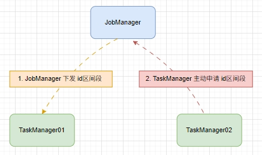
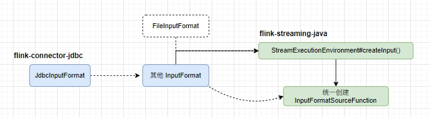
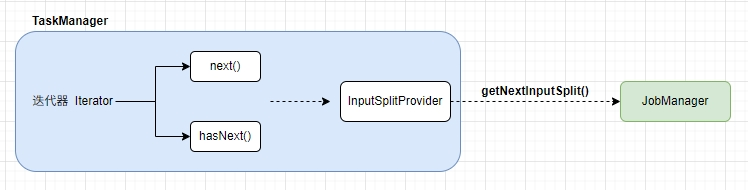
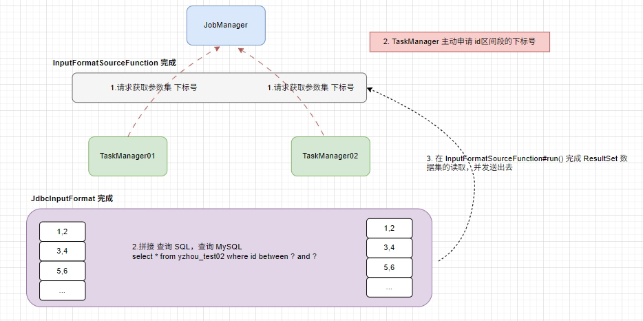

# Flink 源码 - Connector JDBC - 探索 JdbcInputFormat   

>Flink version: 1.15.4，Flink Job Model: Native Kubernetes Application, Kubernetes version: 1.30.8         

## 引文  
由于距离上一篇发布的 `探索 JdbcInputFormat 在 多个 Graph 之间的转换` 公众号文章时间较长，所以需要一些冗余的文字来说明探索的方向。 我是想以 JdbcInputFormat 为示例探索 Connector 实现机制。           

下面是 MySQL 2 Console 示例代码以及 Shell 提交 Job 命令内容。          

### MySQL2Console 代码示例    
Flink Job 示例代码使用 JdbcInputFormat 读取 MySQL 数据打印到控制台。 它并行度设置为 2，numberOfTaskSlots 设置为 1，其目的是模拟在多个 TaskManager 场景。 同时也包括并行读取的场景。`JdbcNumericBetweenParametersProvider` 负责帮助我们完成 Source Ids集合的拆分。             

  

`MySQL2Console.java`
```java
public class MySQL2Console {
  private static final Logger logger = LoggerFactory.getLogger(MySQL2Console.class);

  public static void main(String[] args) throws Exception {
    Configuration configuration = new Configuration();
    StreamExecutionEnvironment env = StreamExecutionEnvironment.getExecutionEnvironment(configuration);
    env.setRuntimeMode(RuntimeExecutionMode.AUTOMATIC);
    env.registerJobListener(new CustomJobListener());
    env.setParallelism(2);

    JdbcNumericBetweenParametersProvider jdbcNumericBetweenParametersProvider = new JdbcNumericBetweenParametersProvider(2, 1, 10);
    DataStreamSource<Row> myDataStream = env.createInput(JdbcInputFormat.buildJdbcInputFormat()
                    .setDrivername("com.mysql.cj.jdbc.Driver")
                    .setDBUrl("jdbc:mysql://192.168.0.201:3306/yzhou_test?serverTimezone=GMT%2B8&useSSL=false")
                    .setUsername("root")
                    .setPassword("123456")
                    .setParametersProvider(jdbcNumericBetweenParametersProvider)
                    .setQuery("select * from yzhou_test02 where id between ? and ?")
                    .setRowTypeInfo(new RowTypeInfo(
                            BasicTypeInfo.INT_TYPE_INFO,
                            BasicTypeInfo.STRING_TYPE_INFO,
                            BasicTypeInfo.STRING_TYPE_INFO,
                            BasicTypeInfo.STRING_TYPE_INFO))
                    .finish())
            .setParallelism(2);
    myDataStream.map(data -> {
              logger.info("yzhou data : " + data.toString());
              return data;
            })
            .print().setParallelism(2);
    System.out.println("yzhou job start ！！！！！" + new DateTime().toString("yyyy-MM-dd HH:mm:ss"));
    JobExecutionResult execute = env.execute("mysql 2 console");
    System.out.println("yzhou job end ！！！！！" + new DateTime().toString("yyyy-MM-dd HH:mm:ss"));
  }
}
```  

### 提交 Flink Job 脚本     
```bash
[root@master01 flink15]# cat submit-application-job-mysql.sh
/root/yzhou/flink/flink-1.15.4/bin/flink  run-application \
    --target kubernetes-application \
    -Dkubernetes.namespace=flink \
    -Dkubernetes.service-account=flink-service-account \
    -Dkubernetes.cluster-id=flink-application-test \
    -Dkubernetes.pod-template-file.jobmanager=./jobmanager-pod-template.yaml \
    -Dkubernetes.pod-template-file.taskmanager=./taskmanager-pod-template.yaml \
    -Dclassloader.resolve-order=parent-first \
    -Dkubernetes.rest-service.exposed.type=NodePort \
    -Dtaskmanager.numberOfTaskSlots=1 \
    -c com.yzhou.flink.example.MySQL2Console \
    local:///opt/flink/artifacts/app.jar   
``` 

### Flink Job 运行时的状态记录   
`Kubernetes Pod 状态`  
   

`Flink Job DAG 图`   
     

在后面探索的手段是 remote debug 和 print log。 若这部分还不熟悉的话可参考 `https://mp.weixin.qq.com/s/G6J_W1Yuetg-rGEYa5f7ZQ`,`我不知道大家是否跟我有同样的疑问`：某些类或者某些方法不太清楚是在 JobManager 还是在 TaskManager 运行 ? 所以 remote debug 可以让我很方便定位具体位置，这里大家可以思考一个问题 `JdbcInputFormat` 支持并行读取，id 为拆分成多个区间段，那 TaskManager 是如何被分配到具体哪个区间呢？ 是由 JobManager 下发给 TaskManager 还是 TaskManager 主动去 JobManager 申请的呢？   
       

若一些逻辑之间需要判断执行先后，或者部分逻辑需要长期跟进的话，可添加 log 打印再重新打包，最后通过 pvc 方式替换 Flink image 中的 lib目录。            

## 思考一 
在 MySQL2Console 代码示例中，我们可知晓 `JdbcInputFormat.buildJdbcInputFormat()` 是调用 `flink-connector-jdbc.jar`类库构造的。  `env.createInput()` 会使用 JdbcInputFormat 对象构造出一个通用模板类型 `InputFormatSourceFunction`，两者是关联关系。       

   

>为什么称呼它为通过模板类型是因为 `InputFormatSourceFunction` 类是 `flink-streaming-java` 模块的类（公共模块）。   

TaskManager 启动后，`InputFormatSourceFunction#open()` 方法执行了`非常重要`的逻辑，首先获取负责 input split 的 RPC调用类 `RpcInputSplitProvider`，`getInputSplits()` 创建了一个请求 JobManager 的迭代器，该迭代器两个非常重要的方法，hasNext(), next() ,判断是否有值，获取下一个返回值都依托于 `InputSplitProvider` RPC 调用 getNextInputSplit() 请求 JobManager。  

**InputFormatSourceFunction#open()**
```java
public void open(Configuration parameters) throws Exception {
        StreamingRuntimeContext context = (StreamingRuntimeContext) getRuntimeContext();

        if (format instanceof RichInputFormat) {
                ((RichInputFormat) format).setRuntimeContext(context);
        }
        format.configure(parameters);

        provider = context.getInputSplitProvider();
        serializer = typeInfo.createSerializer(getRuntimeContext().getExecutionConfig());
        splitIterator = getInputSplits();
        isRunning = splitIterator.hasNext();
}
```

 

`InputFormatSourceFunction#run()` 方法根据 `Iterator<InputSplit> splitIterator` 迭代器获取到 `InputSplit` 任务下标号来调用 `format.open(splitIterator.next())` 构造查询 SQL 参数，`while (isRunning && !format.reachedEnd())` 循环会将查询 MySQL 数据集 ResultSet 遍历后调用 ctx.collect() 发送出去 。  

**InputFormatSourceFunction#run()**
```java
@Override
    public void run(SourceContext<OUT> ctx) throws Exception {
        try {

            Counter completedSplitsCounter =
                    getRuntimeContext().getMetricGroup().counter("numSplitsProcessed");
            if (isRunning && format instanceof RichInputFormat) {
                ((RichInputFormat) format).openInputFormat();
            }

            OUT nextElement = serializer.createInstance();
            while (isRunning) {
                format.open(splitIterator.next());

                // for each element we also check if cancel
                // was called by checking the isRunning flag

                while (isRunning && !format.reachedEnd()) {
                    nextElement = format.nextRecord(nextElement);
                    if (nextElement != null) {
                        ctx.collect(nextElement);
                    } else {
                        break;
                    }
                }
                format.close();
                completedSplitsCounter.inc();

                if (isRunning) {
                    isRunning = splitIterator.hasNext();
                }
            }
        } finally {
            format.close();
            if (format instanceof RichInputFormat) {
                ((RichInputFormat) format).closeInputFormat();
            }
            isRunning = false;
        }
    }
```

**JdbcInputFormat#open()**
```java
@Override
public void open(InputSplit inputSplit) throws IOException {
try {
        if (inputSplit != null && parameterValues != null) {
        for (int i = 0; i < parameterValues[inputSplit.getSplitNumber()].length; i++) {
                Object param = parameterValues[inputSplit.getSplitNumber()][i];
                if (param instanceof String) {
                statement.setString(i + 1, (String) param);
                } else if (param instanceof Long) {
                statement.setLong(i + 1, (Long) param);
                } else if (param instanceof Integer) {
                statement.setInt(i + 1, (Integer) param);
                } else if (param instanceof Double) {
                statement.setDouble(i + 1, (Double) param);
                } else if (param instanceof Boolean) {
                statement.setBoolean(i + 1, (Boolean) param);
                } else if (param instanceof Float) {
                statement.setFloat(i + 1, (Float) param);
                } else if (param instanceof BigDecimal) {
                statement.setBigDecimal(i + 1, (BigDecimal) param);
                } else if (param instanceof Byte) {
                statement.setByte(i + 1, (Byte) param);
                } else if (param instanceof Short) {
                statement.setShort(i + 1, (Short) param);
                } else if (param instanceof Date) {
                statement.setDate(i + 1, (Date) param);
                } else if (param instanceof Time) {
                statement.setTime(i + 1, (Time) param);
                } else if (param instanceof Timestamp) {
                statement.setTimestamp(i + 1, (Timestamp) param);
                } else if (param instanceof Array) {
                statement.setArray(i + 1, (Array) param);
                } else {
                // extends with other types if needed
                throw new IllegalArgumentException(
                        "open() failed. Parameter "
                                + i
                                + " of type "
                                + param.getClass()
                                + " is not handled (yet).");
                }
        }
        if (LOG.isDebugEnabled()) {
                LOG.debug(
                        String.format(
                                "Executing '%s' with parameters %s",
                                queryTemplate,
                                Arrays.deepToString(
                                        parameterValues[inputSplit.getSplitNumber()])));
        }
        }
        LOG.info("yzhou statement.executeQuery");
        resultSet = statement.executeQuery();
        hasNext = resultSet.next();
} catch (SQLException se) {
        throw new IllegalArgumentException("open() failed." + se.getMessage(), se);
}
}
```

我们需要小结一下：     
1.模板类 InputFormatSourceFunction 方法只会在 TaskManager 运行    
2.InputFormatSourceFunction 中的 迭代器对象 `Iterator<InputSplit> splitIterator` ，它返回的是拆分后 Source 集合ids 下标号，TaskManager 是主动向 JobManager 申请任务，而不是 JobManager 主动下发的。 每个 JdbcInputFormat 都保存了一份完整的 拆分 Ids 集合。     
  


//*********************************************************************************


env.createInput() 方法会将 JdbcInputFormat 统一分装成 `InputFormatSourceFunction` 

当 source 是 MySQL 时，env.createInput() 会统一创建 `InputFormatSourceFunction`

```java
env.createInput(JdbcInputFormat.buildJdbcInputFormat()
// 省略部分代码  
```

`StreamExecutionEnvironment#createInput()` 
```java
private <OUT> DataStreamSource<OUT> createInput(
        InputFormat<OUT, ?> inputFormat, TypeInformation<OUT> typeInfo, String sourceName) {

    InputFormatSourceFunction<OUT> function =
            new InputFormatSourceFunction<>(inputFormat, typeInfo);
    return addSource(function, sourceName, typeInfo);
}
```