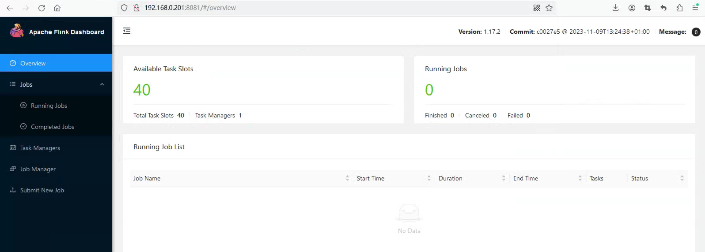
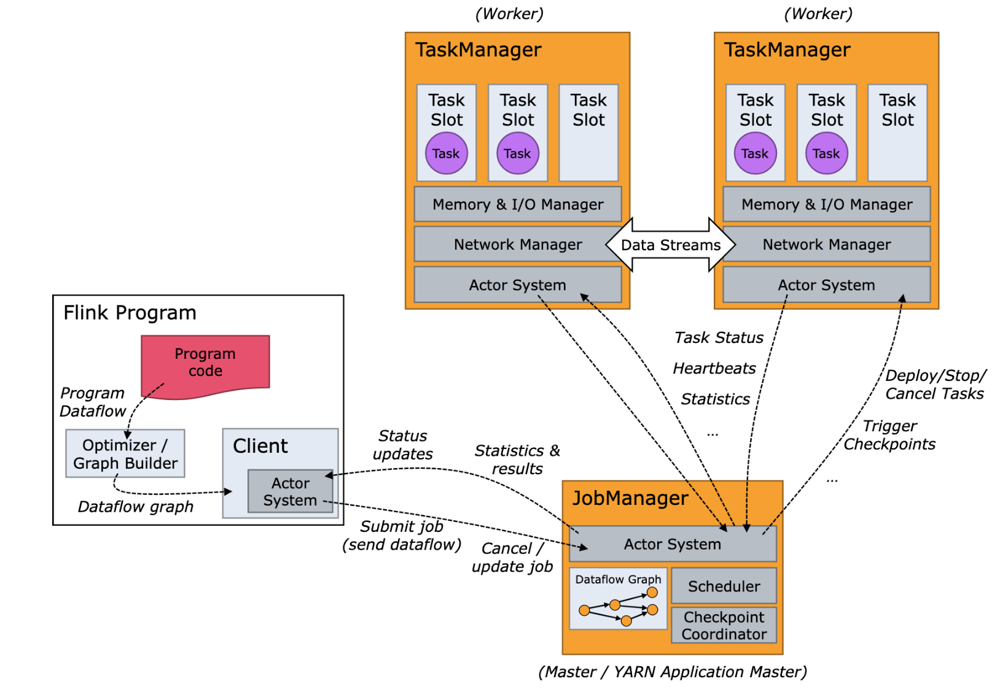
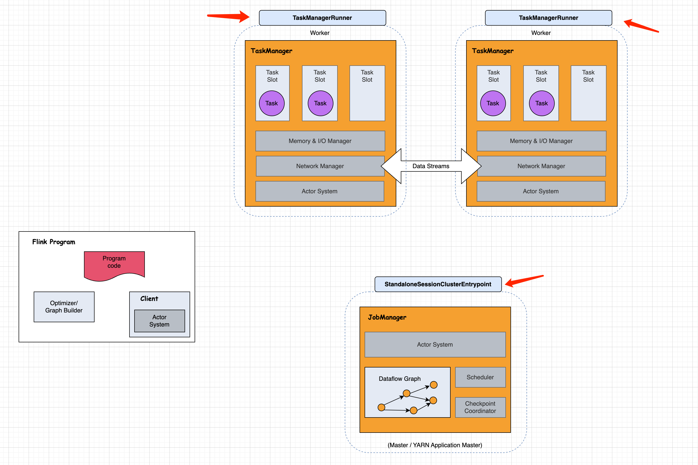

# Flink 源码 - Standalone - Idea 启动 Standalone 集群 (Session Model)          

>Flink version: 1.17.0      

## 引言         
若你对 `Flink Standalone` 使用还不太了解，可访问`Flink Architecture`(https://nightlies.apache.org/flink/flink-docs-release-1.17/docs/concepts/flink-architecture/#taskmanagers) 和 `Flink Standalone deployment`(https://nightlies.apache.org/flink/flink-docs-release-1.17/docs/deployment/resource-providers/standalone/overview/) 了解更多细节 。           

该篇 Blog 介绍 `Idea 启动 Standalone 集群`，其目的是想`配置Flink 源码调试环境，方便 Debug,真实探索 Flink 底层实现逻辑`， 之所以选择 `Flink Standalone` 部署方式，是因为它是 Flink 部署方式中`最简单的`。                

接下来，演示 Flink Standalone 集群的基本使用。              

## Deployment Flink Standalone     
1）下载 Flink   
访问 https://flink.apache.org/zh/downloads/， 下载 `Apache Flink 1.17.2 (asc, sha512)`          

2）解压 & 启动 Standalone（单节点）         
```shell
# 解压 
tar -zxf flink-1.17.2-bin-scala_2.12.tgz        
```

vim flink-1.17.2/conf/flink-conf.yaml                
```shell
# 配置  
# 修改内容如下  
rest.address: 192.168.0.201  # 配置 IP
rest.bind-address: 192.168.0.201 # 配置 IP
taskmanager.numberOfTaskSlots: 40 # Slot个数 调大一些，默认是 1。 
```

启动 standalone   
```shell
flink-1.17.2/bin/start-cluster.sh           
```

3）访问 Flink Web UI    
http://192.168.0.201:8081           
              

>Flink Standalone doc: https://nightlies.apache.org/flink/flink-docs-release-1.17/docs/deployment/resource-providers/standalone/overview/        

完成以上步骤，一个单节点的 Standalone 集群就部署完成了。        


## Anatomy(剖析) of a Flink Cluster         

>如果你对下图还有种未曾见过的 feel，那还希望你访问官方文档了解，`Flink Architecture`(https://nightlies.apache.org/flink/flink-docs-release-1.17/docs/concepts/flink-architecture/#anatomy-of-a-flink-cluster) ，因为在后续的 Blog 中，会频繁出现 `JobManager（ResourceManager、Dispatcher、JobMaster）、TaskManager` 等名词, Flink 官网对 `Glossary`也给出文档介绍（https://nightlies.apache.org/flink/flink-docs-release-1.17/docs/concepts/glossary/）。  
     

后续我的 Blog 内容也会贴合这个图，分析其核心功能，了解细节实现，`Do ... Find ... Why ...` 加油 !!! :) 。                          


## 在 Idea 启动 Standalone 集群 (Session Model)  

### 梳理 Standalone 集群 角色    
在 Standalone Cluster 启动后， 可通过 `jps`,查看Cluster 角色进程有哪些：      
```bash
[root@vm01 flink-1.17.2]# jps
123974 Jps
104813 StandaloneSessionClusterEntrypoint
105103 TaskManagerRunner        
```

有了这些，我就可以开始 `名为 Flink Architecture 的拼图游戏`，StandaloneSessionClusterEntrypoint 是 master role，TaskManagerRunner 是 worker role 。       
      

### 了解 StandaloneSessionClusterEntrypoint、TaskManagerRunner 进程的完整 java 命令   
使用 `ps -ef|grep java` ，查看 master、worker 的 jvm 进程，完整的启动命令。    
```bash
[root@vm01 flink-1.17.2]# ps -ef|grep java
root     104813      1  1 May18 pts/0    00:30:53 /data/jdk1.8.0_391/bin/java -Xmx1073741824 -Xms1073741824 -XX:MaxMetaspaceSize=268435456 -Dlog.file=/root/yzhou/flink/flink1172/flink-1.17.2/log/flink-root-standalonesession-0-vm01.log -Dlog4j.configuration=file:/root/yzhou/flink/flink1172/flink-1.17.2/conf/log4j.properties -Dlog4j.configurationFile=file:/root/yzhou/flink/flink1172/flink-1.17.2/conf/log4j.properties -Dlogback.configurationFile=file:/root/yzhou/flink/flink1172/flink-1.17.2/conf/logback.xml -classpath /root/yzhou/flink/flink1172/flink-1.17.2/lib/flink-cep-1.17.2.jar:/root/yzhou/flink/flink1172/flink-1.17.2/lib/flink-connector-files-1.17.2.jar:/root/yzhou/flink/flink1172/flink-1.17.2/lib/flink-csv-1.17.2.jar:/root/yzhou/flink/flink1172/flink-1.17.2/lib/flink-json-1.17.2.jar:/root/yzhou/flink/flink1172/flink-1.17.2/lib/flink-scala_2.12-1.17.2.jar:/root/yzhou/flink/flink1172/flink-1.17.2/lib/flink-table-api-java-uber-1.17.2.jar:/root/yzhou/flink/flink1172/flink-1.17.2/lib/flink-table-planner-loader-1.17.2.jar:/root/yzhou/flink/flink1172/flink-1.17.2/lib/flink-table-runtime-1.17.2.jar:/root/yzhou/flink/flink1172/flink-1.17.2/lib/log4j-1.2-api-2.17.1.jar:/root/yzhou/flink/flink1172/flink-1.17.2/lib/log4j-api-2.17.1.jar:/root/yzhou/flink/flink1172/flink-1.17.2/lib/log4j-core-2.17.1.jar:/root/yzhou/flink/flink1172/flink-1.17.2/lib/log4j-slf4j-impl-2.17.1.jar:/root/yzhou/flink/flink1172/flink-1.17.2/lib/flink-dist-1.17.2.jar:::/opt/module/hadoop-3.1.3/etc/hadoop: org.apache.flink.runtime.entrypoint.StandaloneSessionClusterEntrypoint -D jobmanager.memory.off-heap.size=134217728b -D jobmanager.memory.jvm-overhead.min=201326592b -D jobmanager.memory.jvm-metaspace.size=268435456b -D jobmanager.memory.heap.size=1073741824b -D jobmanager.memory.jvm-overhead.max=201326592b --configDir /root/yzhou/flink/flink1172/flink-1.17.2/conf --executionMode cluster
root     105103      1  1 May18 pts/0    00:34:34 /data/jdk1.8.0_391/bin/java -XX:+UseG1GC -Xmx536870902 -Xms536870902 -XX:MaxDirectMemorySize=268435458 -XX:MaxMetaspaceSize=268435456 -Dlog.file=/root/yzhou/flink/flink1172/flink-1.17.2/log/flink-root-taskexecutor-0-vm01.log -Dlog4j.configuration=file:/root/yzhou/flink/flink1172/flink-1.17.2/conf/log4j.properties -Dlog4j.configurationFile=file:/root/yzhou/flink/flink1172/flink-1.17.2/conf/log4j.properties -Dlogback.configurationFile=file:/root/yzhou/flink/flink1172/flink-1.17.2/conf/logback.xml -classpath /root/yzhou/flink/flink1172/flink-1.17.2/lib/flink-cep-1.17.2.jar:/root/yzhou/flink/flink1172/flink-1.17.2/lib/flink-connector-files-1.17.2.jar:/root/yzhou/flink/flink1172/flink-1.17.2/lib/flink-csv-1.17.2.jar:/root/yzhou/flink/flink1172/flink-1.17.2/lib/flink-json-1.17.2.jar:/root/yzhou/flink/flink1172/flink-1.17.2/lib/flink-scala_2.12-1.17.2.jar:/root/yzhou/flink/flink1172/flink-1.17.2/lib/flink-table-api-java-uber-1.17.2.jar:/root/yzhou/flink/flink1172/flink-1.17.2/lib/flink-table-planner-loader-1.17.2.jar:/root/yzhou/flink/flink1172/flink-1.17.2/lib/flink-table-runtime-1.17.2.jar:/root/yzhou/flink/flink1172/flink-1.17.2/lib/log4j-1.2-api-2.17.1.jar:/root/yzhou/flink/flink1172/flink-1.17.2/lib/log4j-api-2.17.1.jar:/root/yzhou/flink/flink1172/flink-1.17.2/lib/log4j-core-2.17.1.jar:/root/yzhou/flink/flink1172/flink-1.17.2/lib/log4j-slf4j-impl-2.17.1.jar:/root/yzhou/flink/flink1172/flink-1.17.2/lib/flink-dist-1.17.2.jar:::/opt/module/hadoop-3.1.3/etc/hadoop: org.apache.flink.runtime.taskexecutor.TaskManagerRunner --configDir /root/yzhou/flink/flink1172/flink-1.17.2/conf -D taskmanager.memory.network.min=134217730b -D taskmanager.cpu.cores=40.0 -D taskmanager.memory.task.off-heap.size=0b -D taskmanager.memory.jvm-metaspace.size=268435456b -D external-resources=none -D taskmanager.memory.jvm-overhead.min=201326592b -D taskmanager.memory.framework.off-heap.size=134217728b -D taskmanager.memory.network.max=134217730b -D taskmanager.memory.framework.heap.size=134217728b -D taskmanager.memory.managed.size=536870920b -D taskmanager.memory.task.heap.size=402653174b -D taskmanager.numberOfTaskSlots=40 -D taskmanager.memory.jvm-overhead.max=201326592b      
```

有了这些，还愁 Idea 配置不起来么？ 嘿嘿 (剩下的是时间问题 'ʜᴇʟʟᴏ ><' ) ...         

### 下载源码 & 导入 IDE 
可参考官网文档 https://nightlies.apache.org/flink/flink-docs-release-1.17/docs/flinkdev/ide_setup/ 进行实操         

1）下载源码  
```shell
git clone https://github.com/apache/flink.git       
```

2）导入 IDEA
参考以下配置：       
* 1.配置项目 JDK版本为 1.8   
* 2.配置Scala SDK版本为 2.12.x (大版本保持一致即可)     
* 3.配置 Idea Maven Profiles 为 “fast”   
* 4.配置 Idea Maven 跳过测试        

3）源码编译 & 打包      
```shell
mvn clean package -DskipTests   
```


#### 1.1 下载源码  
```shell
git clone git@github.com:apache/flink.git   
```

#### 1.2 导入 IDEA     
参考以下配置：  
* 1.配置项目 JDK版本为 1.8 
* 2.配置Scala SDK版本为 2.12.x (大版本保持一致即可)  
* 3.配置 Idea Maven Profiles 为 “fast” 
* 4.配置 Idea Maven 跳过测试    

#### 1.3 编译打包     
```shell
mvn clean package 
```

### 2. 启动准备工作 
* 在项目根目录下创建 `conf`,`distlib` 两个文件夹       
* 将编译后  `flink-dist/target/flink-1.18-SNAPSHOT-bin/flink-1.18-SNAPSHOT` 目录下的 conf，lib 分别拷贝到 创建好的 conf，distlib 两个文件夹下。    

### 2. 启动 Standalone 集群的 JobManager 
配置启动类：`org.apache.flink.runtime.entrypoint.StandaloneSessionClusterEntrypoint`  

#### 2.1配置以下启动参数:   
* **JDK**: 1.8    
* **Module**: `flink-runtime`   
* **VM options**:   
```   
-Dlog.file=./log/flink-jobmanager-1.local.log 
-Dlog4j.configuration=./conf/log4j.properties 
-Dlog4j.configurationFile=./conf/log4j.properties 
-Dlogback.configurationFile=./conf/logback.xml  
```
* **Main class**: org.apache.flink.runtime.entrypoint.StandaloneSessionClusterEntrypoint   
* **Program arguments**:  -c conf   
* **Modify classpath**: 选择 `Include` 且指定 distlib 的目录下的`jar`。   
需特别注意, 选择目录无效，需分别添加 jar。例如下图：    
   

### 3. 配置控制台打印 log 
注意，此时 jobmanager已可在 idea 中启动，但经过测试，log无法在 idea 控制台打印，而是在`项目根目录下会自动创建一个log 文件夹`打印 log。         

需在 `conf/log4j.properties` 添加 `ConsoleAppender`, 添加内容如下： 
```shell
... 省略
rootLogger.appenderRef.stdout.ref = ConsoleAppender

... 省略

appender.console.name = ConsoleAppender
appender.console.type = CONSOLE
appender.console.layout.type = PatternLayout
appender.console.layout.pattern = %d{yyyy-MM-dd HH:mm:ss,SSS} %-5p %-60c %x - %m%n

```

### 3. 启动 Standalone 集群的 TaskManager   
配置启动类：`org.apache.flink.runtime.taskexecutor.TaskManagerRunner`       

#### 3.1配置以下启动参数:   
* **JDK**: 1.8    
* **Module**: `flink-runtime`   
* **VM options**:   
```shell 
-Dlog.file=./log/flink-taskmanager-1.local.log 
-Dlog4j.configuration=./conf/log4j.properties 
-Dlog4j.configurationFile=./conf/log4j.properties 
-Dlogback.configurationFile=./conf/logback.xml    
```
* **Main class**: org.apache.flink.runtime.taskexecutor.TaskManagerRunner     
* **Program arguments**:  -c conf   
* **Modify classpath**: 选择 `Include` 且指定 distlib 的目录下的`jar`。   
需特别注意, 选择目录无效，需分别添加 jar。例如下图：    
  

#### 3.2修改 conf/flink-conf.yaml 配置文件  
>注意：TaskManager 启动比 JobManager 不同点， 需修改项目根目录下 conf/flink-conf.yaml 文件，添加内容如下：  
```shell
# 添加如下配置（主要就是taskmanager的各项内存配置，可根据⾃⼰的情况进⾏修改）  
# resource-id 参数较特殊，为了兼容 Windows系统 
taskmanager.resource-id: tm_yzhou
taskmanager.cpu.cores: 1
taskmanager.memory.task.heap.size: 512m
taskmanager.memory.managed.size: 512m
taskmanager.memory.network.min: 128m
taskmanager.memory.network.max: 128m
taskmanager.memory.task.off-heap.size: 0m
taskmanager.memory.framework.heap.size: 256m
taskmanager.memory.framework.off-heap.size: 128m
taskmanager.memory.jvm-metaspace.size: 128m
taskmanager.memory.jvm-overhead.max: 128m
taskmanager.memory.jvm-overhead.min: 128m
```

### 访问 Flink Web UI
JobManager，TaskManager 启动完成后，访问 `http://localhost:8081/#/overview` ,查看 `Task Managers` 菜单，若看到名为 `tm_yzhou` 的 taskmanager，则表示注册成功。  
     


>注意，Idea 启动并不会影响你调整 JobManager，TaskManager 的 flink-conf.yaml 配置项     

refer   
1.https://nightlies.apache.org/flink/flink-docs-master/zh/docs/flinkdev/building/     
2.https://nightlies.apache.org/flink/flink-docs-release-1.17/docs/concepts/flink-architecture/#taskmanagers          
3.https://nightlies.apache.org/flink/flink-docs-release-1.17/docs/concepts/glossary/             
4.https://nightlies.apache.org/flink/flink-docs-release-1.17/docs/deployment/resource-providers/standalone/overview/  
