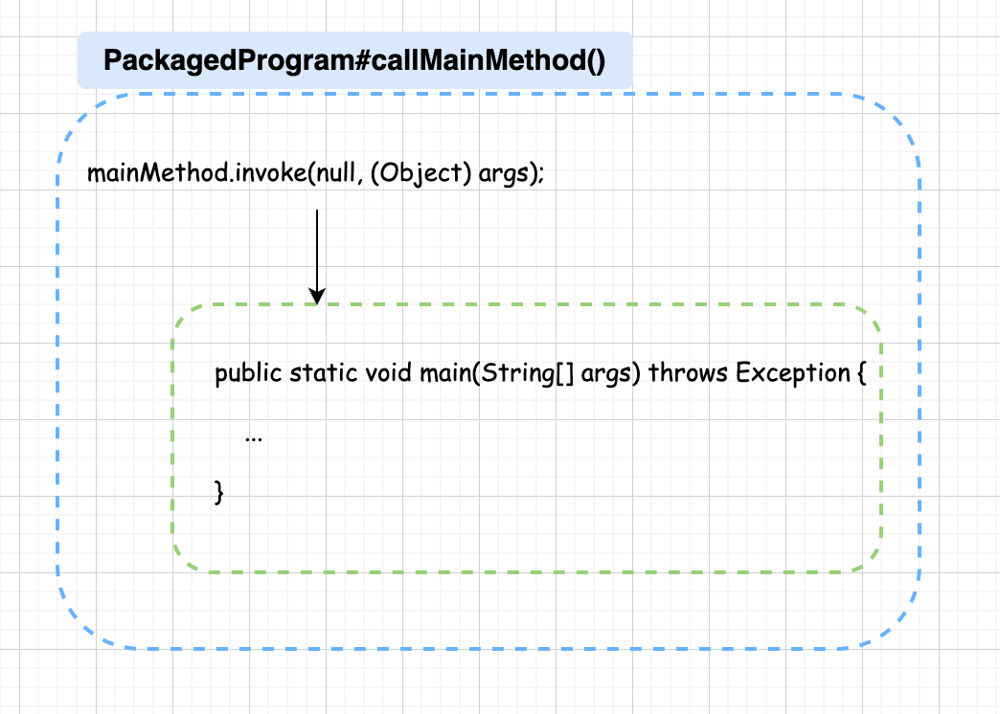

# Flink 源码 - Standalone - 探索 Flink Job Show Plan 实现过程             

>Flink version: 1.17.2          

>注意，该篇 Blog 涉及到的“点”较多,阅读源码过程要实践“第一性原理”,似乎可行性不高，学习的过程像是剥洋葱一样，从外到内，也无法拿着`Flink confluence FLIP`(https://cwiki.apache.org/confluence/display/FLINK/Flink+Improvement+Proposals)对着它的 `Motivation`直接理解，若做到 do-find-why 似乎可行性较高。    

>如果我有表述的不清楚，还麻烦大家给我留言。     

## 引言     
在之前的 Blog 内容中，部署了一些 Flink Job，对下面的图肯定有所了解：        
        

它是 Flink Job 的 `Job Graph 拓扑图`，它展示了 Job 的执行计划。 具体来说，它显示了数据流通过各个算子（operators）的路径，以及每个算子的并行度（Parallelism）。 它在我们使用Flink 的任何阶段都有举足轻重的作用，例如，数据流可视化，帮助我们理解 Job的结构和处理过程，它显示的并行度，可帮助我们优化资源使用和提高处理效率，在后面的 Blog 中，我们会很长时间围绕这 `JobGraph`。    

    


## 开发 Stream WordCount 作业      
关于从零开始搭建 Flink Job 开发项目，可参考Flink 官网给出的模板示例： https://nightlies.apache.org/flink/flink-docs-release-1.17/docs/dev/configuration/maven/，以下是我的 Flink Job 开发项目的构造过程：       

### 添加 Flink 相关依赖         
```xml
<dependency>
    <groupId>org.apache.flink</groupId>
    <artifactId>flink-streaming-java</artifactId>
    <version>${flink.version}</version>
    <scope>provided</scope>
</dependency>
<dependency>
    <groupId>org.apache.flink</groupId>
    <artifactId>flink-runtime-web</artifactId>
    <version>${flink.version}</version>
    <scope>provided</scope>
</dependency>

<build>
    <plugins>
        <plugin>
            <groupId>org.apache.maven.plugins</groupId>
            <artifactId>maven-assembly-plugin</artifactId>
            <version>3.0.0</version>
            <configuration>
                <descriptorRefs>
                    <descriptorRef>jar-with-dependencies</descriptorRef>
                </descriptorRefs>
            </configuration>
            <executions>
                <execution>
                    <id>make-assembly</id>
                    <phase>package</phase>
                    <goals>
                        <goal>single</goal>
                    </goals>
                </execution>
            </executions>
        </plugin>

        <plugin>
            <groupId>org.apache.maven.plugins</groupId>
            <artifactId>maven-compiler-plugin</artifactId>
            <version>3.8.0</version>
            <configuration>
                <source>${target.java.version}</source>
                <target>${target.java.version}</target>
                <encoding>UTF-8</encoding>
            </configuration>
        </plugin>
    </plugins>
</build>
```     

### StreamWordCount 示例      
实现的逻辑是 读取 Socket 文本数据，根据数据的“空格” 进行拆分，然后对 word 进行分组求和。            

```java
public class StreamWordCount {
    private static Logger logger = Logger.getLogger(StreamWordCount.class);

    public static void main(String[] args) throws Exception {
        // 1. 创建流式执行环境
//        StreamExecutionEnvironment env = StreamExecutionEnvironment
//                .createLocalEnvironmentWithWebUI(new Configuration());
        StreamExecutionEnvironment env = StreamExecutionEnvironment   // 非本地运行，使用 getExecutionEnvironment()   
                .getExecutionEnvironment(new Configuration());
        env.setRestartStrategy(RestartStrategies
                .fixedDelayRestart(3, Time.of(10, TimeUnit.SECONDS)));
        // 2. Socket 读取  nc -lk 7777
        DataStreamSource<String> lineDSS = env
                .socketTextStream("localhost", 7777);

        // 3. 转换数据格式
        SingleOutputStreamOperator<Tuple2<String, Long>> wordAndOne = lineDSS
                .flatMap((String line, Collector<String> words) -> {
                    Arrays.stream(line.split(" ")).forEach(words::collect);
                })
                .returns(Types.STRING)
                .map(word -> Tuple2.of(word, 1L))
                .returns(Types.TUPLE(Types.STRING, Types.LONG)).setParallelism(2);

        // 4. 分组
        KeyedStream<Tuple2<String, Long>, String> wordAndOneKS = wordAndOne
                .keyBy(t -> t.f0);
        // 5. 求和
        SingleOutputStreamOperator<Tuple2<String, Long>> result = wordAndOneKS
                .sum(1).setParallelism(1);

        // 6. 打印
        result.print();
        logger.info(result.toString());
        // 7. 执行
        env.execute();
    }
}
```

### 打包        
打包后，产出 `flink-blog-1.0-SNAPSHOT-jar-with-dependencies.jar`, 完整项目示例可访问 https://github.com/xinzhuxiansheng/flink-tutorial/tree/main/flink-blog。    
```shell        
mvn clean package       
```             

## Cli 查看 jar 的 JobGraph         
```shell
./flink info -c com.yzhou.blog.wordcount.StreamWordCount TMP/flink-blog-1.0-SNAPSHOT-jar-with-dependencies.jar   
```

Output log:             
```shell
[root@vm01 bin]# ./flink info -c com.yzhou.blog.wordcount.StreamWordCount TMP/flink-blog-1.0-SNAPSHOT-jar-with-dependencies.jar 
WARNING: An illegal reflective access operation has occurred
WARNING: Illegal reflective access by org.apache.flink.api.java.ClosureCleaner (file:/root/yzhou/flink/flink1172/flink-1.17.2/lib/flink-dist-1.17.2.jar) to field java.lang.String.value
WARNING: Please consider reporting this to the maintainers of org.apache.flink.api.java.ClosureCleaner
WARNING: Use --illegal-access=warn to enable warnings of further illegal reflective access operations
WARNING: All illegal access operations will be denied in a future release
----------------------- Execution Plan -----------------------
{
  "nodes" : [ {
    "id" : 1,
    "type" : "Source: Socket Stream",
    "pact" : "Data Source",
    "contents" : "Source: Socket Stream",
    "parallelism" : 1
  }, {
    "id" : 2,
    "type" : "Flat Map",
    "pact" : "Operator",
    "contents" : "Flat Map",
    "parallelism" : 1,
    "predecessors" : [ {
      "id" : 1,
      "ship_strategy" : "FORWARD",
      "side" : "second"
    } ]
  }, {
    "id" : 3,
    "type" : "Map",
    "pact" : "Operator",
    "contents" : "Map",
    "parallelism" : 2,
    "predecessors" : [ {
      "id" : 2,
      "ship_strategy" : "REBALANCE",
      "side" : "second"
    } ]
  }, {
    "id" : 5,
    "type" : "Keyed Aggregation",
    "pact" : "Operator",
    "contents" : "Keyed Aggregation",
    "parallelism" : 1,
    "predecessors" : [ {
      "id" : 3,
      "ship_strategy" : "HASH",
      "side" : "second"
    } ]
  }, {
    "id" : 6,
    "type" : "Sink: Print to Std. Out",
    "pact" : "Data Sink",
    "contents" : "Sink: Print to Std. Out",
    "parallelism" : 1,
    "predecessors" : [ {
      "id" : 5,
      "ship_strategy" : "FORWARD",
      "side" : "second"
    } ]
  } ]
}
--------------------------------------------------------------

No description provided.
```     

## 如何调试 Flink Web API 服务   
在之前的 Blog "Flink 源码 - Standalone - Idea 启动 Standalone 集群 (Session Model)" 介绍过 “Deployment Flink Standalone”，当部署成功后，可以访问 Flink 提供的 WEB UI（http://192.168.0.201:8081），查看Flink（JobManager,TaskManager） 、 Flink Job 等相关信息，也提供 Flink Job 任务提交的入口 `Submit New Job`。       

            

“查看页面源码” 可看到 Flink WEB UI 是前后端分离模式，我们可以独立请求 API得到返回结果。 


## Show Plan        
Standalone Cluster      

>Flink Job 是一个带有 main()方法入口的 Jar，那 Flink client 是如何“识别” 用户程序的呢？    

## PackagedProgram          

**JarPlanHandler#handleRequest()**      
```java     
@Override
protected CompletableFuture<JobPlanInfo> handleRequest(
        @Nonnull final HandlerRequest<JarPlanRequestBody> request,
        @Nonnull final RestfulGateway gateway)
        throws RestHandlerException {

    ...... 省略部分代码    

    return CompletableFuture.supplyAsync(
            () -> {
                try (PackagedProgram packagedProgram =
                        context.toPackagedProgram(effectiveConfiguration)) {  
                    
                    ...... 省略部分代码   

                }
            },
            executor);
}     
```


### 创建 PackagedProgram userCodeClassLoader
PackagedProgram 在它的构造方法中，创建了一个自定义类加载器 `FlinkUserCodeClassLoader userCodeClassLoader`。 `FlinkUserCodeClassLoaders#create()`方法会根据 `classloader.resolve-order` 配置项最终创建的 ChildFirstClassLoader 还是 ParentFirstClassLoader, 这样的目的是定义从用户代码加载类时的类解析策略，即是先检查用户代码 jar（“child-first”）还是应用程序类路径（“parent-first”）。默认设置指示首先从用户代码 jar 加载类，这意味着用户代码 jar 可以包含和加载与 Flink 使用的不同的依赖项（传递性）。

**FlinkUserCodeClassLoader 类图：**           


    

>MutableURLClassLoader 继承 URLClassLoader，并重写了 addURL()方法，这样就可以动态添加 新的 URL，再使用 loadClass() 方法来接在类，达到动态添加的效果。          

            

>双亲委派（Parent Delegation）是 Java 类加载机制中的一种重要的原则，用于保证类的唯一性和安全性。该机制要求类加载器在加载类时首先委派给父类加载器，只有在父类的加载器无法加载该类时，才由子类加载器尝试加载。 

           

显然，`child-first` ChildFirstClassLoader 打破了双亲机制，在 `ChildFirstClassLoader#loadClassWithoutExceptionHandling()`方法，首先判断当前class是否已加载，若没有，先判断当前的 class 是否默认走 parent-first，Flink 根据 `classloader.parent-first-patterns.default`参数，定义了一些内部java package path，走父类加载，所以，才会有 `for (String alwaysParentFirstPattern : alwaysParentFirstPatterns) ` 处理。        

对于其他类，先查找 Class，而在 ChildFirstClassLoader的构造 方法，传入了 Flink Job的 Jar, 所以 findClass(name)的结果，是可以找到 `com.yzhou.blog.wordcount.StreamWordCount.class`。      
        

        

若没有找到，则委托父类加载`c = super.loadClassWithoutExceptionHandling(name, resolve);`         

**ChildFirstClassLoader#loadClassWithoutExceptionHandling()**           
```java
@Override
protected Class<?> loadClassWithoutExceptionHandling(String name, boolean resolve)
        throws ClassNotFoundException {

    // First, check if the class has already been loaded
    Class<?> c = findLoadedClass(name);

    if (c == null) {
        // check whether the class should go parent-first
        for (String alwaysParentFirstPattern : alwaysParentFirstPatterns) {
            if (name.startsWith(alwaysParentFirstPattern)) {
                return super.loadClassWithoutExceptionHandling(name, resolve);
            }
        }

        try {
            // check the URLs
            c = findClass(name);
        } catch (ClassNotFoundException e) {
            // let URLClassLoader do it, which will eventually call the parent
            c = super.loadClassWithoutExceptionHandling(name, resolve);
        }
    } else if (resolve) {
        resolveClass(c);
    }

    return c;
}
```

>关于 Class Loading 的配置部分，Flink 官网 doc 也单独列出来，可访问 `https://nightlies.apache.org/flink/flink-docs-release-1.17/docs/deployment/config/#class-loading` 了解更多。                   

### 创建 PackagedProgram mainClass            
该章节内容的介绍 与 上一章节 "创建 PackagedProgram userCodeClassLoader"的内容是联动的， 正如它的实现一样，是使用 userCodeClassLoader 来加载 mainClass。 
```java
this.mainClass =
    loadMainClass(
            // if no entryPointClassName name was given, we try and look one up through
            // the manifest
            entryPointClassName != null
                    ? entryPointClassName
                    : getEntryPointClassNameFromJar(this.jarFile),
            userCodeClassLoader);       
```

使用自定义的ClassLoader（并打破双亲委托机制），其目的是为了保障 class的唯一性，避免因为 lib version不一致，出现类冲突，例如 ClassNotFoundException、NoSuchMethodError等 异常出现。          

>类的唯一性是如何确定？       
Java 类的唯一性是通过类加载器和类的全限定名来确定的。   
1. **类加载器**：每个类加载器在 JVM 中都是唯一的，不同的类加载器加载同一个类会产生不同的类对象。因此，类的唯一性与加载它的类加载器密切相关。  
2. **类的全限定名**：类的全限定名包括包名和类名，形如 `com.example.MyClass`。在同一个类加载器中，类的全限定名必须是唯一的。如果两个类具有相同的全限定名，它们会被视为同一个类。  
综合来说，Java 类的唯一性由类加载器和类的全限定名共同确定。在同一个类加载器中，类的全限定名必须是唯一的，否则会导致类的冲突。  

`这里特别说明一点`，为了不破坏原有线程的 ClassLoader，当加载 MainClass时 设置线程的 classloader 为 FlinkUserCodeClassLoader, 处理完后再将原来的 ClassLoader 设置回去。      

`这点特别重要，这样做的好处是，既保证了 “当前线程” 需要 “加载的类” 的唯一性，又不破坏 JVM 原有的 ClassLoader实现。`            

**PackagedProgram#loadMainClass()**    
```java
private static Class<?> loadMainClass(String className, ClassLoader cl)
        throws ProgramInvocationException {
    ClassLoader contextCl = null;
    try {
        contextCl = Thread.currentThread().getContextClassLoader();
        Thread.currentThread().setContextClassLoader(cl);
        return Class.forName(className, false, cl);
    
    ...... 省略部分代码 

    } finally {
        if (contextCl != null) {
            Thread.currentThread().setContextClassLoader(contextCl);
        }
    }
}
```

>在 DataX 项目，可查看 `CLassLoaderSwapper.java`的实现。 代码示例如下： 
**CLassLoaderSwapper#setCurrentThreadClassLoader()**        
```java
/**
 * 保存当前classLoader，并将当前线程的classLoader设置为所给classLoader
 *
 * @param
 * @return
 */
public ClassLoader setCurrentThreadClassLoader(ClassLoader classLoader) {
    this.storeClassLoader = Thread.currentThread().getContextClassLoader();
    Thread.currentThread().setContextClassLoader(classLoader);
    return this.storeClassLoader;
}
```

到此，PackagedProgram.newBuilder() 重要部分构建已介绍的差不多了，接下来，探讨 JobGraph 的构造过程：         
```java
final JobGraph jobGraph =
    context.toJobGraph(packagedProgram, effectiveConfiguration, true);
```

## JobGraph     

**JarPlanHandler#handleRequest()**   
```java
@Override
protected CompletableFuture<JobPlanInfo> handleRequest(
        @Nonnull final HandlerRequest<JarPlanRequestBody> request,
        @Nonnull final RestfulGateway gateway)
        throws RestHandlerException {
    
    ...... 省略部分代码 

    return CompletableFuture.supplyAsync(
            () -> {
                try (...... 省略部分代码 ) {
                    final JobGraph jobGraph =
                            context.toJobGraph(packagedProgram, effectiveConfiguration, true);
                    return planGenerator.apply(jobGraph);
                }
            },
            executor);
}  
```         

下面给出 JobGraph 构造时序图                
             

JobGraph的构造重要部分在 PackagedProgramUtils#createJobGraph(...) 方法内部，接下来，我们来重点讲解这部分的逻辑。            

### 创建 Pipeline     
        
**PackagedProgramUtils#createJobGraph(......)**       
```java
final Pipeline pipeline =
        getPipelineFromProgram(
                packagedProgram, configuration, defaultParallelism, suppressOutput);
``` 

`PackagedProgramUtils#getPipelineFromProgram()`方法实现逻辑让我花了些时间去思考，从 benv 、senv 对象的创建，到 `program.invokeInteractiveModeForExecution()` 内部调用 `PackagedProgram#callMainMethod()` 执行 Flink Job 的 main() 方法。    

**PackagedProgramUtils#getPipelineFromProgram() 时序图**
            

>PackagedProgram#callMainMethod() 执行的是 StreamWordCount的 main()方法，而方法是无返回值的，那 callMainMethod()又是如何与 Pipeline 是如何关联的呢？ 还有 main()方法执行逻辑似乎并不像普通的java程序一样，会启动独立的 Java Server程序。 跟固化的思维逻辑相比，此时的 main() 执行还是在 Flink Client，还并未到 Flink Job 执行物理线程那一步。      

            

**PackagedProgramUtils#getPipelineFromProgram()**               
```java
public static Pipeline getPipelineFromProgram(
        PackagedProgram program,
        Configuration configuration,
        int parallelism,
        boolean suppressOutput)
        throws CompilerException, ProgramInvocationException {
    
    ...... 省略部分代码 

    // temporary hack to support the optimizer plan preview
    OptimizerPlanEnvironment benv =
            new OptimizerPlanEnvironment(
                    configuration, program.getUserCodeClassLoader(), parallelism);
    benv.setAsContext();
    StreamPlanEnvironment senv =
            new StreamPlanEnvironment(
                    configuration, program.getUserCodeClassLoader(), parallelism);
    senv.setAsContext();

    try {
        program.invokeInteractiveModeForExecution(); // 执行 main()
    } catch (Throwable t) {
        if (benv.getPipeline() != null) {
            return benv.getPipeline();
        }

        if (senv.getPipeline() != null) {
            return senv.getPipeline();
        }

        if (t instanceof ProgramInvocationException) {
            throw t;
        }

        throw generateException(
                program, "The program caused an error: ", t, stdOutBuffer, stdErrBuffer);
    } finally {
        benv.unsetAsContext();
        senv.unsetAsContext();
        if (suppressOutput) {
            System.setOut(originalOut);
            System.setErr(originalErr);
        }
        Thread.currentThread().setContextClassLoader(contextClassLoader);
    }

    throw generateException(
            program,
            "The program plan could not be fetched - the program aborted pre-maturely.",
            null,
            stdOutBuffer,
            stdErrBuffer);
}
```   

### PackagedProgram#callMainMethod


## Rest Router   


refer   
1.https://nightlies.apache.org/flink/flink-docs-release-1.17/docs/dev/configuration/maven/          
2.https://nightlies.apache.org/flink/flink-docs-release-1.17/docs/dev/configuration/overview/        
3.https://nightlies.apache.org/flink/flink-docs-release-1.17/docs/deployment/cli/           

