# Flink 源码 - Standalone - 探索 Flink Stream Job Show Plan 实现过程 - 构建 StreamGraph              

>Flink version: 1.17.2          

>注意，该篇 Blog 涉及到的内容较多,本人在阅读源码过程，用“第一性原理”的思路来阐述，对于我来说“太难”，本人无法拿着`Flink confluence FLIP`(https://cwiki.apache.org/confluence/display/FLINK/Flink+Improvement+Proposals)对着它的 `Motivation`直接理解。  
探索的过程像是剥洋葱一样，从外到内。若做到 do-find-why 即可。          

>如果我有表述的不清楚，还麻烦大家给我留言,帮忙修订它。       

## 引言     
在之前的 Blog 内容中，部署了一些 Flink Job，对下面的图(`红色框标记的`)肯定有所了解：         
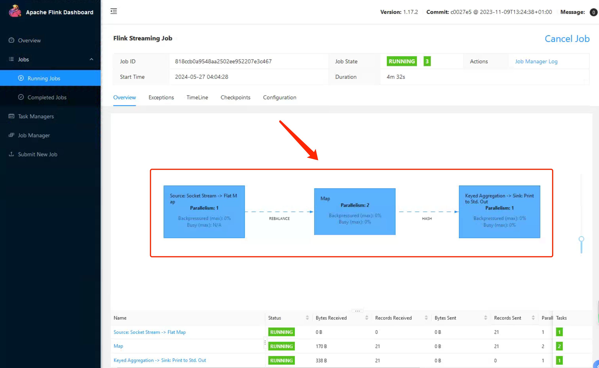        

它是 Flink Job 的 `Job Graph 拓扑图`，它展示了 Job 的执行计划，拓扑图显示了数据流通过各个算子（operators）的路径，以及每个算子的并行度（Parallelism）。 `It's very important`，它可以帮助我们理解 Job的结构和处理过程，它显示的并行度，可帮助我们优化资源使用和提高处理效率，在后面的 Blog 中，我们会很长时间围绕这 `JobGraph`。         

>在之前的 Blog "Flink 源码 - Standalone - Idea 启动 Standalone 集群 (Session Model)" 内容中提到 `Flink Architecture 的拼图游戏`，那 ”Show Plan“ 涉及到哪些角色呢？  

接下来，我们通过 Job 示例，探索 Show Plan 实现过程，并最终画到架构图上：                
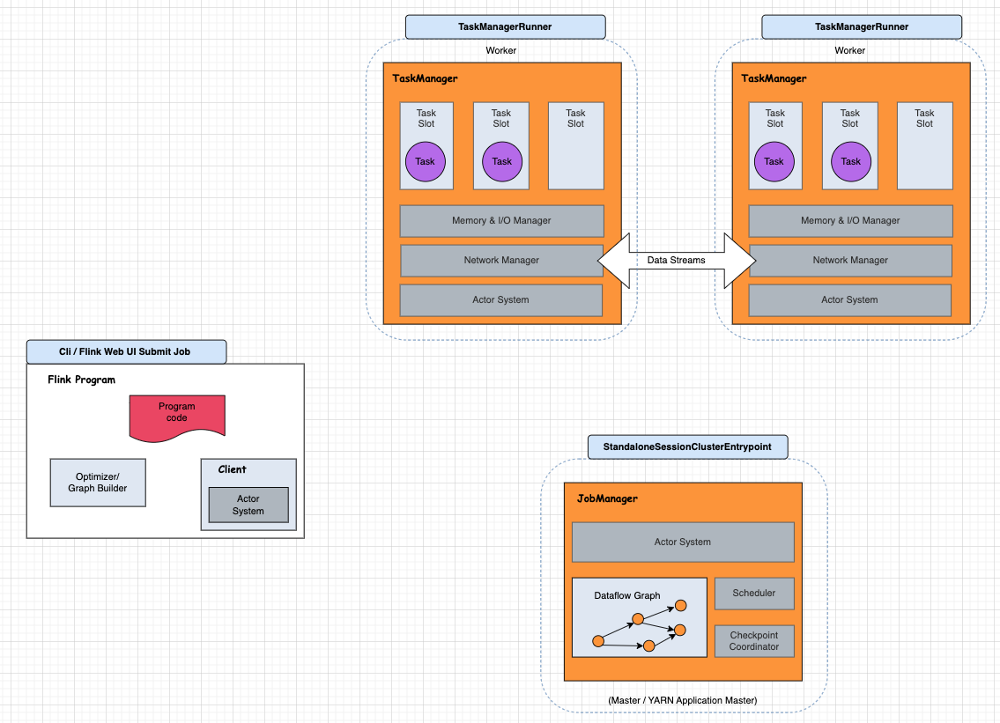              

## 开发 Stream WordCount 作业        
关于从零开始搭建 Flink Job 开发项目，可参考Flink 官网给出的模板示例：`https://nightlies.apache.org/flink/flink-docs-release-1.17/docs/dev/configuration/maven/` ，以下是 Example Job 项目搭建过程：         

### 添加 Flink 相关依赖         
```xml
<dependency>
    <groupId>org.apache.flink</groupId>
    <artifactId>flink-streaming-java</artifactId>
    <version>${flink.version}</version>
    <scope>provided</scope>
</dependency>
<dependency>
    <groupId>org.apache.flink</groupId>
    <artifactId>flink-runtime-web</artifactId>
    <version>${flink.version}</version>
    <scope>provided</scope>
</dependency>

<build>
    <plugins>
        <plugin>
            <groupId>org.apache.maven.plugins</groupId>
            <artifactId>maven-assembly-plugin</artifactId>
            <version>3.0.0</version>
            <configuration>
                <descriptorRefs>
                    <descriptorRef>jar-with-dependencies</descriptorRef>
                </descriptorRefs>
            </configuration>
            <executions>
                <execution>
                    <id>make-assembly</id>
                    <phase>package</phase>
                    <goals>
                        <goal>single</goal>
                    </goals>
                </execution>
            </executions>
        </plugin>

        <plugin>
            <groupId>org.apache.maven.plugins</groupId>
            <artifactId>maven-compiler-plugin</artifactId>
            <version>3.8.0</version>
            <configuration>
                <source>${target.java.version}</source>
                <target>${target.java.version}</target>
                <encoding>UTF-8</encoding>
            </configuration>
        </plugin>
    </plugins>
</build>
```     

### StreamWordCount 示例      
实现的逻辑是 读取 Socket 文本数据，根据数据的“空格” 进行拆分，然后对 word 进行分组求和。            

```java
public class StreamWordCount {
    private static Logger logger = Logger.getLogger(StreamWordCount.class);

    public static void main(String[] args) throws Exception {
        // 1. 创建流式执行环境
//        StreamExecutionEnvironment env = StreamExecutionEnvironment
//                .createLocalEnvironmentWithWebUI(new Configuration());
        StreamExecutionEnvironment env = StreamExecutionEnvironment   // 非本地运行，使用 getExecutionEnvironment()   
                .getExecutionEnvironment(new Configuration());
        env.setRestartStrategy(RestartStrategies
                .fixedDelayRestart(3, Time.of(10, TimeUnit.SECONDS)));
        // 2. Socket 读取  nc -lk 7777
        DataStreamSource<String> lineDSS = env
                .socketTextStream("localhost", 7777);

        // 3. 转换数据格式
        SingleOutputStreamOperator<Tuple2<String, Long>> wordAndOne = lineDSS
                .flatMap((String line, Collector<String> words) -> {
                    Arrays.stream(line.split(" ")).forEach(words::collect);
                })
                .returns(Types.STRING)
                .map(word -> Tuple2.of(word, 1L))
                .returns(Types.TUPLE(Types.STRING, Types.LONG)).setParallelism(2);

        // 4. 分组
        KeyedStream<Tuple2<String, Long>, String> wordAndOneKS = wordAndOne
                .keyBy(t -> t.f0);
        // 5. 求和
        SingleOutputStreamOperator<Tuple2<String, Long>> result = wordAndOneKS
                .sum(1).setParallelism(1);

        // 6. 打印
        result.print();
        logger.info(result.toString());
        // 7. 执行
        env.execute();
    }
}
```

### 打包        
打包后，产出 `flink-blog-1.0-SNAPSHOT-jar-with-dependencies.jar`。            
```shell        
mvn clean package       
```                 

>Example Job 的完整项目示例可访问 Github `https://github.com/xinzhuxiansheng/flink-tutorial/tree/main/flink-blog`

## How to view job plan    
查看 Job Plan 有两种方式，一个是使用 CLI 命令行，另一种是浏览 Flink WEB UI 页面。下面，介绍两种查看方式。               

### CLI 查看 Job Plan     
使用 `./flink info` 查看 Job Graph，可访问官网 `https://nightlies.apache.org/flink/flink-docs-release-1.17/docs/deployment/cli/` 查看 ./flink info 更多介绍。               

```shell
[root@vm01 bin]# ./flink info -h   
Action "info" shows the optimized execution plan of the program (JSON).   
  Syntax: info [OPTIONS] <jar-file> <arguments>  
  "info" action options:
     -c,--class <classname>           Class with the program entry point
                                      ("main()" method). Only needed if the JAR
                                      file does not specify the class in its
                                      manifest.   
     -p,--parallelism <parallelism>   The parallelism with which to run the
                                      program. Optional flag to override the
                                      default value specified in the
                                      configuration.   
```

**执行命令**        
```shell
./flink info -c com.yzhou.blog.wordcount.StreamWordCount TMP/flink-blog-1.0-SNAPSHOT-jar-with-dependencies.jar   
```

Output log:             
```shell
[root@vm01 bin]# ./flink info -c com.yzhou.blog.wordcount.StreamWordCount TMP/flink-blog-1.0-SNAPSHOT-jar-with-dependencies.jar 
WARNING: An illegal reflective access operation has occurred
WARNING: Illegal reflective access by org.apache.flink.api.java.ClosureCleaner (file:/root/yzhou/flink/flink1172/flink-1.17.2/lib/flink-dist-1.17.2.jar) to field java.lang.String.value
WARNING: Please consider reporting this to the maintainers of org.apache.flink.api.java.ClosureCleaner
WARNING: Use --illegal-access=warn to enable warnings of further illegal reflective access operations
WARNING: All illegal access operations will be denied in a future release
----------------------- Execution Plan -----------------------
{
  "nodes" : [ {
    "id" : 1,
    "type" : "Source: Socket Stream",
    "pact" : "Data Source",
    "contents" : "Source: Socket Stream",
    "parallelism" : 1
  }, {
    "id" : 2,
    "type" : "Flat Map",
    "pact" : "Operator",
    "contents" : "Flat Map",
    "parallelism" : 1,
    "predecessors" : [ {
      "id" : 1,
      "ship_strategy" : "FORWARD",
      "side" : "second"
    } ]
  }, {
    "id" : 3,
    "type" : "Map",
    "pact" : "Operator",
    "contents" : "Map",
    "parallelism" : 2,
    "predecessors" : [ {
      "id" : 2,
      "ship_strategy" : "REBALANCE",
      "side" : "second"
    } ]
  }, {
    "id" : 5,
    "type" : "Keyed Aggregation",
    "pact" : "Operator",
    "contents" : "Keyed Aggregation",
    "parallelism" : 1,
    "predecessors" : [ {
      "id" : 3,
      "ship_strategy" : "HASH",
      "side" : "second"
    } ]
  }, {
    "id" : 6,
    "type" : "Sink: Print to Std. Out",
    "pact" : "Data Sink",
    "contents" : "Sink: Print to Std. Out",
    "parallelism" : 1,
    "predecessors" : [ {
      "id" : 5,
      "ship_strategy" : "FORWARD",
      "side" : "second"
    } ]
  } ]
}
--------------------------------------------------------------

No description provided.
```     

### Flink WEB UI 查看 Job Plan      

**Job 未提交前，查看 Job Plan**         

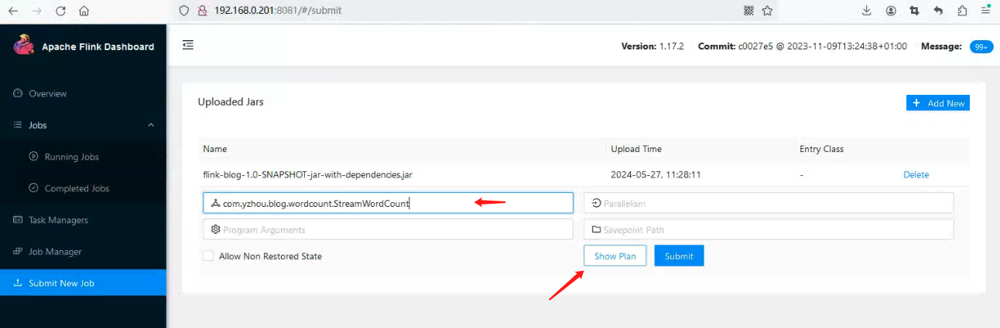    

**Job 提交后，查看 Job Plan**   

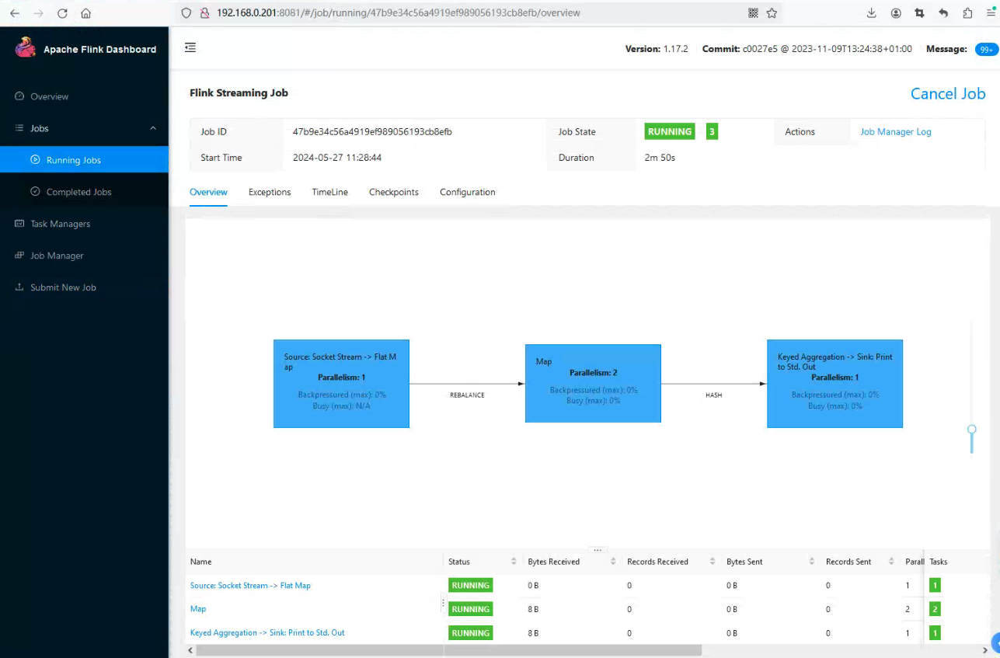        


>注意，若你实践过后，一定要得到一个结论：CLI 返回的 Plan JSON信息 并不与 Standalone 集群通信，所以它独立在 Flink Client 完成的。 这点无法在 Flink WEB UI 验证，因为 Flink WEB UI 是由 JobManager 的 Netty Server 提供的。         

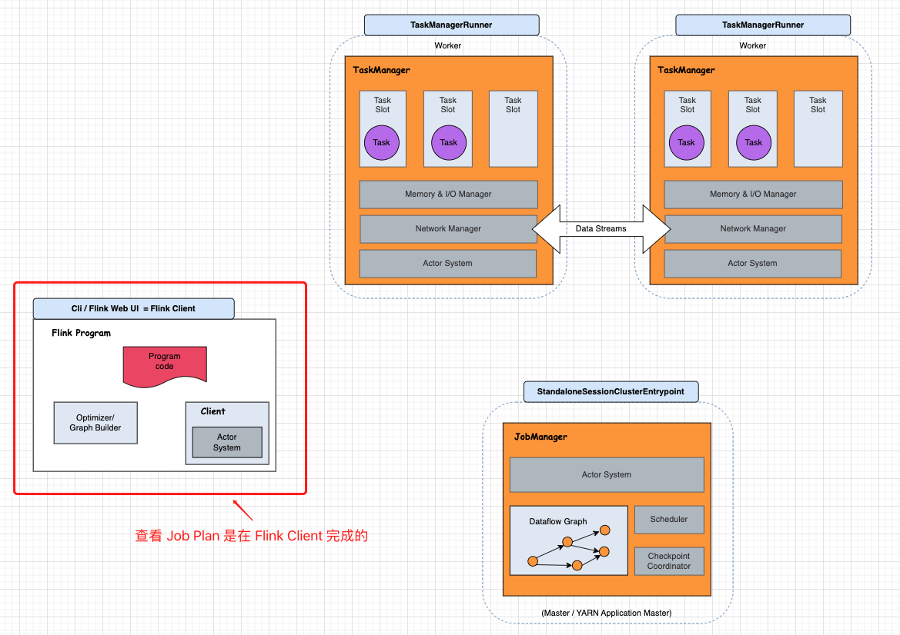        

其实，这个结论在 官网也有提到以下内容 :  (https://nightlies.apache.org/flink/flink-docs-master/docs/internals/job_scheduling/)      

```bash
The JobManager receives the JobGraph , which is a representation of the data flow consisting of operators ( JobVertex ) and intermediate results ( IntermediateDataSet ). Each operator has properties, like the parallelism and the code that it executes. In addition, the JobGraph has a set of attached libraries, that are necessary to execute the code of the operators.
```  
 
JobManager 接受到 JobGraph ..., 那说明 Flink Client 在提交 Job 的时候，会带有 JobGraph 参数给 JobManager。      
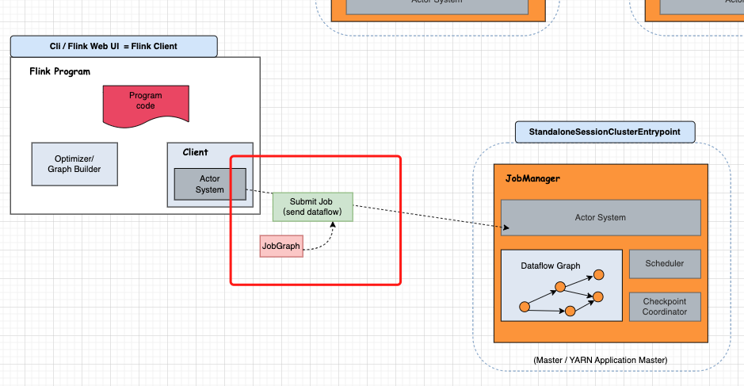        


## 配置源码调试     
`在后面的内容学习过程中，当我一筹莫展的时候，唯有 Debug 解惑`。It's very important.        

### CLI 调试    
该步骤可参考之前 Blog “Flink 源码 - Standalone - 通过 CliFrontend 提交 Job 到 Standalone 集群” 的配置项，但需修改 “Program arguments” 参数项为：`info
-c
com.yzhou.blog.wordcount.StreamWordCount
D:\Code\Java\flink-tutorial\flink-blog\target\flink-blog-1.0-SNAPSHOT-jar-with-dependencies.jar`        

### Flink WEB UI 远程调试 
该步骤可参考之前 Blog “Flink 源码 - Standalone - 通过 CliFrontend 提交 Job 到 Standalone 集群” 对 conf/flink-conf.yaml的 `env.java.opts.jobmanager` 参数配置。          

>注意，关于 Flink WEB UI的 API 服务是由 JobManager 的Netty Sever 提供的，在调试`Show Plan` 功能，我们还需找到它对应的 Handler。 接下来，我简单介绍下，也可减少大家定位代码的时间成本。下面是 Netty Server的结构图：     

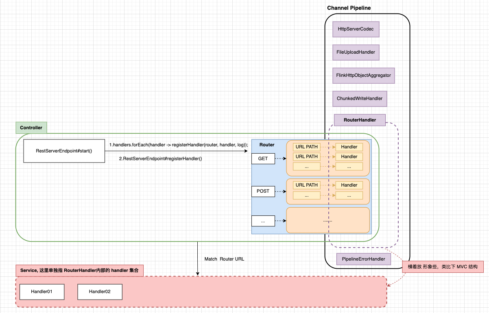        

可阅读 `RestServerEndpoint#start()` 了解 Netty Server的启动过程，那么 Show Plan 对应的 Handler 是 `JarPlanHandler`, 处理逻辑在 `handleRequest()`; 下面是 `JarPlanHandler#handleRequest()`具体代码：       
```java
@Override
protected CompletableFuture<JobPlanInfo> handleRequest(
        @Nonnull final HandlerRequest<JarPlanRequestBody> request,
        @Nonnull final RestfulGateway gateway)
        throws RestHandlerException {
    final JarHandlerContext context = JarHandlerContext.fromRequest(request, jarDir, log);
    final Configuration effectiveConfiguration = new Configuration(this.configuration);
    context.applyToConfiguration(effectiveConfiguration, request);

    return CompletableFuture.supplyAsync(
            () -> {
                try (PackagedProgram packagedProgram =
                                context.toPackagedProgram(effectiveConfiguration)) {
                    final JobGraph jobGraph =
                            context.toJobGraph(packagedProgram, effectiveConfiguration, true);
                    return planGenerator.apply(jobGraph);
                }
            },
            executor);
}
```

到此，我就不花篇幅说明 Netty Server是如何构造的，我们还是要回到主线`Show Plan`。                 

## Debug Show Plan Code      
>我采用的是 Flink WEB UI 远程调试, 如下图所示：         
 

### PackagedProgram                  
**JarPlanHandler#handleRequest()**      
```java     
@Override
protected CompletableFuture<JobPlanInfo> handleRequest(
        @Nonnull final HandlerRequest<JarPlanRequestBody> request,
        @Nonnull final RestfulGateway gateway)
        throws RestHandlerException {

    ...... 省略部分代码    

    return CompletableFuture.supplyAsync(
            () -> {
                try (PackagedProgram packagedProgram =
                        context.toPackagedProgram(effectiveConfiguration)) {  
                    
                    ...... 省略部分代码   

                }
            },
            executor);
}     
```

### 创建 PackagedProgram userCodeClassLoader    
PackagedProgram 在它的构造方法中，创建了一个自定义类加载器 `FlinkUserCodeClassLoader userCodeClassLoader`。 `FlinkUserCodeClassLoaders#create()`方法会根据 `classloader.resolve-order` 配置项来决定创建的 ChildFirstClassLoader 还是 ParentFirstClassLoader, 这样是为了定义从用户代码加载类时的类解析策略，即是先检查用户代码 jar（“child-first”）还是应用程序类路径（“parent-first”）。默认设置是先从用户代码 jar 加载类，这意味着用户代码 jar 可以包含和加载与 Flink 使用的不同的依赖项。关于这部分的参数可访问 `https://nightlies.apache.org/flink/flink-docs-release-1.17/docs/deployment/config/#classloader-resolve-order`。      

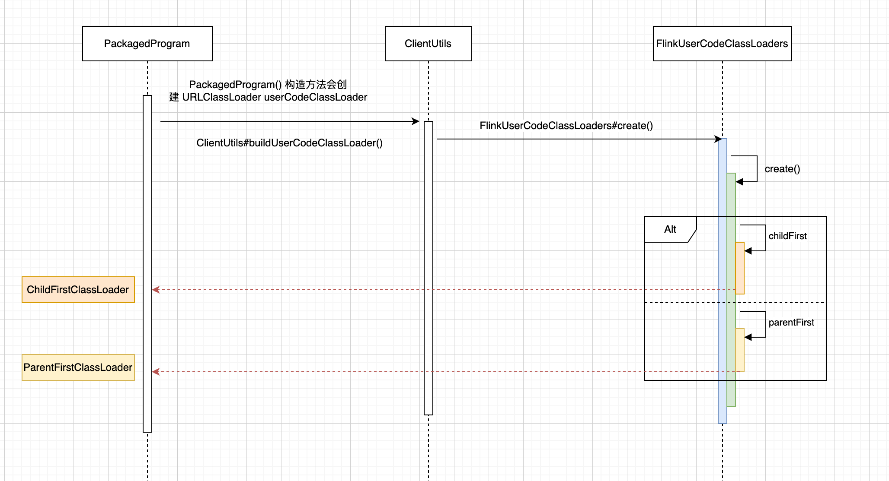  

ChildFirstClassLoader 、 ParentFirstClassLoader 是 FlinkUserCodeClassLoader的派生类，且父类 MutableURLClassLoader 继承了 URLClassLoader，也重写了 addURL() 方法，这样就可以动态新的 URL，再使用 loadCLass()方法加载类，从而达到动态 class的效果。          
**FlinkUserCodeClassLoader 类图：**           
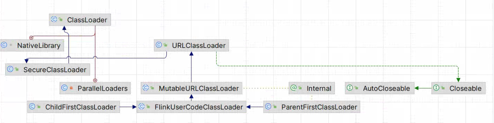

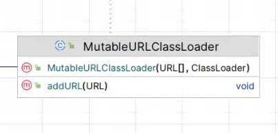           

显然，`child-first` ChildFirstClassLoader 打破了双亲机制，在 `ChildFirstClassLoader#loadClassWithoutExceptionHandling()`方法，首先判断当前class是否已加载，若没有，再去判断当前的 class 是否符合`classloader.parent-first-patterns.default`参数的 package path，
如果是 true，则会走父类加载。          
```java
@Override
protected Class<?> loadClassWithoutExceptionHandling(String name, boolean resolve)
        throws ClassNotFoundException {

    ...... 省略部分代码 
        // check whether the class should go parent-first
        for (String alwaysParentFirstPattern : alwaysParentFirstPatterns) {
            if (name.startsWith(alwaysParentFirstPattern)) {
                return super.loadClassWithoutExceptionHandling(name, resolve);
            }
        }
    ...... 省略部分代码 
}
```     

在上面代码中的 alwaysParentFirstPatterns 集合变量，可通过参数配置，参考 Flink 官网 `Configuration`文档，可访问 `https://nightlies.apache.org/flink/flink-docs-release-1.17/docs/deployment/config/#classloader-parent-first-patterns-default`    

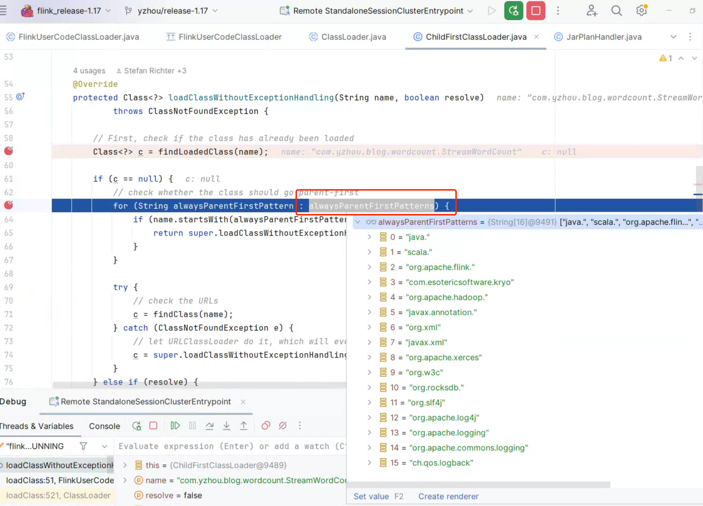    


>双亲委派（Parent Delegation）是 Java 类加载机制中的一种重要的原则，用于保证类的唯一性和安全性。该机制要求类加载器在加载类时首先委派给父类加载器，只有在父类的加载器无法加载该类时，才由子类加载器尝试加载。    
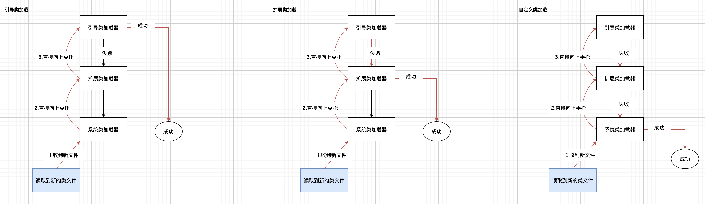      

对于其他类，先查找 Class，这部分对应的是 ChildFirstClassLoader的构造 方法，传入了 Flink Job的 Jar, 所以 findClass(name)的结果，是可以找到 `com.yzhou.blog.wordcount.StreamWordCount.class`。             
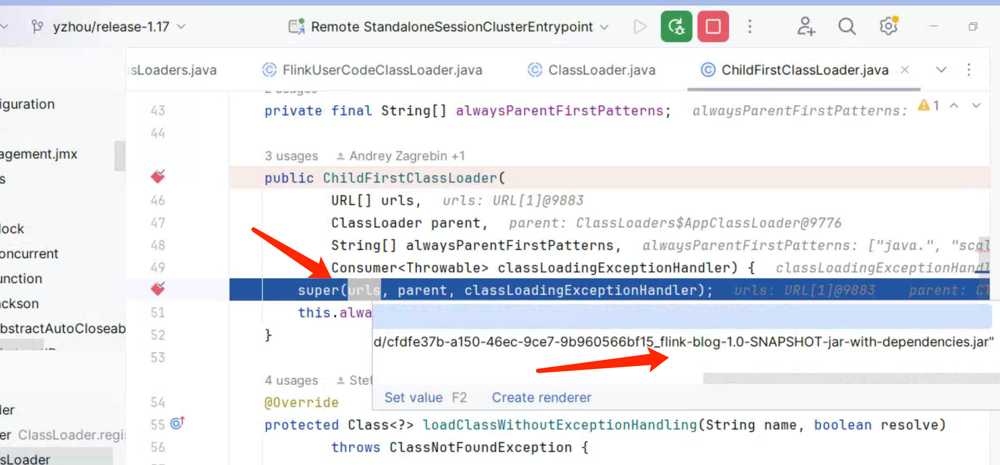        

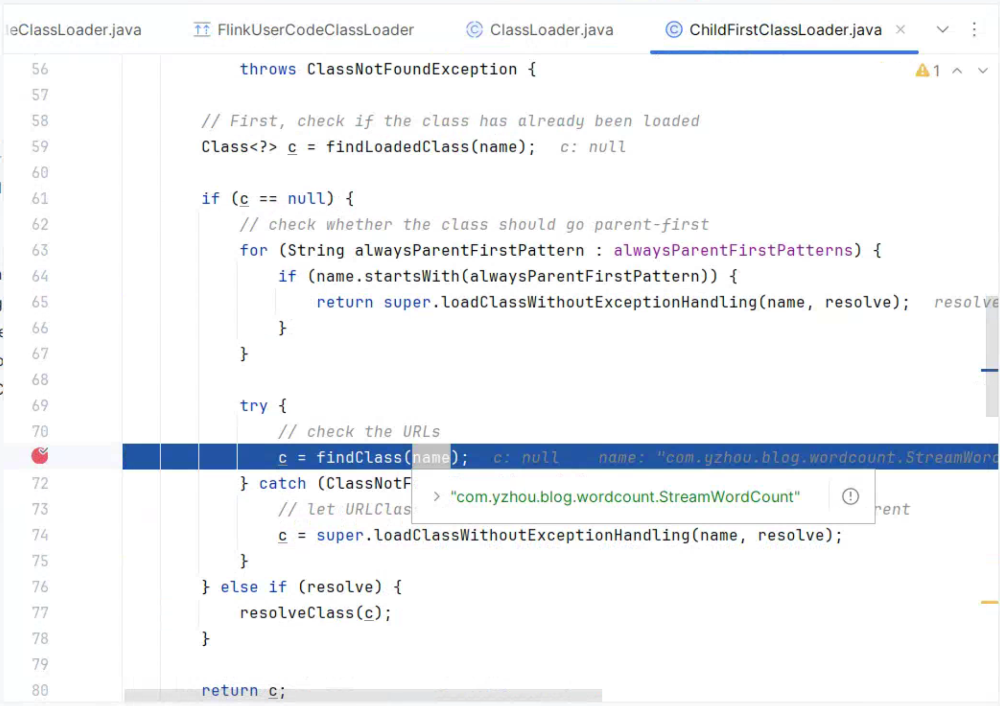        

若没有找到，则委托父类加载`c = super.loadClassWithoutExceptionHandling(name, resolve);`         
ParentFirstClassLoader 类就不需要过多介绍，它遵循的是双亲委派，下面列出
`ChildFirstClassLoader#loadClassWithoutExceptionHandling()` Code：          

**ChildFirstClassLoader#loadClassWithoutExceptionHandling()**           
```java
@Override
protected Class<?> loadClassWithoutExceptionHandling(String name, boolean resolve)
        throws ClassNotFoundException {

    // First, check if the class has already been loaded
    Class<?> c = findLoadedClass(name);

    if (c == null) {
        // check whether the class should go parent-first
        for (String alwaysParentFirstPattern : alwaysParentFirstPatterns) {
            if (name.startsWith(alwaysParentFirstPattern)) {
                return super.loadClassWithoutExceptionHandling(name, resolve);
            }
        }

        try {
            // check the URLs
            c = findClass(name);
        } catch (ClassNotFoundException e) {
            // let URLClassLoader do it, which will eventually call the parent
            c = super.loadClassWithoutExceptionHandling(name, resolve);
        }
    } else if (resolve) {
        resolveClass(c);
    }

    return c;
}
```

>关于 Class Loading 的配置部分，Flink 官网 doc 也单独列出来，可访问 `https://nightlies.apache.org/flink/flink-docs-release-1.17/docs/deployment/config/#class-loading` 了解更多。                                        

### 创建 PackagedProgram mainClass            
该章节内容的介绍 与 上一章节 "创建 PackagedProgram userCodeClassLoader"的内容是联动的， 正如它的实现一样，是使用 userCodeClassLoader 来加载 mainClass。 
```java
this.mainClass =
    loadMainClass(
            // if no entryPointClassName name was given, we try and look one up through
            // the manifest
            entryPointClassName != null
                    ? entryPointClassName
                    : getEntryPointClassNameFromJar(this.jarFile),
            userCodeClassLoader);       
```

`使用自定义的ClassLoader（并打破双亲委托机制），其目的是为了保障 class 的唯一性`，避免因为 lib version 不一致，出现类冲突，例如 ClassNotFoundException、NoSuchMethodError等 异常出现。 

下面补充一个概念：                      
>类的唯一性是如何确定？       
Java 类的唯一性是通过类加载器和类的全限定名来确定的。   
1. **类加载器**：每个类加载器在 JVM 中都是唯一的，不同的类加载器加载同一个类会产生不同的类对象。因此，类的唯一性与加载它的类加载器密切相关。  
2. **类的全限定名**：类的全限定名包括包名和类名，形如 `com.example.MyClass`。在同一个类加载器中，类的全限定名必须是唯一的。如果两个类具有相同的全限定名，它们会被视为同一个类。  
综合来说，Java 类的唯一性由类加载器和类的全限定名共同确定。在同一个类加载器中，类的全限定名必须是唯一的，否则会导致类的冲突。    

`这里特别说明一点`，为了不破坏原有线程的 ClassLoader，当加载 MainClass 时设置线程的 classloader 为 FlinkUserCodeClassLoader, 处理完后再将原来的 ClassLoader 设置回去。`这点特别重要，这么做的好处是，既保证了 “当前线程” 需要 “加载的类” 的唯一性，又不破坏 JVM 原有的 ClassLoader实现。` 下面列出 ClassLoader 切换的 Code：                        
**PackagedProgram#loadMainClass()**      
```java
private static Class<?> loadMainClass(String className, ClassLoader cl)
        throws ProgramInvocationException {
    ClassLoader contextCl = null;
    try {
        contextCl = Thread.currentThread().getContextClassLoader();
        Thread.currentThread().setContextClassLoader(cl);
        return Class.forName(className, false, cl);
    
    ...... 省略部分代码 

    } finally {
        // 在 finnally 部分，在赋值为原来的 ClassLoader
        if (contextCl != null) {
            Thread.currentThread().setContextClassLoader(contextCl);
        }
    }
}
```

大家可阅读 `DataX 项目 CLassLoaderSwapper.java`的实现。 代码示例如下，它使用了同样的 classloader 切换逻辑， 这对于一个动态任务架构的服务来说，特别经典的处理方式。      
**CLassLoaderSwapper#setCurrentThreadClassLoader()**        
```java
/**
 * 保存当前classLoader，并将当前线程的classLoader设置为所给classLoader
 *
 * @param
 * @return
 */
public ClassLoader setCurrentThreadClassLoader(ClassLoader classLoader) {
    this.storeClassLoader = Thread.currentThread().getContextClassLoader();
    Thread.currentThread().setContextClassLoader(classLoader);
    return this.storeClassLoader;
}
```

到此，PackagedProgram.newBuilder() 构建的重要部分已介绍的差不多了，接下来，探讨 JobGraph 的构造过程。                  

## JobGraph     

**JarPlanHandler#handleRequest()**   
```java
@Override
protected CompletableFuture<JobPlanInfo> handleRequest(
        @Nonnull final HandlerRequest<JarPlanRequestBody> request,
        @Nonnull final RestfulGateway gateway)
        throws RestHandlerException {
    
    ...... 省略部分代码 

    return CompletableFuture.supplyAsync(
            () -> {
                try (...... 省略部分代码 ) {
                    final JobGraph jobGraph =
                            context.toJobGraph(packagedProgram, effectiveConfiguration, true);
                    return planGenerator.apply(jobGraph);
                }
            },
            executor);
}  
```         

下面给出 JobGraph 构造时序图                
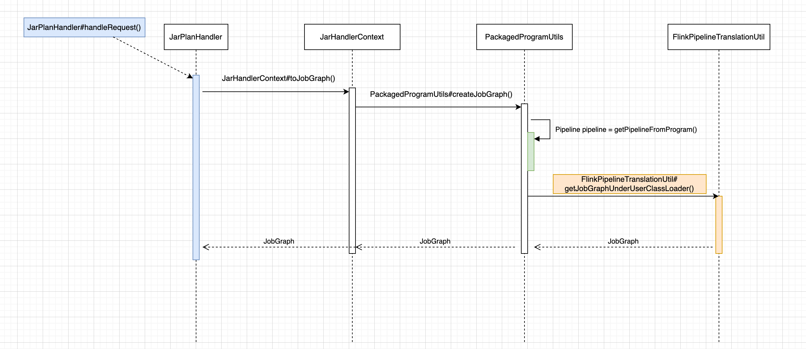             

JobGraph的构造主要部分在`PackagedProgramUtils#createJobGraph(...)`方法的内部，接下来，我们来重点讲解这部分的逻辑。             

### 创建 Pipeline      
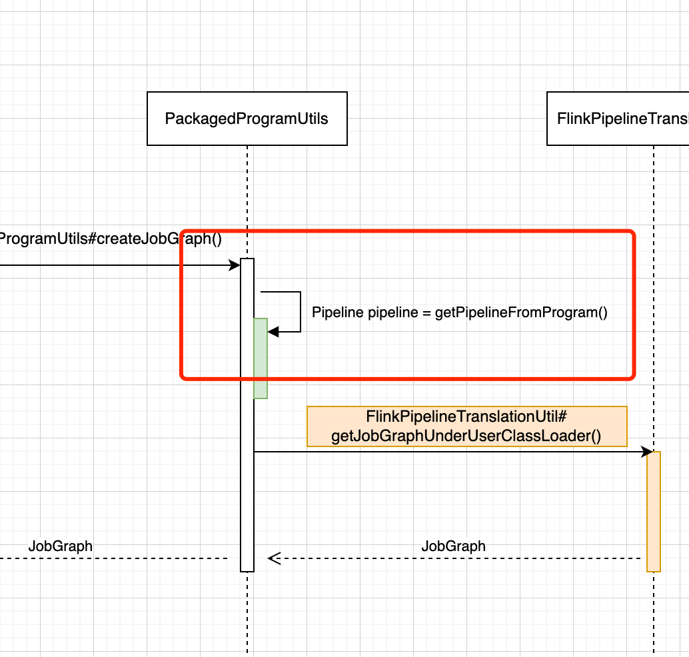    

**PackagedProgramUtils#createJobGraph(......)**       
```java
final Pipeline pipeline =
        getPipelineFromProgram(
                packagedProgram, configuration, defaultParallelism, suppressOutput);
``` 

`PackagedProgramUtils#getPipelineFromProgram()`方法实现逻辑让我花了些时间去思考。       
**PackagedProgramUtils#getPipelineFromProgram() 时序图**
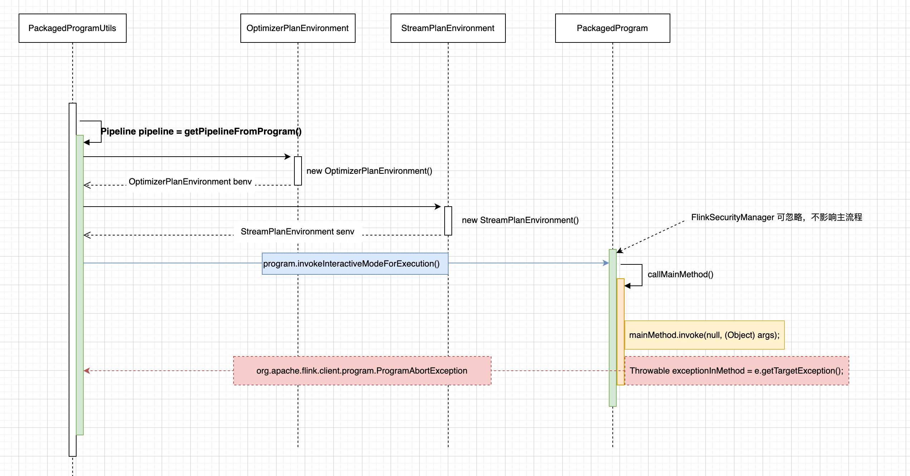   

从 benv 、senv 对象的创建，到 `program#invokeInteractiveModeForExecution()` 内部调用 `PackagedProgram#callMainMethod()` 执行 Flink Job 的 main() 方法。 但在调试过程中发现，callMainMethod() 总是会抛出 `org.apache.flink.client.program.ProgramAbortException`。如下图所示：  
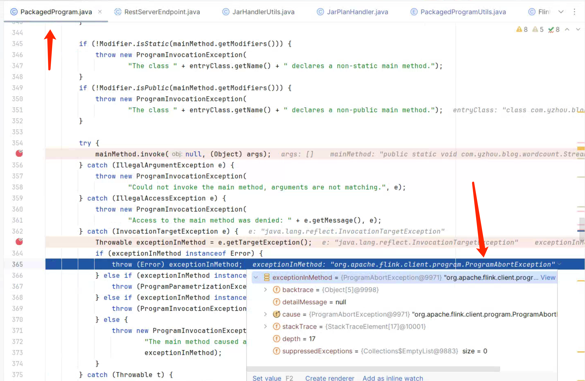                 

通过 Idea 查看 `ProgramAbortException`的 usages，如下图所示：        
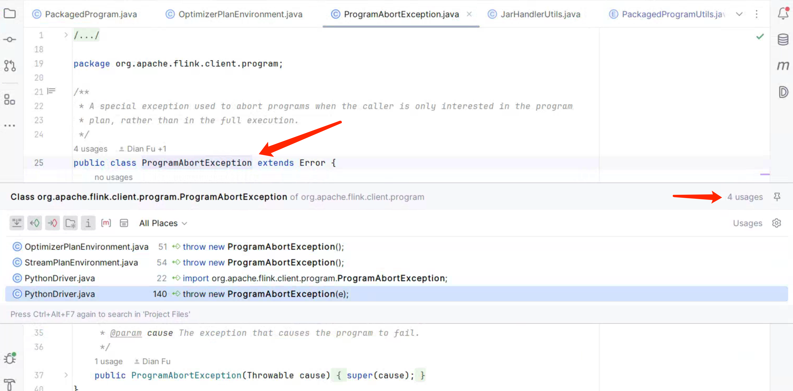        

OptimizerPlanEnvironment、StreamPlanEnvironment 正好对应的 benv、senv。分别在它们的 executeAsync() 方法打了断点，可知 
callMainMethod() 异常是由 `StreamPlanEnvironment#executeAsync()` 抛出。**那是不是意味着 Flink Job StreamWordCount的 main() 在执行的过程中，会调用`StreamPlanEnvironment#executeAsync()`?**。

是的，Debug 过程中，断点进入`StreamPlanEnvironment#executeAsync()`后，通过 Idea 查看 JVM虚拟机栈，可以看到 main()的栈帧，这足够证明 StreamPlanEnvironment 与 Flink Job 的 `env.execute()`的关联性，如下图所示：     
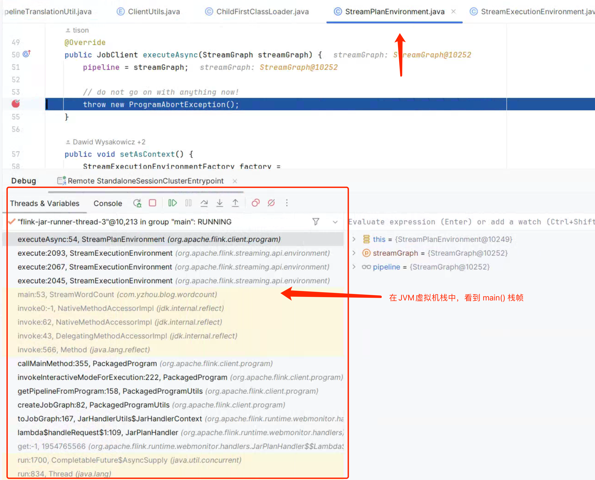    

接下来，了解 `StreamPlanEnvironment 与 Flink Job 的 env.execute()`是如何关联的。         

#### 1）Flink 源码绑定 StreamWordCount example 项目     
StreamWordCount.java 是篇章节 “开发 Stream WordCount 作业” 的示例代码，`PackagedProgram#callMainMethod()`通过发射调用`StreamWordCount#main()`方法，而 Flink 源码中是不存在`StreamWordCount.java`, 所以为了调试 StreamWordCount#main(), 我将 示例项目 copy 一份到 Flink的 `flink-examples` 模块下，结构如下图：     

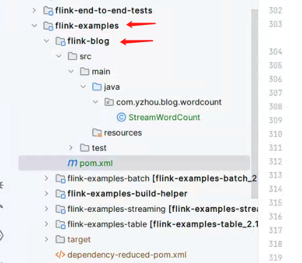   

此时，在 StreamWordCount#main() 打上断点，重新在Flink Web UI 中点击 “Show Plan”，就可以调试了。如下图所示： 

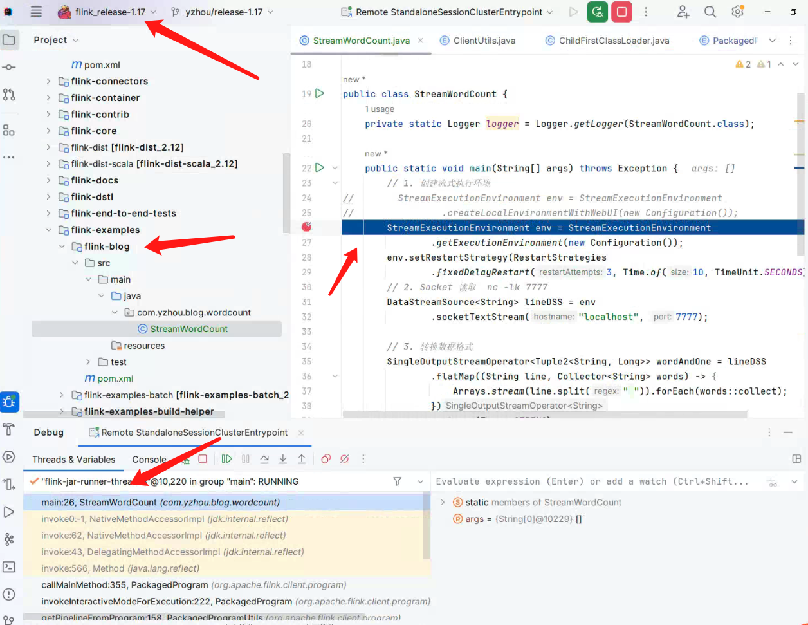    

#### 2）StreamWordCount DataStream API 链路 与 Transformation 关系       
通过 DataStream<T> 类图可了解到，每个 DataStream<T>内部 都包含一个 Transformation 对象，在后续的代码中可以证实，`DataStream<T> 是 Flink User API 衔接转换的 Object，但其本质是构建出其内部的 Transformation 对象`如下图所示：       

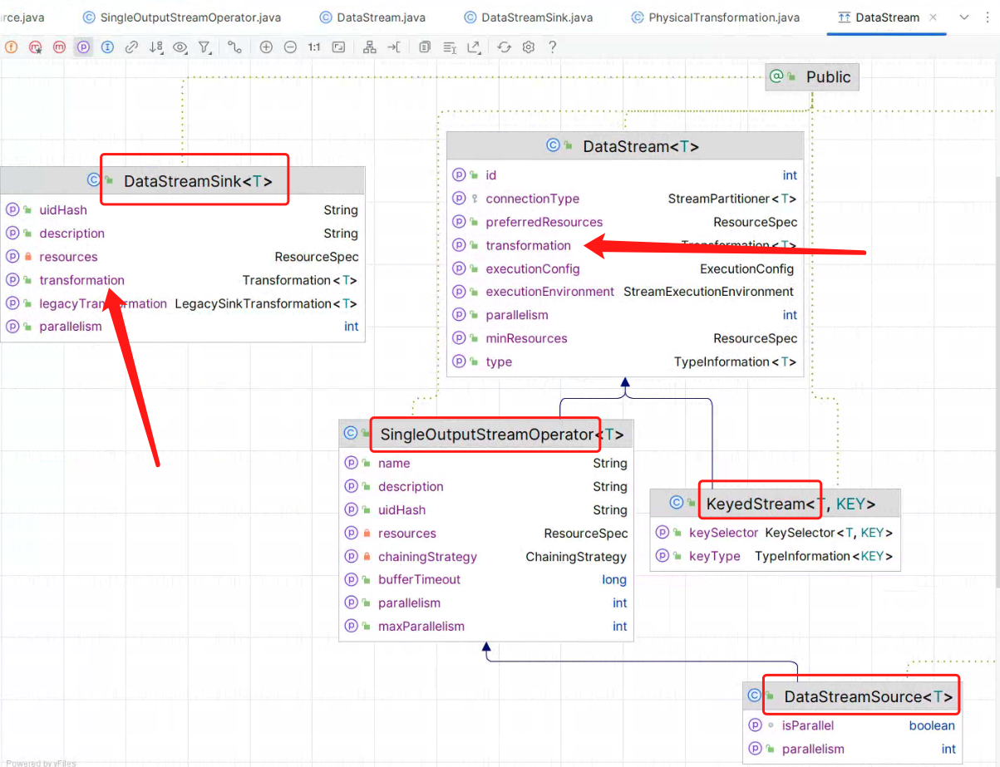    

#### 3）DataStream 派生类中的 Transformation 属性会存放在 StreamExecutionEnvironment.transformations 集合中     

>transformations的类型是 List<Transformation<?>>  

如下图所示, 我将 StreamWordCount 分成两个模块。         
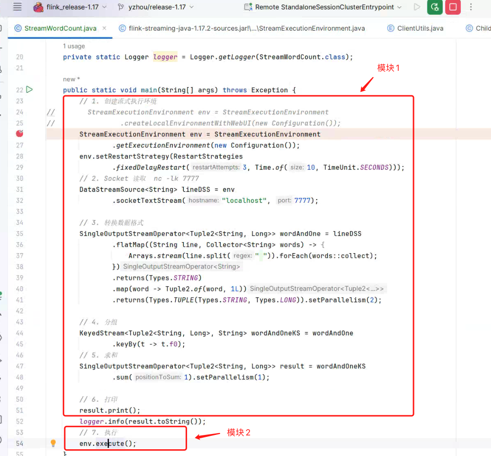 

在上图中`模块一`代码中，调用 .socketTextStream()、.flatMap()、.map()、.keyBy()、.sum()、.print() 方法, 它会创建不同类型的 DataStream<T> 派生类以及 它内部的 `Transformation<T> transformation` 属性。 StreamWordCount的 链路如下图所示：         

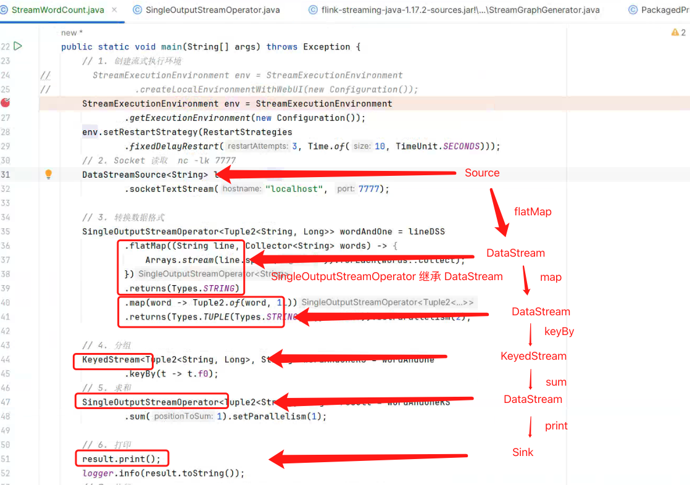   
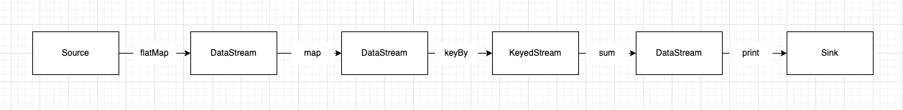                    

Flink 官网文档的code 示例也将中间算子 Transformation 标记出来，可访问`https://nightlies.apache.org/flink/flink-docs-release-1.17/docs/learn-flink/overview/#stream-processing`,如下图所示：   
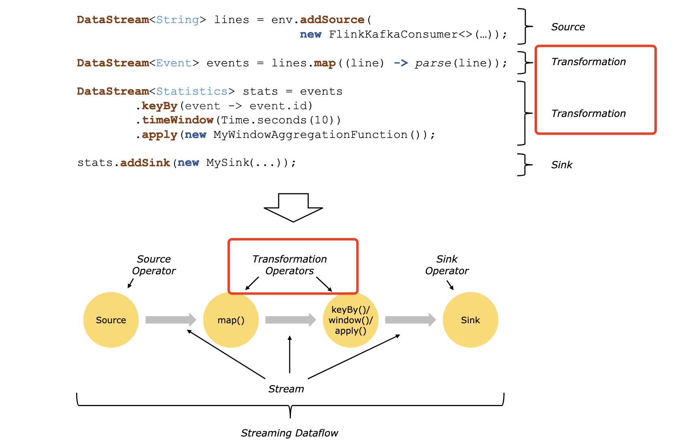        

Flink 首先会将该链路算子转成 `Transformation`对象，存储在 `StreamExecutionEnvironment.transformations`集合中，如下图所示(标记出红框)：   
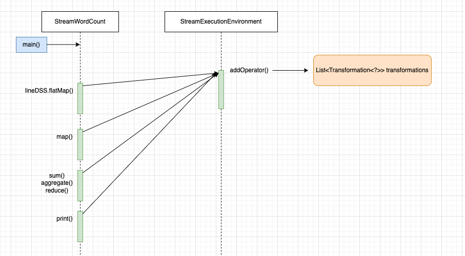                   

跟着上面的思路，那 flatMap、map、keyBy、sum 会创建其内部 Transformation 对象，那都会存在 `StreamExecutionEnvironment.transformations`集合中么 ？。                 

`但结果并不这样`，首先根据 Debug 结果可知，`StreamExecutionEnvironment.transformations` 集合长度为4，子项为：  
* OneInputTransformation flatMap   
* OneInputTransformation Map  
* ReduceTransformation Keyed Aggregation  
* LegacySinkTransformation Prnt to Std.Out      

并不包含 keyBy() 的 PartitionTransformation ，下面是 keyBy 的 KeyedStream#KeyedStream()代码，显然它没有调用`StreamExecutionEnvironment#addOperator()`方法。         
```java
this(
    dataStream,
    new PartitionTransformation<>(
            dataStream.getTransformation(),
            new KeyGroupStreamPartitioner<>(
                    keySelector,
                    StreamGraphGenerator.DEFAULT_LOWER_BOUND_MAX_PARALLELISM)),
    keySelector,
    keyType);  
```

**那这里我会有 2个疑惑？**        
* 1.transformations集合 没有 keyBy()的 PartitionTransformation 如何保证 StreamWordCount DataStram API 链路的完整性 ？       
* 2.哪些 Transformation 该加入 `StreamExecutionEnvironment.transformations`集合中。         

**针对第一个疑惑**：Transformation<T> 抽象类中，它内部包含有一个 `public abstract List<Transformation<?>> getInputs()` 抽象方法，它的派生类内有一个 `Transformation<IN> input` 属性，再重写 getInputs(),返回 `Collections.singletonList(input)`。  

Transformation<IN> input 存放的是它上一个 DataStream<T> 的 input。 我们可以通过 flatMap 对应的 OneInputTransformation 对象来做演示，下面是创建 OneInputTransformation 对象的代码：  
```java
OneInputTransformation<T, R> resultTransform =
    new OneInputTransformation<>(
            this.transformation,    // 特别注意该形参值 
            operatorName,
            operatorFactory,
            outTypeInfo,
            environment.getParallelism(),
            false);
```

而 this.transformation 是 Source DataStream对象内部的 Transformation。  根据`引用传递`,那 `StreamExecutionEnvironment.transformations`集合 如下图(**图33**)所示：      
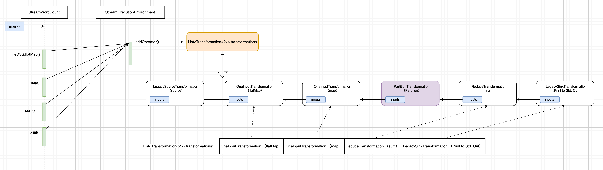  

集合中每个 transformation 的内部属性 inputs 存放了它前面所有的 transformations 引用链路。        

**针对第二个疑惑**：我们知晓调用`StreamExecutionEnvironment#addOperator()`方法，才会将 Transformation 对象添加到 `StreamExecutionEnvironment.transformations`集合中。 关于 `keyBy() 的 PartitionTransformation` 没有加入到 transformations集合中，其原因是 PartitionTransformation 没有继承 `PhysicalTransformation`抽象类，这意味着它在运行时并不会转换为算子。 以 StreamWordCount 为例，看它的 Transformation 的继承关系：        
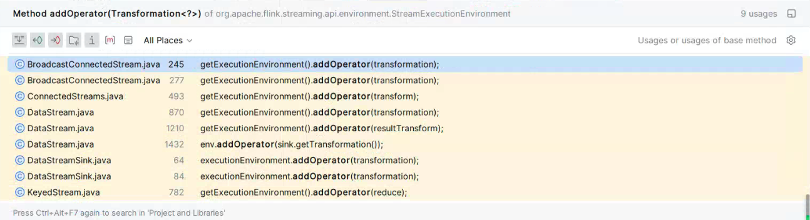        

* 继承 `PhysicalTransformation`抽象类的 Transformation 称为 `物理 Transformation`，它会在运行时转换为具体的算子。        

* 直接继承 `Transformation`抽象类的 Transformation 称为 `虚拟 Transformation`，它不会在运行时转换为具体的算子。             

但有个例外`LegacySourceTransformation (Source)` 并没有添加到`transformations`集合中，`规律总结得到的一个结论：非 Source 的 Transformation 除外，其它 物理 Transformation 会加到 transformations集合中`。        

>关于 物理 Transformation 和 虚拟 Transformation 概念 ，在后面构造 StreamGraph 会用到，请务必知晓。      

#### 3）List<Transformation<?>> transformations 遍历以及递归的过程  
在`模块二`中，当执行 `env.execute()`方法时，会传入 `StreamExecutionEnvironment.transformations`集合作为形参来调用 `StreamExecutionEnvironment#getStreamGraph()` 来构造 StreamGraph的。 如下图所示：         

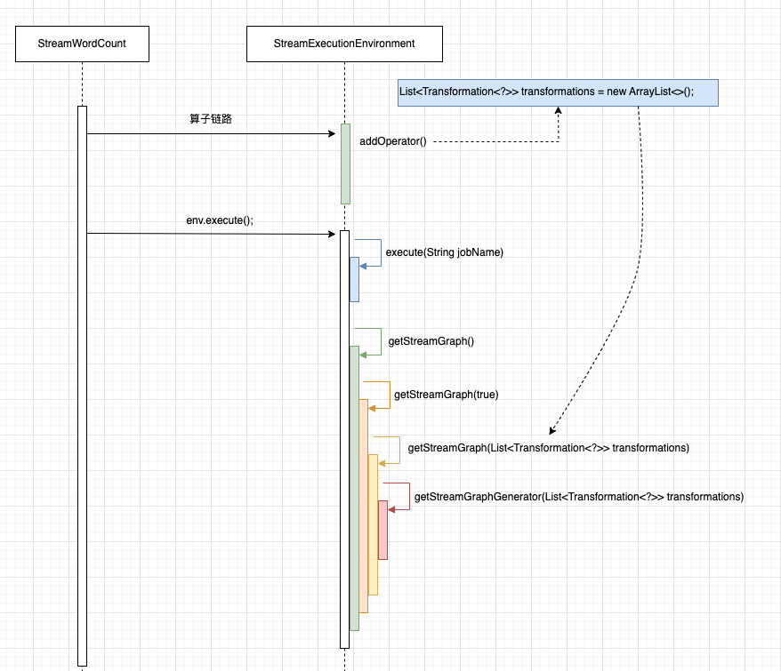     

下面通过 Idea 的 `Call Hierarchy` 查看 StreamGraph 生成的核心方法`StreamGraphGenerator#generate()` 从 StreamWordCount#main() 为入口的调用链路。         
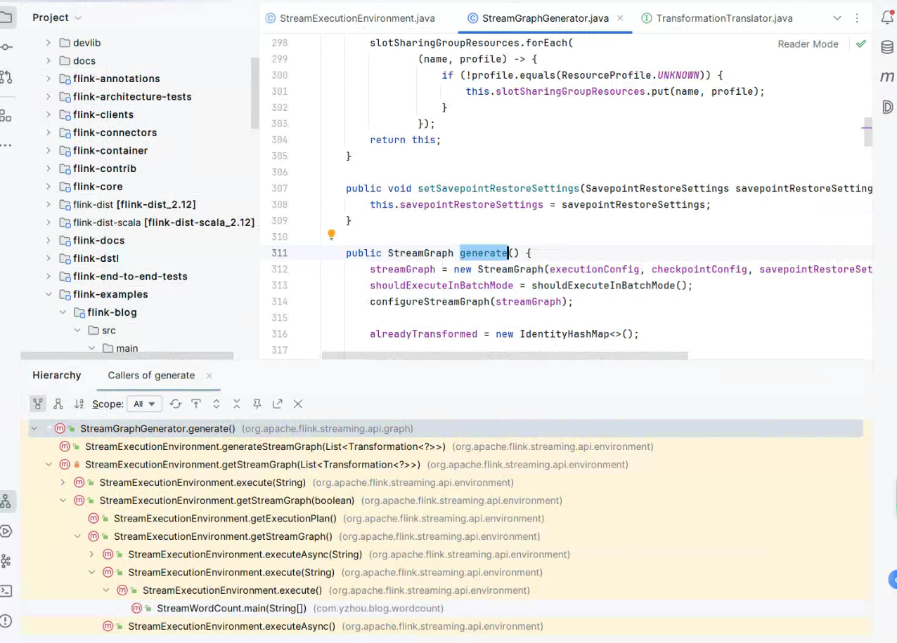        

>注意，`StreamExecutionEnvironment.transformations`集合的结构图(**图33**)请务必记住，在下面的介绍过程中，全部围绕它的结构层次来执行，包括一些递归操作。 `It's very important !!!`。      

下面是 `StreamGraphGenerator#generate()` 方法代码。        
```java
public StreamGraph generate() {
    streamGraph = new StreamGraph(executionConfig, checkpointConfig, savepointRestoreSettings);
    shouldExecuteInBatchMode = shouldExecuteInBatchMode();
    configureStreamGraph(streamGraph);

    alreadyTransformed = new IdentityHashMap<>();

    for (Transformation<?> transformation : transformations) {
        transform(transformation);
    }

    streamGraph.setSlotSharingGroupResource(slotSharingGroupResources);

    setFineGrainedGlobalStreamExchangeMode(streamGraph);

    for (StreamNode node : streamGraph.getStreamNodes()) {
        if (node.getInEdges().stream().anyMatch(this::shouldDisableUnalignedCheckpointing)) {
            for (StreamEdge edge : node.getInEdges()) {
                edge.setSupportsUnalignedCheckpoints(false);
            }
        }
    }

    final StreamGraph builtStreamGraph = streamGraph;

    alreadyTransformed.clear();
    alreadyTransformed = null;
    streamGraph = null;

    return builtStreamGraph;
}
```

在 **generate()** 方法中，首先会创建 StreamGraph 实例，在通过 for 循环(`for (Transformation<?> transformation : transformations)`)遍历 transformation &  调用 transform(transformation)，其内部会将 transformation 转换为 `StreamNode` 以及关联一些 `StreamEdge`。     

**transform(transformation)** 方法，是转换 transformation 的入口 function;      

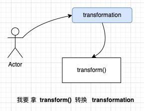   

其内部先使用`alreadyTransformed`判断是否转换过(这点非常重要，但这也是因为它的数据结构而存在的)，其次它会做一些参数初始化，例如最大并发数`transform.setMaxParallelism`，共享 slot槽 `transform.getSlotSharingGroup().ifPresent` 等配置，等做完这些准备后，transform() 方法会从 一个静态 Map `translatorMap` 获取对应的 translator `translatorMap.get(transform.getClass())`，得到一个 translator。          

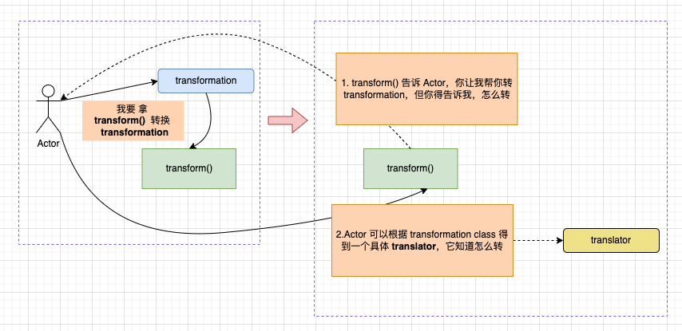     

**StreamGraphGenerator#transform(transformation)** 方法, 有了 translator ，会调用`StreamGraphGenerator#translate(translator, transform)`方法，委托 translator 负责转换 transformation 。 但 transformation 自身的数据结构内部是包括 上游 parent Transformations，在转换自身之前，要先判断 parent Transformations 是否都完成转换，其次才是 自己。

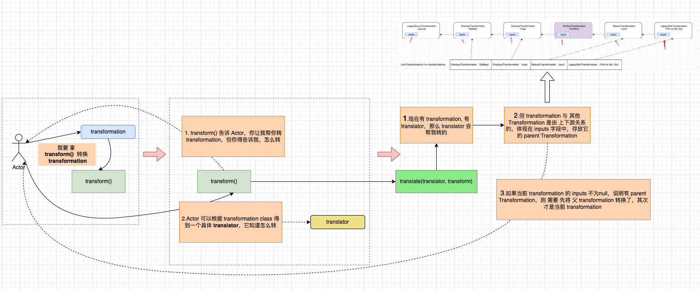                

**StreamGraphGenerator#translate(translator, transform)** 方法，在判断当前 transform 是否包含 parent Transformations，会存在递归逻辑，`final List<Collection<Integer>> allInputIds = getParentInputIds(transform.getInputs());` , 若存在 父 Transformation ，则通过 `for (Transformation<?> transformation : parentTransformations)`,遍历它的父 Transformation，`allInputIds.add(transform(transformation));` 调回 `StreamGraphGenerator#transform(transformation)` 这已形成递归调用。        

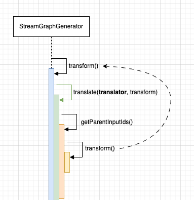        


**StreamGraphGenerator#getParentInputIds()**  
```java
private List<Collection<Integer>> getParentInputIds(
        @Nullable final Collection<Transformation<?>> parentTransformations) {
    final List<Collection<Integer>> allInputIds = new ArrayList<>();
    if (parentTransformations == null) {
        return allInputIds;
    }

    for (Transformation<?> transformation : parentTransformations) {
        allInputIds.add(transform(transformation)); // 递归调用 transform 
    }
    return allInputIds;
}
```     

下面，结合(**图33**)，使用一些示例，对 getParentInputIds() 方法进行递归演示：           
            

从 `StreamExecutionEnvironment.transformations`集合取出 `OneInputTransformation （flatMap）`        

1.执行 StreamGraphGenerator#transform(transformation)，先判断 `OneInputTransformation （flatMap）`是否转换过 在从`translatorMap.get(transform.getClass())`取出 translator。             

2.OneInputTransformation （flatMap）和 translator 作为形参，执行`StreamGraphGenerator#translate(translator, transform)`，其内部调用 `StreamGraphGenerator#getParentInputIds()` 判断 OneInputTransformation （flatMap） 是否存在 父 Transformation， 根据 **图33** 可知，flatMap 的 inputs 是 `LegacySourceTransformation (source)`, 不为空，则在调用 `StreamExecutionEnvironment.transformations()`,此时，你会发现，我们现在又回到 step1了。 

假设，从 `StreamExecutionEnvironment.transformations`集合取出 `OneInputTransformation （map）`， 那它的 inputs 是 `OneInputTransformation （flatMap）`,而 flatMap 的 inputs 是`LegacySourceTransformation (source)`,  你会发现 如果在 `StreamGraphGenerator#transform(transformation)` 不做 `if (alreadyTransformed.containsKey(transform))` 判断，则会重复转换。       

那我接着回到 step2, 当执行 `StreamGraphGenerator#transform(transformation)` 是 LegacySourceTransformation (source)  时，它并没有父 Transformation，那就会执行`translator.translateForStreaming(transform, context)` 方法。       

**StreamGraphGenerator#translate(translator, transform)**       
```java
private Collection<Integer> translate(
        final TransformationTranslator<?, Transformation<?>> translator,
        final Transformation<?> transform) {
    // ... 省略部分代码

    final List<Collection<Integer>> allInputIds = getParentInputIds(transform.getInputs());

    // ... 省略部分代码  
    final TransformationTranslator.Context context =
            new ContextImpl(this, streamGraph, slotSharingGroup, configuration);

    return shouldExecuteInBatchMode
            ? translator.translateForBatch(transform, context)
            : translator.translateForStreaming(transform, context);
}
```

>注意：StreamGraphGenerator#generate() 的 `for (Transformation<?> transformation : transformations)` 它遍历的是 `StreamExecutionEnvironment.transformations`集合，集合的size 是4（包含 OneInputTransformation （flatMap）、OneInputTransformation （map）、ReduceTransformation （sum）、LegacySinkTransformation （Print to Std. Out））， 你可以通过 Idea 调试可看到 LegacySinkTransformation （Print to Std. Out） 的 inputs，因为引用传递，所以包括它自生一共是 6个 Transformation， 所以在 getParentInputIds() 递归时，保证了所有 Transformation 都被当作形参，传入 `StreamGraphGenerator#transform(transformation)` 方法中执行 。                 

#### 4）translator 转换 transform 为 StreamNode & StreamEdge 过程       
`StreamGraphGenerator#transform(transformation)`方法是并不能直接转换 以下 Transformation：      
LegacySourceTransformation (source)、OneInputTransformation （flatMap）、OneInputTransformation （map）、PartitionTransformation （keyBy）、ReduceTransformation （sum）、LegacySinkTransformation （Print to Std. Out）  

它需要借助 `translator`, 每种 Transformation 的 translator，是通过 `StreamGraphGenerator` 的 静态块提前定义好的： 
**StreamGraphGenerator.java**       
```java
@SuppressWarnings("rawtypes")
private static final Map<
                Class<? extends Transformation>,
                TransformationTranslator<?, ? extends Transformation>>
        translatorMap;

static {
    @SuppressWarnings("rawtypes")
    Map<Class<? extends Transformation>, TransformationTranslator<?, ? extends Transformation>>
            tmp = new HashMap<>();
    tmp.put(OneInputTransformation.class, new OneInputTransformationTranslator<>());
    tmp.put(TwoInputTransformation.class, new TwoInputTransformationTranslator<>());
    tmp.put(MultipleInputTransformation.class, new MultiInputTransformationTranslator<>());
    tmp.put(KeyedMultipleInputTransformation.class, new MultiInputTransformationTranslator<>());
    tmp.put(SourceTransformation.class, new SourceTransformationTranslator<>());
    tmp.put(SinkTransformation.class, new SinkTransformationTranslator<>());
    tmp.put(LegacySinkTransformation.class, new LegacySinkTransformationTranslator<>());
    tmp.put(LegacySourceTransformation.class, new LegacySourceTransformationTranslator<>());
    tmp.put(UnionTransformation.class, new UnionTransformationTranslator<>());
    tmp.put(PartitionTransformation.class, new PartitionTransformationTranslator<>());
    tmp.put(SideOutputTransformation.class, new SideOutputTransformationTranslator<>());
    tmp.put(ReduceTransformation.class, new ReduceTransformationTranslator<>());
    tmp.put(
            TimestampsAndWatermarksTransformation.class,
            new TimestampsAndWatermarksTransformationTranslator<>());
    tmp.put(BroadcastStateTransformation.class, new BroadcastStateTransformationTranslator<>());
    tmp.put(
            KeyedBroadcastStateTransformation.class,
            new KeyedBroadcastStateTransformationTranslator<>());
    tmp.put(CacheTransformation.class, new CacheTransformationTranslator<>());
    translatorMap = Collections.unmodifiableMap(tmp);
}
```

这种“策略模式”，是很常见的一种。    

它给我们构造了以下的关系图：    

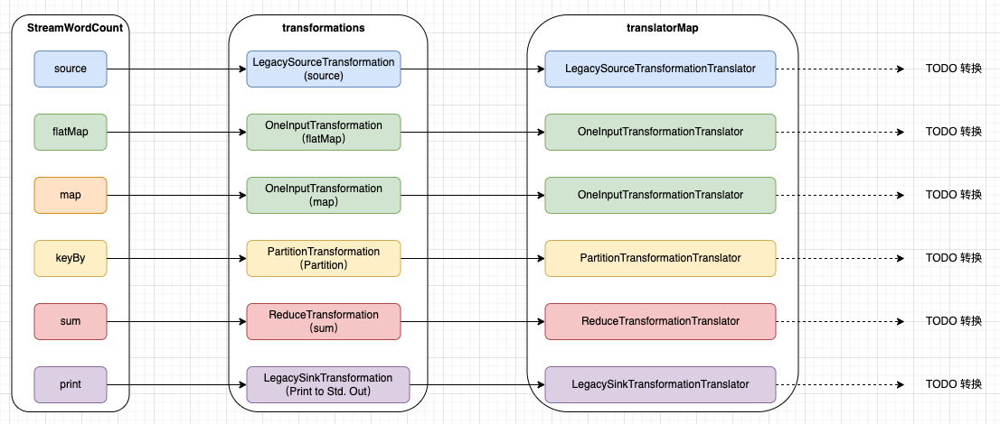      


那么，我们开始进入 translator 环节          

##### 4.1） translator 入口 function  
TransformationTranslator 继承 SimpleTransformationTranslator， translateForStreaming()是 translator 当然入口。            
**SimpleTransformationTranslator#translateForStreaming()**  
```java
public final Collection<Integer> translateForStreaming(
        final T transformation, final Context context) {
    checkNotNull(transformation);
    checkNotNull(context);

    final Collection<Integer> transformedIds =
            translateForStreamingInternal(transformation, context);
    configure(transformation, context);

    return transformedIds;
}
```     

##### 4.2）LegacySourceTransformationTranslator (Source) 转换  LegacySourceTransformation    
在 `LegacySourceTransformationTranslator.translateInternal()`方法中会调用 `StreamGraph#addLegacySource()`创建 `StreamNode`，但整个创建过程与 LegacySourceTransformationTranslator 没有关系，所以越来越觉得 StreamGraph 像个工具类, 不过还得注意 StreamNode的 构造方法的形参：           
```java
StreamNode vertex =
    new StreamNode(
            vertexID,
            slotSharingGroup,
            coLocationGroup,
            operatorFactory,
            operatorName,
            vertexClass);
```

vertexID : `LegacySourceTransformation (source)`的 id       
vertexClass: org.apache.flink.streaming.runtime.tasks.SourceStreamTask   

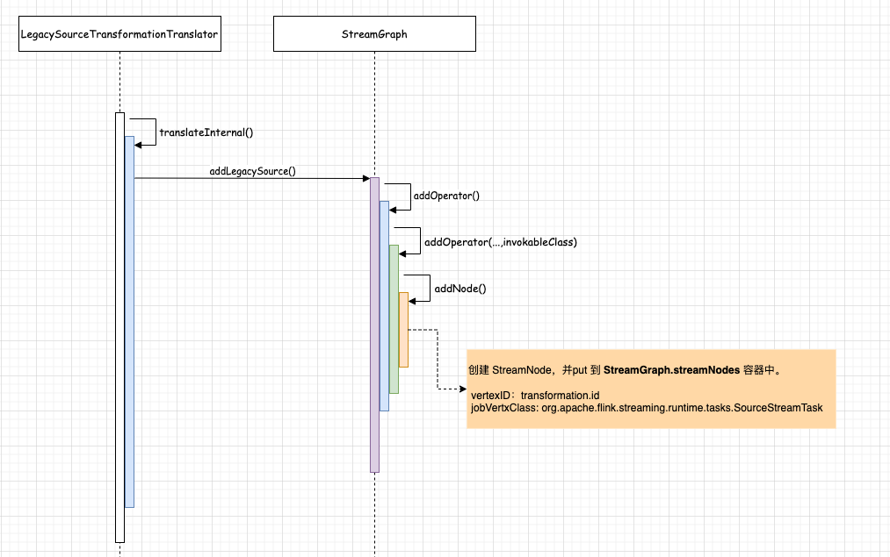  

所以，当 LegacySourceTransformation (source) 转换后，在 StreamGraph 的 `Map<Integer, StreamNode> StreamNodes` 存放 key 为 transformation.id , value 是 StreamNode。 

转换完成后，会返回 LegacySourceTransformation 的id，`StreamGraphGenerator#transform(transformation)` 会将 返回的 transformedIds 作为value，transform 作为 key ，put 到 StreamGraphGenerator.alreadyTransformed 容器中。        

**StreamGraphGenerator#transform()**
```java
private Collection<Integer> transform(Transformation<?> transform) {
        
        // ...... 省略部分代码

        Collection<Integer> transformedIds;
        if (translator != null) {
            transformedIds = translate(translator, transform);
        } else {
            transformedIds = legacyTransform(transform);
        }

        // need this check because the iterate transformation adds itself before
        // transforming the feedback edges
        if (!alreadyTransformed.containsKey(transform)) {
            alreadyTransformed.put(transform, transformedIds);
        }

        return transformedIds;
    }
```     

`特别注意： 它的 value，返回是它自身的id，特殊说明是因为，在转换虚拟 Transformation时 返回的ids，并不是它自身id，而是它父类的 ids。`         

>注意：关于 一些参数配置，再不影响主流程情况，后面会再介绍       

##### 4.3）OneInputTransformationTranslator (FlatMap) 转换  OneInputTransformation   
`OneInputTransformationTranslator` 并不像 LegacySourceTransformationTranslator 那样，而它是继承 `AbstractOneInputTransformationTranslator`, 中间多了一层抽象。      

在 `LegacySourceTransformationTranslator.translateInternal()`方法 调用的是 `AbstractOneInputTransformationTranslator#translateInternal()` `StreamGraph#addOperator()`，它会创建一个 StreamNode,并且也会 put 到 `StreamGraph.StreamNodes` 容器中，key 是 transformation.id, value 是 StreamNode, 但主流程并没有结束， 创建 StreamNode 后，会调用下面的for循环，创建 StreamEdge:   
```java
for (Integer inputId : context.getStreamNodeIds(parentTransformations.get(0))) {   
    streamGraph.addEdge(inputId, transformationId, 0);   
}
```

而 `OneInputTransformation （flatMap）`的 parent Transformation 是 LegacySourceTransformation (source), 所以从`StreamGraphGenerator.alreadyTransformed` 获取 LegacySourceTransformation (source) 的 id。  

下图是 `streamGraph.addEdge(inputId, transformationId, 0);`的 方法调用关系：        
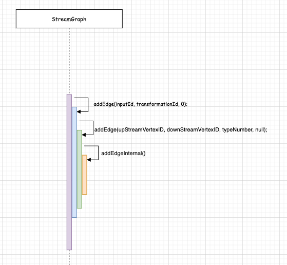        

那重点来看 `StreamGraph#addEdgeInternal()` 方法。           

>在还有没代码之前，还需对齐一下定义：       
1.形参 upStreamVertexID 中的 upStream 与 parent 是对等关系， 称呼上游或者父 都可以          
2.形参 upStreamVertexID 中的 VertexID 与 tramsformation.id 是对等关系           

首先 StreamGraph#addEdgeInternal() 会根据 上游的 tramsformation.id 作为key，判断它是什么类型节点（virtualSideOutputNode、virtualPartitionNode、StreamNode）
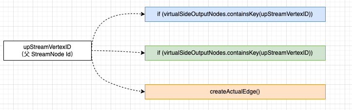            

在 4.2小节可知道 LegacySourceTransformation (source) 并非 virtualSideOutputNode、virtualPartitionNode， 所以它会执行 `StreamGraph#createActualEdge()`。 

在 **StreamGraph#createActualEdge()** 会创建一个 StreamEdge, 
```java
StreamEdge edge =
                new StreamEdge(
                        upstreamNode,
                        downstreamNode,
                        typeNumber,
                        partitioner,
                        outputTag,
                        exchangeMode,
                        uniqueId,
                        intermediateDataSetId);

getStreamNode(edge.getSourceId()).addOutEdge(edge);
getStreamNode(edge.getTargetId()).addInEdge(edge);
```

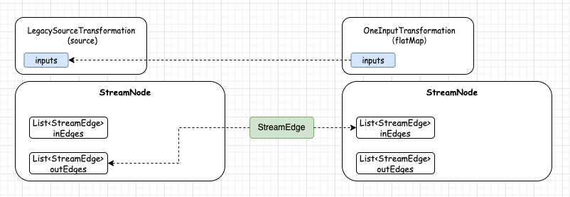        


##### 4.4）OneInputTransformationTranslator (Map) 转换  OneInputTransformation  
因为 Map 与 FlatMap 都属于 OneInputTransformation.class，所以它的转换逻辑是一致的。

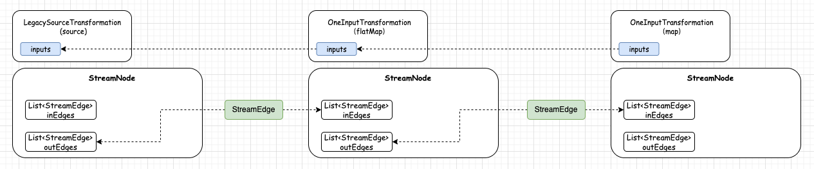        


##### 4.5）PartitionTransformationTranslator (keyBy) 转换  PartitionTransformation     
在`PartitionTransformationTranslator#translateInternal()`方法中，先获取`PartitionTransformation （keyBy）` 的 父 Transformation，再把 父 Transformation 作为 key，从 `StreamGraphGenerator.alreadyTransformed` 获取 value。    

获取它的父 Transformation 的 ids, 然后调用 `Transformation.getNewNodeId()` 获取虚拟节点 id，
在 调用`StreamGraph#addVirtualPartitionNode()` 创建一个`VirtualPartitionNode`, 将 虚拟节点放入 `Map<Integer, Tuple3<Integer, StreamPartitioner<?>, StreamExchangeMode>> virtualPartitionNodes` 容器中。     

**StreamGraph#addVirtualPartitionNode()**       
```java
 public void addVirtualPartitionNode(
        Integer originalId,
        Integer virtualId,
        StreamPartitioner<?> partitioner,
        StreamExchangeMode exchangeMode) {

    if (virtualPartitionNodes.containsKey(virtualId)) {
        throw new IllegalStateException(
                "Already has virtual partition node with id " + virtualId);
    }

    virtualPartitionNodes.put(virtualId, new Tuple3<>(originalId, partitioner, exchangeMode));
}
```

##### 4.6）ReduceTransformationTranslator (sum) 转换  ReduceTransformation   
ReduceTransformation （sum）与 OneInputTransformation （map） 转换差不多，同样是调用 `StreamGraph#addOperator()` 创建 StreamNode, 但是在添加 StreamEdge `streamGraph.addEdge(inputId, transformationId, 0)` 的时候，会有不同的处理。        

因为 ReduceTransformation（sum）的 父 Transformation 是 `PartitionTransformation （keyBy）`,它并不是 StreamNode，而是 `VirtualPartitionNode`;       

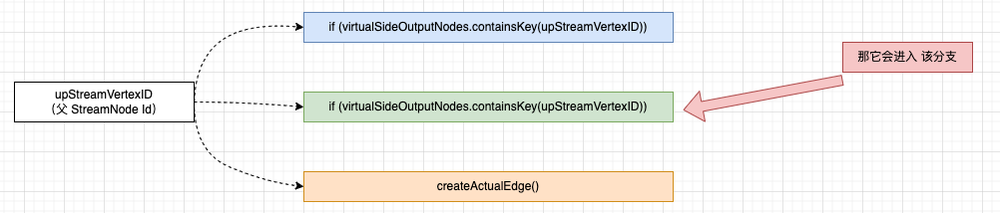    

下面是`if (virtualPartitionNodes.containsKey(upStreamVertexID))`代码，很明显这是一个递归处理逻辑，而跳出递归的判断就是 if 判断条件不成立, 如果当前的父 Transformation 不是 StreamNode，则会拿父 Transformation 的 父 Transformation，后面以此内推，直到条件满足后，执行 `StreamGraph.createActualEdge()`方法。  

```java
private void addEdgeInternal(
        // ...... 省略部分代码
        ) {

    if (virtualSideOutputNodes.containsKey(upStreamVertexID)) {

        // ...... 省略部分代码

    } else if (virtualPartitionNodes.containsKey(upStreamVertexID)) {
        int virtualId = upStreamVertexID;
        upStreamVertexID = virtualPartitionNodes.get(virtualId).f0;
        if (partitioner == null) {
            partitioner = virtualPartitionNodes.get(virtualId).f1;
        }
        exchangeMode = virtualPartitionNodes.get(virtualId).f2;
        addEdgeInternal(
                upStreamVertexID,
                downStreamVertexID,
                typeNumber,
                partitioner,
                outputNames,
                outputTag,
                exchangeMode,
                intermediateDataSetId);
    } else {
        createActualEdge(
                upStreamVertexID,
                downStreamVertexID,
                typeNumber,
                partitioner,
                outputTag,
                exchangeMode,
                intermediateDataSetId);
    }
}
```

##### 4.7）LegacySinkTransformationTranslator (print) 转换  LegacySinkTransformation 
`LegacySinkTransformationTranslator#translateInternal()` 创建 StreamNode & StreamEdge。  

#### 5.StreamWordCount 所有 Transformation 转换后的产物       


refer     
1.https://nightlies.apache.org/flink/flink-docs-release-1.17/docs/dev/configuration/maven/          
2.https://nightlies.apache.org/flink/flink-docs-release-1.17/docs/dev/configuration/overview/        
3.https://nightlies.apache.org/flink/flink-docs-release-1.17/docs/deployment/cli/    
4.https://nightlies.apache.org/flink/flink-docs-release-1.17/docs/dev/datastream/operators/overview/        


