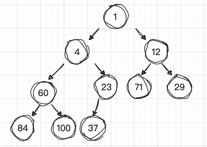
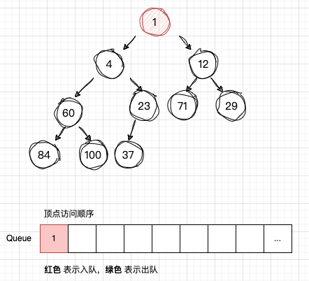
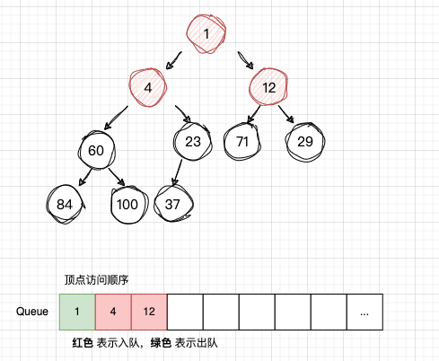
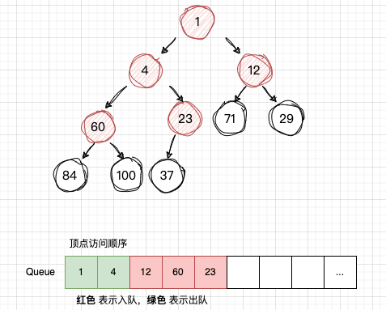
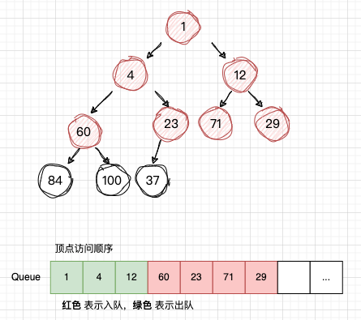
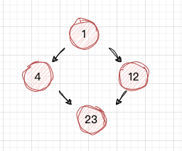
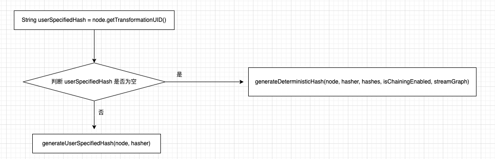

# Flink 源码 - Standalone - 探索 Flink Stream Job Show Plan 实现过程 - 构建 JobGraph              

>Flink version: 1.17.2       


**StreamingJobGraphGenerator#createJobGraph()**     
```java
private JobGraph createJobGraph() {
    preValidate();
    jobGraph.setJobType(streamGraph.getJobType());
    jobGraph.setDynamic(streamGraph.isDynamic());

    jobGraph.enableApproximateLocalRecovery(
            streamGraph.getCheckpointConfig().isApproximateLocalRecoveryEnabled());

    // Generate deterministic hashes for the nodes in order to identify them across
    // submission iff they didn't change.
    Map<Integer, byte[]> hashes =
            defaultStreamGraphHasher.traverseStreamGraphAndGenerateHashes(streamGraph);

    // Generate legacy version hashes for backwards compatibility
    List<Map<Integer, byte[]>> legacyHashes = new ArrayList<>(legacyStreamGraphHashers.size());
    for (StreamGraphHasher hasher : legacyStreamGraphHashers) {
        legacyHashes.add(hasher.traverseStreamGraphAndGenerateHashes(streamGraph));
    }

    setChaining(hashes, legacyHashes);

    if (jobGraph.isDynamic()) {
        setVertexParallelismsForDynamicGraphIfNecessary();
    }

    // Note that we set all the non-chainable outputs configuration here because the
    // "setVertexParallelismsForDynamicGraphIfNecessary" may affect the parallelism of job
    // vertices and partition-reuse
    final Map<Integer, Map<StreamEdge, NonChainedOutput>> opIntermediateOutputs =
            new HashMap<>();
    setAllOperatorNonChainedOutputsConfigs(opIntermediateOutputs);
    setAllVertexNonChainedOutputsConfigs(opIntermediateOutputs);

    setPhysicalEdges();

    markSupportingConcurrentExecutionAttempts();

    validateHybridShuffleExecuteInBatchMode();

    setSlotSharingAndCoLocation();

    setManagedMemoryFraction(
            Collections.unmodifiableMap(jobVertices),
            Collections.unmodifiableMap(vertexConfigs),
            Collections.unmodifiableMap(chainedConfigs),
            id -> streamGraph.getStreamNode(id).getManagedMemoryOperatorScopeUseCaseWeights(),
            id -> streamGraph.getStreamNode(id).getManagedMemorySlotScopeUseCases());

    configureCheckpointing();

    jobGraph.setSavepointRestoreSettings(streamGraph.getSavepointRestoreSettings());

    final Map<String, DistributedCache.DistributedCacheEntry> distributedCacheEntries =
            JobGraphUtils.prepareUserArtifactEntries(
                    streamGraph.getUserArtifacts().stream()
                            .collect(Collectors.toMap(e -> e.f0, e -> e.f1)),
                    jobGraph.getJobID());

    for (Map.Entry<String, DistributedCache.DistributedCacheEntry> entry :
            distributedCacheEntries.entrySet()) {
        jobGraph.addUserArtifact(entry.getKey(), entry.getValue());
    }

    // set the ExecutionConfig last when it has been finalized
    try {
        jobGraph.setExecutionConfig(streamGraph.getExecutionConfig());
    } catch (IOException e) {
        throw new IllegalConfigurationException(
                "Could not serialize the ExecutionConfig."
                        + "This indicates that non-serializable types (like custom serializers) were registered");
    }

    jobGraph.setChangelogStateBackendEnabled(streamGraph.isChangelogStateBackendEnabled());

    addVertexIndexPrefixInVertexName();

    setVertexDescription();

    // Wait for the serialization of operator coordinators and stream config.
    try {
        FutureUtils.combineAll(
                        vertexConfigs.values().stream()
                                .map(
                                        config ->
                                                config.triggerSerializationAndReturnFuture(
                                                        serializationExecutor))
                                .collect(Collectors.toList()))
                .get();

        waitForSerializationFuturesAndUpdateJobVertices();
    } catch (Exception e) {
        throw new FlinkRuntimeException("Error in serialization.", e);
    }

    if (!streamGraph.getJobStatusHooks().isEmpty()) {
        jobGraph.setJobStatusHooks(streamGraph.getJobStatusHooks());
    }

    return jobGraph;
}
```

## 为 StreamNode 生成确定性 hash   
在`StreamingJobGraphGenerator#createJobGraph()` 方法中 会调用`defaultStreamGraphHasher.traverseStreamGraphAndGenerateHashes()` 为所有节点生成 hash，变量`defaultStreamGraphHasher`是 StreamGraphHasher 接口类型，在 `StreamingJobGraphGenerator`的构造方法中，使用 `this.defaultStreamGraphHasher = new StreamGraphHasherV2();` 作为它的默认实现。 
```java
// Generate deterministic hashes for the nodes in order to identify them across
// submission iff they didn't change.
Map<Integer, byte[]> hashes =
        defaultStreamGraphHasher.traverseStreamGraphAndGenerateHashes(streamGraph);
```     

`StreamGraphHasherV2#traverseStreamGraphAndGenerateHashes()`方法会涉及到图的广度优先遍历算法，这里补充下关于`广度优先遍历`：        
>在广度优先遍历中，我们通常使用一个队列（Queue）来存储待访问的节点。初始时，将起始节点放入队列。然后，执行以下操作直到队列为空:           
1.从队列中取出一个节点。  
2.访问该节点，并将其标记为已访问。  
3.将该节点的所有未被访问的邻近节点加入队列。    

**示例演示流程：**      
下面是一颗二叉树，现在要其使用广度优先遍历。              
  

1）开始访问 `num1`，然后将 `num1` 插入 `队列Q` ,注意这是“首次入队”   
    

2）从`队列Q`读取 `num1`，获取`num1` 的子节点：`num4` , `num12`，并且依次入队        
            

3）从`队列Q`读取 `num4`，获取`num4` 的子节点：`num60` , `num23`，并且依次入队        
    

4）从`队列Q`读取 `num12`，获取`num12` 的子节点：`num71` , `num29`，并且依次入队      
    

依次类推，
到这里，差不多可以写出一段伪代码：         
```java
创建队列 Q
将 root 节点 放入 Q中  

while((node = Q.poll()!=null)){
    获取 node 的子节点，subNodes;
    将 subNodes for循环 添加到 队列 Q中
}
```

这样就完成了 `广度优先遍历`，其实在图数据结构中，它与树最大不同的是`节点和边可以形成一个循环`，它的节点和边的关系放在`邻接表`。 所以图的广度优先遍历，需要一个集合来判断当前节点是否遍历过，看下图中的 `num23`, 当 `num4`和`num12` 出队后，都读取了`num23`，显然它读取了2遍，所以 判断一个节点是否遍历过，是很重要的。         



接下来，看`StreamGraphHasherV2#traverseStreamGraphAndGenerateHashes()`的实现过程。       

在`StreamGraphHasherV2#traverseStreamGraphAndGenerateHashes()`方法中，创建了 Set<Integer> visited 、 Queue<StreamNode> remaining 和 List<Integer> sources , visited 存储已访问过的节点， remaining 存储待访问的节点, sources 存储 StreamGraph的 顶端节点。          

for 循环，将 sources 节点放入 remaining,visited 集合中。   
```java
for (Integer sourceNodeId : sources) {
    remaining.add(streamGraph.getStreamNode(sourceNodeId));
    visited.add(sourceNodeId);
}
```

然后利用 while 循环遍历 remaining 队列里面的子项，在if 调用 `generateNodeHash()` 生成 hash值，并put 到 `hashes集合`中，但显然它也会返回 `false`。 这显然有些符合我们的示例中的预期，访问的结果一般不会希望再移除它，让它有机会再访问一次。 下面结合`generateNodeHash()`的实现来介绍后续处理逻辑；             
```java
while ((currentNode = remaining.poll()) != null) {
    // Generate the hash code. Because multiple path exist to each
    // node, we might not have all required inputs available to
    // generate the hash code.
    if (generateNodeHash(
            currentNode,
            hashFunction,
            hashes,
            streamGraph.isChainingEnabled(),
            streamGraph)) {
        // Add the child nodes
        for (StreamEdge outEdge : currentNode.getOutEdges()) {
            StreamNode child = streamGraph.getTargetVertex(outEdge);

            if (!visited.contains(child.getId())) {
                remaining.add(child);
                visited.add(child.getId());
            }
        }
    } else {
        // We will revisit this later.
        visited.remove(currentNode.getId());
    }
}
```

`StreamGraphHasherV2#generateNodeHash()`方法是生成 Node的hash 值的核心方法，下面是它的流程图：      
            

若用户通过 `uid()`函数配置了 `transformationUID`值，则重新初始化 hasher 计算 hash值， 否则调用`generateDeterministicHash()` 创建 hash 值， 不过 `generateDeterministicHash()`方法内部 `generateNodeLocalHash()`方法更让人琢磨不透，似乎 Hasher对象 生成hash 值有某种顺序似的。  

hashes集合 是在 `StreamGraphHasherV2#traverseStreamGraphAndGenerateHashes()` 创建的，在 StreamGraph 的广度遍历过程中，计算 Operator的 Hash值 并放入 hashes 集合中, 下面是`generateNodeLocalHash()`方法的注释，其实目的是一目了然，StreamNode id计算 hash 无法保证它的`不变性`,所以，`它使用 hashes 的下标，因为 StreamGraph 构造的图是一个有向图`。   
```java
// Include stream node to hash. We use the current size of the computed
// hashes as the ID. We cannot use the node's ID, because it is
// assigned from a static counter. This will result in two identical
// programs having different hashes.
```

如果当前 Node 的父节点存在没有计算好 hash值，则返回 false，将它从 `visited`集群移除掉
```java
if (userSpecifiedHash == null) {
    // Check that all input nodes have their hashes computed
    for (StreamEdge inEdge : node.getInEdges()) {
        // If the input node has not been visited yet, the current
        // node will be visited again at a later point when all input
        // nodes have been visited and their hashes set.
        if (!hashes.containsKey(inEdge.getSourceId())) {
            return false;
        }
    }
// ...
```


`generateDeterministicHash()` 计算 Node 的 hash 值 与是否能和下游节点 chain一起的个数有关，最后通过`for (StreamEdge inEdge : node.getInEdges())` 确保所有输入节点在进入循环之前已经设置了它们的哈希值（调用这个方法）。然后，对于每个输入边，它获取源节点的哈希值，并检查这个哈希值是否存在。如果不存在，它会抛出一个异常。最后，它使用异或和乘法操作来更新当前节点的哈希值。这个过程会对所有的输入边进行迭代，直到计算出最终的哈希值。          
```java
generateNodeLocalHash(hasher, hashes.size());

// Include chained nodes to hash
for (StreamEdge outEdge : node.getOutEdges()) {
    if (isChainable(outEdge, isChainingEnabled, streamGraph)) {

        // Use the hash size again, because the nodes are chained to
        // this node. This does not add a hash for the chained nodes.
        generateNodeLocalHash(hasher, hashes.size());
    }
}
```


`StreamingJobGraphGenerator#createJobGraph()` 是构建 JobGraph 对象的方法入口。      


在生成 chain之前`需要提前判断 2个连接的节点（StreamNode）需满足一定的条件,才能把这2个节点放到一个 chain `，具体判断查看 `StreamingJobGraphGenerator#isChainable()` 和 `StreamingJobGraphGenerator#isChainableInput()` 。 

**StreamingJobGraphGenerator#isChainable()**              
```java
public static boolean isChainable(StreamEdge edge, StreamGraph streamGraph) {
    StreamNode downStreamVertex = streamGraph.getTargetVertex(edge);

    return downStreamVertex.getInEdges().size() == 1 && isChainableInput(edge, streamGraph);
}
```

**StreamingJobGraphGenerator#isChainableInput()**           
```java
private static boolean isChainableInput(StreamEdge edge, StreamGraph streamGraph) {
    StreamNode upStreamVertex = streamGraph.getSourceVertex(edge);
    StreamNode downStreamVertex = streamGraph.getTargetVertex(edge);

    if (!(upStreamVertex.isSameSlotSharingGroup(downStreamVertex)
            && areOperatorsChainable(upStreamVertex, downStreamVertex, streamGraph)
            && arePartitionerAndExchangeModeChainable(
                    edge.getPartitioner(), edge.getExchangeMode(), streamGraph.isDynamic())
            && upStreamVertex.getParallelism() == downStreamVertex.getParallelism()
            && streamGraph.isChainingEnabled())) {

        return false;
    }

    // check that we do not have a union operation, because unions currently only work
    // through the network/byte-channel stack.
    // we check that by testing that each "type" (which means input position) is used only once
    for (StreamEdge inEdge : downStreamVertex.getInEdges()) {
        if (inEdge != edge && inEdge.getTypeNumber() == edge.getTypeNumber()) {
            return false;
        }
    }
    return true;
}
```

判断逻辑是: 首选下游节点的 输入边大小只能为1（`downStreamVertex.getInEdges().size() == 1`）; 在 `isSameSlotSharingGroup()`中：上下游 StreamNode 的 `SlotSharingGroup` 需是同一个 且 SlotShargingGroup 在不设置的情况在，它的缺省值是 `default`; 在 `areOperatorsChainable()`中：判断上下游 StreamNode 它是否支持 chain 策略; `arePartitionerAndExchangeModeChainable()` 判断 edge的分区策略;  `upStreamVertex.getParallelism() == downStreamVertex.getParallelism()` 上下游节点的并行度要保持一致; 最后是 StreamGraph 要开启 chaining;   


```java
for (StreamEdge outEdge : currentNode.getOutEdges()) {
    if (isChainable(outEdge, streamGraph)) {
        chainableOutputs.add(outEdge);
    } else {
        nonChainableOutputs.add(outEdge);
    }
}
```

遍历当前节点 StreamNode的 输出边 outEdges，首先判断它们是否支持合并 chain,若支持合并，则添加到 `chainableOutputs`集合中，不支持则添加到 `nonChainableOutputs`集合中。  

```java
for (StreamEdge chainable : chainableOutputs) {
    transitiveOutEdges.addAll(
            createChain(
                    chainable.getTargetId(),
                    chainIndex + 1,
                    chainInfo,
                    chainEntryPoints));
}
```
`chainableOutputs`集合 若不为空，则会递归遍历 StreamEdge 的下游 targetId (StreamNode)。