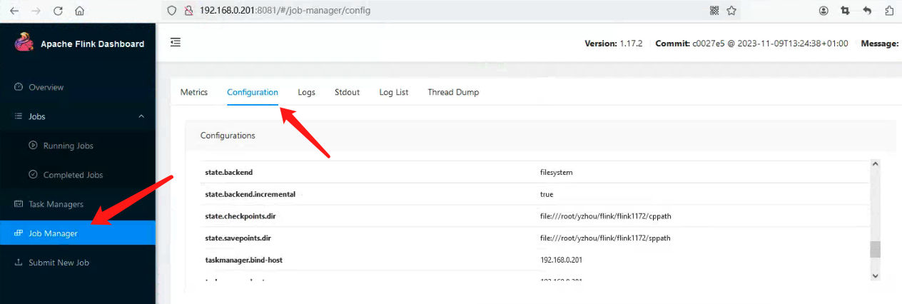
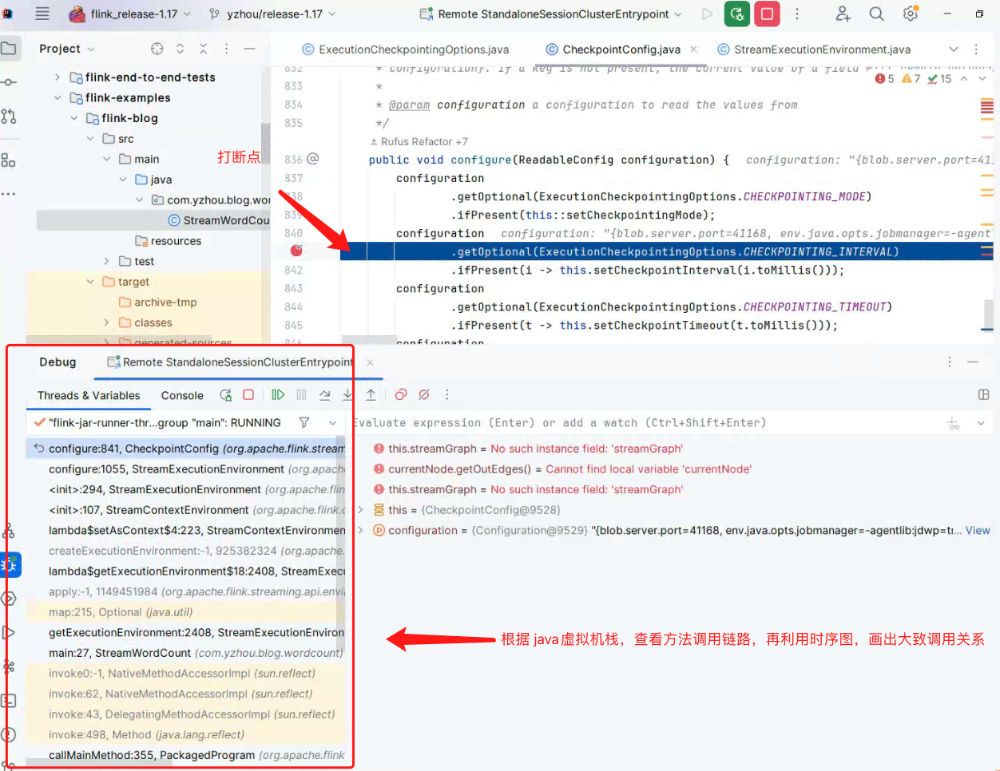

# Flink 源码 - Standalone - 探索 Flink Stream Job Show Plan 实现过程 - 构建 StreamGraph

## 引言     


## Flink Standalone 集群 配置 Checkpoint Path      
vim conf/flink-conf.yaml          
```bash
# config checkpoint
state.backend: filesystem
state.backend.incremental: true  # 该参数在 state.backend = rocksdb，才有效  
state.checkpoints.dir: file:///root/yzhou/flink/flink1172/cppath
state.savepoints.dir: file:///root/yzhou/flink/flink1172/sppath
execution.checkpointing.interval: 60000  # 每 60 秒执行一次 checkpoint
```

配置重启 Standalone 集群后，可以在 Flink WEB UI 中看到 state 配置：         
    

## StreamWordCount 示例 获得 Checkpoint 默认配置项       
下面的代码是 在之前 Blog “Flink 源码 - Standalone - 探索 Flink Stream Job Show Plan 实现过程 - 构建 StreamGraph” 中的 `StreamWordCount`示例，接下来，我们仍然会使用该示例来测试。       
```java
public class StreamWordCount {
    private static Logger logger = Logger.getLogger(StreamWordCount.class);

    public static void main(String[] args) throws Exception {
        // 1. 创建流式执行环境
//        StreamExecutionEnvironment env = StreamExecutionEnvironment
//                .createLocalEnvironmentWithWebUI(new Configuration());
        StreamExecutionEnvironment env = StreamExecutionEnvironment   // 非本地运行，使用 getExecutionEnvironment()   
                .getExecutionEnvironment(new Configuration());
        env.setRestartStrategy(RestartStrategies
                .fixedDelayRestart(3, Time.of(10, TimeUnit.SECONDS)));
        // 2. Socket 读取  nc -lk 7777
        DataStreamSource<String> lineDSS = env
                .socketTextStream("localhost", 7777);

        // 3. 转换数据格式
        SingleOutputStreamOperator<Tuple2<String, Long>> wordAndOne = lineDSS
                .flatMap((String line, Collector<String> words) -> {
                    Arrays.stream(line.split(" ")).forEach(words::collect);
                })
                .returns(Types.STRING)
                .map(word -> Tuple2.of(word, 1L))
                .returns(Types.TUPLE(Types.STRING, Types.LONG)).setParallelism(2);

        // 4. 分组
        KeyedStream<Tuple2<String, Long>, String> wordAndOneKS = wordAndOne
                .keyBy(t -> t.f0);
        // 5. 求和
        SingleOutputStreamOperator<Tuple2<String, Long>> result = wordAndOneKS
                .sum(1).setParallelism(1);

        // 6. 打印
        result.print();
        logger.info(result.toString());
        // 7. 执行
        env.execute();
    }
}
```

`StreamWordCount#main()` 并没有 `Checkpoint` 相关配置，所以在 `flink-conf.yaml`的配置是全局的, 根据下面`调试 tip`操作，可知 `StreamWordCount#main()` 在 创建 StreamExecutionEnvironment 对象时， `StreamExecutionEnvironment env = StreamExecutionEnvironment.getExecutionEnvironment(new Configuration());` 调用 `StreamExecutionEnvironment#configure()` 配置了关于 Checkpoint 的相关参数, 下面是配置代码块：     
```java
public void configure(ReadableConfig configuration, ClassLoader classLoader) {
    // 省略部分代码 
    checkpointCfg.configure(configuration);
}
```

>调试 tip:      
调试源码过程中，存在源码不知道在哪触发？ 例如 `StreamWordCount#main()` 并没有 `Checkpoint`相关配置，但通过 Flink WEB UI查看作业情况，Checkpoint是生效的， 所以，在源码中搜索`execution.checkpointing.interval`, 然后在获取此参数配置的 `get`方法打断点，再根据 Idea 查看, 例如图片中的示例：          
        

根据 `CheckpointConfig#configure()` 方法，由此可知 `StreamWordCount` Job 启动时，Flink 会默认给他配置的一些参数以及缺省值，内容如下：         
```java
public void configure(ReadableConfig configuration) {
    configuration
            .getOptional(ExecutionCheckpointingOptions.CHECKPOINTING_MODE)
            .ifPresent(this::setCheckpointingMode);
    configuration
            .getOptional(ExecutionCheckpointingOptions.CHECKPOINTING_INTERVAL)
            .ifPresent(i -> this.setCheckpointInterval(i.toMillis()));
    configuration
            .getOptional(ExecutionCheckpointingOptions.CHECKPOINTING_TIMEOUT)
            .ifPresent(t -> this.setCheckpointTimeout(t.toMillis()));
    configuration
            .getOptional(ExecutionCheckpointingOptions.MAX_CONCURRENT_CHECKPOINTS)
            .ifPresent(this::setMaxConcurrentCheckpoints);
    configuration
            .getOptional(ExecutionCheckpointingOptions.MIN_PAUSE_BETWEEN_CHECKPOINTS)
            .ifPresent(m -> this.setMinPauseBetweenCheckpoints(m.toMillis()));
    configuration
            .getOptional(ExecutionCheckpointingOptions.TOLERABLE_FAILURE_NUMBER)
            .ifPresent(this::setTolerableCheckpointFailureNumber);
    configuration
            .getOptional(ExecutionCheckpointingOptions.EXTERNALIZED_CHECKPOINT)
            .ifPresent(this::setExternalizedCheckpointCleanup);
    configuration
            .getOptional(ExecutionCheckpointingOptions.ENABLE_UNALIGNED)
            .ifPresent(this::enableUnalignedCheckpoints);
    configuration
            .getOptional(ExecutionCheckpointingOptions.CHECKPOINT_ID_OF_IGNORED_IN_FLIGHT_DATA)
            .ifPresent(this::setCheckpointIdOfIgnoredInFlightData);
    configuration
            .getOptional(ExecutionCheckpointingOptions.ALIGNED_CHECKPOINT_TIMEOUT)
            .ifPresent(this::setAlignedCheckpointTimeout);
    configuration
            .getOptional(
                    ExecutionCheckpointingOptions.UNALIGNED_MAX_SUBTASKS_PER_CHANNEL_STATE_FILE)
            .ifPresent(this::setMaxSubtasksPerChannelStateFile);
    configuration
            .getOptional(ExecutionCheckpointingOptions.FORCE_UNALIGNED)
            .ifPresent(this::setForceUnalignedCheckpoints);
    configuration
            .getOptional(CheckpointingOptions.CHECKPOINTS_DIRECTORY)
            .ifPresent(this::setCheckpointStorage);
}
```     

总结成以下参数项：      
```bash
execution.checkpointing.mode - desc: The checkpointing mode (exactly-once vs. at-least-once).       
execution.checkpointing.interval - desc: Gets the interval in which checkpoints are periodically scheduled.    
execution.checkpointing.timeout - desc: The maximum time that a checkpoint may take before being discarded.     
execution.checkpointing.max-concurrent-checkpoints - desc: The maximum number of checkpoint attempts that may be in progress at the same time. If this value is n, then no checkpoints will be triggered while n checkpoint attempts are currently in flight. For the next checkpoint to be triggered, one checkpoint attempt would need to finish or expire.   
execution.checkpointing.min-pause    
execution.checkpointing.tolerable-failed-checkpoints    
execution.checkpointing.externalized-checkpoint-retention   
execution.checkpointing.unaligned.enabled   
execution.checkpointing.recover-without-channel-state.checkpoint-id    
execution.checkpointing.aligned-checkpoint-timeout
execution.checkpointing.unaligned.max-subtasks-per-channel-state-file   
execution.checkpointing.unaligned.forced   
state.checkpoints.dir   
```


## 


refer           
1.https://nightlies.apache.org/flink/flink-docs-release-1.17/zh/docs/ops/state/checkpoints/     
2.https://issues.apache.org/jira/browse/FLINK-8531      
