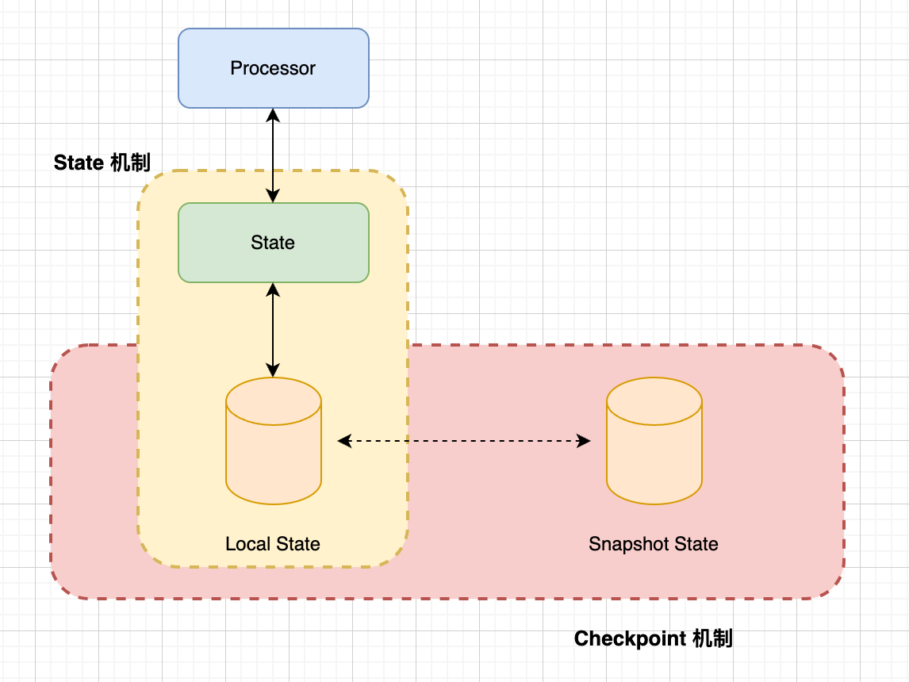
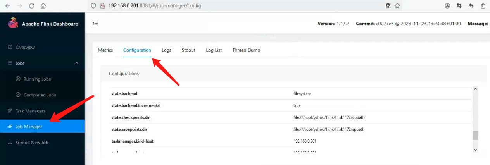

# Flink 源码-Standalone - 通过 StreamWordCount 探索 State & Checkpoint 使用    

## 引言  
在 Flink 中，每个函数和算子都可以是有状态的，而有状态的函数和算子是将 Data 存储在 State 中，所以 State 提供了 Flink 中用于存储计算过程中数据的存储介质。 在 Flink 这种分布式系统中，必然存在 `Fallacies of distributed computing` (https://en.wikipedia.org/wiki/Fallacies_of_distributed_computing) , So Flink 提供了一种叫做 `检查点分布式快照机制`（Checkpoint）,用于保证有状态流处理的容错性，它会定期捕获和保存有状态的快照, 若 Job 发生故障后，Checkpoint允许 Job 在发生故障时恢复到最近的检查点，从而恢复 Job 的状态和处理位置，这样可以确保数据处理的连续性和一致性。     

State 是 Checkpoint 保护的对象，在 每次执行 Checkpoint 时，Flink 会将当前所有状态的快照保存下来。     

   

>关于更多的 State & Checkpoint 可访问官网文档。  
State 官网文档介绍，可访问 `https://nightlies.apache.org/flink/flink-docs-release-1.17/docs/concepts/stateful-stream-processing/`  
Checkpoint 官网文档介绍，可访问 `https://nightlies.apache.org/flink/flink-docs-release-1.17/docs/dev/datastream/fault-tolerance/checkpointing/`    

接下来，开始介绍基于 Standalone 的 State & Checkpoint 使用

## 配置 Checkpoint Config          
vim conf/flink-conf.yaml          
```bash
# config checkpoint
state.backend: filesystem
state.backend.incremental: true  # 该参数在 state.backend = rocksdb，才有效  
state.checkpoints.dir: file:///root/yzhou/flink/flink1172/cppath   
state.savepoints.dir: file:///root/yzhou/flink/flink1172/sppath
execution.checkpointing.interval: 60000  # 每 60 秒执行一次 checkpoint    
```

配置重启 Standalone 集群后，可以在 Flink WEB UI 中看到 checkpoint 配置：         
    

## StreamWordCount 示例代码      
下面的代码是 在之前 Blog “Flink 源码 - Standalone - 探索 Flink Stream Job Show Plan 实现过程 - 构建 StreamGraph” 中的 `StreamWordCount`示例，接下来，我们仍然会使用该示例来测试。       
```java
public class StreamWordCount {
    private static Logger logger = Logger.getLogger(StreamWordCount.class);

    public static void main(String[] args) throws Exception {
        // 1. 创建流式执行环境
//        StreamExecutionEnvironment env = StreamExecutionEnvironment
//                .createLocalEnvironmentWithWebUI(new Configuration());
        StreamExecutionEnvironment env = StreamExecutionEnvironment   // 非本地运行，使用 getExecutionEnvironment()   
                .getExecutionEnvironment(new Configuration());
        env.setRestartStrategy(RestartStrategies
                .fixedDelayRestart(3, Time.of(10, TimeUnit.SECONDS)));
        // 2. Socket 读取  nc -lk 7777
        DataStreamSource<String> lineDSS = env
                .socketTextStream("localhost", 7777);

        // 3. 转换数据格式
        SingleOutputStreamOperator<Tuple2<String, Long>> wordAndOne = lineDSS
                .flatMap((String line, Collector<String> words) -> {
                    Arrays.stream(line.split(" ")).forEach(words::collect);
                })
                .returns(Types.STRING)
                .map(word -> Tuple2.of(word, 1L))
                .returns(Types.TUPLE(Types.STRING, Types.LONG)).setParallelism(2);

        // 4. 分组
        KeyedStream<Tuple2<String, Long>, String> wordAndOneKS = wordAndOne
                .keyBy(t -> t.f0);
        // 5. 求和
        SingleOutputStreamOperator<Tuple2<String, Long>> result = wordAndOneKS
                .sum(1).setParallelism(1);

        // 6. 打印
        result.print();
        logger.info(result.toString());
        // 7. 执行
        env.execute();
    }
}
```

1）终端执行 `nc -lk 7777`   
2）通过 Flink WEB UI 提交 StreamWordCount Job  
3）输入测试数据，最后 word count 的统计结果可在 Task Managers Stdout Log页面查看，如下图所示：                   
 
              

## 触发 Checkpoint 
通过 Flink WEB UI 页面，查看 Job 的Checkpoint History，发现每隔 60s触发一次 Checkpoint，可能你会有以下疑问：                    
1.`StreamWordCount#main()` 没有调用`Checkpoint`相关 API，那 Checkpoint 又是如何生效？   
2.`StreamWordCount#main()` 没有调用`State`相关 API，那每隔 60s 触发一次 Checkpoint 存储的是什么呢？     


针对第一个疑问：`bin/flink-conf.yaml`的配置是全局性,是因为`StreamWordCount#main()` 在创建 StreamExecutionEnvironment 对象时， 会调用 `StreamExecutionEnvironment#configure()`来关联 Checkpoint 的相关参数, 下面是相关代码块：   
**创建 StreamExecutionEnvironment** 
```java
StreamExecutionEnvironment env = StreamExecutionEnvironment.getExecutionEnvironment(new Configuration());
```
**设置 Checkpoint配置**   
```java
public void configure(ReadableConfig configuration, ClassLoader classLoader) {
    // 省略部分代码 
    checkpointCfg.configure(configuration);
}
```

>调试 tip:      
调试源码过程中，存在源码不知道在哪触发？ 例如 `StreamWordCount#main()` 并没有 `Checkpoint`相关配置，但通过 Flink WEB UI查看作业情况，Checkpoint是生效的， 所以，在源码中搜索`execution.checkpointing.interval`, 然后在获取此参数配置的 `get`方法打断点，再根据 Idea 查看, 例如图片中的示例：          
          

根据`CheckpointConfig#configure()`方法，由此可知 `StreamWordCount` Job 启动时，Flink 会默认给它配置的一些参数以及缺省值，config 代码如下：                
**CheckpointConfig#configure()**        
```java
public void configure(ReadableConfig configuration) {
    configuration
            .getOptional(ExecutionCheckpointingOptions.CHECKPOINTING_MODE)
            .ifPresent(this::setCheckpointingMode);
    configuration
            .getOptional(ExecutionCheckpointingOptions.CHECKPOINTING_INTERVAL)
            .ifPresent(i -> this.setCheckpointInterval(i.toMillis()));
    configuration
            .getOptional(ExecutionCheckpointingOptions.CHECKPOINTING_TIMEOUT)
            .ifPresent(t -> this.setCheckpointTimeout(t.toMillis()));
    configuration
            .getOptional(ExecutionCheckpointingOptions.MAX_CONCURRENT_CHECKPOINTS)
            .ifPresent(this::setMaxConcurrentCheckpoints);
    configuration
            .getOptional(ExecutionCheckpointingOptions.MIN_PAUSE_BETWEEN_CHECKPOINTS)
            .ifPresent(m -> this.setMinPauseBetweenCheckpoints(m.toMillis()));
    configuration
            .getOptional(ExecutionCheckpointingOptions.TOLERABLE_FAILURE_NUMBER)
            .ifPresent(this::setTolerableCheckpointFailureNumber);
    configuration
            .getOptional(ExecutionCheckpointingOptions.EXTERNALIZED_CHECKPOINT)
            .ifPresent(this::setExternalizedCheckpointCleanup);
    configuration
            .getOptional(ExecutionCheckpointingOptions.ENABLE_UNALIGNED)
            .ifPresent(this::enableUnalignedCheckpoints);
    configuration
            .getOptional(ExecutionCheckpointingOptions.CHECKPOINT_ID_OF_IGNORED_IN_FLIGHT_DATA)
            .ifPresent(this::setCheckpointIdOfIgnoredInFlightData);
    configuration
            .getOptional(ExecutionCheckpointingOptions.ALIGNED_CHECKPOINT_TIMEOUT)
            .ifPresent(this::setAlignedCheckpointTimeout);
    configuration
            .getOptional(
                    ExecutionCheckpointingOptions.UNALIGNED_MAX_SUBTASKS_PER_CHANNEL_STATE_FILE)
            .ifPresent(this::setMaxSubtasksPerChannelStateFile);
    configuration
            .getOptional(ExecutionCheckpointingOptions.FORCE_UNALIGNED)
            .ifPresent(this::setForceUnalignedCheckpoints);
    configuration
            .getOptional(CheckpointingOptions.CHECKPOINTS_DIRECTORY)
            .ifPresent(this::setCheckpointStorage);
}
```     

通过`CheckpointConfig#configure()`可以总结出配置的具体参数项以及它的默认值，内容如下：                              
```bash
execution.checkpointing.mode
execution.checkpointing.interval
execution.checkpointing.timeout    
execution.checkpointing.max-concurrent-checkpoints 
execution.checkpointing.min-pause    
execution.checkpointing.tolerable-failed-checkpoints    
execution.checkpointing.externalized-checkpoint-retention   
execution.checkpointing.unaligned.enabled   
execution.checkpointing.recover-without-channel-state.checkpoint-id    
execution.checkpointing.aligned-checkpoint-timeout
execution.checkpointing.unaligned.max-subtasks-per-channel-state-file   
execution.checkpointing.unaligned.forced   
state.checkpoints.dir   
```

了解配置参数对于了解 Checkpoint 的机制是个很不错的入口，同样对于 Checkpoint 调优非常重要（`可以不配置，走缺省值，但不能不知道该配置`）。       

到这里，`第一个疑问`应该解释的差不多了，可了解`StreamWordCount#main()`若设置 Checkpoint 配置参数，那它的优先级是高于 `bin/flink-conf.yaml`。                         

接下来，一起探索`第二个疑问`。                  

## 从 检查点（Checkpoint）恢复 StreamWordCount Job      


## 手动触发 StreamWordCount Job Checkpoint      

### 配置 Checkpoint 自动触发的时间间隔为 86400000 毫秒      
为了测试手动触发 Job 的 checkpoint，则对 Standalone 集群的 `execution.checkpointing.interval` 参数进行修改，调整为 86400000 毫秒（24小时）执行一次。        
vim conf/flink-conf.yaml    
```yaml
execution.checkpointing.interval: 86400000  
```
修改后，重启 Standalone集群 & 重新提交 StreamWordCount Job。   

### Http 方式，手动触发 Job Checkpoint   
手动触发的 REST API URL： `http://<jobmanager>:8081/jobs/<job_id>/checkpoints`       
```shell
curl --location --request POST 'http://192.168.0.201:8081/jobs/fdbb23ffb2e6c660892905952e4d0a9d/checkpoints'
```

此时，观察 StreamWordCount Job 的 Checkpoints 的 History 页面，列表中的`Trigger Time` 并不是规律的，这显然是手动触发的效果。                

   

现在有了手动触发，那接下来也就方便我们远程调试了，再加上 自动触发 Checkpoint的时间间隔调整到 24小时，所以在这段时间里面，并不会打扰调试的过程。             

### 根据 手动触发 Checkpoint URL 找到 对应的 Netty Handler    
在之前的 Blog “Flink 源码 - Standalone - 探索 Flink Stream Job Show Plan 实现过程 - 构建 StreamGraph”中的 “Flink WEB UI 远程调试”章节介绍过 Flink WEB UI 是由Netty提供的Server服务 以及它的Handler 查找思路，在这里就不过多介绍，若还有疑问，可翻篇之前的 Blog。     

>CheckpointTriggerHandler 是 URL：http://<jobmanager>:8081/jobs/<job_id>/checkpoints 的处理 Handler。      

**在 StreamWordCount#main() 并没有直接使用 State API存放数据，那为什么还会有 Checkpoint？**，答案是存在 Checkpoint的，接下来，通过 sum history 的测试，来验证 Checkpoint 是否生效。             

## 配置 flink-conf.yaml 中 Checkpoint参数 
### 配置 execution.checkpointing.externalized-checkpoint-retention 参数       
在做测试之前，建议将 `execution.checkpointing.externalized-checkpoint-retention` 参数修改为 `RETAIN_ON_CANCELLATION`, 它的默认值是`NO_EXTERNALIZED_CHECKPOINTS`。 其目的是为了解决在Flink WEB UI 触发 `Cancel Job`的时候，默认情况下不保留 Checkpoint的目录。               

    

### 配置 state.checkpoints.num-retained 参数   
测试阶段，建议将 `state.checkpoints.num-retained` 参数修改大一些，例如 100，它的默认值是 1。 在触发 Checkpoint 后，Flink 会检查 Job 的Checkpoint 保留个数，若是默认值 1，则只会保留最新的 Checkpoint， 这显然无法满足测试和生产的使用情况。          

```shell
[root@vm01 b00959e4e790420e1510a881d01e1b83]# tree .
.
├── chk-1
│   └── _metadata
├── chk-2
│   └── _metadata
├── chk-3
│   └── _metadata
├── chk-4
│   └── _metadata
├── shared
└── taskowned
```

这部分，可查看 源码中 `CheckpointingOptions.java`的定义。           

>可参考访问文档 `https://nightlies.apache.org/flink/flink-docs-release-1.17/docs/deployment/config/#checkpointing`    

修改完，记得重启 Standalone 集群。           

## 测试 StreamWordCount Job 从 Checkpoint 恢复作业     
### 发送测试数据，统计结果     

```shell
[root@vm01 flink1172]# nc -lk 7777   
``` 

查看 TaskManager 的 `Stdout` Log         

       

### 手动触发 Checkpoint   
```shell  
[root@vm01 b00959e4e790420e1510a881d01e1b83]# tree .
.
├── chk-1
│   └── _metadata
├── chk-2
│   └── _metadata
├── chk-3
│   └── _metadata
├── chk-4
│   └── _metadata
├── shared
└── taskowned
```

当执行 chk-4 时， word count的统计结果：        
```bash
(name,4)
(yzhou,4)
(my,4)
(is,4)
```

### 从 chk-4 恢复 StreamWordCount Job      
1）在 Flink WEB UI 触发 `Cancel Job`  

2）在 `Submit New Job` 添加 `Savepoint path` 参数 为 `/root/yzhou/flink/flink1172/cppath/b00959e4e790420e1510a881d01e1b83/chk-4`, 该path 指向的是 chk-x 的具体路径。      
   

>注意，该操作与 下面的 CLI操作是等同的，内容如下：      
```shell
./flink run -s /root/yzhou/flink/flink1172/cppath/b00959e4e790420e1510a881d01e1b83/chk-4 -c com.yzhou.blog.wordcount.StreamWordCount /root/yzhou/flink/flink1172/flink-1.17.2/bin/TMP/flink-blog-1.17-SNAPSHOT-jar-with-dependencies.jar   
```

3）在 `nc -lk 7777` 发送 `my name is yzhou`， 结果如下：        
```bash   
(my,5)
(is,5)
(name,5)
(yzhou,5)  
```


## StreamWordCount#main() 中哪些算子会有 State   
在 


refer        
1.https://nightlies.apache.org/flink/flink-docs-release-1.17/docs/concepts/stateful-stream-processing/                  


1.https://nightlies.apache.org/flink/flink-docs-release-1.17/zh/docs/ops/state/checkpoints/     
2.https://issues.apache.org/jira/browse/FLINK-8531        
3.https://nightlies.apache.org/flink/flink-docs-release-1.17/docs/ops/rest_api/#jobs-jobid-checkpoints-1        
4.https://nightlies.apache.org/flink/flink-docs-release-1.17/zh/docs/concepts/stateful-stream-processing/     
5.https://nightlies.apache.org/flink/flink-docs-release-1.17/docs/deployment/config/#checkpointing   


