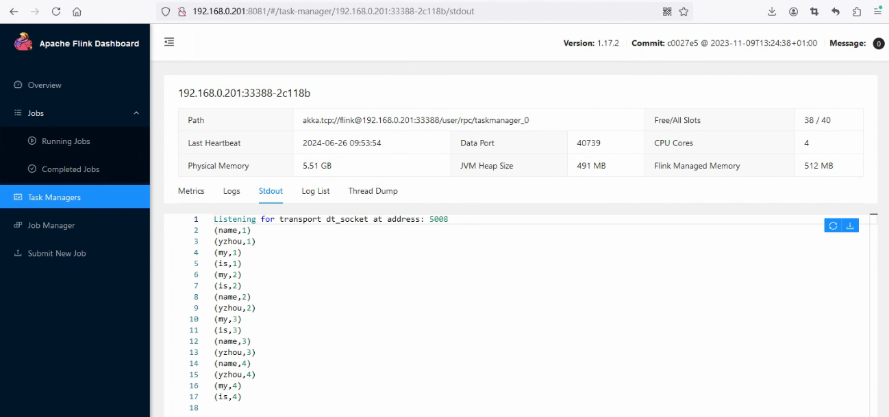
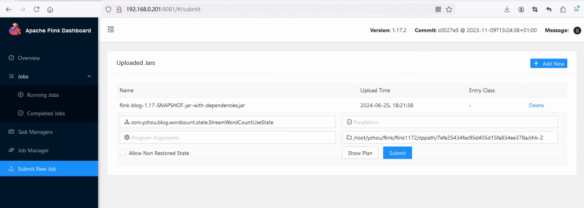

# Flink 源码-Standalone 06-通过 StreamWordCount 探索 ValueState

## 引言

Flink 提供的用于编写有状态程序的 API, 在之前 Blog “Flink 源码-Standalone - 通过 StreamWordCount 探索 State & Checkpoint”

> 注意：该篇 Blog 中 Job 运行环境依赖 `之前 Blog “Flink 源码-Standalone - 通过 StreamWordCount 探索 State & Checkpoint”` 的 Standalone 集群配置。

## StreamWordCountUseState 示例代码

`StreamWordCountUseState.java` 是以之前 Blog “Flink 源码-Standalone - 通过 StreamWordCount 探索 State & Checkpoint”的`StreamWordCount.java`为基础做了修改，继承了`KeyedProcessFunction`，并且使用`ValueState`存储 Word Count 的统计结果。

```java
public class StreamWordCountUseState {
    private static Logger logger = LoggerFactory.getLogger(com.yzhou.blog.wordcount.StreamWordCount.class);

    public static void main(String[] args) throws Exception {
        // 1. 创建流式执行环境
//        StreamExecutionEnvironment env = StreamExecutionEnvironment
//                .createLocalEnvironmentWithWebUI(new Configuration());
        StreamExecutionEnvironment env = StreamExecutionEnvironment
                .getExecutionEnvironment(new Configuration());
        env.setRestartStrategy(RestartStrategies
                .fixedDelayRestart(3, Time.of(10, TimeUnit.SECONDS)));
        // 2. Socket 读取  nc -lk 7777
        DataStreamSource<String> lineDSS = env
                .socketTextStream("localhost", 7777);

        // 3. 转换数据格式
        SingleOutputStreamOperator<Tuple2<String, Long>> wordAndOne = lineDSS
                .flatMap(
                        (String line, Collector<String> words) -> {
                            Arrays.stream(line.split(" ")).forEach(words::collect);
                        }
                )
                .returns(Types.STRING)
                .map(word -> Tuple2.of(word, 1L))
                .returns(Types.TUPLE(Types.STRING, Types.LONG)).setParallelism(2);

        // 4. 分组
        KeyedStream<Tuple2<String, Long>, String> wordAndOneKS = wordAndOne
                .keyBy(t -> t.f0);
        // 5. 求和
        SingleOutputStreamOperator<Tuple2<String, Long>> result = wordAndOneKS
                .process(new WordCountProcessFunction())
                .setParallelism(1).uid("wc-sum");

        // 6. 打印
        result.print();
        logger.info(result.toString());
        // 7. 执行
        env.execute();
    }

    public static class WordCountProcessFunction extends KeyedProcessFunction<String, Tuple2<String, Long>, Tuple2<String, Long>> {
        private ValueState<Long> countState;

        @Override
        public void open(org.apache.flink.configuration.Configuration parameters) throws Exception {
            ValueStateDescriptor<Long> descriptor = new ValueStateDescriptor<>(
                    "wordCountState", // 状态的名称
                    Types.LONG // 状态存储的数据类型
            );
            countState = getRuntimeContext().getState(descriptor);
        }

        @Override
        public void processElement(
                Tuple2<String, Long> value,
                Context ctx,
                Collector<Tuple2<String, Long>> out) throws Exception {

            // 获取当前单词的计数状态
            Long currentCount = countState.value();

            // 初始化状态
            if (currentCount == null) {
                currentCount = 0L;
            }

            // 自增并更新状态
            currentCount += value.f1;
            countState.update(currentCount);

            // 输出当前单词的计数结果
            out.collect(new Tuple2<>(value.f0, currentCount));
        }
    }
}
```

### 测试统计结果

1）终端执行 `nc -lk 7777`，发送四次`my name is yzhou`内容
2）通过 Flink WEB UI 提交 StreamWordCount Job  
3）输入测试数据，最后 word count 的统计结果可在 Task Managers Stdout Log 页面查看，如下图所示：  


### 手动触发 Checkpoint

手动触发的 REST API URL： `http://<jobmanager>:8081/jobs/<job_id>/checkpoints`

```shell
curl --location --request POST 'http://192.168.0.201:8081/jobs/7efe25434fac95d405d15fa834ee378a/checkpoints'
```

观察 Checkpoint 的存储目录。  
**Checkpoint Path:**

```bash
[root@vm01 7efe25434fac95d405d15fa834ee378a]# tree .
.
├── chk-1
│   └── _metadata
├── chk-2
│   └── _metadata
├── shared
└── taskowned
```

### 从 Checkpoint 恢复作业，验证 ValueState 是否恢复存储值

在 `Submit New Job`添加 Checkpoint Path`/root/yzhou/flink/flink1172/cppath/7efe25434fac95d405d15fa834ee378a/chk-2` 再提交。  


同样发送`my name is yzhou`,可在 TaskManager 的 `Stdout log`看到以下统计结果：

```bash
(name,5)
(is,5)
(my,5)
(yzhou,5)
```

**小结**  
`StreamWordCountUseState.java`的测试结果与 Blog "Flink 源码-Standalone - 通过 StreamWordCount 探索 State & Checkpoint"的`StreamWordCount.java`的测试结果是一致的，也符合预期。

基于上面的案例，不知道你会不会有一些疑问：

- 第一个疑问是：`KeyedProcessFunction` 是什么？ 它与 `ProcessFunction`有什么区别？
- 第二个疑问是：Word Count 的统计结果是 K，V 结构，可在`WordCountProcessFunction#processElement()`方法中，使用`Long currentCount = countState.value();`方法获取计数值，调用`countState.update(currentCount);`更新计数值，那它是如何知道 K 是哪个呢？例如，过来的数据是`my`,`name`,`is`,`yzhou`, `countState`是怎么知道的？

若你存在其他的疑问，可留言给我，一起探索其他疑问点。

> 其实接下来，才是该篇 Blog 的重点，上面的示例提出一些思考点将读者带入到下面内容中来。

## ProcessFunction

> 非常建议在没有开始阅读下面介绍之前，先阅读`ProcessFunction`文档（https://nightlies.apache.org/flink/flink-docs-release-1.17/docs/dev/datastream/operators/process_function/）。

```bash
 The ProcessFunction

The ProcessFunction is a low-level stream processing operation, giving access to the basic building blocks of all (acyclic) streaming applications:

    events (stream elements)
    state (fault-tolerant, consistent, only on keyed stream)
    timers (event time and processing time, only on keyed stream)

The ProcessFunction can be thought of as a FlatMapFunction with access to keyed state and timers. It handles events by being invoked for each event received in the input stream(s).

For fault-tolerant state, the ProcessFunction gives access to Flink’s keyed state, accessible via the RuntimeContext, similar to the way other stateful functions can access keyed state.

The timers allow applications to react to changes in processing time and in event time. Every call to the function processElement(...) gets a Context object which gives access to the element’s event time timestamp, and to the TimerService. The TimerService can be used to register callbacks for future event-/processing-time instants. With event-time timers, the onTimer(...) method is called when the current watermark is advanced up to or beyond the timestamp of the timer, while with processing-time timers, onTimer(...) is called when wall clock time reaches the specified time. During that call, all states are again scoped to the key with which the timer was created, allowing timers to manipulate keyed state.

    If you want to access keyed state and timers you have to apply the ProcessFunction on a keyed stream:

stream.keyBy(...).process(new MyProcessFunction());
```

RuntimeContext runtimeContext 是 StreamRuntimeContext

在上面的`StreamWordCountUseState`案例中，使用了`KeyedProcessFunction`抽象类实现了 Word Count 统计结果，

AbstractRichFunction 包含 RuntimeContext runtimeContext 属性值，
RuntimeContext runtimeContext 的类型是： StreamRuntimeContext， 那它是谁的上下文，边界怎么定义， 谁给它赋值

AbstractStreamOperator#setup() 会创建 StreamingRuntimeContext 对象，
```java
this.runtimeContext =
        new StreamingRuntimeContext(
                environment,
                environment.getAccumulatorRegistry().getUserMap(),
                getMetricGroup(),
                getOperatorID(),
                getProcessingTimeService(),
                null,
                environment.getExternalResourceInfoProvider());
```

那么 AbstractStreamOperator 与 AbstractRichFunction 有什么关系么 ？    


### `KeyedProcessFunction` 是什么？ 它与 `ProcessFunction`有什么区别？

## 为什么没有 Key

```java
Long currentCount = countState.value();
```

## ValueState 与 MapState 区别

refer  
1.https://nightlies.apache.org/flink/flink-docs-release-1.17/docs/dev/datastream/fault-tolerance/state/  
2.https://nightlies.apache.org/flink/flink-docs-release-1.17/docs/dev/datastream/operators/process_function/
