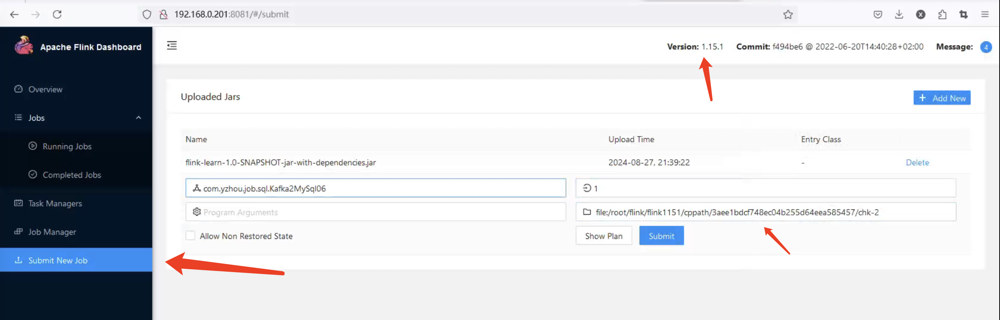
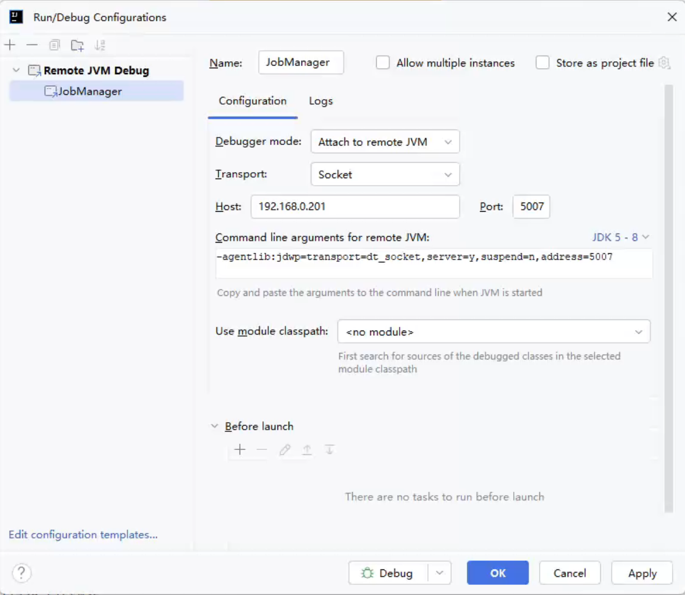
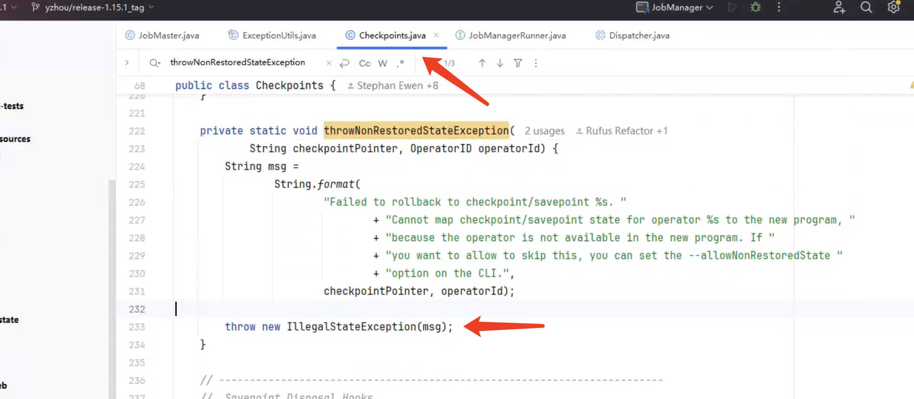
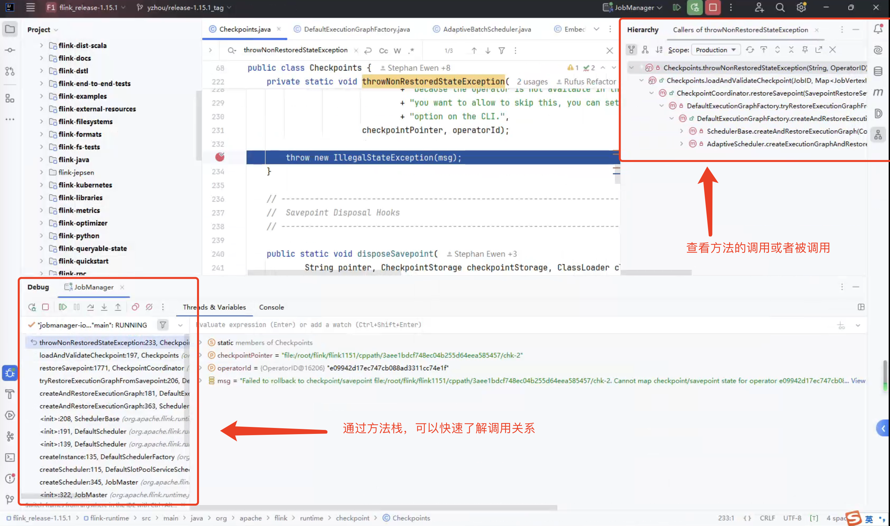
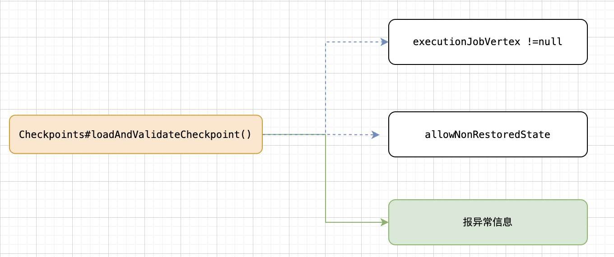
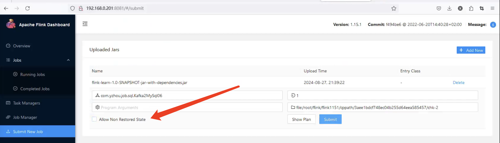

# Flink 源码 - Standalone - 探索 Flink SQL State 恢复异常的原因

>Flink version: 1.15.1，1.15.4      

## 引言(背景)   
使用 Flink Table API 开发的的一个 Jar Job，使用 Flink WEB UI “Submit New Job”功能部署 Job，发现在 Flink 1.15.1的 Standalone集群部署 Job 时，无法从 Checkpoint/Savepoint 恢复 Job（注意，Jar Job并没有做任何调整）。       
       

**Flink Standalone Log（`flink-root-standalonesession-xxx.log`） 会报出以下异常信息：**        
```bash
Caused by: java.lang.IllegalStateException: Failed to rollback to checkpoint/savepoint file:/root/flink/flink1151/cppath/3aee1bdcf748ec04b255d64eea585457/chk-2. Cannot map checkpoint/savepoint state for operator e09942d17ec747cb088ad3311cc74e1f to the new program, because the operator is not available in the new program. If you want to allow to skip this, you can set the --allowNonRestoredState option on the CLI.
        at org.apache.flink.runtime.checkpoint.Checkpoints.throwNonRestoredStateException(Checkpoints.java:233) ~[flink-dist-1.15.1.jar:1.15.1]
        at org.apache.flink.runtime.checkpoint.Checkpoints.loadAndValidateCheckpoint(Checkpoints.java:197) ~[flink-dist-1.15.1.jar:1.15.1]
        at org.apache.flink.runtime.checkpoint.CheckpointCoordinator.restoreSavepoint(CheckpointCoordinator.java:1771) ~[flink-dist-1.15.1.jar:1.15.1]
        at org.apache.flink.runtime.scheduler.DefaultExecutionGraphFactory.tryRestoreExecutionGraphFromSavepoint(DefaultExecutionGraphFactory.java:206) ~[flink-dist-1.15.1.jar:1.15.1]
        at org.apache.flink.runtime.scheduler.DefaultExecutionGraphFactory.createAndRestoreExecutionGraph(DefaultExecutionGraphFactory.java:181) ~[flink-dist-1.15.1.jar:1.15.1]
        at org.apache.flink.runtime.scheduler.SchedulerBase.createAndRestoreExecutionGraph(SchedulerBase.java:363) ~[flink-dist-1.15.1.jar:1.15.1]
        at org.apache.flink.runtime.scheduler.SchedulerBase.<init>(SchedulerBase.java:208) ~[flink-dist-1.15.1.jar:1.15.1]
        at org.apache.flink.runtime.scheduler.DefaultScheduler.<init>(DefaultScheduler.java:191) ~[flink-dist-1.15.1.jar:1.15.1]
        at org.apache.flink.runtime.scheduler.DefaultScheduler.<init>(DefaultScheduler.java:139) ~[flink-dist-1.15.1.jar:1.15.1]
        at org.apache.flink.runtime.scheduler.DefaultSchedulerFactory.createInstance(DefaultSchedulerFactory.java:135) ~[flink-dist-1.15.1.jar:1.15.1]
        at org.apache.flink.runtime.jobmaster.DefaultSlotPoolServiceSchedulerFactory.createScheduler(DefaultSlotPoolServiceSchedulerFactory.java:115) ~[flink-dist-1.15.1.jar:1.15.1]
        at org.apache.flink.runtime.jobmaster.JobMaster.createScheduler(JobMaster.java:345) ~[flink-dist-1.15.1.jar:1.15.1]
        at org.apache.flink.runtime.jobmaster.JobMaster.<init>(JobMaster.java:322) ~[flink-dist-1.15.1.jar:1.15.1]
        at org.apache.flink.runtime.jobmaster.factories.DefaultJobMasterServiceFactory.internalCreateJobMasterService(DefaultJobMasterServiceFactory.java:106) ~[flink-dist-1.15.1.jar:1.15.1]
        at org.apache.flink.runtime.jobmaster.factories.DefaultJobMasterServiceFactory.lambda$createJobMasterService$0(DefaultJobMasterServiceFactory.java:94) ~[flink-dist-1.15.1.jar:1.15.1]
        at org.apache.flink.util.function.FunctionUtils.lambda$uncheckedSupplier$4(FunctionUtils.java:112) ~[flink-dist-1.15.1.jar:1.15.1]
        at java.util.concurrent.CompletableFuture$AsyncSupply.run(CompletableFuture.java:1604) ~[?:1.8.0_411]
        at java.util.concurrent.ThreadPoolExecutor.runWorker(ThreadPoolExecutor.java:1149) ~[?:1.8.0_411]
        at java.util.concurrent.ThreadPoolExecutor$Worker.run(ThreadPoolExecutor.java:624) ~[?:1.8.0_411]
        ... 1 more
2024-08-27 22:32:43,746 ERROR org.apache.flink.runtime.webmonitor.handlers.JarRunHandler   [] - Exception occurred in REST handler: Could not execute application.
```

**我们来看下 Flink Table API 构建的 Flink Jar Job的代码：**       
```java
public class Kafka2MySql06 {
    public static void main(String[] args) {
        StreamExecutionEnvironment env = StreamExecutionEnvironment.getExecutionEnvironment();
        env.setRuntimeMode(RuntimeExecutionMode.STREAMING);

//        ParameterTool parameterTool = ParameterTool.fromArgs(args);
//        String scanStartupMode = parameterTool.get("scan.startup.mode");

        StreamTableEnvironment tableEnv = StreamTableEnvironment.create(env);

        // 注册表
        // kafka
        String createKafkaTableSql = "CREATE TABLE\n"
            + "  `yzhoujsontp01` (\n"
            + "    LOG_TIMESTAMP STRING,\n"
            + "    d_timestamp AS TO_TIMESTAMP (LOG_TIMESTAMP, 'yyyy-MM-dd HH:mm:ss.SSSSSS'),\n"
            + "    WATERMARK FOR d_timestamp AS d_timestamp\n"
            + "  )\n"
            + "WITH\n"
            + "  (\n"
            + "    'properties.bootstrap.servers' = '192.168.0.201:9092',\n"
            + "    'connector' = 'kafka',\n"
            + "    'json.ignore-parse-errors' = 'false',\n"
            + "    'format' = 'json',\n"
            + "    'topic' = 'yzhoujsontp01',\n"
            + "    'properties.group.id' = 'testGroup02',\n"
            + "    'scan.startup.mode' = 'earliest-offset',\n"
            + "    'json.fail-on-missing-field' = 'false'\n"
            + "  )";
        TableResult kafkaTableResult = tableEnv.executeSql(createKafkaTableSql);
        // mysql
        String createMySQLTableSql = "  CREATE TABLE\n"
            + "  `st_output01` (\n"
            + "    log_date STRING,\n"
            + "    count_per_day BIGINT,\n"
            + "    PRIMARY KEY (log_date) NOT ENFORCED\n"
            + "  )\n"
            + "WITH\n"
            + "  (\n"
            + "    'password' = '123456',\n"
            + "    'connector' = 'jdbc',\n"
            + "    'table-name' = 'st_output01',\n"
            + "    'sink.parallelism' = '1',\n"
            + "    'url' = 'jdbc:mysql://192.168.0.201:3306/yzhou_test',\n"
            + "    'username' = 'root'\n"
            + "  )";
        TableResult mysqlTableResult = tableEnv.executeSql(createMySQLTableSql);

        tableEnv.executeSql(
                "INSERT INTO st_output01\n"
                    + "SELECT\n"
                    + "    DATE_FORMAT(TO_TIMESTAMP(LOG_TIMESTAMP,'yyyy-MM-dd HH:mm:ss.SSSSSS'),'yyyy-MM-dd') AS log_date,\n"
                    + "    count(*) AS count_per_day\n"
                    + "FROM yzhoujsontp01\n"
                    + "GROUP BY\n"
                    + "    TUMBLE(PROCTIME(),INTERVAL '1' MINUTE),\n"
                    + "    DATE_FORMAT(TO_TIMESTAMP(LOG_TIMESTAMP,'yyyy-MM-dd HH:mm:ss.SSSSSS'),'yyyy-MM-dd');"
        );
    }
}
```
整个 Flink Job 的处理逻辑比较简单，从 Kafka 读取数据按照`LOG_TIMESTAMP`字段做条数汇总，再写入到 MySQL。（显然Job 逻辑并不是这次的核心）。  

此时，我不知道你是否也遇到过这个异常 case，如果你要是遇到过是否会和我有一样的疑虑（`请排除更改了 Job 的 DAG,因为它必然会出现这个问题`）。    

我将Idea 项目中的 Flink 依赖升级到 1.15.4，重新打包 Jar，再按照 Checkpoint/Savepoint 恢复Job 的逻辑，重新测试了下，`发现 Job 是可以从 Checkpoint/Savepoint 恢复的`。我心中的担心也随着消失，因为这个 case的异常信息与我了解到 Flink源码不太一致，当然也有可能是我学习的源码与测试 Flink 版本不一致的情况，因为Flink 版本发布也都会多多少少修复一些 Bug。    

## 搭建远程调试        

### 1.搭建 Flink 1.15.1 源码调试环境
**1.配置远程调试端口**       
在部署的Flink Standalone conf/flink-conf.yaml 添加以下内容：  
```bash 
env.java.opts.jobmanager: -agentlib:jdwp=transport=dt_socket,server=y,suspend=n,address=192.168.0.201:5007
env.java.opts.taskmanager: -agentlib:jdwp=transport=dt_socket,server=y,suspend=n,address=192.168.0.201:5008
```

**2.克隆代码**   
```bash
# 从 release-1.15.1 tag 创建分支
git branch new-branch release-1.15.1 
git switch new-branch   
```

**3.配置 Remote JVM Debug**   
      

### 2.定位异常点      
```java
at org.apache.flink.runtime.checkpoint.Checkpoints.throwNonRestoredStateException(Checkpoints.java:233) ~[flink-dist-1.15.1.jar:1.15.1]
```
    

>此处特别注意： 源码要与异常信息中提示的类名，行号都要对应上。     

## 分析异常  
### 1.定位代码，了解异常方法的上下调用关系      
在 Idea 中通过断点调试查看`方法栈`的链路关系，或者通过`Hierarchy`查看调用关系，大多数情况下，断点调试的`方法栈`更让我们可以快速了解方法的调用关系以及`栈帧`中涉及到的变量值。（具备代码定位能力也非常重要， 而理解代码处理逻辑就交给 Chatgpt来吧， 开个玩笑，但借助AI 理解代码也是一个不错的方式，当然准确性还需你抉择）     
    

### 2.源码分析   
通过`开启远程调试，观察 Idea 的方法栈`，很容易定位到`Checkpoints#loadAndValidateCheckpoint()并且 行号：197 行`方法 。   
```java
public static CompletedCheckpoint loadAndValidateCheckpoint(
        JobID jobId,
        Map<JobVertexID, ExecutionJobVertex> tasks,
        CompletedCheckpointStorageLocation location,
        ClassLoader classLoader,
        boolean allowNonRestoredState,
        CheckpointProperties checkpointProperties,
        RestoreMode restoreMode)
        throws IOException {

    checkNotNull(jobId, "jobId");
    checkNotNull(tasks, "tasks");
    checkNotNull(location, "location");
    checkNotNull(classLoader, "classLoader");

    final StreamStateHandle metadataHandle = location.getMetadataHandle();
    final String checkpointPointer = location.getExternalPointer();

    // (1) load the savepoint
    final CheckpointMetadata checkpointMetadata;
    try (InputStream in = metadataHandle.openInputStream()) {
        DataInputStream dis = new DataInputStream(in);
        checkpointMetadata = loadCheckpointMetadata(dis, classLoader, checkpointPointer);
    }

    // generate mapping from operator to task
    Map<OperatorID, ExecutionJobVertex> operatorToJobVertexMapping = new HashMap<>();
    for (ExecutionJobVertex task : tasks.values()) {
        for (OperatorIDPair operatorIDPair : task.getOperatorIDs()) {
            operatorToJobVertexMapping.put(operatorIDPair.getGeneratedOperatorID(), task);
            operatorIDPair
                    .getUserDefinedOperatorID()
                    .ifPresent(id -> operatorToJobVertexMapping.put(id, task));
        }
    }

    // (2) validate it (parallelism, etc)
    HashMap<OperatorID, OperatorState> operatorStates =
            new HashMap<>(checkpointMetadata.getOperatorStates().size());
    for (OperatorState operatorState : checkpointMetadata.getOperatorStates()) {

        ExecutionJobVertex executionJobVertex =
                operatorToJobVertexMapping.get(operatorState.getOperatorID());

        if (executionJobVertex != null) {

            if (executionJobVertex.getMaxParallelism() == operatorState.getMaxParallelism()
                    || executionJobVertex.canRescaleMaxParallelism(
                            operatorState.getMaxParallelism())) {
                operatorStates.put(operatorState.getOperatorID(), operatorState);
            } else {
                String msg =
                        String.format(
                                "Failed to rollback to checkpoint/savepoint %s. "
                                        + "Max parallelism mismatch between checkpoint/savepoint state and new program. "
                                        + "Cannot map operator %s with max parallelism %d to new program with "
                                        + "max parallelism %d. This indicates that the program has been changed "
                                        + "in a non-compatible way after the checkpoint/savepoint.",
                                checkpointMetadata,
                                operatorState.getOperatorID(),
                                operatorState.getMaxParallelism(),
                                executionJobVertex.getMaxParallelism());

                throw new IllegalStateException(msg);
            }
        } else if (allowNonRestoredState) {
            LOG.info(
                    "Skipping savepoint state for operator {}.", operatorState.getOperatorID());
        } else {
            if (operatorState.getCoordinatorState() != null) {
                throwNonRestoredStateException(
                        checkpointPointer, operatorState.getOperatorID());
            }

            for (OperatorSubtaskState operatorSubtaskState : operatorState.getStates()) {
                if (operatorSubtaskState.hasState()) {
                    throwNonRestoredStateException(
                            checkpointPointer, operatorState.getOperatorID());
                }
            }

            LOG.info(
                    "Skipping empty savepoint state for operator {}.",
                    operatorState.getOperatorID());
        }
    }

    return new CompletedCheckpoint(
            jobId,
            checkpointMetadata.getCheckpointId(),
            0L,
            0L,
            operatorStates,
            checkpointMetadata.getMasterStates(),
            checkpointProperties,
            restoreMode == RestoreMode.CLAIM
                    ? new ClaimModeCompletedStorageLocation(location)
                    : location,
            null);
}
```

若`operatorSubtaskState.hasState()`存在 State,则会报出`Cannot map checkpoint/savepoint state for operator`（Flink 优秀的开发者他们定义变量名时太准确了）。     

查看`Checkpoints#loadAndValidateCheckpoint()`中的 if else 语句，了解是什么情况会进去`该 else`以及我们期望它应该进入哪个？。       
    

`allowNonRestoredState else`很容易排除，因为我没有设置`allowNonRestoredState=true`，剩下的就只剩`executionJobVertex !=null`;    
  


## 回顾 Flink Stream API 的 JobGraph的知识点  
目前 Flink Table API 源码还没有梳理太多，但这并不影响我举一反三，
