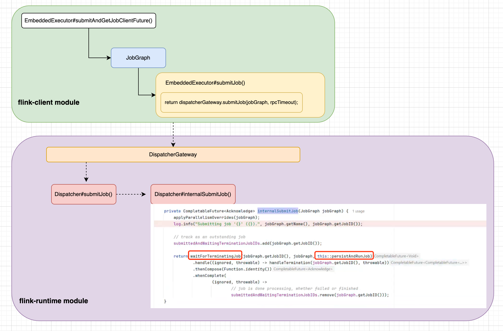
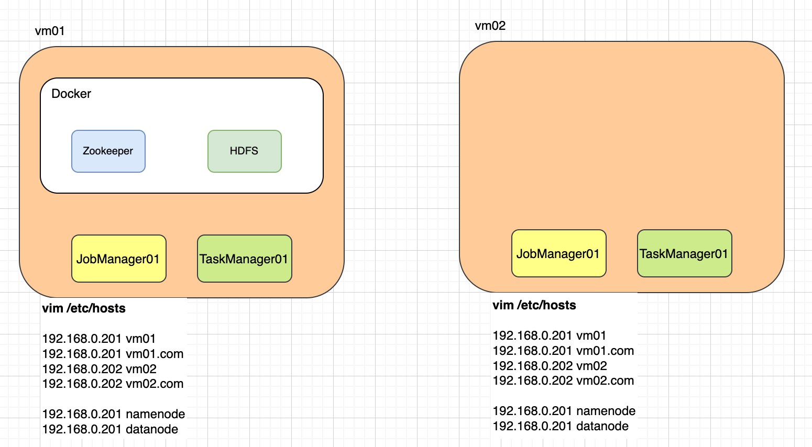
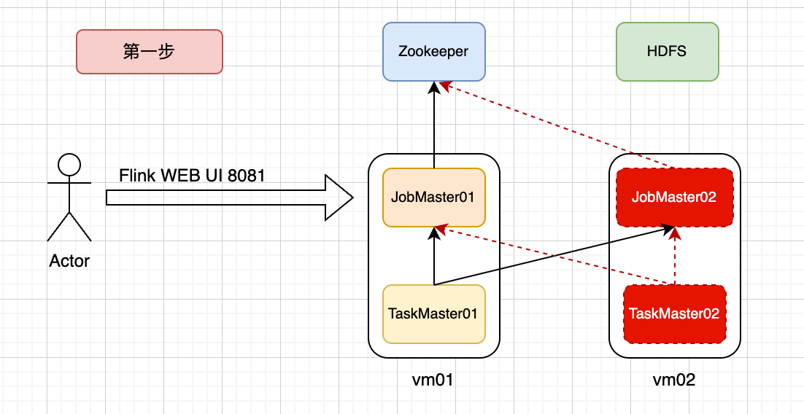
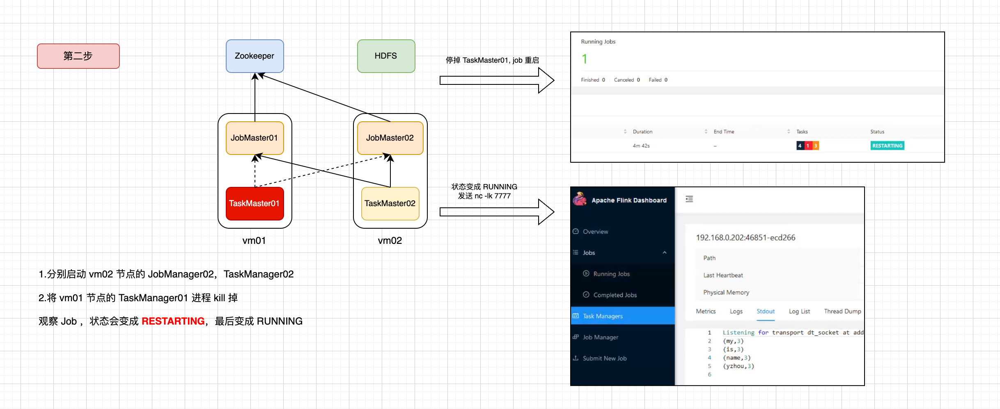
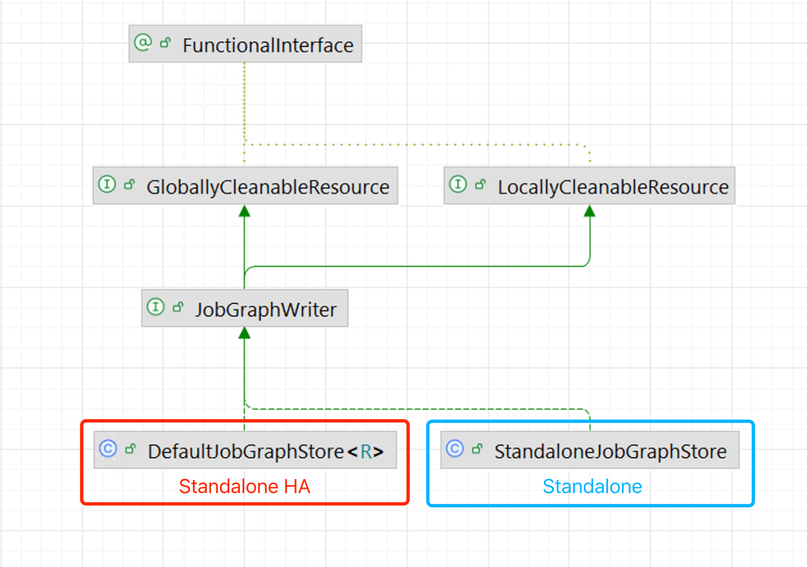
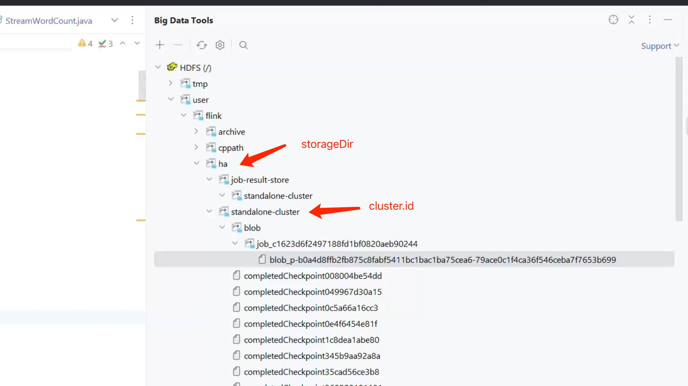
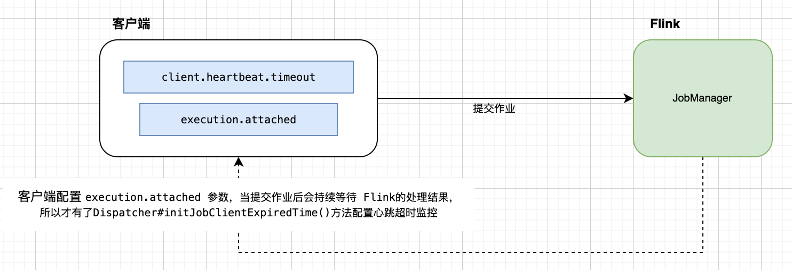
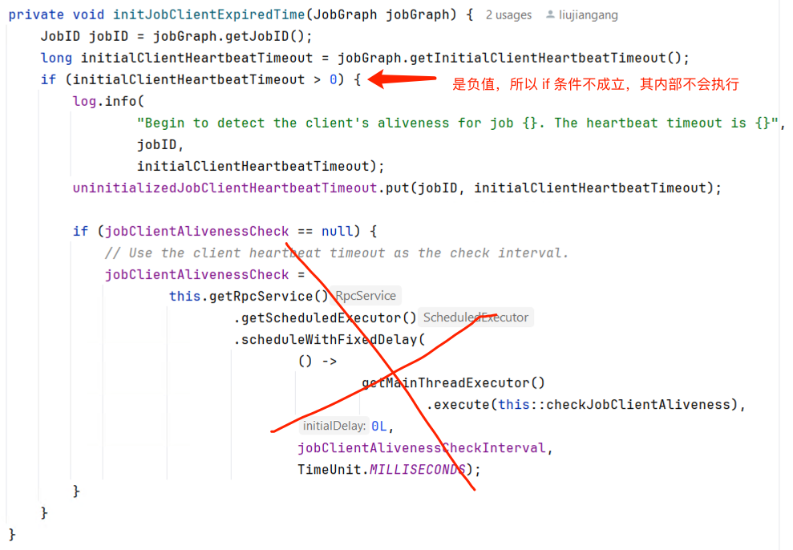

# Flink 源码 - Standalone - 探索 Flink Stream Job Submit 实现过程 - 构建 ExecutionGraph                

>Flink version: 1.17.2       

## 引言   
在之前的 Blog "Flink 源码 - Standalone - 探索 Flink Stream Job Show Plan 实现过程 - 构建 StreamGraph" 和 "Flink 源码 - Standalone - 探索 Flink Stream Job Show Plan 实现过程 - 构建 JobGraph" 讲解了 Flink Job Main() Stream API 转成 StreamGraph，再转成 JobGraph 流程，此时，不知道你是否跟我一样，有种兴奋感觉，那种离真相越来越近的感觉。      

我们需要引述官网的一段介绍来引入该篇 Blog的主题：       
>###  JobManager Data Structures #
>During job execution, the JobManager keeps track of distributed tasks, decides when to schedule the next task (or set of tasks), and reacts to finished tasks or execution failures.  

>The JobManager receives the JobGraph , which is a representation of the data flow consisting of operators ( JobVertex ) and intermediate results ( IntermediateDataSet ). Each operator has properties, like the parallelism and the code that it executes. In addition, the JobGraph has a set of attached libraries, that are necessary to execute the code of the operators.       

>`The JobManager transforms the JobGraph into an ExecutionGraph .` The ExecutionGraph is a parallel version of the JobGraph: For each JobVertex, it contains an ExecutionVertex per parallel subtask. An operator with a parallelism of 100 will have one JobVertex and 100 ExecutionVertices. The ExecutionVertex tracks the state of execution of a particular subtask. All ExecutionVertices from one JobVertex are held in an ExecutionJobVertex , which tracks the status of the operator as a whole. Besides the vertices, the ExecutionGraph also contains the IntermediateResult and the IntermediateResultPartition . The former tracks the state of the IntermediateDataSet, the latter tracks the state of each of its partitions.  

>### 翻译   
>`JobManager 将 JobGraph 转换为 ExecutionGraph 。` ExecutionGraph 是 JobGraph 的并行版本：对于每个 JobVertex，它包含每个并行子任务的 ExecutionVertex。并行度为 100 的算子将有 1 个 JobVertex 和 100 个 ExecutionVertices。 ExecutionVertex 跟踪特定子任务的执行状态。来自一个 JobVertex 的所有 ExecutionVertices 都保存在 ExecutionJobVertex 中，它跟踪整个算子的状态。除了顶点之外，ExecutionGraph 还包含 IntermediateResult 和 IntermediateResultPartition 。前者跟踪 IntermediateDataSet 的状态，后者跟踪其每个分区的状态。      

    

(`https://nightlies.apache.org/flink/flink-docs-release-1.17/docs/internals/job_scheduling/#jobmanager-data-structures`)

从官网可知，`JobManager` 会将 `JobGraph` 转换成 `ExecutionGraph`, 同时它也告诉我们 ExecutionGraph 是 JobGraph的并行版本。上面的图很形象，接下来，让我们接着 Blog "Flink 源码 - Standalone - 探索 Flink Stream Job Show Plan 实现过程 - 构建 JobGraph"的内容,探索 ExecutionGraph的构建过程。         


## 创建完 JobGraph，发送请求       
在`EmbeddedExecutor#submitAndGetJobClientFuture()`方法中完成了 StreamGraph 转换成 JobGraph的逻辑，得到 JobGraph后，通过`EmbeddedExecutor#submitJob()`方法调用 AKKA RPC 触发 Job 提交请求, 下图展示了核心方法的调用关系：   


在`Dispatcher#internalSubmitJob()`方法   


```java
private void persistAndRunJob(JobGraph jobGraph) throws Exception {
    jobGraphWriter.putJobGraph(jobGraph);
    initJobClientExpiredTime(jobGraph);
    runJob(createJobMasterRunner(jobGraph), ExecutionType.SUBMISSION);
}
```


### jobGraph 持久化    
```java
jobGraphWriter.putJobGraph(jobGraph);
```

`Dispatcher#jobGraphWriter`，它是一个 interface ，其类型为 JobGraphWriter,它的作用是存储或者移除 JobGraph 对象,在Flink Standalone 模式下，jobGraphWriter 对应的实现类是 `StandaloneJobGraphStore`。但是`StandaloneJobGraphStore`在重写`putJobGraph()`方法时并没有做任何处理。      

**StandaloneJobGraphStore.java**   
```java
/**
 * {@link JobGraph} instances for JobManagers running in {@link HighAvailabilityMode#NONE}.
 *
 * <p>All operations are NoOps, because {@link JobGraph} instances cannot be recovered in this
 * recovery mode.
 */
public class StandaloneJobGraphStore implements JobGraphStore {
    @Override
    public void start(JobGraphListener jobGraphListener) throws Exception {
        // Nothing to do
    }

    @Override
    public void stop() {
        // Nothing to do
    }

    @Override
    public void putJobGraph(JobGraph jobGraph) {
        // Nothing to do
    }

    @Override
    public Collection<JobID> getJobIds() {
        return Collections.emptyList();
    }

    @Override
    public JobGraph recoverJobGraph(JobID jobId) {
        return null;
    }
}
```

请大家特别注意`StandaloneJobGraphStore`的类注释说明：`Standalone 模式下不做任何操作，不会持久化 jobGraph`, 这里提出一个问题：`Standalone HA 是怎么样？`,接下来，通过搭建一个 `Standalone HA` 来测试。   

### 验证 Standalone HA       
部署结构图： 
   

#### 部署 Zookeeper(单节点)    
目录结构： 
```bash
[root@vm01 Zookeeper]# tree .
.
├── docker-compose.yml
└── volumes
    ├── conf
    │   └── zoo.cfg
    ├── data
    └── logs
```

vim docker-compose.yml  
```bash
version: '3.7'

services:
  zookeeper_1:
    image: zookeeper:3.7.0
    hostname: zookeeper_1
    container_name: zookeeper_1
    ports:
      - 2181:2181
    volumes:
      - ./volumes/conf/zoo.cfg:/conf/zoo.cfg
      - ./volumes/data:/opt/data
      - ./volumes/logs:/opt/datalogs
``` 

vim volumes/conf/zoo.cfg            
```bash
# The number of milliseconds of each tick
tickTime=2000
# The number of ticks that the initial
# synchronization phase can take
initLimit=10
# The number of ticks that can pass between
# sending a request and getting an acknowledgement
syncLimit=5
# the directory where the snapshot is stored.
# do not use /tmp for storage, /tmp here is just
# example sakes.
dataDir=/opt/data
dataLogDir=/opt/datalogs
# the port at which the clients will connect
clientPort=2181
```

>关于 docker-compose 部署 Zookeeper，可参考 https://hub.docker.com/_/zookeeper   

#### 部署 HDFS(单节点)   
目录结构： 
```bash
[root@vm01 Hdfs]# tree .
.
├── config
├── docker-compose.yaml 
├── hadoop/...
```

vim docker-compose.yml （`network_mode 配置为 host`）      
```bash
version: "3"
services:
   namenode:
      image: apache/hadoop:3.3.5
      hostname: namenode
      command: ["hdfs", "namenode"]
      user: "root:root"
      network_mode: "host"  # 使用 host 网络模式
      env_file:
        - ./config
      environment:
          ENSURE_NAMENODE_DIR: "/tmp/hadoop-root/dfs/name"
      ulimits:
        nofile:
          soft: 65536
          hard: 65536
      volumes:
        - namenode:/tmp/hadoop-root/dfs
      privileged: true

   datanode:
      image: apache/hadoop:3.3.5
      hostname: datanode
      command: ["hdfs", "datanode"]
      user: "root:root"
      network_mode: "host"  # 使用 host 网络模式
      env_file:
        - ./config
      ulimits:
        nofile:
          soft: 65536
          hard: 65536
      volumes:
        - datanode:/tmp/hadoop-root/dfs
        # - ./volumes/data:/tmp/hadoop-root/dfs/data
      privileged: true

volumes:
  datanode:
  namenode:
```

vim config     
```bash
CORE-SITE.XML_fs.default.name=hdfs://namenode
CORE-SITE.XML_fs.defaultFS=hdfs://namenode
CORE-SITE.XML_hadoop.http.staticuser.user=root
CORE-SITE.XML_hadoop.tmp.dir=/tmp/hadoop-root
HDFS-SITE.XML_dfs.namenode.rpc-address=namenode:8020
HDFS-SITE.XML_dfs.replication=1
```
  
还有特别重要的一步： `将 namenode 容器内的 hadoop 配置拷贝到 linux 机器上，在后续的 Flink 会使用相关配置`    
```bash
docker cp CONTAINER:SRC_PATH DEST_PATH   
# 示例：将容器内部 /opt/hadoop/etc/hadoop 文件夹拷贝到当前目录
docker cp xxxxxxxx:/opt/hadoop/etc/hadoop . 
``` 

>关于 docker-compose 部署 HDFS，可参考 https://hub.docker.com/r/apache/hadoop   

#### Flink Standalone HA(2个 JobManager，2个 TaskManager)    
**vm01**
vim conf/flink-conf.yaml （为了保证示例完整性，我给出我的全部参数配置）  
```bash
restart-strategy: fixed-delay
restart-strategy.fixed-delay.attempts: 3
restart-strategy.fixed-delay.delay: 5000

jobmanager.rpc.address: 192.168.0.201
jobmanager.bind-host: 0.0.0.0
taskmanager.bind-host: 192.168.0.201
taskmanager.host: 192.168.0.201
rest.bind-address: 0.0.0.0

env.java.opts.jobmanager: -agentlib:jdwp=transport=dt_socket,server=y,suspend=n,address=192.168.0.201:5007
env.java.opts.taskmanager: -agentlib:jdwp=transport=dt_socket,server=y,suspend=n,address=192.168.0.201:5008

# ha
high-availability: zookeeper
high-availability.storageDir: hdfs:///user/flink/ha/
high-availability.zookeeper.quorum: vm01:2181
high-availability.zookeeper.path.root: /flink-standalone-ha
high-availability.cluster-id: /standalone-cluster
fs.default-scheme: hdfs://namenode
env.hadoop.conf.dir: /root/docker/Hdfs/hadoop

#blob server
blob.storage.directory: /root/flink/flink1172-ha/blob
blob.server.port: 6124


# config checkpoint
state.backend: filesystem
state.backend.incremental: true
state.checkpoints.dir: hdfs:///user/flink/cppath
state.savepoints.dir: hdfs:///user/flink/sppath
execution.checkpointing.interval: 60000
execution.checkpointing.externalized-checkpoint-retention: RETAIN_ON_CANCELLATION
state.checkpoints.num-retained: 100

rest.flamegraph.enabled: true
classloader.resolve-order: parent-first

web.upload.dir: /root/flink/flink1172-ha


historyserver.web.port: 8082
historyserver.web.address: 0.0.0.0
jobmanager.archive.fs.dir: hdfs:///user/flink/archive
historyserver.archive.fs.dir: hdfs:///user/flink/archive
historyserver.archive.fs.refresh-interval: 10000
```

**vm02**        
vim conf/flink-conf.yaml     
```bash
restart-strategy: fixed-delay
restart-strategy.fixed-delay.attempts: 3
restart-strategy.fixed-delay.delay: 5000

jobmanager.rpc.address: 192.168.0.202
jobmanager.bind-host: 0.0.0.0
taskmanager.bind-host: 192.168.0.202
taskmanager.host: 192.168.0.202
rest.bind-address: 0.0.0.0

env.java.opts.jobmanager: -agentlib:jdwp=transport=dt_socket,server=y,suspend=n,address=192.168.0.202:5007
env.java.opts.taskmanager: -agentlib:jdwp=transport=dt_socket,server=y,suspend=n,address=192.168.0.202:5008

# ha
high-availability: zookeeper
high-availability.storageDir: hdfs:///user/flink/ha/
high-availability.zookeeper.quorum: vm01:2181
high-availability.zookeeper.path.root: /flink-standalone-ha
high-availability.cluster-id: /standalone-cluster
fs.default-scheme: hdfs://namenode
env.hadoop.conf.dir: /root/docker/Hdfs/hadoop

#blob server
blob.storage.directory: /root/flink/flink1172-ha/blob
blob.server.port: 6124


# config checkpoint
state.backend: filesystem
state.backend.incremental: true
state.checkpoints.dir: hdfs:///user/flink/cppath
state.savepoints.dir: hdfs:///user/flink/sppath
execution.checkpointing.interval: 60000
execution.checkpointing.externalized-checkpoint-retention: RETAIN_ON_CANCELLATION
state.checkpoints.num-retained: 100

rest.flamegraph.enabled: true
classloader.resolve-order: parent-first

web.upload.dir: /root/flink/flink1172-ha


historyserver.web.port: 8082
historyserver.web.address: 0.0.0.0
jobmanager.archive.fs.dir: hdfs:///user/flink/archive
historyserver.archive.fs.dir: hdfs:///user/flink/archive
historyserver.archive.fs.refresh-interval: 10000
```

>注意，vm01,vm02 都分别需要将 hadoop 配置文件拷贝到 `/root/docker/Hdfs/hadoop/`目录（也可以自行在 conf/flink-conf.yaml 修改）     

此时，分别在 vm1,vm02 启动 JobManager，TaskManager：  
```bash
./jobmanager.sh start 
./taskmanager.sh start 
```   

到这里，我们完成了 Flink Standalone HA 环境部署， 分别访问 vm01:8081,vm02:8082 都可以看到 2个 TaskManager。       

#### 验证    
**1.** 如下图说所示，Flink Standalone HA 集群先启动 vm01节点下的 JobManager，TaskManager;        
       

**下面是之前的 StreamWordCount 案例代码**     
```java
public class StreamWordCount {
    private static Logger logger = LoggerFactory.getLogger(StreamWordCount.class);

    public static void main(String[] args) throws Exception {
        // 1. 创建流式执行环境
//        StreamExecutionEnvironment env = StreamExecutionEnvironment
//                .createLocalEnvironmentWithWebUI(new Configuration());
        StreamExecutionEnvironment env = StreamExecutionEnvironment
                .getExecutionEnvironment(new Configuration());
        env.setRestartStrategy(RestartStrategies
                .fixedDelayRestart(3, Time.of(10, TimeUnit.SECONDS)));
        // 2. Socket 读取  nc -lk 7777
        DataStreamSource<String> lineDSS = env
                .socketTextStream("vm01.com", 7777);

        // 3. 转换数据格式n
        SingleOutputStreamOperator<Tuple2<String, Long>> wordAndOne = lineDSS
                .flatMap(
                        (String line, Collector<String> words) -> {
                    Arrays.stream(line.split(" ")).forEach(words::collect);
                        }
                        )
                .returns(Types.STRING)
                .map(word -> Tuple2.of(word, 1L))
                .returns(Types.TUPLE(Types.STRING, Types.LONG)).setParallelism(2);

        // 4. 分组
        KeyedStream<Tuple2<String, Long>, String> wordAndOneKS = wordAndOne
                .keyBy(t -> t.f0);
        // 5. 求和
        SingleOutputStreamOperator<Tuple2<String, Long>> result = wordAndOneKS
                .sum(1).setParallelism(1).uid("wc-sum");

        // 6. 打印
        result.print();
        //logger.info(result.toString());
        // 7. 执行
        env.execute();
    }
}
```

**2.** 将其打包成 jar，访问 vm01:8081 上传 jar，提交 Job。 通过 `nc -lk 7777`命令发送多条`my name is yzhou`。  

**3.** 将 vm01 节点的 TaskManager01 进程 kill 掉，此时作业状态会变成`RESTRATING`,最后变成`RUNNING`。   
  

此时，再使用`nc -lk 7777`命令发送消息`my name is yzhou`,可以看到统计结果，判断Job 从 最新State 恢复的。    

以上操作，我们完成了 Flink Standalone HA的测试，让我们回到主线，`Dispatcher#persistAndRunJob()`中的`jobGraphWriter`, 在 Standalone HA模式下它对应的实现类是`DefaultJobGraphStore`。      
      

**hdfs 存储**  
   

**zookeeper 存储**    
zookeeper 中记录的 JobGraph 提交的 Client IP，提交作业时会创建`/{zookeeper.path.root}/{cluster-id}/jobgraphs/{jobID}`路径。

```bash
[zk: localhost:2181(CONNECTED) 15]
[zk: localhost:2181(CONNECTED) 15]
[zk: localhost:2181(CONNECTED) 15] ls /flink-standalone-ha/standalone-cluster/jobgraphs
[7d616f96620eceb016e69441fd3dd046]
[zk: localhost:2181(CONNECTED) 16] ls /flink-standalone-ha/standalone-cluster/jobgraphs/7d616f96620eceb016e69441fd3dd046
[locks]
[zk: localhost:2181(CONNECTED) 17] ls /flink-standalone-ha/standalone-cluster/jobgraphs/7d616f96620eceb016e69441fd3dd046/locks
[]
[zk: localhost:2181(CONNECTED) 18] get /flink-standalone-ha/standalone-cluster/jobgraphs/7d616f96620eceb016e69441fd3dd046/locks
192.168.0.201
[zk: localhost:2181(CONNECTED) 19]
```

>注意，这里涉及到 JobManager的一个组件 BlobServer，它主要负责管理二进制大文件的服务，比如保存用户上传的 Jar 文件，该篇 Blog 不做过多介绍，后面的文章中会再介绍。    


### 根据过期时间配置心跳任务    
```java
initJobClientExpiredTime(jobGraph);
```

`Dispatcher#initJobClientExpiredTime()`会从 jobGraph 获取客户端的心跳超时时间，如果心跳超时时间大于0会创建一个定时任务，它会通过 Flink RPC服务的调度器来执行，其目的是检查客户端而存活信息。我们看`JobGraph#getInitialClientHeartbeatTimeout()`方法，如果`initialClientHeartbeatTimeout`参数不存在，则默认值 `Long.MIN_VALUE`（负数）。             
**JobGraph#setInitialClientHeartbeatTimeout()方法代码：**       
```java
public void setInitialClientHeartbeatTimeout(long initialClientHeartbeatTimeout) {
    jobConfiguration.setLong(INITIAL_CLIENT_HEARTBEAT_TIMEOUT, initialClientHeartbeatTimeout);
}

public long getInitialClientHeartbeatTimeout() {
    return jobConfiguration.getLong(INITIAL_CLIENT_HEARTBEAT_TIMEOUT, Long.MIN_VALUE);
}
```

如下图所示， 接着看下`setInitialClientHeartbeatTimeout()`方法调用的地方`executors.PipelineExecutorUtils#getJobGraph()`方法, 当通过 client 配置`execution.attached`参数提交作业时才会将`client.heartbeat.timeout`参数赋值给 `initialClientHeartbeatTimeout`， 很显然该示例是通过 Flink WEB UI 提交Job,所以此时`initialClientHeartbeatTimeout`会赋值默认值。        
```java
if (configuration.getBoolean(DeploymentOptions.ATTACHED)
        && configuration.getBoolean(DeploymentOptions.SHUTDOWN_IF_ATTACHED)) {
    jobGraph.setInitialClientHeartbeatTimeout(
            configuration.getLong(ClientOptions.CLIENT_HEARTBEAT_TIMEOUT));
}
```
     

`变量 initialClientHeartbeatTimeout`被赋值`Long.MIN_VALUE`, 则后面的 if逻辑不会处理，所以暂时不讨论；       
       
 
### 运行任务  
```java
runJob(createJobMasterRunner(jobGraph), ExecutionType.SUBMISSION);    
```   


创建 JobManagerRunner   


每提交一个Flink Job 都会创建 JobManagerRunner 


这段代码的主要功能是创建一个 `JobManagerRunner` 实例，用于在 Flink 中管理作业的执行。`JobManagerRunner` 是 Flink 的核心组件之一，负责协调和控制分布式作业的生命周期、资源调度、高可用性（HA）、容错处理等。

以下是代码的详细解释：

### 方法签名
```java
public JobManagerRunner createJobManagerRunner(
        JobGraph jobGraph,
        Configuration configuration,
        RpcService rpcService,
        HighAvailabilityServices highAvailabilityServices,
        HeartbeatServices heartbeatServices,
        JobManagerSharedServices jobManagerServices,
        JobManagerJobMetricGroupFactory jobManagerJobMetricGroupFactory,
        FatalErrorHandler fatalErrorHandler,
        long initializationTimestamp)
        throws Exception
```
- **参数**：
  - `JobGraph jobGraph`：Flink 作业的有向无环图（DAG），定义了作业的计算拓扑结构。
  - `Configuration configuration`：包含作业和集群的配置信息。
  - `RpcService rpcService`：远程过程调用服务，支持 Flink 分布式组件之间的通信。
  - `HighAvailabilityServices highAvailabilityServices`：高可用服务，支持在发生故障时恢复作业状态。
  - `HeartbeatServices heartbeatServices`：心跳服务，监控分布式组件的存活状态。
  - `JobManagerSharedServices jobManagerServices`：JobManager 的共享服务，如 I/O 线程池和缓存管理等。
  - `JobManagerJobMetricGroupFactory jobManagerJobMetricGroupFactory`：用于创建度量指标组，用于监控作业的运行状况。
  - `FatalErrorHandler fatalErrorHandler`：处理运行期间发生的致命错误。
  - `initializationTimestamp`：作业初始化的时间戳。

### 主要代码解释

1. **检查作业是否为空**：
   ```java
   checkArgument(jobGraph.getNumberOfVertices() > 0, "The given job is empty");
   ```
   - 确保 `JobGraph` 中至少有一个顶点（任务）。如果作业为空，则抛出异常。

2. **创建 `JobMasterConfiguration`**：
   ```java
   final JobMasterConfiguration jobMasterConfiguration =
            JobMasterConfiguration.fromConfiguration(configuration);
   ```
   - 从传入的 `Configuration` 创建 `JobMasterConfiguration`，用于配置 `JobMaster`，包括调度器模式、容错设置等。

3. **获取作业结果存储（JobResultStore）**：
   ```java
   final JobResultStore jobResultStore = highAvailabilityServices.getJobResultStore();
   ```
   - 通过高可用服务获取 `JobResultStore`，用于存储作业的最终结果，支持在高可用模式下恢复。

4. **获取领导选举服务（LeaderElectionService）**：
   ```java
   final LeaderElectionService jobManagerLeaderElectionService =
            highAvailabilityServices.getJobManagerLeaderElectionService(jobGraph.getJobID());
   ```
   - 为当前 `JobGraph` 的 `JobID` 获取领导选举服务，用于选举出 JobManager 的领导实例，在高可用模式下确保作业有唯一的主控节点。

5. **创建 Slot Pool 和调度器工厂**：
   ```java
   final SlotPoolServiceSchedulerFactory slotPoolServiceSchedulerFactory =
            DefaultSlotPoolServiceSchedulerFactory.fromConfiguration(
                    configuration, jobGraph.getJobType(), jobGraph.isDynamic());
   ```
   - 创建 `SlotPoolServiceSchedulerFactory`，根据作业的类型和配置生成 Slot Pool（管理 TaskManager 的计算资源）和调度器工厂。
   - 如果 `JobMasterConfiguration` 的调度模式为 `REACTIVE`，则检查是否使用了自适应调度器（Adaptive Scheduler）。

6. **管理类加载器的租赁**：
   ```java
   final LibraryCacheManager.ClassLoaderLease classLoaderLease =
            jobManagerServices.getLibraryCacheManager()
                    .registerClassLoaderLease(jobGraph.getJobID());
   final ClassLoader userCodeClassLoader =
            classLoaderLease.getOrResolveClassLoader(
                    jobGraph.getUserJarBlobKeys(), jobGraph.getClasspaths())
                    .asClassLoader();
   ```
   - 获取类加载器租赁，用于加载用户提交的作业代码和依赖的 Jar 包。`getOrResolveClassLoader()` 负责根据作业的依赖创建类加载器。

7. **创建 `JobMasterServiceFactory`**：
   ```java
   final DefaultJobMasterServiceFactory jobMasterServiceFactory =
            new DefaultJobMasterServiceFactory(
                    jobManagerServices.getIoExecutor(),
                    rpcService,
                    jobMasterConfiguration,
                    jobGraph,
                    highAvailabilityServices,
                    slotPoolServiceSchedulerFactory,
                    jobManagerServices,
                    heartbeatServices,
                    jobManagerJobMetricGroupFactory,
                    fatalErrorHandler,
                    userCodeClassLoader,
                    initializationTimestamp);
   ```
   - 创建 `JobMasterServiceFactory`，用于生成 `JobMaster` 服务实例。`JobMaster` 负责调度作业和管理资源。
   - 其中包含 `RpcService`、心跳服务、调度器、类加载器、I/O 线程池等必要的服务和资源。

8. **创建 `JobMasterServiceProcessFactory`**：
   ```java
   final DefaultJobMasterServiceProcessFactory jobMasterServiceProcessFactory =
            new DefaultJobMasterServiceProcessFactory(
                    jobGraph.getJobID(),
                    jobGraph.getName(),
                    jobGraph.getCheckpointingSettings(),
                    initializationTimestamp,
                    jobMasterServiceFactory);
   ```
   - 创建 `JobMasterServiceProcessFactory`，用于管理 `JobMaster` 服务的生命周期，处理作业检查点和作业恢复。

9. **返回 `JobMasterServiceLeadershipRunner` 实例**：
   ```java
   return new JobMasterServiceLeadershipRunner(
            jobMasterServiceProcessFactory,
            jobManagerLeaderElectionService,
            jobResultStore,
            classLoaderLease,
            fatalErrorHandler);
   ```
   - 最终返回 `JobMasterServiceLeadershipRunner`，它结合了领导选举服务、作业结果存储和类加载器租赁，负责启动和管理 `JobMaster`，并在领导选举中胜出时掌管作业执行。

### 总结
这段代码的作用是通过各种配置和服务，生成一个用于作业管理的 `JobManagerRunner`。它通过心跳机制、领导选举、高可用性服务等机制确保 Flink 作业能够可靠、高效地在分布式环境中执行，并具备故障恢复能力。


`Dispatcher`为每个作业创建一个 JobManagerRunner，


refer     
1.https://nightlies.apache.org/flink/flink-docs-release-1.17/docs/internals/job_scheduling/           
2.https://hub.docker.com/r/apache/hadoop   
3.https://hub.docker.com/_/zookeeper      

