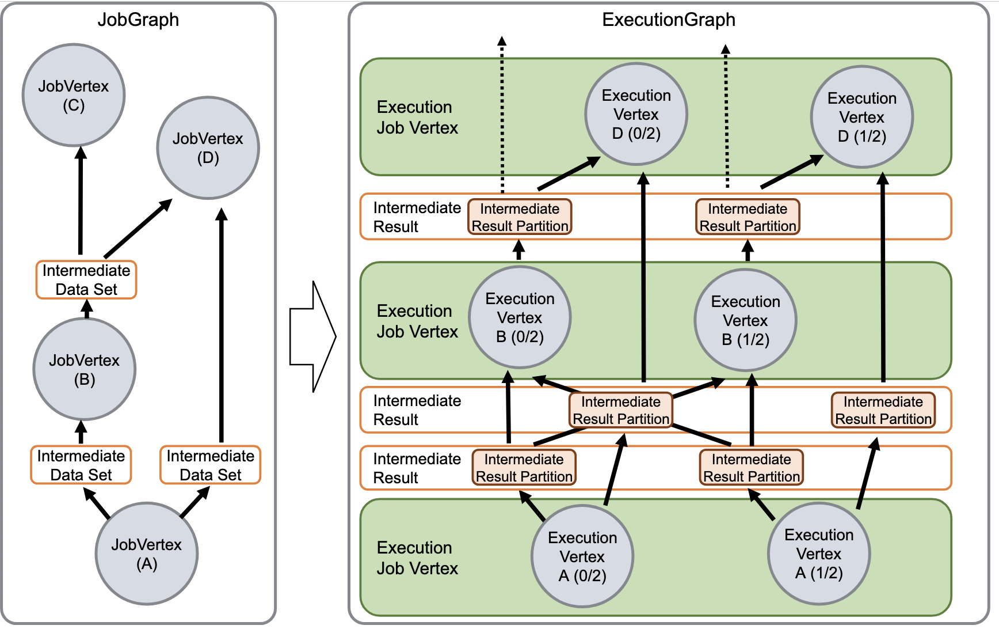

# Flink 源码 - Standalone - 探索 Flink Stream Job Submit 实现过程 - 构建 ExecutionGraph                

>Flink version: 1.17.2       

## 引言   
在之前的 Blog "Flink 源码 - Standalone - 探索 Flink Stream Job Show Plan 实现过程 - 构建 StreamGraph" 和 "Flink 源码 - Standalone - 探索 Flink Stream Job Show Plan 实现过程 - 构建 JobGraph" 讲解了 Flink Job Main() Stream API 转成 StreamGraph，再转成 JobGraph 流程，此时，不知道你是否跟我一样，有种兴奋感觉，那种离真相越来越近的感觉。      

我们需要引述官网的一段介绍来引入该篇 Blog的主题：       
>###  JobManager Data Structures #
>During job execution, the JobManager keeps track of distributed tasks, decides when to schedule the next task (or set of tasks), and reacts to finished tasks or execution failures.  

>The JobManager receives the JobGraph , which is a representation of the data flow consisting of operators ( JobVertex ) and intermediate results ( IntermediateDataSet ). Each operator has properties, like the parallelism and the code that it executes. In addition, the JobGraph has a set of attached libraries, that are necessary to execute the code of the operators.       

>`The JobManager transforms the JobGraph into an ExecutionGraph .` The ExecutionGraph is a parallel version of the JobGraph: For each JobVertex, it contains an ExecutionVertex per parallel subtask. An operator with a parallelism of 100 will have one JobVertex and 100 ExecutionVertices. The ExecutionVertex tracks the state of execution of a particular subtask. All ExecutionVertices from one JobVertex are held in an ExecutionJobVertex , which tracks the status of the operator as a whole. Besides the vertices, the ExecutionGraph also contains the IntermediateResult and the IntermediateResultPartition . The former tracks the state of the IntermediateDataSet, the latter tracks the state of each of its partitions.  

>### 翻译
>`JobManager 将 JobGraph 转换为 ExecutionGraph 。` ExecutionGraph 是 JobGraph 的并行版本：对于每个 JobVertex，它包含每个并行子任务的 ExecutionVertex。并行度为 100 的算子将有 1 个 JobVertex 和 100 个 ExecutionVertices。 ExecutionVertex 跟踪特定子任务的执行状态。来自一个 JobVertex 的所有 ExecutionVertices 都保存在 ExecutionJobVertex 中，它跟踪整个算子的状态。除了顶点之外，ExecutionGraph 还包含 IntermediateResult 和 IntermediateResultPartition 。前者跟踪 IntermediateDataSet 的状态，后者跟踪其每个分区的状态。    

  

(`https://nightlies.apache.org/flink/flink-docs-release-1.17/docs/internals/job_scheduling/#jobmanager-data-structures`)

从官网可知，`JobManager` 会将 `JobGraph` 转换成 `ExecutionGraph`, 同时它也告诉我们 ExecutionGraph 是 JobGraph的并行版本。上面的图很形象，接下来，让我们接着 Blog "Flink 源码 - Standalone - 探索 Flink Stream Job Show Plan 实现过程 - 构建 JobGraph"的内容,探索 ExecutionGraph的构建过程。      

## 创建完 JobGraph，发送请求     

refer     
1.https://nightlies.apache.org/flink/flink-docs-release-1.17/docs/internals/job_scheduling/             

