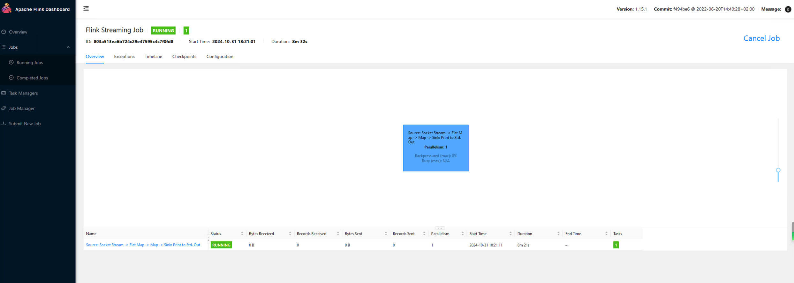

# Flink 源码 - Standalone - 探索 Flink Web UI 不展示 Source、Sink Metrics   

## 背景  
有用户在使用实时计算平台开发 Flink Job时，提交作业启动后，打开 Flink Web UI 无法看到  
   

我做了一些其他测试 case，来证实 Source、Sink 确实没有值的情况：  

### 多个算子链

### 单个算子链  

## 

查看示例作业详情，

1. 说明 Metrics 没有  

2. 通过 Metrics 可以看到   
