# Flink 源码 - Native Kubernetes - Flink Cli 脚本提交 Application Job 时的参数读取和 Log4j 配置

>Flink version: 1.15.4, Flink Job Model: Native Kubernetes Application, Kubernetes version: 1.30.8      

## 背景  
在 Flink Job 开发中，我并不是全部都在使用像 `StreamPark` 或者自研的实时计算平台管理 Job，我经常在测试 Flink Job 参数、修改 Flink 源码和添加 Log 再重新部署，会用到 Flink Cli 脚本手动提交作业，这个过程中使用 K9s工具和将重复的指令编写Shell，它们都帮我提升了不小的效率，如果你使用 `Seatunnel Runs on Flink` 也会遇到 Flink Cli，它是直接调用 Flink Cli 提交作业的。   

这里引出一个疑问点：Flink Cli 提交作业时，参数是如何传递到 Native Kubernetes Application Model Job的 ？若要修改 Log 打印级别该如何修改?（这里并非是动态修改）     
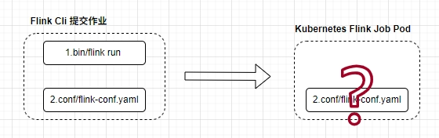    

>下面通过一个 Flink Cli 来介绍这部分。   

## Flink Cli 提交作业示例   
我的测试 Flink Job 是 Native Kubernetes Application Mode，所以我会涉及到 Kubernetes 的使用。我们通过以下官方 doc 来对环境进行配置（我是在我的 Kubernetes 集群中的 Master01 节点进行以下操作的）       
```bash
1.https://nightlies.apache.org/flink/flink-docs-release-1.15/docs/try-flink/local_installation/    
2.https://nightlies.apache.org/flink/flink-docs-release-1.15/docs/deployment/resource-providers/native_kubernetes/   
```

下面是测试脚本内容，用它提交作业创建后，我们可以观察 Flink Job 部署在 Kubernetes 的情况。     
>注意，我给作业定义的 cluster-id 为 `flink-application-test`,下面会多次涉及到它。   
```bash
[root@master01 flink15]# cat submit-application-job-kafka.sh
/root/yzhou/flink/flink-1.15.4/bin/flink  run-application \
    --target kubernetes-application \
    -Dkubernetes.namespace=flink \
    -Dkubernetes.service-account=flink-service-account \
    -Dkubernetes.cluster-id=flink-application-test \
    -Dkubernetes.pod-template-file.jobmanager=./jobmanager-pod-template.yaml \
    -Dkubernetes.pod-template-file.taskmanager=./taskmanager-pod-template.yaml \
    -Dclassloader.resolve-order=parent-first \
    -Dkubernetes.rest-service.exposed.type=NodePort \
    -c com.yzhou.flink.example.Kafka2Console \
    local:///opt/flink/artifacts/app.jar
```

### Flink Deployment 
查看 Flink Job Deployment，它的 yaml 使用了一个名称 `flink-config-flink-application-test` configmap，并且将它挂载到 Pod 的 `/opt/flink/opt`目录下，此时 Flink Job JobManager Pod, TaskManager Pod 的配置文件并非像 `Flink 官网下载的安装包一样`，如下图所示：  
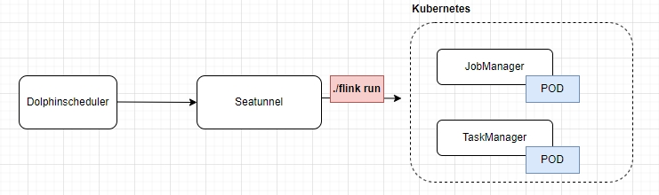    

当 Job 部署到 Kubernetes 后，JobManager、TaskManager 的 Pod /opt/flink/conf/ 目录只包含 `flink-conf.yaml`, `log4j-console.properties`, `logback-console.xml`。  
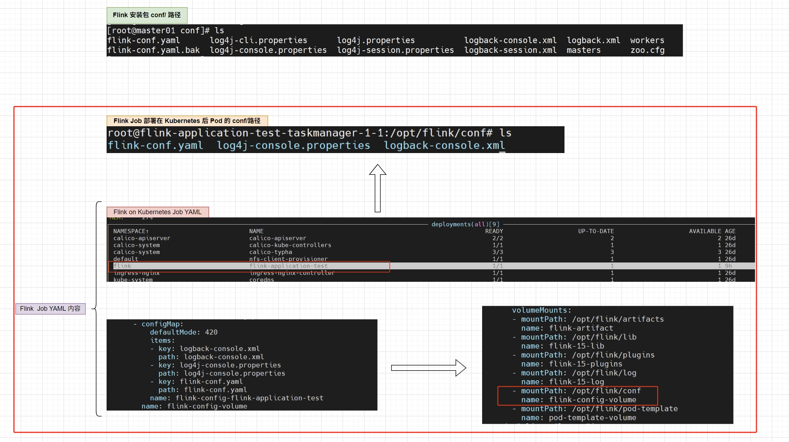    

再使用 kubectl 查看 Flink Job deployment YAML 文件内容，你可以看到 deployment 的 YAML 挂载了 `/opt/flink/conf` 路径的 `configmap`, 它定义的内容如下图：   
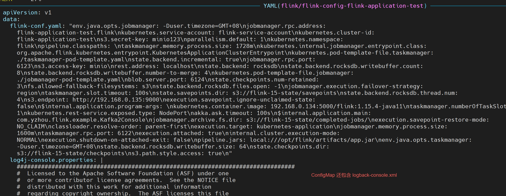    

通过以上内容了解，可以肯定的是 Native Kubernetes Application Model Job 采用的是 ConfigMap 来配置 Flink Job 的参数和 Log。这样就证实了，参数和 log并不是通过 JobManager 内部对其配置文件进行覆盖操作的。    
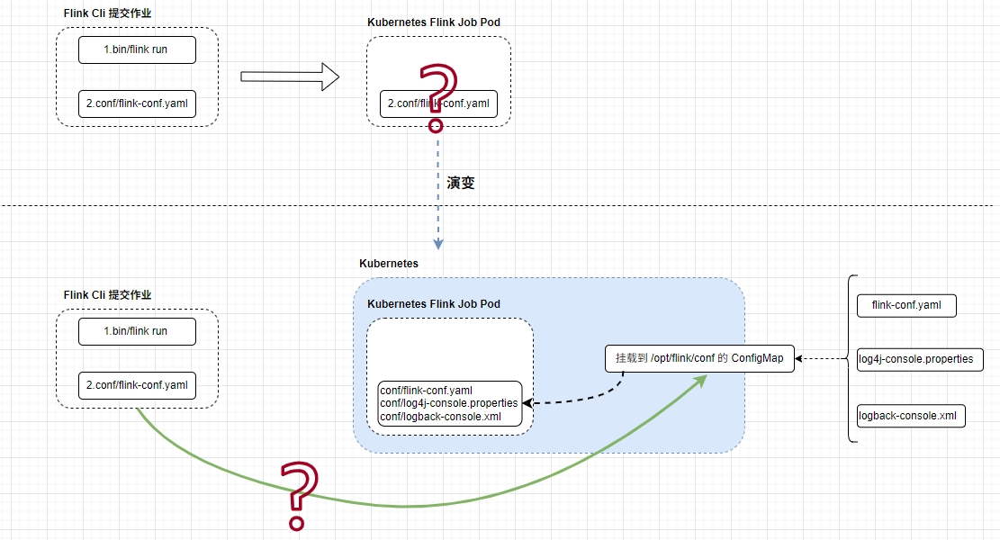 

>下面接着探索，Flink Cli 又是如何将配置参数创建成 ConfigMap 的呢？   

## 参数 & Log 转成 ConfigMap 
我们可以先回顾 Kubernetes ConfigMap 有两种常用的方式来创建。    
第一种：kubectl 使用 --from-file=file path. 指定配置文件参数。 示例如下：  
```shell
kubectl create configmap flink-conf --from-file=flink-conf.yaml=flink-conf.yaml --from-file=log4j-console.properties=log4j-console.properties --from-file=logback-console.xml=logback-console.xml
```

>可以使用 `--from-literal=key=value` 命令，直接定义 kv值。   

第二种：定义 ConfigMap YAML，将配置文件内容放在 YAML 内。 示例如下：  
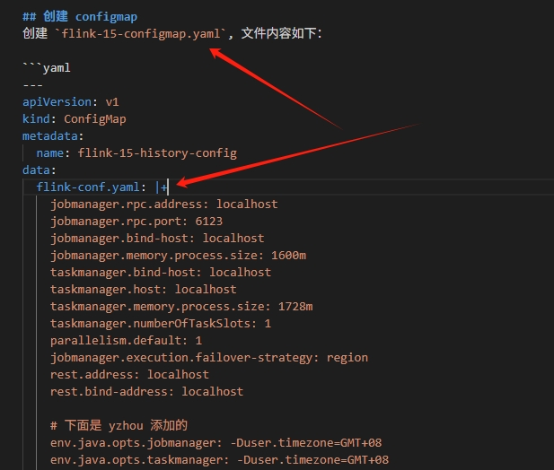   

上面的示例，是我在 Kubernetes 部署 `Flink History Server` 服务时定义的 ConfigMap，有了上一章节的介绍，你应该可以了解我的目的，毕竟 Flink History Server 不能通过 Flink Cli 提交后部署，所以，我提前手动创建好 ConfigMap。   

那我们回到 Flink Cli 源码部分。   

### 探索 ./flink run 执行流程  

**结构图**  
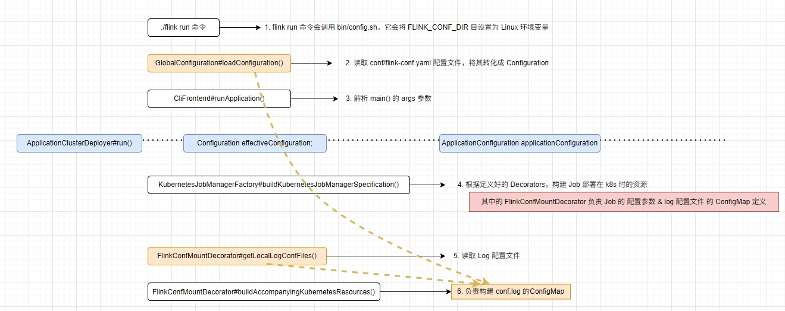     

通过 `./flink run` 执行时，脚本中会先调用 bin/config.sh, 它会将执行命令目录拼接 `conf/`字符串，设置成 `FLINK_CONF_DIR`。  
```bash
[root@master01 flink15]# cat submit-application-job-kafka.sh
/root/yzhou/flink/flink-1.15.4/bin/flink  run-application \
    --target kubernetes-application \
    -Dkubernetes.namespace=flink \
    -Dkubernetes.service-account=flink-service-account \
    -Dkubernetes.cluster-id=flink-application-test \
    -Dkubernetes.pod-template-file.jobmanager=./jobmanager-pod-template.yaml \
    -Dkubernetes.pod-template-file.taskmanager=./taskmanager-pod-template.yaml \
    -Dclassloader.resolve-order=parent-first \
    -Dkubernetes.rest-service.exposed.type=NodePort \
    -c com.yzhou.flink.example.Kafka2Console \
    local:///opt/flink/artifacts/app.jar
```

`bin/config.sh 设置 FLINK_CONF_DIR 环境变量`   
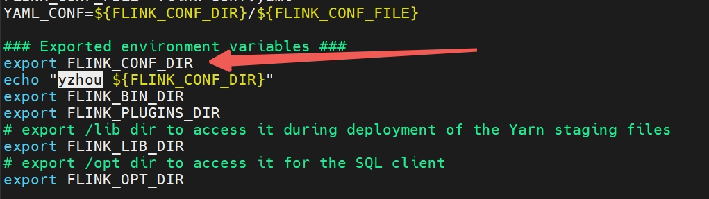

有了前面环境变量的设置，`CliFrontend#main()` 会通过环境变量设置的 conf/ 路径，读取`flink-conf.yaml`参数。 main() 方法也会解析上面 ./flink run 后面的参数。并将这两部分最后封装成 `Configuration effectiveConfiguration` 和 `ApplicationConfiguration applicationConfiguration`。 这部分的处理逻辑可参考 `CliFrontend#runApplication()`方法。   
```java
public static void main(final String[] args) {
    EnvironmentInformation.logEnvironmentInfo(LOG, "Command Line Client", args);

    // 1. find the configuration directory
    final String configurationDirectory = getConfigurationDirectoryFromEnv();

    // 2. load the global configuration
    final Configuration configuration =
            GlobalConfiguration.loadConfiguration(configurationDirectory);

    // 3. load the custom command lines
    final List<CustomCommandLine> customCommandLines =
            loadCustomCommandLines(configuration, configurationDirectory);

    int retCode = 31;
    try {
        final CliFrontend cli = new CliFrontend(configuration, customCommandLines);

        SecurityUtils.install(new SecurityConfiguration(cli.configuration));
        retCode = SecurityUtils.getInstalledContext().runSecured(() -> cli.parseAndRun(args));
    } catch (Throwable t) {
        final Throwable strippedThrowable =
                ExceptionUtils.stripException(t, UndeclaredThrowableException.class);
        LOG.error("Fatal error while running command line interface.", strippedThrowable);
        strippedThrowable.printStackTrace();
    } finally {
        System.exit(retCode);
    }
}
```

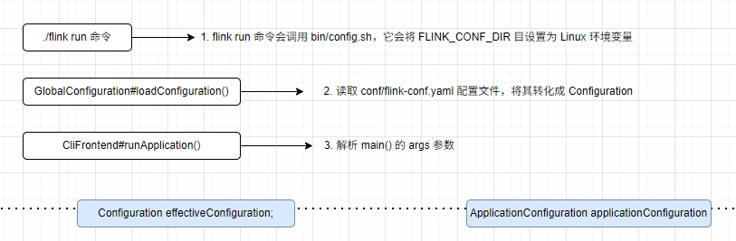        

准备好配置参数， 调用 `ApplicationClusterDeployer#run()` 开始提交 Flink Job 部署。`KubernetesJobManagerFactory#buildKubernetesJobManagerSpecification()` 方法负责构建 Kubernetes Job 所需所有资源，如下图所示，`FlinkConfMountDecorator` 对象负责构建 Job 的配置参数 & Log ConfigMap 的定义。    

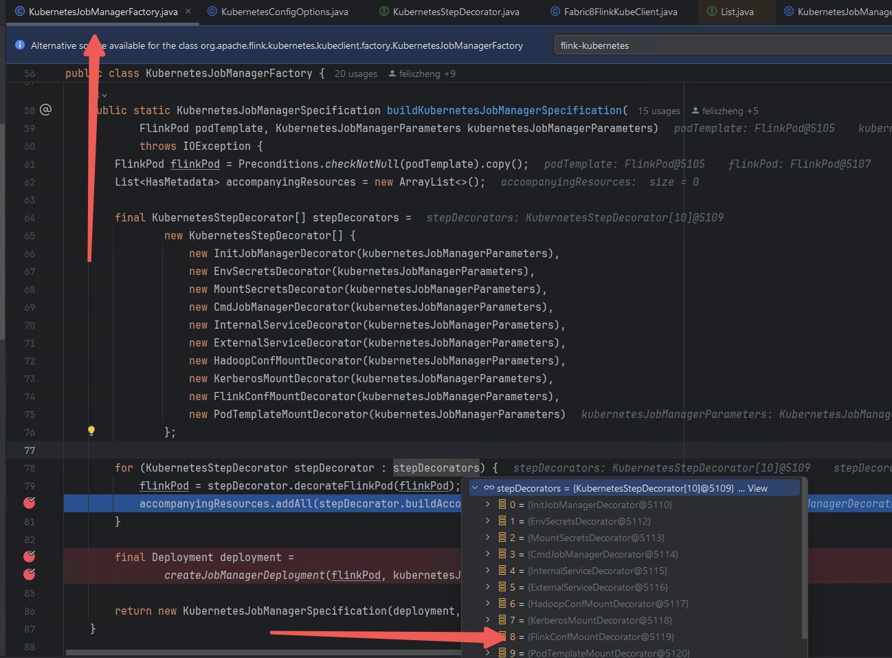      

Cli 刚运行时，读取 flink-conf.yaml, 关于 log 配置文件读取，可参考 `FlinkConfMountDecorator#getLocalLogConfFiles()`方法，它读取 `log4j-console.properties`, `logback-console.xml` 内容。  

`FlinkConfMountDecorator#buildAccompanyingKubernetesResources()`  
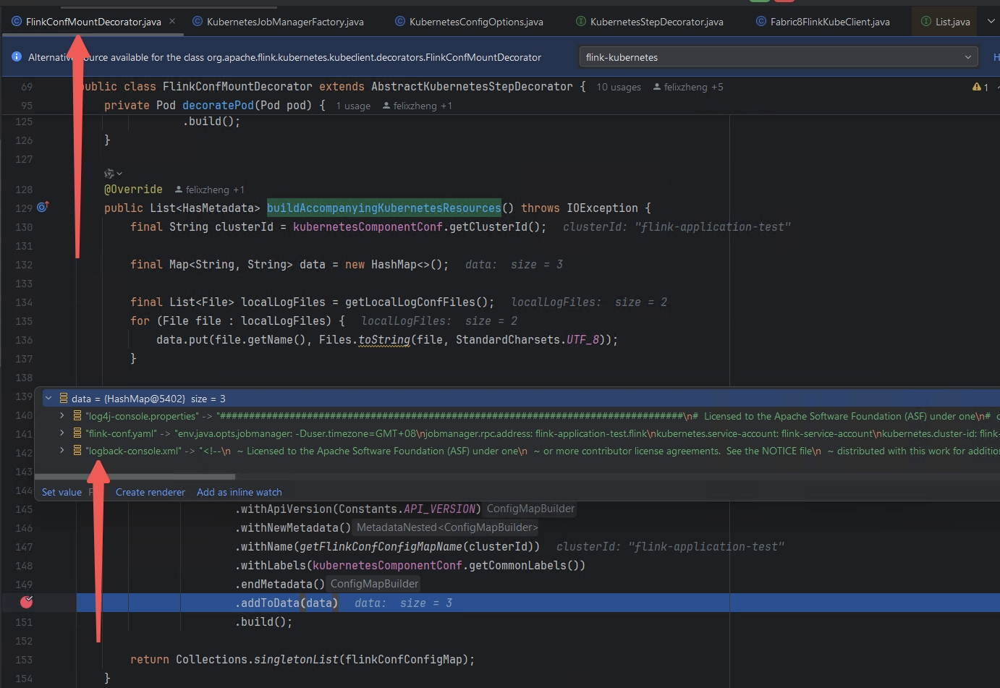   

到这里，ConfigMap 所需的3个 file，已经全部读取了。 我们也弄清楚了 JobManager, TaskManager Pod 中 conf/ 的由来。  
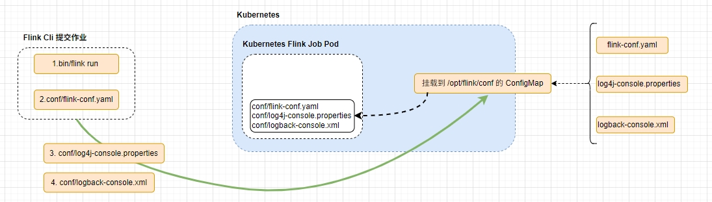    

修改 Job 参数和 Log 级别，只需要修改本地 conf/ 文件即可。   


## 背景      
自从使用像 `StreamPark` 或者自研的实时计算平台管理 Flink Job 的启停之后，使用 `Flink Cli` 脚本提交 Flink Job 场景就变得更少了， 但 `机会` 还是有的。 :)     

**1.** 学习 Flink 源码时，我会在一些代码中添加 log，来弄清楚方法的调用逻辑，这部分确实对我来说是一个不小的工程量，但修改代码、编译打包、部署 Kubernetes 集群，使用 Kubernetes 部署 Flink Job，这些对于我来说不算多大麻烦，我是想弄清楚 JobManager，TaskManager 都分别做了哪些事？ 下面我列举使用 `flink-connector-jdbc jar` 实现 `MySQL2Console` 案例。 下面是示例代码：      
```java
public class MySQL2Console {
  public static void main(String[] args) throws Exception {
    StreamExecutionEnvironment env = StreamExecutionEnvironment.getExecutionEnvironment();
    env.setRuntimeMode(RuntimeExecutionMode.AUTOMATIC);
    env.setParallelism(2);

    JdbcNumericBetweenParametersProvider jdbcNumericBetweenParametersProvider = new JdbcNumericBetweenParametersProvider(2, 1, 10);
    DataStreamSource<Row> myDataStream = env.createInput(JdbcInputFormat.buildJdbcInputFormat()
            .setDrivername("com.mysql.cj.jdbc.Driver")
            .setDBUrl("jdbc:mysql://192.168.0.201:3306/yzhou_test?serverTimezone=GMT%2B8&useSSL=false")
            .setUsername("root")
            .setPassword("123456")
            .setParametersProvider(jdbcNumericBetweenParametersProvider)
            .setQuery("select * from yzhou_test02 where id between ? and ?")
            .setRowTypeInfo(new RowTypeInfo(
                    BasicTypeInfo.INT_TYPE_INFO,
                    BasicTypeInfo.STRING_TYPE_INFO,
                    BasicTypeInfo.STRING_TYPE_INFO,
                    BasicTypeInfo.STRING_TYPE_INFO))
            .finish())
            .setParallelism(2);

    myDataStream.print().setParallelism(2);
    env.execute("mysql 2 console");
  }
}
```  

示例中是将 MySQL 数据读取后再打印，关于 MySQL 数据源是否支持并行读取，估计你和我一样比较关注，毕竟在数据量较大时，并行读取是首选的。 我创建 `JdbcNumericBetweenParametersProvider` 对象用来定义数据左右边界和步长大小，有了它们，我可以根据 `id` 来分割 MySQL 数据读取区间，例如下面 SQL 形式：     
```bash
select * from yzhou_test02 where id between 1 and 2
select * from yzhou_test02 where id between 3 and 4
select * from yzhou_test02 where id between 5 and 6 
...   
```   

通过上面形式以此来达到并发读取。 看到这里，不知道你是否跟我有差不多的疑问，上面的 Flink Jar，编译打包好后，部署在 Kubernetes中，Job 包含 JobManager，TaskManager，如下图：     
 

当读取 MySQL 的SQL 被拆分成上述多条 SQL 执行时，是谁（JobManager,TaskManager）再分发 SQL，分发逻辑是什么？ 如果是我自己写一个 MySQL 读取，那我该如何处理 `并行`，如果是我自己写，我可能还会对不同的场景下监听分发后执行结果，若结果是异常，是否需要重新分发？         

**2.** 在被其他组件调用时，会采用 Flink Cli 触发 Job 部署操作。特别典型的场景是 `Seatunnel Runs On Flink`，Seatunnel 是使用 Flink Cli 脚本触发 Job 部署 如下图：   
  
 
`Seatunnel 打印的启动脚本示例：`  
```bash
${FLINK_HOME}/bin/flink run-application --target kubernetes-application --parallelism 4 -Dkubernetes.cluster-id=xy-mysql-alluxio local:///opt/flink/seatunnel-flink-15-starter.jar -c org.apache.seatunnel.core.starter.flink.SeaTunnelFlink /opt/soft/apache-seatunnel-2.3.5/starter/seatunnel-flink-15-starter.jar --config /tmp/dolphinscheduler/exec/process/xuyi/10986792794592/15091555245440_195/279023/2182599/seatunnel_279023_2182599.conf    
```

基于上面两个场景，掌握 Flink Cli 提交作业还是很受用的。    

## 参数 和 Log  


在工作中，使用 Flink Cli 脚本提交 `Flink Native Kubernetes Application` Job 


```shell

```

refer   
1.https://nightlies.apache.org/flink/flink-docs-release-1.15/docs/try-flink/local_installation/    
2.https://nightlies.apache.org/flink/flink-docs-release-1.15/docs/deployment/resource-providers/native_kubernetes/     
