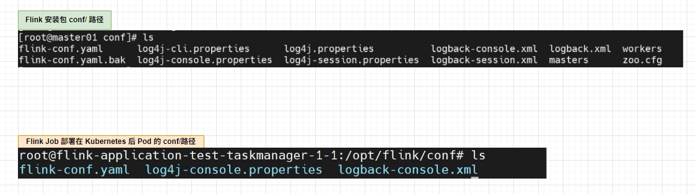

# Flink 源码 - Native Kubernetes - CLI 读取参数和配置 Log4j 

>Flink version: 1.15.4, Flink Job Model: Native Kubernetes Application, Kubernetes version: 1.30.8      

>注意，该篇 Blog

## 背景      
自从使用像 `StreamPark` 或者自研的实时计算平台管理 Flink Job 的启停之后，使用 `Flink Cli` 脚本提交 Flink Job 场景就变得更少了， 但 `机会` 还是有的。 :)     

**1.** 学习 Flink 源码时，我会在一些代码中添加 log，来弄清楚方法的调用逻辑，这部分确实对我来说是一个不小的工程量，但修改代码、编译打包、部署 Kubernetes 集群，使用 Kubernetes 部署 Flink Job，这些对于我来说不算多大麻烦，我是想弄清楚 JobManager，TaskManager 都分别做了哪些事？ 下面我列举使用 `flink-connector-jdbc jar` 实现 `MySQL2Console` 案例。 下面是示例代码：      
```java
public class MySQL2Console {
  public static void main(String[] args) throws Exception {
    StreamExecutionEnvironment env = StreamExecutionEnvironment.getExecutionEnvironment();
    env.setRuntimeMode(RuntimeExecutionMode.AUTOMATIC);
    env.setParallelism(2);

    JdbcNumericBetweenParametersProvider jdbcNumericBetweenParametersProvider = new JdbcNumericBetweenParametersProvider(2, 1, 10);
    DataStreamSource<Row> myDataStream = env.createInput(JdbcInputFormat.buildJdbcInputFormat()
            .setDrivername("com.mysql.cj.jdbc.Driver")
            .setDBUrl("jdbc:mysql://192.168.0.201:3306/yzhou_test?serverTimezone=GMT%2B8&useSSL=false")
            .setUsername("root")
            .setPassword("123456")
            .setParametersProvider(jdbcNumericBetweenParametersProvider)
            .setQuery("select * from yzhou_test02 where id between ? and ?")
            .setRowTypeInfo(new RowTypeInfo(
                    BasicTypeInfo.INT_TYPE_INFO,
                    BasicTypeInfo.STRING_TYPE_INFO,
                    BasicTypeInfo.STRING_TYPE_INFO,
                    BasicTypeInfo.STRING_TYPE_INFO))
            .finish())
            .setParallelism(2);

    myDataStream.print().setParallelism(2);
    env.execute("mysql 2 console");
  }
}
```  

示例中是将 MySQL 数据读取后再打印，关于 MySQL 数据源是否支持并行读取，估计你和我一样比较关注，毕竟在数据量较大时，并行读取是首选的。 我创建 `JdbcNumericBetweenParametersProvider` 对象用来定义数据左右边界和步长大小，有了它们，我可以根据 `id` 来分割 MySQL 数据读取区间，例如下面 SQL 形式：     
```bash
select * from yzhou_test02 where id between 1 and 2
select * from yzhou_test02 where id between 3 and 4
select * from yzhou_test02 where id between 5 and 6 
...   
```   

通过上面形式以此来达到并发读取。 看到这里，不知道你是否跟我有差不多的疑问，上面的 Flink Jar，编译打包好后，部署在 Kubernetes中，Job 包含 JobManager，TaskManager，如下图：     
 

当读取 MySQL 的SQL 被拆分成上述多条 SQL 执行时，是谁（JobManager,TaskManager）再分发 SQL，分发逻辑是什么？ 如果是我自己写一个 MySQL 读取，那我该如何处理 `并行`，如果是我自己写，我可能还会对不同的场景下监听分发后执行结果，若结果是异常，是否需要重新分发？         

**2.** 在被其他组件调用时，会采用 Flink Cli 触发 Job 部署操作。特别典型的场景是 `Seatunnel Runs On Flink`，Seatunnel 是使用 Flink Cli 脚本触发 Job 部署 如下图：   
  
 
`Seatunnel 打印的启动脚本示例：`  
```bash
${FLINK_HOME}/bin/flink run-application --target kubernetes-application --parallelism 4 -Dkubernetes.cluster-id=xy-mysql-alluxio local:///opt/flink/seatunnel-flink-15-starter.jar -c org.apache.seatunnel.core.starter.flink.SeaTunnelFlink /opt/soft/apache-seatunnel-2.3.5/starter/seatunnel-flink-15-starter.jar --config /tmp/dolphinscheduler/exec/process/xuyi/10986792794592/15091555245440_195/279023/2182599/seatunnel_279023_2182599.conf    
```

基于上面两个场景，掌握 Flink Cli 提交作业还是很受用的。    

## 参数 和 Log  


在工作中，使用 Flink Cli 脚本提交 `Flink Native Kubernetes Application` Job 


```shell

```

refer   
1.https://nightlies.apache.org/flink/flink-docs-release-1.15/docs/try-flink/local_installation/    
2.https://nightlies.apache.org/flink/flink-docs-release-1.15/docs/deployment/resource-providers/native_kubernetes/     
