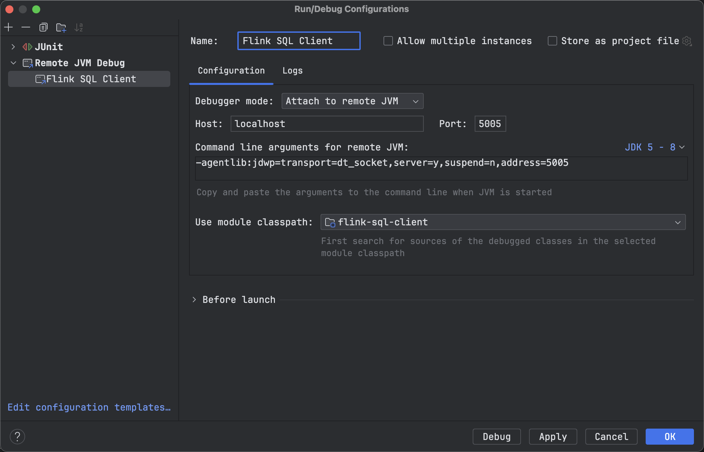

## Flink SQL Client 远程调试    

>Flink version: 1.15.4  

### 引言  
不管是开发还是生产阶段的验证，Flink 的 bin/sql-client.sh 都是验证 Flink SQL 使用`非常重要`的一环，它可将任务提交到 Flink Standalone 集群，“效率”、“低成本”的学习 Flink SQL。     

### bin/sql-client.sh 开启远程调试端口  
我们查看 bin/sql-client.sh 脚本内容：(截取核心入口类 `org.apache.flink.table.client.SqlClient` )        
```shell
# check if SQL client is already in classpath and must not be shipped manually
if [[ "$CC_CLASSPATH" =~ .*flink-sql-client.*.jar ]]; then

    # start client without jar
    exec "$JAVA_RUN" $JVM_ARGS "${log_setting[@]}" -classpath "`manglePathList "$CC_CLASSPATH:$INTERNAL_HADOOP_CLASSPATHS"`" org.apache.flink.table.client.SqlClient "$@"

# check if SQL client jar is in /opt
elif [ -n "$FLINK_SQL_CLIENT_JAR" ]; then

    # start client with jar
    exec "$JAVA_RUN" $JVM_ARGS "${log_setting[@]}" -classpath "`manglePathList "$CC_CLASSPATH:$INTERNAL_HADOOP_CLASSPATHS:$FLINK_SQL_CLIENT_JAR"`" org.apache.flink.table.client.SqlClient "$@" --jar "`manglePath $FLINK_SQL_CLIENT_JAR`"

# write error message to stderr
else
    (>&2 echo "[ERROR] Flink SQL Client JAR file 'flink-sql-client*.jar' neither found in classpath nor /opt directory should be located in $FLINK_OPT_DIR.")

    # exit to force process failure
    exit 1
fi
```

所以我们只需要在这个脚本里面加上调试参数，然后IDEA开启调试模式即可。具体步骤如下：      
```shell    
# 在 bin/sql-client.sh 添加以下内容 
JVM_ARGS=-agentlib:jdwp=transport=dt_socket,server=y,suspend=n,address=5005     
```

>注意：别忘记启动 Flink Standalone集群，`bin/start-cluster.sh`      

启动 `bin/sql-client.sh`,会看到以下内容：   
```shell
[root@yzhou bin]# ./sql-client.sh 
Listening for transport dt_socket at address: 5005
``` 

### IDEA 配置   
添加 `Remote JVM Debug` 启动项， `-agentlib:jdwp=transport=dt_socket,server=y,suspend=n,address=5005`, `Use module classpath`: flink-sql-client。   

        

配置后，在 `CliClient#getAndExecuteStatements()方法`打上断点，然后在 bin/sql-client.sh 输入 `select 1`, 开始远程调试 Flink SQL 之路。     


refer   
1.https://cloud.tencent.com/developer/article/2101186       