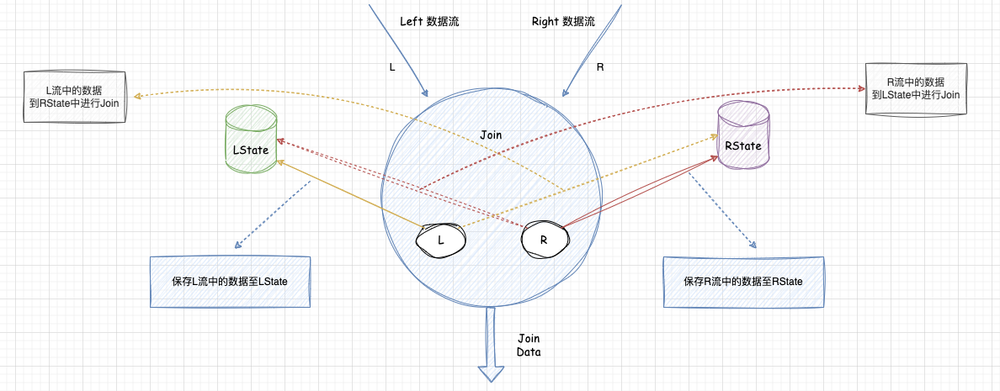

## Flink SQL 双流 Join 底层原理

### 介绍    

  

在Flink SQL中，无论是ININER JOIN是OUTER JON (Left、Right、Full), 都需要对左右两边的数据流进行保存，两边的数据流对应的就是 Left数据流和Right数据流，简称为L和R。 此时JOIN 底层对应的会有两个State来存储两边数据流里面的数据, 在这里可以称之为LState和RState。    

其中LState中存储左边数据流中的数据,RState存储右边数据流中的数据，左右两边的数据流到来的时候会进行如下操作： 
* 1.左边数据流中的数据到达的时候,会存储至LState中。并且到RState中进行Join。   
* 2.然后将Join之后生成的结果数据发送到下游。右边数据流中的数据到达的时候会存储到RState中。并且到LState中进行Join，  
* 3.然后将Join之后生成的结果数据发送到下游。这祥就实现了Flink SQL的双流Join。   

>在这里有一点大家需要注意：由于Flink SQL底层是一个分布式的计算引擎, 分布式计算引擎中的数据在进行Join操作的时候会产生`Shuffle`,那么它是怎么保障左右两边流中需要进行Join的数据 会在相同的节点进行处理呢？ 在双流Join的场景中, FlinkSOL会利用JOIN中ON的关联条件分区，把相同关联条件的数据分发到同一个分区里面, 这样可以确保两个流中相同关联条件的数据会在同一个节点中进行处理。   

