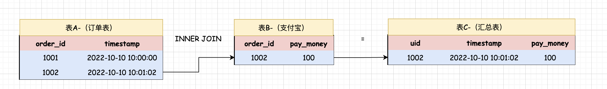
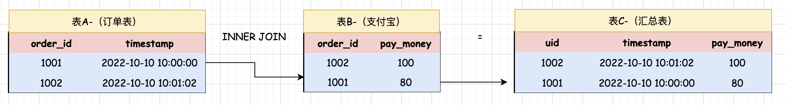
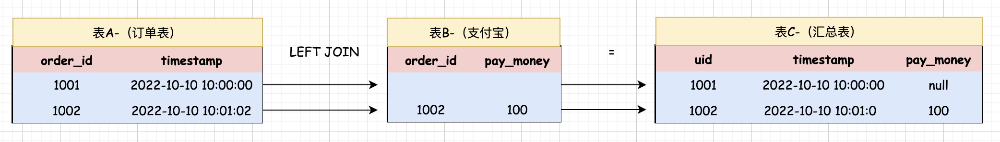
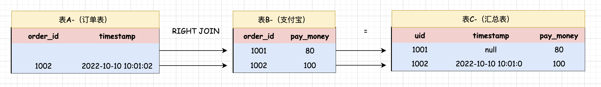
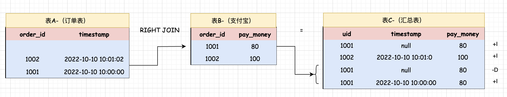
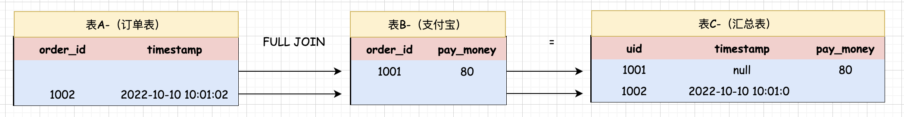

## Regular Join(普通Join)  

### 介绍    
* 普通 Join 其实就是常规的双流 Join，通过关联条件去关联两条实时数据流,对应的其实就是Flink SOL中的两个动态表的Join   

* 普通 Join 支特常规的 Inner Join 和 Outer Join。 Outer Join 对应的就是 Left Join, Right Join 和 Full Join。        

### Inner Join 
`Inner Join在SQL语句中可以简写为Join, 在双流Join时，只有左右两边数据流中的数据都关联上了,才会输出结果 +[L,R], 结果中会包含这两条流中的数据。`          

#### Inner Join 执行流程    
Inner Join 的执行流程,看下面示例图，这里面有三个流表或者说是动态表  
      

表A 和表B 属于两个业务表,表C属于结果表。 表A 中存储的是平台中用户的订单数据,表B 中存储的是平台中用户的支付数据，表C 中存储的是订单数据和支付数据关联之后的结果数据，针对表A 和 表B 他们其中任何一个表中有数据到达时都会主动到另外一个表中进行关联查询,是否有匹配的数据。 当表A 中第一条数据1001 到达时会主动到表B中进行关联查询，但是没有关联到数据,所以不输出结果，当表A 中第二条数据1002 到达时或者是表B 中的1002 这条数据到达时，都会主动到另一张表中关联查询,此时是可以关联到的，所以输出这个结果（1002，2022-10-10 10:01:02,100), 当表B 中的1001 这条数据到达时会主动到表A中进行关联查询。         
    

此时可以关联到数据，最终会输出这个结果（1001，2022-10-10 10:00:00,80), 这就是普通 Join 中 Inner Join 的执行效果,最后还需要注意一点：`Inner Join 不会产生回撤流`  

### Out Join    
* Left Join(Left Outer Join) 它属于简写形式，完整写法是Left Outer Join      

在双流 Join 时,只要左边数据流中的数据到达了。`无论是否关联到右边数据流中的数据都会输出结果`。
1.如果关联到右边数据流中的数据了,则输出完整的结果 +[L,R]。      
2.如果没有关联到右边数据流中的数据, 则会使用 null 进行补全, 然后输出 +[L,null] 。        
3.当右边数据流中的数据到达之后，也会到左边的数据流中进行关联 , 如果发现左边数据流之前输出过没有关联到的数据则会产生回徹流,将之前使用 null 补全的数据回撤掉 -[L,null] ,最后再重新输出关联后的数据 +[L,R]      

* Right Join(Right Outer Join)  它属于简写形式，完整写法是Right Outer Join  

在双流Join时, 他的执行逻辑和Left Join 正好相反。 

* Full Join(Full Outer Join) 它属于简写形式，完整写法是Full Quter Join。        

双流Join时。左边或者右边数据流中数据到达了之后,无论是否关联到另一侧数据流中的数据，都会输出结果。 针对左边的数据流来说, 如果关联到了右边数据流中的数据，则输出 +[L,R] , 如果没有关联到。则输出 +[L,null]，针对右边的数据流来说，如果关联到了左边数据流中的数据, 则输出 +[L,R], 如果没有关联到，则输出 +[null,R], 针对这些没有关联的数据, 后期当数据到达之后，会产生回撤流, 将之前包含 null 的数据回撤掉, 再补全输出完整结果。   

#### Left Join 的执行流程       
这里面的示例表还是之前在 Inner Join的执行流程提到的表A，表B和表C这三张表。      
      

唯一的区别就是将之前的 INNER JOIN 换成了 LEFT JOIN,此时当表A 中第一条数据1001 到达时会主动到表B 中进行关联查询，没有关联到数据，但是这里使用的是 LEFT JOIN,虽然没有关联上也会输出结果，只不过`缺失`的字段会使用 null 进行补全，所以说输出的结果就是这样。当表A 中第二条数据1002 到达时,如果表B 中的1002 这条数据已经到达，则可以关联上输出结果。如果表B 中的1002 这条数据比表A 中的1002 这条数据先到则不会输出结果，因为这是 Left Join，表中的1002 到表A 中关联不到就不会输出结果了。   

接下来，当表B 中的1001 这条数据到达的时候，会主动到表A 中进行关联查询，但是此时他发现表A 中的那条数据之前已经输出过结果了，只不过结果中关于表B 中的数据字段使用的是null。所以此时呢，它会产生一个回撤流，将之前输出的包含了null 的数据回撤掉`-D`,再重新输出完整的结果数据 `+I` ,这就是普通 Join 中 Left Join的执行流程,最后还需要注意一点：`Left Join 是会产生回撤流`     

>在这大家可能会有一个疑问，为什么这里在实现数据更新的时候,使用的是 -D 和 +I，而不是使用 -U 和 +U 呢？  
分析回撤流的时候介绍过通过 -U 回撤数据, 这里使用的却是 -D。     // TODO

#### Right Join 的执行流程  
这里面的示例表还是之前的表A 表B和表C这三张表。      
      

唯一的区别就是将之前的 LEFT JOIN 换成 RIGHT JOIN，当表B 中的1001 这条数据到达的时候，会主动到表A 中进行关联查询，没有关联到数据，但是现在使用的是RIGHT JOIN, 虽然没有关联上，也会输出结果，只不过缺失的数据字段会使用 null 进行补全,所以输出结果就是这样。 当表B 中的第二条数据1002 达到时, 如果表A 中的1002这条数据已经到达了，则可以关联上输出结果。如果表A 中的1002 这条数据比表B 中的1002 这条数据先到则不会输出结果，因为这是Right Join，表A 中的1002 到表B 中关联不到就不会输出结果了 。          

接下来，当表A 中的1001 这条数据到达的时候，会主动到表B 中进行关联查询，但是此时他发现表B 中的那条数据之前已经输出过结果了, 只不过结果中的关于表A 中的数据字段使用的是null。所以此时呢，它会产生一个回撤流, 将之前输出的包含了 null 的数据回撤掉 -D，再重新输出完整的结果数据 +I ,这就是普通 Join 中 Right Join的执行流程，最后还需要注意一点：`Right Left 也是会产生回撤流`   
          

#### Full Join 的执行流程       
这里面的示例表还是之前的表A 表B和表C这三张表。  

将之前的 RIGHT JOIN 换成 FULL JOIN, 当表B 中的1001 这条数据到达的时候,会主动到表A 中进行关联查询，没有关联到数据，但是现在使用的 FULL JOIN, 虽然没有关联上，也会输出结果，只不过缺失的数据字段会使用 null 进行补全。当表A 中1002 这条数据到达的时候会主动到表B 中关联查询，没有关联到的数据，这里使用 FUll JOIN，虽然没有关联上也会输出结果，只不过缺失的数据字段会使用 null 进行补全。     

接下来，当表A 中的1001 这条数据到达的时候，会主动到表B 中进行关联查询, 但是此时他发现表B 中的那条数据之前已经输出过结果了，只不过结果中关于表A 中的数据字段使用的是 null，所以它会产生一个回撤流, 将之前输出的包含了 null 的数据回撤掉 -D，重新输出完整的结果数据 +I，当表B 中的1002 这条数据到达的时候会主动到表A 中进行关联查询，但是此时他发现表A 中的那条数据之前已经输出过结果了，只不过结果中关于表B 中的数据字段使用的是 null。所以此时它也会产生一个回撤流，将之前输出的包含了 null 的数据回撤掉 -D,再 重新输出完整的结果数据 +I, 这就是普通 Join 中 Full Join的执行过程，最后还需要注意一点：`Full Join 也会产生回撤流`。  

