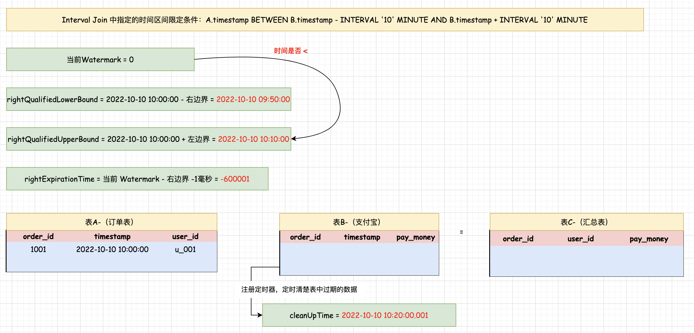
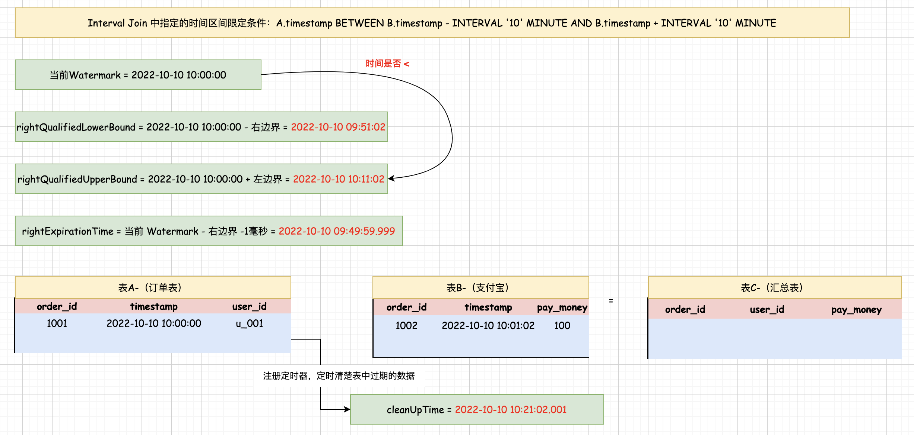
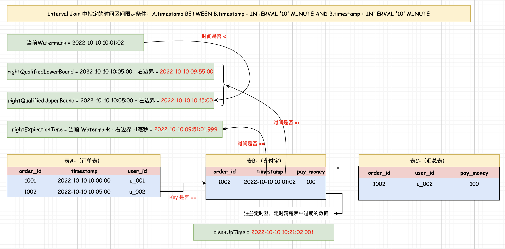
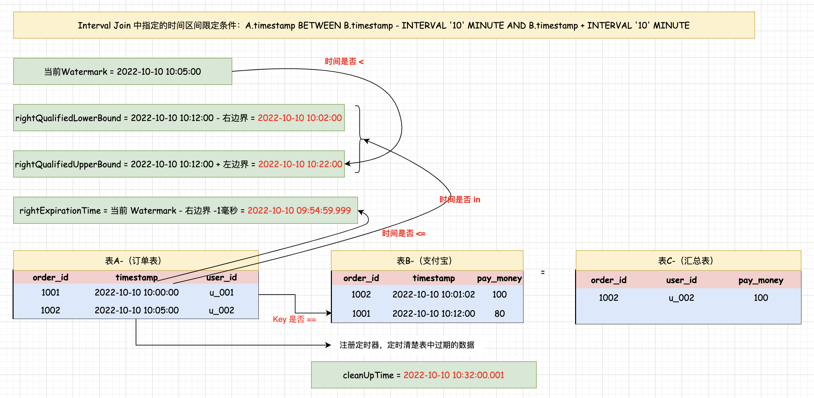

## Flink SQL 时间区间 Join(Interval Join) 执行流程

### 流程介绍 
在使用时间区间 Join 的时候，在 Join 后面的关联条件中,除了需要指定 key 值的关联条件之外，还需要指定一个时间区间限定条件。 在这个图里面，key 值的关联条件其实就是表 A 中的 order_id 等于表 B 中的 order_id。 对应的时间区间限定条件是左右边界都是10分钟, 简单来说就是在关联数据的时候。表 A 只会关联表 B 中前后10分钟肉的数据,超过这个时间区间的数据就关联不上了。    

在这大家可能会有一个疑问: 假设表A 中来了一条数据，对应的时间是10:00:00, 怎么知道表 B 中时间是多少, 表 A 和表 B 在建表时都会通过`Watermark`定义一个时间水位线, 可以使用`处理时间或者事件时间`, 然后以这个水位线时间为基准进行时间区间关联，简单来说: 表 A 和表 B 时间是多少是由Watermark决定，它会根据表中接收到的数据时间来进行计算, 注意:这里的时间区间限制条件需要根据实际需求设置，不一定和案例中一样，根据实际业务需求限制一个时间区间即可。            

时间区间JOIN在执行的时候，会用到一些时间变量, 下面我们先来分析一下。            
* 首先，第一个:当前Watermark, 按照建表语句中关于 Watermark 的定义格式,生成当前两个数据流的 Watermark，然后获取两个数据流里面目前最大的 Watermark 作为当前 Watermark。 初始化的时候当前 Watermark 的值为0。  

`rightQualifiedLowerBound` 可以翻译为右流下边界，根据左流中当前数据自身的时间减去时间区间限定条件里面右边界的时间(+ 10分钟)，得到右流中允许关联时间区间下边界, 左流中的数据和右流中的数据进行关联的时候会根据这个参数的值限制右流中数据的时间区间的下边界。 注意，当右流来数据的时候会计算 `leftQulifiedLowerBound` 可以翻译为左流下边界，此时会根据右流中数据自身的时间减去时间区间限定条件里面左边界的时间（-10分钟），得到左流中允许关联的时间区间的下边界。右流中的数据和左流中的数据进行关联的时候，会根据这个参数的值限制左流中数据时间区间下边界`rightQulifiedUpperBound` 可以翻译为右流上边界。 根据左流中当前数据自身的时间加上时间区间限定条件里面左边界的时间（-10分钟），得到右流中允许关联时间区间上边界。左流中的数据和右流中的数据进行关联的时候，会根据这个参数的值限制右流中数据的时间区间的上边界。注意：当右流来数据的时候会计算`leftQualifiedUpperBound` 可以翻译为左流上边界。此时会根据右流中的数据自身的时间加上时间区间限定条件里面右边界的时间（+10分钟），得到左流中允许关联时间区间上边界。 右流中的数据和左流中的数据进行关联的时候,会根据这个参数的值限制左流中数据的时间区间的上边界。    

`rightExpirationTime`: 根据当前的 watermark 计算另一个数据流中允许数据过期的最小值,其实就是为了在和另一边数据流里面的数据进行 join 的时候判断另一边数据流中的数据是不是比指定时间区间的下边界还要小, 如果是则说明数据已经过期了,后期不可能再关联到了，需要从状态中清除。在清除的时候会判断当前SQL的 JOIN 方式是不是 Outer Join，如果是，则将缺失的字段置为 null 输出结果。如果是 INNER Join，则只会将数据从状态中清除不会输出结果。注意： 当左流中来数据的时候，会计算右流中数据过期时间的最小值 `rightExpirationTime`,因为在 Join 的时候，左流中的这条数据会和右流中相同 key 的数据挨个进行对比，对比的时候会判断右流中的数据是不是过期了。当右流中来数据的时候，会计算左流中数据过期时间的最小值 `leftExpirationTime`, 因为在Join 的时候，右流中的这条数据会和左流中相同 key的数据挨个进行对比，对比的时候会判断左流中的数据是不是过期了。    

`cleanUpTime` 计算定时清理过期数据的时间，然后设置一个定时器,这个时间是由一个公式得到的。当前数据自身的时间 + 时间区间限定条件里面上边界的时间或者下边界的时间 + 最小清除时间间隔 + allowedLateness + 1。 其中最小清除时间间隔 = (时间区间限定条件里面的上边界 + 下边界)/2。 其中 `allowedLateness` 默认是0。   

### 案例分析        
下面来根据数据流程，来具体分析: 
   

#### 左流 第一条数据进来 
图中示意：表 A是左流,表 B 对应的是右流，此时左流中进行了一条数据, 数据自身的时间是2022-10-10 10:00:00, 所以此时可以计算出右流中允许关联的时间区间的下边界09:50:00和上边界10:10:00, 此时当前 watermark = 0 ,所以右流中允许数据过期的最小值是(0-10分钟-1毫秒) = -600001毫秒, 由于是第一条数据进来，不会出现数据过期, 所以会得到一个负数的时间，不影响程序的逻辑性，此时根据左流中key=1001 这条数据到右流的状态中关联数据，发现关联不到，因为右流中还没有接受到key=1001的数据。        

接下来会判断当前 Watermark 是否小于右流中允许关联的数据时间区间上边界,如果小于，则说明左流中的这条数据后期还可以会和右流中的数据进行关联。那当前 Watermark的值为0, 右流中允许关联的数据时间区间上边界为10:10:00, 所以小于，满足条件。因此在这里会把左流中接收到的这条数据存储到左流的状态中,然后还会判断右流中目前是否有定时器，如果没有，则给右流注册一个定时器,定时器触发的时间是10:20:00.001, 当后期任意一个流中 Watermark的值大于等于这个定时器指定的时间的时候，定时器会触发执行,在执行的时候会清除左流状态中过期的数据。 如果发现当前 Watermark,大于右流中允许关联的数据时间区间上边界，说明左流中的这条数据迟到了,就不会把这条数据存储到左流的状态中了，同时会判断当前SQL JOIN的类型是否是 LEFT JOIN 或者 FULL JOIN， 如果是，则将缺失的字段置为 NULL 输出结果数据。这就是第1条数据进来的时候它的执行流程。      

#### 右流 第一条数据进来
那接下来我们来看下图， 此时右流中进来了1条数据  
   

数据自身的时间是10:01:02, 所以可以计算出左流中允许关联的数据的时间区间的下边界09:51:02 和上边界 10:11:02。 此时当前 Watermark 的值为 10:00:00,所以左流中允许数据过期的最小值是（10:00:00 - 10分钟 -1毫秒) = 09:49:59.999。 此时根据右流中key =1002 的数据到左流的状态中关联数据发现关联不到，因为左流中还没有接受到key=1002数据。接下来判断当前 Watermark 是否小于左流中允许关联的数据的时间区间上边界。当前 Watermark为 10:00:00, 左流中允许关联的数据的时间区间上边界为：10:11:02, 条件满足。所以右流中的这条数据后期还可以和和左流中的数据进行关联,因此在这里会把右流中收到的这条数据存储到右流的状态中。 然后给左流注册1个定时器,定时器触发的时间是10:21:02.001, 当后期任意一个流中 Watermark 的值大于等于这个定时器指定的时间的时候,定时器会触发执行，在执行的时候会清除右流状态中过期的数据。     

>注意，根据前面的分析我们可以知道，当左流中进来数据的时候，会获取到右流中相同key 的数据进行关联，关联时会判断右流中相同key 的数据是否满足对应的时间区间,如果不满足，则会被从右流的状态中清除。同时判断是否是RIGHT JOIN,FULL JOIN, 如果是，则将缺失的字段置为NULL，输出结果数据。 当右流中进来数据的时候会获取左流中相同key 进行关联，关联时会判断左流中相同key 是否满足对应时间区间, 如果不满足，则会被从左流的状态中清除。同时判断是否是 LEFT JOIN,FULL JOIN，如果是，则将缺失的字段置为NULL，输出结果数据。 

针对当前案例来说，如果后期左流接收到了 key=1002 的数据,则会和右流中key=1002的数据进行关联，判断数据是否满足对应的时间区间, 如果不满足，则会被从右流的状态中清除。如果左流一直都没有接受到key=1002的数据, 那么右流中 key=1002 的这条数据岂不是会一直存储在右流的状态中？ 那如果在实际业务中有很多这种数据呢？ 这样会导致右流的状态变得很大, 但是状态中的这些数据其实都是超时无法关联的数据,保留在状态中没有任何意义。所以此时定时器对应的数据清除功能就有意义了，只要后期两个数据流中任意一个数据流的 Watermark 的值大于等于定时器对应的时间，则定时器就会触发执行, 在触发的时候会清除对应数据流的状态中过期的数据。针对此案例而言，就算后期左流一直没有接受到key=1002的数据，右流中key=1002的数据也会在任意一个数据流的 Watermark 大于等于 10:21:02.001 的时候触发定时器的数据清除功能，实现过期数据清除，这就是第2条数据进行的时候底层的执行流程。         

#### 左流 第二条数据过来
接下来，我们来看下图，此时左流中进来了一条数据，数据自身的时间是10:05:00  
    

所以可以计算出右流中允许关联的数据的时间区间下边界：09:55:00 和上边界: 10:15:00。此时当前 Watermark 值为: 10:01:02。所以右流中允许数据过期的最小值是 09:51:01.999。此时根据左流中 key=1002 这条数据到右流的状态中关联数据，是可以获取到右流状态中 key=1002 的数据的。获取到右流状态中 key=1002 的数据之后,会挨个进行判断，可能获取到多个。这个案例右流的状态中就只有一个key=1002的数据。 判断的时候首先会判断右流中 key=1002 数据自身时间是否在右流中允许关联的数据时间区间下边界和上边界之中, 在这里发现这个时间条件是满足的,满足之后其实就可以进行关联输出了，不过底层真正在执行关联输出的时候还会对两条数据的key值再做一次判断，确认是不是相等, 如果相等就会输出关联后的结果了, 所以最后会在结果表中看到关联输出的结果。 接下来还会判断右流中key=1002的数据的自身时间是否小于等于右流中允许数据过期的最小值, 如果满足条件就说明这条数据过期了，需要清除, 在这里发现这条数据不满足条件，所以暂时不会从有流状态中清除key=1002的这条数据。 接下来还会继续判断当前 Watermark 是否小于右流中允许关联的数据的时间区间上边界, 当前Watermark 值为: 10:01:02, 右流中允许关联的数据的时间区间上边界为: 10:15:00。条件满足, 所以左流中的这条数据后期还可能和右流中的数据进行关联, 因此在这里会把左流中收到的这条数据存储到左流的状态中。然后给右流注册一个定时器，定时器触发的时间是: 10:25:00.001。当后期任意一个流中 Watermark 的值大于等于这个定时器指定的时间的时候,定时器会触发执行，在执行的时候会清除左流状态中过期的数据。 这就是第3条数据进来的时候它的执行流程。    
    
#### 右流 第二条数据过来
接下来，我们来看下图，此时右流中进来了一条数据,数据自身的时间是 10:12:00 
        

可以计算出左流中允许关联数据时间区间下边界: 10:02:00 ,数据自身时间是10.12:00，可以计算出左流中允许关联数据时间区间下边界10:02:00 和上边界 10:22:00。此时当前 Watermark 值为 10:05:00, 所以左流中允许数据过期的最小值是: (10:05:00-10分钟-1毫秒)=09:54:59.999。 

此时根据右流中key=1001这条数据到左流的状态中关联数据，是可以获取到左流状态中 key=1001 的数据的。那获取到左流状态中 key=1001 的数据之后，会挨个进行判断, 这个案例里面左流的状态中就只有一个key=1001的数据。 他判断的时候首先会判断左流中 key=1001 数据自身时间是否在左流中允许关联数据时间区间下边界和上边界之中。 在这里发现这个时间条件是不满足的，因为这条数据自身的时间比允许关联的数据的时间区间的下边界还要小,不满足的时候就不会关联输出结果了。 那接下采还会判断左流中 key=1001 的数据的自身时间是否小等等于左流中允许数据过期的最小值。 在这里发现这个条件是不满定的,所以暂时不会从左流状态中清除key=1001的这条数据。            

接下来还会继续判斯当前 Watermark 是否小于左流中允许关联的数据的时间区间上边界。当前 Watermark 值为: 10:05:00 ,左流中充许关联的数据的时间区间上边界为: 10:22:00, 条件满足，所以右流中的这条数据后期还有可能和左流中的数据进行关联，因此在这里会把右流中收到的这条数据存储到右流的状态中, 然后给左流注册一个定时器, 定时器触发的时间是10:32:00.001。 当后期任意一个流中 Watermark 的值大于等于这个定时器指定的时间的时候,定时器会触发执行, 在执行的时候会清除右流状态中过期的数据， 这就是第4条数据进来的时候 它的执行流程。

分析到这里我们其实就了解了时间区间Join(IntervalJoin) 整个的执行流程, 无论是INNER JOIR,LEFT JOIN , RIGHT JOIN还是FULL JOIN，底层都是这个执行流程, 唯一的区别就是在数据过期的时候，只有当SQL JOIN的类型是OUTER JOIN的时候, 才会将缺失的字段置为NUL，
输出没有关联到的结果数据。  

>注意，复习Flink 中 Watermark 水印解决数据乱序的内容。      
