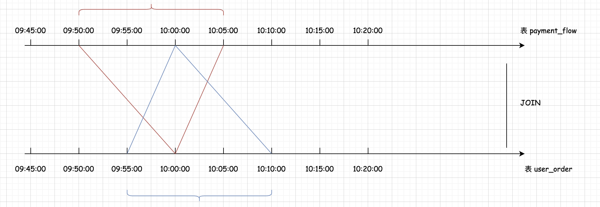
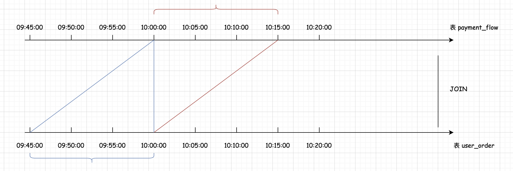

## Flink SQL 时间区间 Join（Interval Join） 左边界 + 右边界   

### 引言    
在大多数场景下，左边界和有边界的区间范围是相等的，如果左边界和右边界指定的时间范围不一样呢？    

```sql
SELECT 
  uo.order_id,
  uo.user_id,
  pf.pay_money
FROM user_order AS uo 
[INNER | LEFT | RIGHT | FULL] JOIN payment_flow AS pf
ON uo.order_id = pf.order_id
-- 指定取值的时间区间   
AND uo.d_timestamp 
  BETWEEN pf.d_timestamp - INTERVAL '5' MINUTE -- 左边界
  AND pf.d_timestamp + INTERVAL '10' MINUTE -- 右边界
``` 

看上面这个案例 SQL 指定的左边界为5分钟，右边界为10分钟，此时两个表在关联数据的时候如何计算另一边数据流中的时间区间？     

        

假设表 user_order 中在 10:00:00 的时候进来了一条数据，那么它会和表 payment_flow 中 09:50:00 到 10:05:00 之间的数据进行关联。假设表 payment_flow 中在 10:00:00 的时候进来了一条数据，那么它会和 表 user_order 中 09:55:00 到 10:10:00 之间的数据进行关联。此时我们需要注意数据区间的计算公式,左流和右流的时间区间计算公式是不一样的。(请参考 Flink 源码 TimeIntervalJoin#processElement1(),TimeIntervalJoin#processElement2())       

### 案例    
接下来我们通过一个实际案例来看一下 SQL 中左边界和右边界应该如何指定？       
**背景是这样的:**       
用户在平台下单后，会在订单表中产生1条数据，平台限时15分钟内必须支付，否则会取消订单,那这时候呢，我们希望在订单数据流中关联支付数据流, 那么 SQL 中对应的时间区间限定条件应该如何设置才能满足这个需求呢？     

针对当前需求，我们可以知道支付表中的数据会比订单表中的数据晚15分钟，所以当订单表中进来数据的时候会和支付表中后15分钟内的数据进行关联。当支付表中进来数据的时候会和订单表中前15分钟内的数据进行关联。 我们可以画一个图： 
        

注意：这里面的订单表就是 user_order, 支付表就是 payment_flow        

假设表 user_order 中在10:00:00 的时候进来了一条数据，那么它会和表 payment_flow 中的10:00:00 到 10:15:00 之间的数据进行关联。因为支付表中的数据最多会晚15分钟。假设表 payment_flow 中在 10:00:00 的时候进来了一条数据，那么它会和表 user_order 中 09:45:00 到 10:00:00 之间的数据进行关联,因为订单表中的数据最多会早15分钟，那这样是满足需求的, 因为表 payment_flow 中的数据会比 user_order 中的数据晚,最多晚15分钟 。   

根据图中的时间轴结合左流和右流时间区间上下边界的计算公式,反推出 SQL 中需要指定的时间范围。 表 user_order 中在10点的时候进来了1条数据为例进行分析, 此时表 payment_flow 中的允许关联的数据流的下边界（rightQualifiedLowerBound）= 10:00:00 - SQL中的右边界 = 10:00:00。 所以 SQL 中的右边界为 0。此时表 payment_flow 中的允许关联的数据流的上边界(rightQualifiedUpperBound) = 10:00:00 + SQL中的左边界 = 10:15:00。 所以 SQL 中的左边界为15。最终我们可以得到完整的SQL语句是这样的： 左边界： 15，右边界为 0 
```
SELECT 
  uo.order_id,
  uo.user_id,
  pf.pay_money
FROM user_order AS uo 
[INNER | LEFT | RIGHT | FULL] JOIN payment_flow AS pf
ON uo.order_id = pf.order_id
-- 指定取值的时间区间   
AND uo.d_timestamp 
  BETWEEN pf.d_timestamp - INTERVAL '15' MINUTE -- 左边界
  AND pf.d_timestamp                -- 右边界
```


