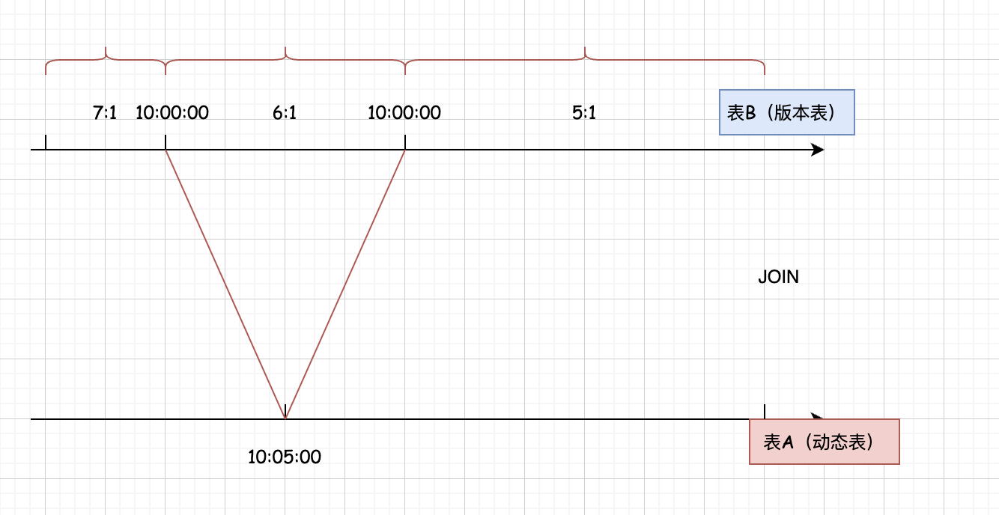

## Flink SQL 时态/快照 Join(Temporal Join)      

### 介绍 
Temporal Join，可以翻译为时态 Join 或者快照 Join, 在离线数据分析中其实是没有快照 Join 这种概念的,但是离线数据分析中为了保存数据的历史变化情况, 经常会维护一种表: `拉链表`。 使用一个普通的明细表去join 这个拉链表的方式就叫做快照 Join。    

Flink SQL中有一种表叫做 `Versioned Table 版本表`。 使用一个明细表去 join 这个版本表的方式就叫做快照 Join。在快照 Join 中，版本表其实就是对同一条 key 的历史版本进行维护, 当有明细表 join 这个版本表时可以根据明细表中的时间版本选择版本表对应时间区间内的快照数据进行 join，所以说快照 Join 在Flink SQL 中就是一条实时流 Join 另一条实时流，对应的就是`动态表 join 版本表`。    

在进行快照 join 时只有左表中的数据才会触发 join 操作。右表中的数据不会触发 join 操作，因为没有意义，根据我们前面的分析可以知道快照 Join 是为了让左表去关联右表中不同时间的数据版本(快照)；所以只有左表中的数据才会触发 join 操作,当触发 join 操作之后, 缓存中只会保留元素最新版本的数据, 过期版本的数据将会被删除。 

这里所说的缓存其实就是状态, 因为两个表中的数据在 join 之前还是会存储在各自的状态中。    

下面我们来结合一个快照join的应用场景，来介绍：  
        

表 A 属于左表,是普通的动态表,存储的是订单数据; 表 B 属于右表,是版本表,存储的是汇率数据;     
在10:00:00 点之前, 假设人民币和美元的汇率是7:1, 在10:00:00 点之后变成了6:1, 在10:10:00 之后变成了5:1, 那在基于事件时间语义的任务中,事件时间10点之前的订单数据，要按照汇率 7:1 进行计算, 10:00:00 之后的订单数据, 要按照汇率6:1进行计算, 10:10:00 之后的订单数据要按照汇率5:1进行计算。  
它这里面维护汇率变化的表,在Flink SQL 中就会被称为`版本表`。 那在这里面对应的就是表B。   

结合这个应用场景, 我们可以在 Flink SQL 中定义两个表:一个是订单表, 一个是汇率表；让订单表中的数据
join 汇率表中的数据,实现快照 Join, 针对订单产生的实际时间关联汇率表中对应时间区间的汇率
对应的快照 JOIN SQL语句：   

```sql
SELECT 
  os.order_id,
  os.price,
  os.currency,
  cr.rate,
  os.order_time
FROM orders AS os
[INNER | LEFT] JOIN currency_rates FOR SYSTEM_TIME AS OF os.order_time AS cr
ON os.currency = cr.currency    
```

它支持 inner join 和left join。 核心语法是 `FOR SYSTEM_TIME AS`, 那针对这个 SQL 里面的一些核心点的总结：    
* 只支持inner join 和left join  
    咱们前面分析过,在进行快照 join 时,只有左表中的数据才会触发 join 操作, 所以只有 inner join 和left join 才有意义。        

* 核心语法是 `for system as of`, 它后面需要指定左表中的时间字段,支持事件时间和处理时间，不过常见的肯定是使用事件时间。  

* 左右两个表的建表语义中都需要定义时间字段，支持事件时间和处理时间，如果使用的是事件时间，两个表中还都需要设置 Watermark, Watermark 在这里起到触发输出结果的作用，如果使用的是处理时间则不需要设置 Watermark。      

*  版本表额外还需要定义主键,这是由版本表的自身特性决定的。为了保证可以追溯历史版本，所以需要有一个主键字段。        

* JOIN 的关联条件中必须包含右表也就是版本表中的主键,因为两个表中的数据进行关联时必须要使用主键字段才能关联上,当然了还可以加入其他辅助条件。     

这就是快照JOIN SQL 语句的一些特点。         
