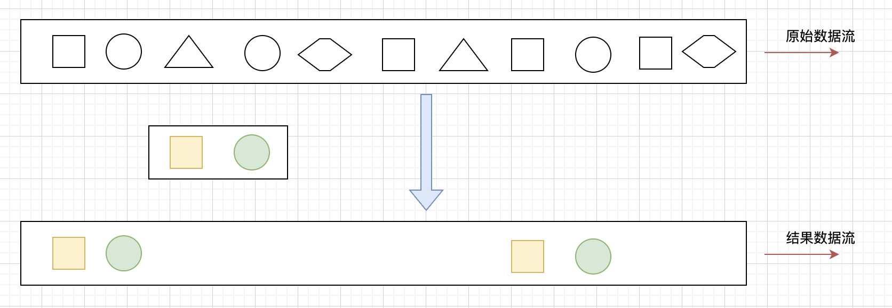

## Flink CEP 介绍   

### CEP 的概念  
* 复杂事件处理（Complex Event Processing），用于识别输入流中符合指定规则的事件，并按照指定方式输出。        

通过概念可以了解，CEP主要是识别输入流中用户指定的一些基本规则的事件，然后将这些事件再通过指定方式输出。     

如下图所示： 我们指定“方块、圆”为基本规则的事件，在输入的原始流中，将这些事件作为一个结果流输出来。     

      

### CEP的使用场景   
* 风险控制  对用户异常行为模式进行实时检测，当发生不该发生的行为，判定用户是否有违规操作的嫌疑。    
* 营销策略  用预先定义好的规则对用户的行为轨迹进行实时跟踪，对行为轨迹匹配预定义规则的用户实时发送相对应策略的推广。    
* 运维监控  灵活配置多指标，多依赖来实现更复杂的监控模式。  

像用户异常检测：我们指定异常操作事件为要输出的结果流；策略营销：指定符合要求的事件为结果流；运维监控：指定一定范围的指标为结果流；银行卡盗刷：指定同一时刻在两个地方被刷两次为异常结果流。


### Flink CEP Pattern API   

在Flink CEP API中，主要通过Pattern 类来进行实现。CEP模式主要分为三种模式：  

#### 1.个体模式     
* 单例模式：只接收一个事件  
    触发条件 (.where()/.or()/.until())  
* 循环模式：可以接收一个或多个事件
    单例 +量词（在个体模式后追加量词，指定循环次数）        

个体模式分为`单例模式`和`循环模式`：    

单例模式只接收一个事件，主要通过(.where()/.or()/.until())等条件触发，使用规则如下：start为定义的变量。  
```java
start.where(event => event.getName.startsWith("foo"))   
```

循环模式可以接收一个或多个事件，使用规则为 单例+量词:   
```java
start.times(2) // 必须2次   
start.times(2,5) // 2,3,4 或者5次都可以 
start.times(2,5).greedy // 2,3,4或者5次，并且尽可能的重复匹配   
start.times(2).optional // 0或者2次
start.oneOrMore  // 1次或者多次 
stat.timesOrMore(2).optional.greedy // 0，2或者多次，并且尽可能的重复匹配  
``` 

#### 2.组合模式（多个个体模式的组合）
* 严格连续(next)    
    中间没有任何不匹配的事件    
* 宽松连续(followBy)
    忽略匹配的事件之间的不匹配的事件
* 不确定的宽松连续(followByAny)     
    一个匹配的事件能够再次使用      

组合模式主要分为三种使用规则：`但是在使用组合模式之前，必须以初始模式开始，使用begin() 控制`，如下所示：    
```
val start = pattern.begin("start")  
```

（1）严格连续，通过next()方法控制，这句话是指用户定义的基本事件，如最上图中的方块，必须是连续都是方块，不能出圆圈。可以通过下面示例理解。               
`对于模式 "a next b", 事件流 [a,c,b,d],没有匹配`    

（2）宽松连续，通过followBy()控制，中间可以有不匹配的事件       
`对于模式 "a followedBy b", 事件流 [a,c,b,d], 匹配为 [a,b]` 

（3）不确定的宽松连续，通过followByAny()方法控制，表示一个匹配的事件可以多次被使用
`对于模式 "a followedByAny b", 事件流 [a,c,b1,b2], 匹配为 [a,b1],[a,b2]` 

组合模式还包含：“不希望出现某种连续关系”：          
* .notNext()—— 不想让某个事件严格近邻前一个事件发生     
* .notFollowedBy()——不想让某个事件在两个事件之间发生        

>组合模式注意事项：
所有组合模式必须以.begin()开始；组合模式不能以.notFollowedBy()结束；"not"类型的模式不能被optional所修饰；此外，还可以为模式指定时间约束，用来要求在多长时间内匹配有效。         

#### 3.模式组    
一个组合模式作为条件嵌套在个体模式里 Pattern(（ab）c)       

### Flink CEP 案例      
为例帮助大家更好的理解CEP的API使用，接下里通过两个案例，对CEP的使用进行讲解。   
（a）电商案例——条件创建订单之后15分钟之内一定要付款，否则取消订单   

案例介绍：在电商系统当中，经常会发现有些订单下单之后没有支付，就会有一个倒计时的时间值，提示你在15分钟内完成支付，如果没有完成支付，那么该订单就会被取消，主要是因为拍下订单就会减库存，但是如果一直没有支付，那么就会造成库存没有了，后面购买的时候买不到。            

在CEP概念介绍时，引入过一条链路：       
`浏览商品—>加入购物车—>创建订单—>支付完成—>发货—>收货事件流形成的模式`。        

上述模式是标准的电商事件流，我们案例中定义的CEP规则是 创建订单—>支付完成 这两个环节，要求是，判断15分钟内是否付款，否则订单取消。           
代码设计：      
```java

```


refer   
1.https://mp.weixin.qq.com/s?__biz=Mzg5NDY3NzIwMA==&mid=2247497195&idx=1&sn=3afa899382469e9675b93d5e8eea0960&chksm=c0194c54f76ec5420d8b5eab5ef6a27405996c97a4c3bb622dc6f8833012e7a3c7b3ea8fa6dc&token=299008056&lang=zh_CN#rd   
2.https://nightlies.apache.org/flink/flink-docs-master/zh/docs/libs/cep/    
