## 入门 Flink CDC

>Flink CDC version: 2.1 

### 新Source架构
在FLIP-27中，Flink社区重构了Flink-Connector，提供了全新的一套Source接口，新接口相比之前的Legacy Source，在Source层面实现了无锁化，业务数据、barrier、watermark都由一个mailbox线程来处理，比之前更加优雅。Flink-CDC 2.0+以上的版本基于这套接口重写了CDC-Souce。  

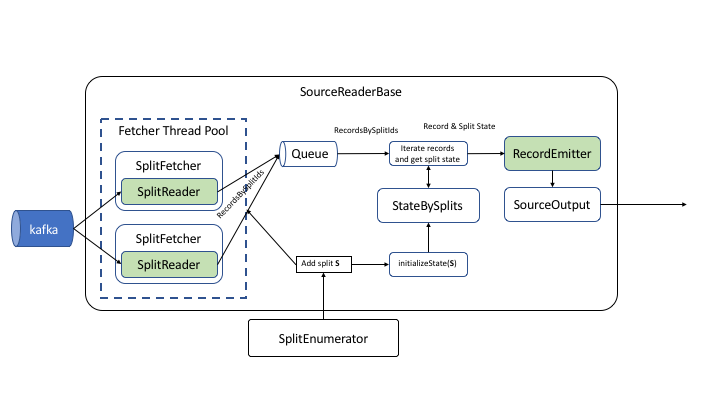  

### 数据读取流程    
CDC 2.0进行数据同步主要分为两个阶段，第一阶段为全量读取阶段，第二阶段为增量读取阶段。我们先了解Flink CDC 1.0的以下痛点：（三大痛点）        
第一个是一致性通过加锁保证，对业务不友好；      
第二个是不支持水平扩展，在全量读取阶段只能单并发，如果表特别大，那么耗时就会很长；          
第三个是全量读取阶段不支持 checkpoint，如果读取失败，则只能从开始再次读取，耗时也会很长。           

Flink CDC 1.0 实现中，底层封装了 Debezium，读取数据的时候就分为两个阶段，第一个是全量读取阶段，第二个是增量读取阶段。在全量读取阶段和增量阶段衔接时是通过加锁来保证数据一致性。

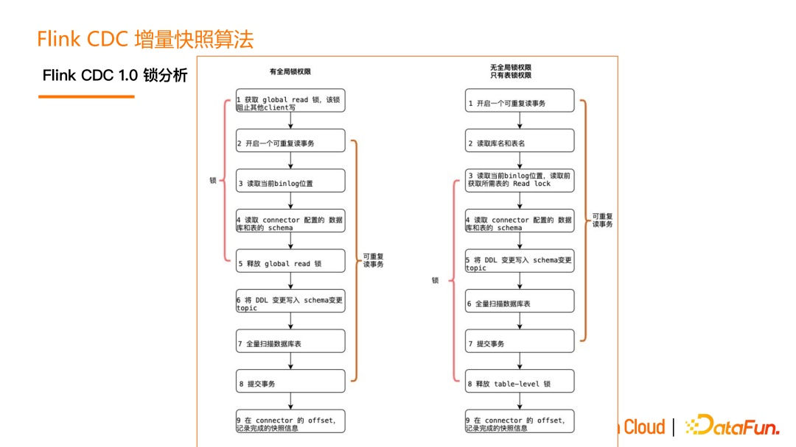      
读取 MySQL 的加锁流程如上图所示，对于不同的数据库，权限也不同，有的是全局锁，有的是表锁，且它们的流程也不相同。     

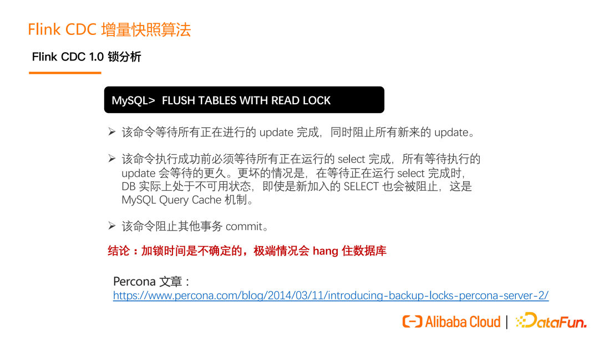          

但加锁是非常危险的操作，以 MySQL 的加锁为例，MySQL 的加锁时间是不确定的，在某些极端情况下，会把数据库 hang住，影响数据库上承载的线上业务。  

**Flink CDC 2.0 无锁设计**  
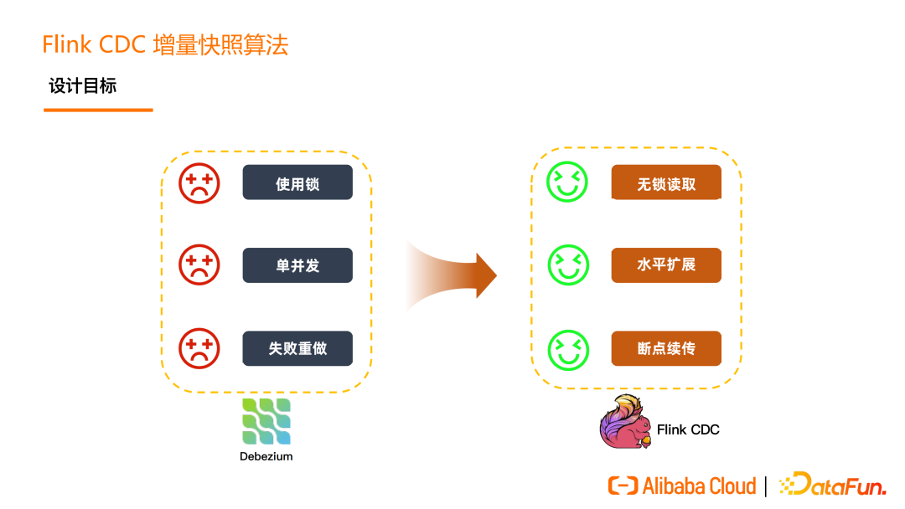    
Flink CDC 2.0 的设计主要是为了解决 Flink CDC 1.0 的痛点问题，即全量读取阶段使用无锁读取，支持高并发的水平扩展，可断点续传解决失败重做问题。 

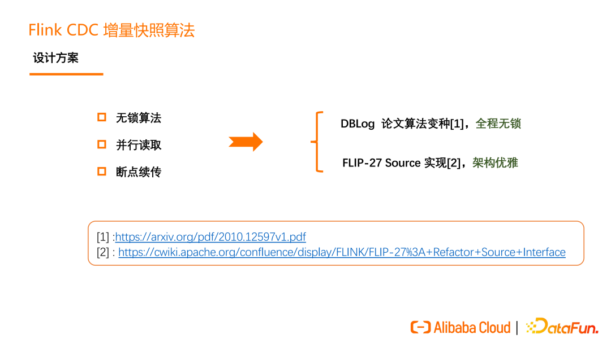   
Flink CDC 2.0 主要是借鉴 DBLog 算法的一个变种同时结合 FLIP-27 Source 实现。 

**DBLog 算法原理**  
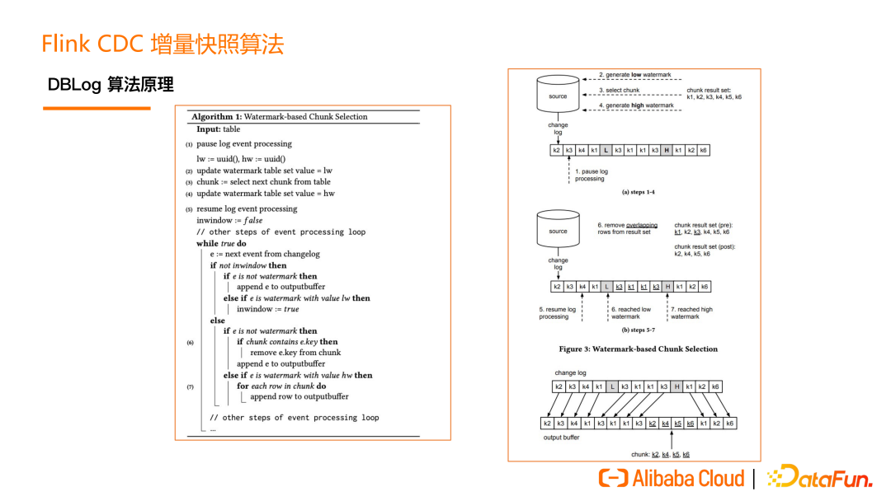   
DBLog 这个算法的原理分成两个部分，第一部分是分 chunk，第二部分是读 chunk。分 chunk 就是把一张表分为多个 chunk（桶/片）。我可以把这些 chunk 分发给不同的并发的 task 去做。例如：有 reader1 和 reader2，不同的 reader 负责读不同的 chunk。其实只要保证每个 reader 读的那个 chunk 是完整的，也能跟最新的 Binlog 能够匹配在一起就可以了。在读 chunk 的过程中，会同时读属于这个 chunk的历史数据，也会读这个 chunk 期间发生的 Binlog 事件，然后来做一个 normalize。   

      
先是 chunk 的划分。一张表，它的 ID 字段是主键 PK。通过 query 能够知道最大的 PK 也能知道最小的 PK。然后根据最大最小的 PK 设定一个步长，那么就能把这个表分成一些 chunk。每个 chunk 是一个左闭右开的区间，这样可以实现 chunk 的无缝衔接。第一个 chunk 和最后一个 chunk 最后一个字段，是一个正无穷和负无穷的表示， 即所有小于 k1 的 key 由第一个 chunk 去读，所有大于 K104 的 key 由最后一个chunk去读。       

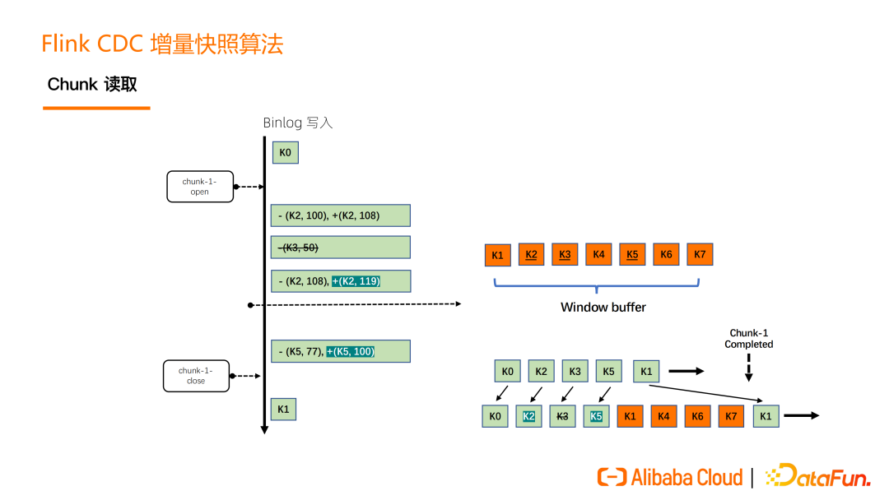    
chunk 的读取，首先有一个 open 打点的过程，还有一个 close 打点的过程。例如，读属于这个 chunk1 的所有数据时，橘色的 K1 到 K7 是这些全量数据。橘黄色里面有下划线的数据，是在读期间这些 Binlog 在做改变。比如 K2 就是一条 update，从 100 变成 108，K3 是一条 delete。K2 后面又变成 119。还有 K5 也是一个update。在 K2、K3、K5 做标记，说明它们已经不是最新的数据了，需要从 Binlog 里面读出来，做一个 merge 获取最新的数据， 最后读出来的就是在 close 位点时刻的最新数据。最后的效果就是，将 update 最新的数据最终输出，将 delete 的数据如 K3 不输出。所以在 chunk1 读完的时候，输出的数据是 K0、K2、K4、K5、K6、K7 这些数据，这些数据也是在 close 位点时数据库中该 chunk 的数据。   

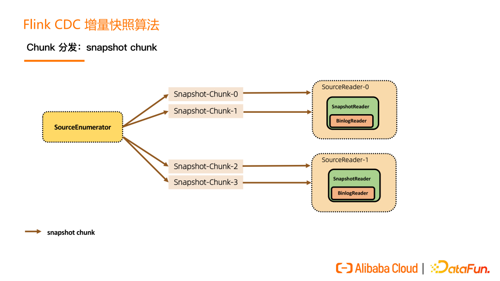      
接下来是 chunk 的分发。一张表切成了 N 个 chunk 后，SourceEnumerator 会将这些 chunk 分给一些 SourceReader 并行地读取，并行读是用户可以配置的，这就是水平扩展能力。   

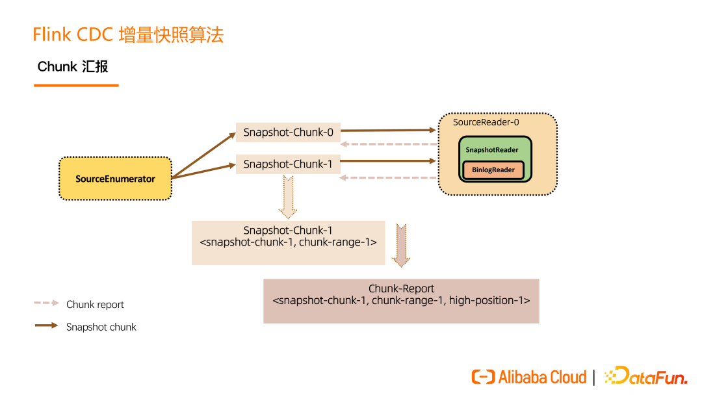  

每一个 Snapshot chunk 读完了之后有一个信息汇报过程，这个汇报非常关键，包含该 chunk 的基本信息和该 chunk 是在什么位点读完的（即 close 位点）。在进入 Binlog 读取阶段之后， 在 close 位点之后且属于这个 chunk 的 binlog 数据，是要需要继续读取的，从而来保证数据的完整性。    

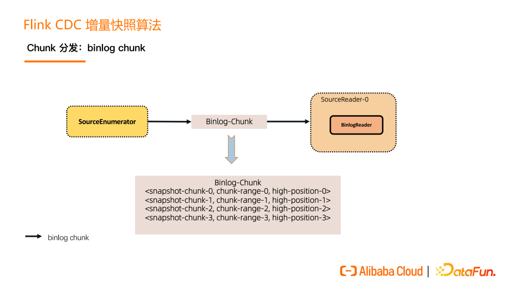  

在所有的 Snapshot chunk 读完之后会发一个特殊的 Binlog chunk，该 chunk 里包含刚刚所有 Snapshot chunk 的汇报信息。Binlog Reader 会根据所有的 Snapshot chunk 汇报信息按照各自的位点进行跳读，跳读完后再进入一个纯粹的 binlog 读取。跳读就是需要考虑各个 snapshot chunk 读完全量时的 close 位点进行过滤，避免重复数据，纯 binlog 读就是在跳读完成后只要是属于目标表的 changelog 都读取。    

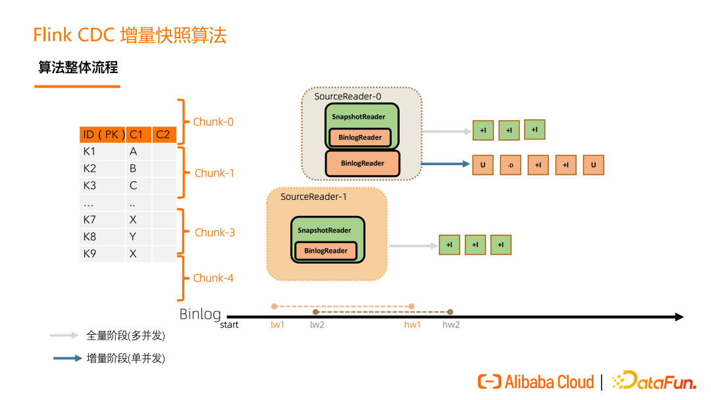      

Flink CDC 增量快照算法流程为，首先，一张表按 key 分成一个个 chunk，Binlog在不断地写，全量阶段由 SourceReader 去读，进入增量阶段后，SourceReader 中会启一个 BinlogReader 来读增量的部分。全量阶段只会有 insert only 的数据，增量阶段才会有 update、delete 数据。SourceReader 中具体去负责读 chunk 的 reader 会根据收到的分片类型，决定启动 SnapshotReader 还是 BinlogReader。        

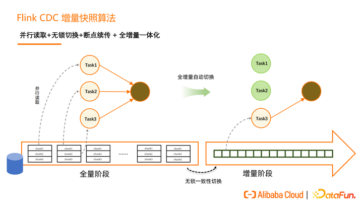          

Flink CDC 增量快照算法的核心价值包括：
第一，实现了并行读取，水平扩展的能力，即使十亿百亿的大表，只要资源够，那么水平扩展就能够提升效率；  
第二，实现 Dblog 算法的变动，它能够做到在保证一致性的情况下，实现无锁切换； 
第三，基于 Flink 的 state 和 checkpoint 机制，它实现了断点续传。比如 task 1 失败了，不影响其它正在读的task，只需要把 task 1 负责的那几个 chunk 进行重读；       
第四，全增量一体化，全增量自动切换。    

**Flink CDC 增量快照框架**  
Flink CDC 的增量快照读取算法早期只在 MySQL CDC 上支持，为了其他 CDC Connector 也能够轻松地接入，获得无锁读取，并发读取，断点续传等高级能力。在 2.2 版本中，我们推出了增量快照框架，把一些复用的、可以沉淀的代码抽象了出来，把一些面向数据源的特有的实现进行抽象。   

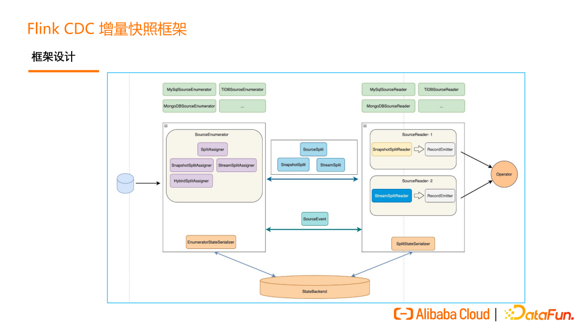  

Flink CDC 增量快照框架的架构如上图所示。    

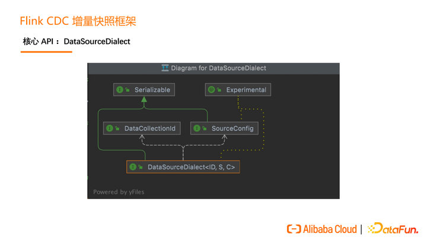      

增量快照框架的设计围绕一个核心的 API 展开，这个核心的 API 就是DataSourceDialect（数据源方言），这个方言关心的就是面向某个数据源特有的，在接入全增量框架时需要实现的方法。   

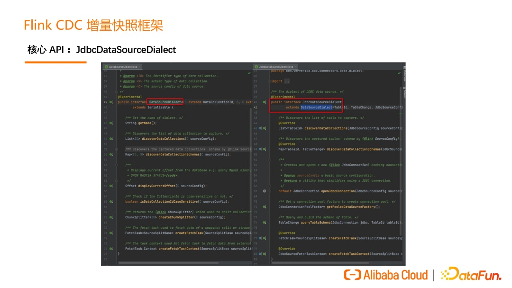      
对于 JDBC 数据源，我们还提供了 JdbcDataSourceDialect 这个 API，可以让JDBC 数据源以更低的成本接入这个框架。  

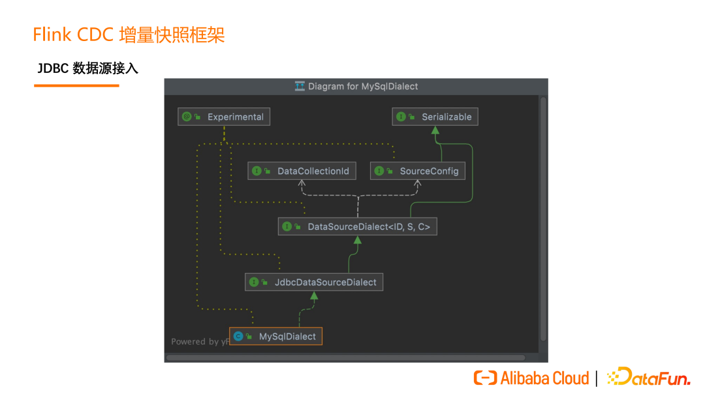    
如上图所示，如果用户要实现 MySQL 接入的增量快照框架，只需要实现MySQLDialect 即可。  

refer   
1.https://cwiki.apache.org/confluence/display/FLINK/FLIP-27%3A+Refactor+Source+Interface    
2.https://zhuanlan.zhihu.com/p/600303844    

