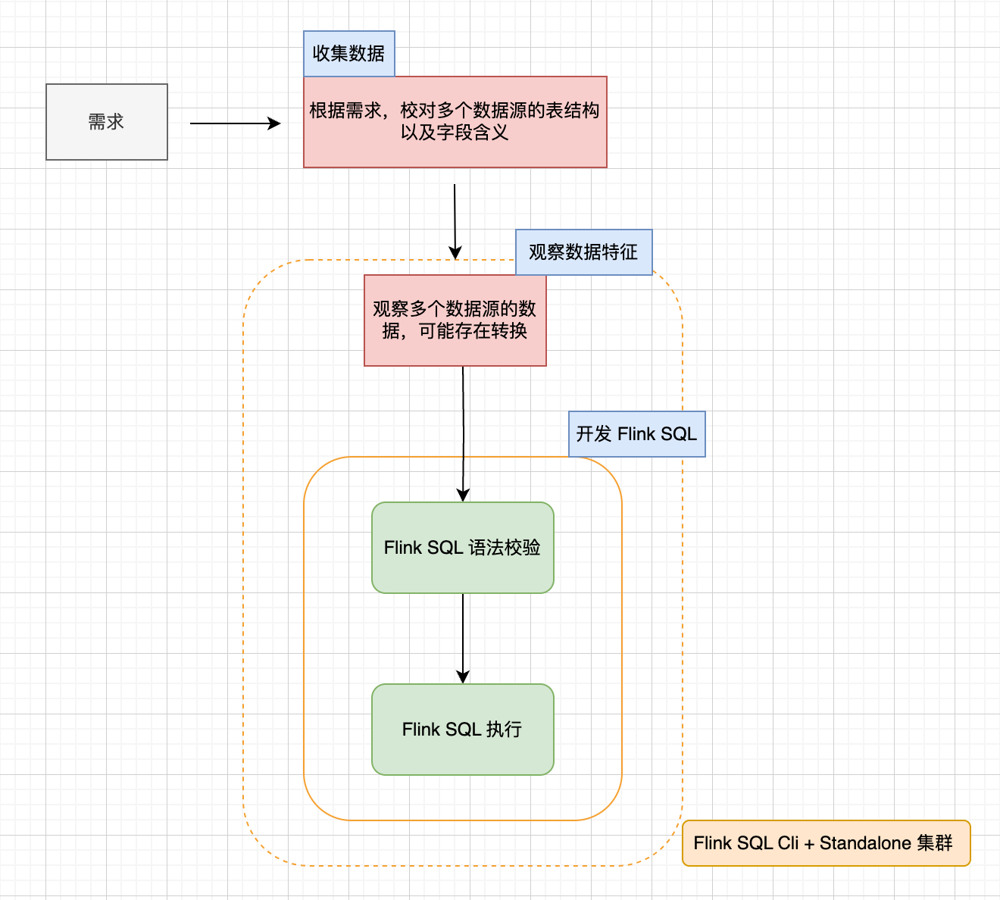
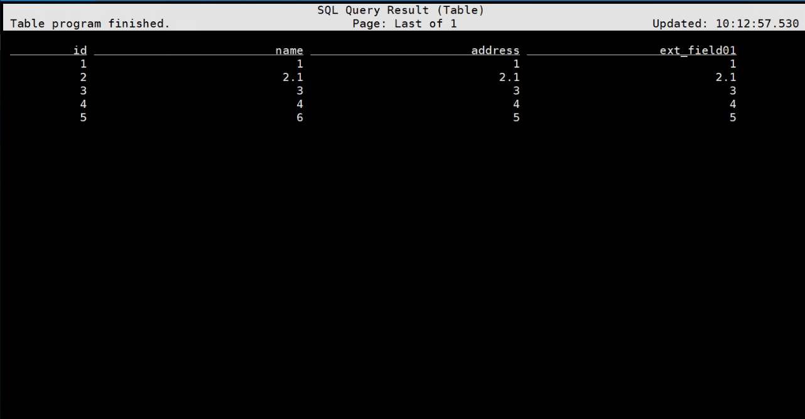
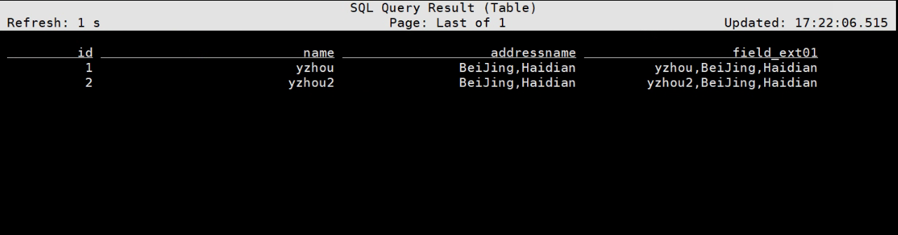

# Flink SQL - SQL CLI 的使用  

>Flink version: 1.17.2   

## 引言 
在 Flink SQL 领域中 CLI 是非常重要的工具，下面通过一个 Flink SQL Job 开发流程来介绍下，如下图所示：   
  

有一个实时需求，目前看可以使用 Flink SQL 实现，首先会根据需求，收集数据，校对多个数据源的表结构以及字段含义，可能这个过程会存在数据并未结构化存储,还需实现数据采集等操作。 有了数据源，会观察数据源的数据，是否需要根据需求对数据进行一些转换操作，最后开发 Flink SQL 实现实时需求。  

Flink SQL Cli 在开发流程中提供了 Flink SQL 语法校验 和 验证 Flink SQL 执行，甚至在“观察数据源的数据”环节都可能使用 Flink SQL Cli。 

在 Flink 生态中，Flink on Yarn，Flink on Kubernetes 都能提供 SQL 语法校验、验证 Flink SQL 执行是否正确 功能, 那为什么选择 Flink SQL Cli呢？  

是因为 Flink SQL Cli 可减少开发时间成本，主要从以下几点体现出来：   
* 1.Flink SQL Job 提交到 Flink Standalone集群 耗时较少，所以，频繁修改、验证 Flink SQL 的正确，涉及到多次提交 Job，那积累起来的节约时间优势与其他部署方式相比就特别明显。    

* 2.查看 log 简单，Flink on Yarn，Flink on Kubernetes 太依赖于外部组件，而 Flink Standalone 集群的 log 查看起来就简单的多，直接使用 less 命令查看即可。     

* 3.SQL 任意组合执行，改动成本低。     

>关于 Flink SQL CLI 可访问 `https://nightlies.apache.org/flink/flink-docs-release-1.17/docs/dev/table/sqlclient/`   

接下来，我们通过一些 Flink SQL Cli 的使用案例来了解它。     

## 案例分析    

### 1.预览数据源的数据，例如 MySQL  
使用以下 Flink CREATE TABLE SQL，创建 Table
```sql
CREATE TABLE `yzhou_test01` (
    `id` INT NOT NULL COMMENT '',
    `name` STRING NOT NULL COMMENT '',
    `address` STRING COMMENT '',
    `ext_field01` STRING COMMENT '',
    PRIMARY KEY (id) NOT ENFORCED
)
WITH
(
  'connector' = 'jdbc',
  'table-name' = 'yzhou_test01',
  'url' = 'jdbc:mysql://192.168.0.202:3306/yzhou_test',
  'username' = 'root',
  'password' = '123456',
  'driver' = 'com.mysql.cj.jdbc.Driver'
);
```

查看 Table   
```shell
Flink SQL> SHOW TABLES;
+--------------+
|   table name |
+--------------+
| yzhou_test01 |
+--------------+
1 row in set
```

执行 SELECT * 预览数据，注意，因为数据源是 JDBC，属于`有界数据源`，需执行`SET 'execution.runtime-mode' = 'batch';`（在 Flink SQL Cli 默认以 stream 方式处理数据源），以下是完整数据结果：          

```bash
SET 'execution.runtime-mode' = 'batch';

SELECT * FROM yzhou_test01;    
```

Outout log:         
     

**小结**    
该案例中，使用以下3类 Flink SQL：       
1.`CREATE TABLE ...`: 建表语句          
2.`SET 'execution.runtime-mode' ...`: 配置参数语句    
3.`SELECT * ...`: 执行 SQL    

### 2.删除 Table 例如，频繁修改 With 参数
Flink Create Table SQL 主要分2个部分，拿上面说的`yzhou_test01`建表语句来说, 它包含字段信息、参数信息，在开发阶段字段需求不明确，或者配置不同 WITH 参数测试，都会涉及到 Table 的修改。
```sql
CREATE TABLE `yzhou_test01` (
  字段信息
)
WITH
(
  参数信息
);
``` 

所以删表语句 `Drop TABLE yzhou_test01`，是较常用的。      

### 3.测试 UDF   
在 Flink SQL 中大多数时候会使用一些`System(Built-in) Functions`，也存在Flink 提供的系统函数无法支持的一些数据处理，所以需要开发`User-defined Functions`, 那开发的 UDF 也是可以在 Flink SQL Cli 验证它的正确性，接下来，演示在 Flink SQL Cli 调用 UDF。   

>系统内置函数可参考`https://nightlies.apache.org/flink/flink-docs-release-1.17/docs/dev/table/functions/systemfunctions/` 
关于 UDF 可参考`https://nightlies.apache.org/flink/flink-docs-release-1.17/docs/dev/table/functions/udfs/`   

#### 案例背景介绍   
现在有一个 Kafka 的数据源，存放格式为：`{"id":1,"name":"yzhou","addressId":1}`的数据, 还有一个 MySQL 数据源，它是用来存放地址信息，它的字段 id，name，需要使用 Flink SQL 实现 Kafka Join MySQL, 利用 UDF 将 Kafka 中的 name 与 MySQL 中的 name 拼接成 一个新字段 info；如下图所示：        

     

>注意，上述需求并非不能用系统函数实现，只是通过简化需求来测试 UDF。         

#### 建表语句

Kafka Source     
```sql 
CREATE TABLE `Kafka_Source` (
    `id` INT,
    `name` STRING,
    `addressId` INT
  )
WITH
(
    'connector' = 'kafka',
    'json.ignore-parse-errors' = 'true',
    'format' = 'json',
    'topic' = 'yzhoujsontp01',
    'scan.startup.mode' = 'latest-offset',
    'json.fail-on-missing-field' = 'false',
    'properties.bootstrap.servers' = '192.168.0.201:9092',
    'properties.group.id' = 'yzhougid06201'
);
```

>注意：若使用`SELECT * FROM Kafka_Source;` 查看 kafka Topic 数据，在 Flink Version 1.17.2 版本中，Job 需触发 Checkpoint 后，终端才会展示 Topic 数据。

MySQL Source 

```sql   
CREATE TABLE `MySQL_Source` (
    `id` INT,
    `name` STRING,
    PRIMARY KEY (id) NOT ENFORCED
  )
WITH
(
    'password' = '123456',
    'connector' = 'jdbc',
    'table-name' = 'user_address',
    'url' = 'jdbc:mysql://192.168.0.202:3306/yzhou_test',
    'username' = 'root'
);
```  

>注意：若使用`SELECT * FROM MySQL_Source;` 查看 MySQL 数据，需提前执行 `SET 'execution.runtime-mode' = 'batch';`，终端才会展示 Topic 数据。   


>MySQL DDL SQL
```sql
create table user_address
(
    id   int auto_increment primary key,
    name varchar(100) null
);
```

#### 开发 UDF   
* 1.添加 pom.xml    
```xml  
 <dependencies>
    <dependency>
        <groupId>org.apache.flink</groupId>
        <artifactId>flink-table-common</artifactId>
        <version>1.17.2</version>
    </dependency>
</dependencies>

<build>
    <plugins>
        <plugin>
            <groupId>org.apache.maven.plugins</groupId>
            <artifactId>maven-compiler-plugin</artifactId>
            <version>3.8.1</version>
            <configuration>
                <source>1.8</source>
                <target>1.8</target>
                <encoding>UTF-8</encoding>
            </configuration>
        </plugin>

        <plugin>
            <artifactId>maven-shade-plugin</artifactId>
            <version>3.1.0</version>
            <executions>
                <execution>
                    <phase>package</phase>
                    <goals>
                        <goal>shade</goal>
                    </goals>
                </execution>
            </executions>
        </plugin>
    </plugins>
</build>
``` 

* 2.开发 UDF 方法 
```java
/*
    拼接 两个字段
 */
public class Concatenate2Fields extends ScalarFunction {
    public Concatenate2Fields() {}
    public String eval(String s1,String s2) {
        return s1+","+s2;
    }
}
```   

#### 在 SQL CLI 测试 UDF    
1）将 UDF jar 添加到 lib/ 下，重启 Standalone 集群    

2）执行 Kafka，MySQL 的 Flink Create Table SQL     

3）创建临时函数,`Concatenate2Fields` 是定义函数名称，`com.yzhou.udf.scalarfunction.Concatenate2Fields` 指向类的完全限定名。   
```shell
Flink SQL> create temporary function Concatenate2Fields as 'com.yzhou.udf.scalarfunction.Concatenate2Fields';    
```
 
4）准备数据   
将 user_address 维表插入：1,Beijing,Haidian 数据  

5）执行 SQL    
```sql
SELECT 
A.id,
A.name,
B.name AS addressname,
Concatenate2Fields(A.name,B.name) as field_ext01
FROM Kafka_Source AS A
INNER JOIN MySQL_Source AS B 
ON A.addressId = B.id;  
```

6）使用 shell 发送数据到 yzhoujsontp01 topic   
```
{"id":1,"name":"yzhou","addressId":1}
``` 

>注意：查看执行 SQL 的结果，在 Flink Version 1.17.2 版本中，Job 需触发 Checkpoint 后，终端才会展示 Topic 数据。  

Output log:    
  

测试 UDF 功能，测试完成。    

**小结** 
在 Flink SQL Cli 查询数据源数据或者查看 Flink SQL 执行结果，会存在一些前置条件，还需多注意。 例如，`设置 batch 处理模式`，`触发 Checkpoint`。     

### 4.查看 Flink SQL Job Plan     
在之前 Blog "Flink 源码 - Standalone - 探索 Flink Stream Job Show Plan 实现过程 - 构建 StreamGraph"介绍过 Flink Jar Job 的 `Plan` 查看，它对于 Job的执行优化提供了专业性的指标参考。同样， Flink SQL Job 可利用 Flink SQL Cli 工具查看 Job 的 Plan。   

接下来，使用下面的 SQL 案例来演示 Plan。    

使用 `EXPLAIN PLAN FOR` 关键字   
```sql
EXPLAIN PLAN FOR
SELECT 
A.id,
A.name,
B.name AS addressname,
Concatenate2Fields(A.name,B.name) as field_ext01
FROM Kafka_Source AS A
INNER JOIN MySQL_Source AS B 
ON A.addressId = B.id;
```

Output log:         
```bash
| == Abstract Syntax Tree ==
LogicalProject(id=[$0], name=[$1], addressname=[$4], field_ext01=[Concatenate2Fields($1, $4)])
+- LogicalJoin(condition=[=($2, $3)], joinType=[inner])
   :- LogicalTableScan(table=[[default_catalog, default_database, Kafka_Source]])
   +- LogicalTableScan(table=[[default_catalog, default_database, MySQL_Source]])

== Optimized Physical Plan ==
Calc(select=[id, name, name0 AS addressname, Concatenate2Fields(name, name0) AS field_ext01])
+- Join(joinType=[InnerJoin], where=[=(addressId, id0)], select=[id, name, addressId, id0, name0], leftInputSpec=[NoUniqueKey], rightInputSpec=[JoinKeyContainsUniqueKey])
   :- Exchange(distribution=[hash[addressId]])
   :  +- TableSourceScan(table=[[default_catalog, default_database, Kafka_Source]], fields=[id, name, addressId])
   +- Exchange(distribution=[hash[id]])
      +- TableSourceScan(table=[[default_catalog, default_database, MySQL_Source]], fields=[id, name])

== Optimized Execution Plan ==
Calc(select=[id, name, name0 AS addressname, Concatenate2Fields(name, name0) AS field_ext01])
+- Join(joinType=[InnerJoin], where=[(addressId = id0)], select=[id, name, addressId, id0, name0], leftInputSpec=[NoUniqueKey], rightInputSpec=[JoinKeyContainsUniqueKey])
   :- Exchange(distribution=[hash[addressId]])
   :  +- TableSourceScan(table=[[default_catalog, default_database, Kafka_Source]], fields=[id, name, addressId])
   +- Exchange(distribution=[hash[id]])
      +- TableSourceScan(table=[[default_catalog, default_database, MySQL_Source]], fields=[id, name])
 |
```      

refer       
1.https://nightlies.apache.org/flink/flink-docs-release-1.17/docs/dev/table/sqlclient/      
2.https://nightlies.apache.org/flink/flink-docs-release-1.17/docs/dev/table/functions/systemfunctions/   
3.https://nightlies.apache.org/flink/flink-docs-release-1.17/docs/dev/table/functions/udfs/      
4.https://nightlies.apache.org/flink/flink-docs-release-1.17/docs/dev/table/sql/overview/        

