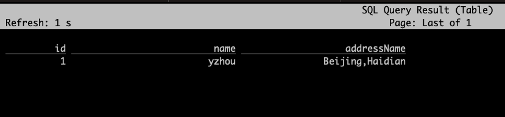

## Flink SQL CLI 验证 UDF 函数  

>Flink version: 1.15.4  

### 引言        
在 Flink SQL 开发业务过程中，若`内置函数`无法实现的逻辑处理，则需开发 UDF 来实现，此案例的需求背景是：kafka lookup join mysql，将 kafka 的 name field 与 mysql 的 name 进行拼接成新字段，生成1个新字段, 写入 MySQL 中。 

``` sql
SELECT 
A.id
A.name
B.name AS addressName   
FROM kafka_source AS A
INNER JOIN mysql_source AS B 
ON A.addressId = B.id 
```

### 环境准备    

#### Kafka Source   


```sql 
CREATE TABLE `Kafka_Source` (
    `id` INT,
    `name` STRING,
    `addressId` INT
  )
WITH
(
    'connector' = 'kafka',
    'properties.bootstrap.servers' = 'DN-KAFKA3:9092',
    'json.ignore-parse-errors' = 'false',
    'format' = 'json',
    'topic' = 'yzhoujsontp01',
    'properties.group.id' = 'yzhougid122101',
    'scan.startup.mode' = 'latest-offset',
    'json.fail-on-missing-field' = 'false'
);
```

#### MySQL Source 

```sql
create table user_address
(
    id   int auto_increment primary key,
    name varchar(100) null
);
```

```sql
CREATE TABLE `MySQL_Source` (
    `id` INT,
    `name` STRING,
    PRIMARY KEY (id) NOT ENFORCED
  )
WITH
(
    'password' = '123456',
    'connector' = 'jdbc',
    'table-name' = 'user_address',
    'url' = 'jdbc:mysql://192.168.0.5:3306/drc_test',
    'username' = 'dp_test'
);
``` 


#### MySQL Sink 

MySQL DDL:  
```sql
create table user_info_out
(
    id           int auto_increment
        primary key,
    name         varchar(100) null,
    address_name int          null,
    field_ext01  varchar(100) null
);
```     

```sql
CREATE TABLE `MySQL_Sink` (
    `id` INT,
    `name` STRING,
    `addressname` STRING,
    `field_ext01` STRING,
    PRIMARY KEY (id) NOT ENFORCED
)
WITH
(
    'password' = '123456',
    'connector' = 'jdbc',
    'table-name' = 'user_info_out',
    'url' = 'jdbc:mysql://192.168.0.5:3306/drc_test',
    'username' = 'dp_test'
);
```


### 使用 Flink SQL 将 Kafka Join MySQL 2 MySQL 
```sql
SELECT 
A.id,
A.name,
B.name AS addressname   
FROM Kafka_Source AS A
INNER JOIN MySQL_Source AS B 
ON A.addressId = B.id;
```

* 1.将 user_address 维表插入：1,Beijing 数据    
* 2.使用 shell 发送数据到 yzhoujsontp01 topic   
```
{"id":1,"name":"yzhou","addressId":1} 
```   

此时，看 SQL Cli 终端能看到结果信息：       
   

>接下来，我们自己实现 UDF，将 name、addressname 字段 拼接成`新字段 field_ext01` 

### 开发 UDF 

#### 开发步骤   
* 1.添加 pom.xml    
```xml  
 <dependencies>
    <dependency>
        <groupId>org.apache.flink</groupId>
        <artifactId>flink-table-common</artifactId>
        <version>1.15.4</version>
    </dependency>
</dependencies>

<build>
    <plugins>
        <plugin>
            <groupId>org.apache.maven.plugins</groupId>
            <artifactId>maven-compiler-plugin</artifactId>
            <version>3.8.1</version>
            <configuration>
                <source>1.8</source>
                <target>1.8</target>
                <encoding>UTF-8</encoding>
            </configuration>
        </plugin>

        <plugin>
            <artifactId>maven-shade-plugin</artifactId>
            <version>3.1.0</version>
            <executions>
                <execution>
                    <phase>package</phase>
                    <goals>
                        <goal>shade</goal>
                    </goals>
                </execution>
            </executions>
        </plugin>
    </plugins>
</build>
``` 

* 2.开发 UDF 方法 
```java
/*
    拼接 两个字段
 */
public class Concatenate2Fields extends ScalarFunction {
    public Concatenate2Fields() {}
    public String eval(String s1,String s2) {
        return s1+","+s2;
    }
}
```

#### Flink SQL cli 注册 UDF 方法
```shell
Flink SQL> create temporary function Concatenate2Fields as 'com.yzhou.udf.scalarfunction.Concatenate2Fields';    
```

#### 执行 SQL 
```sql
SELECT 
A.id,
A.name,
B.name AS addressname,
Concatenate2Fields(A.name,B.name) as field_ext01
FROM Kafka_Source AS A
INNER JOIN MySQL_Source AS B 
ON A.addressId = B.id;
```


