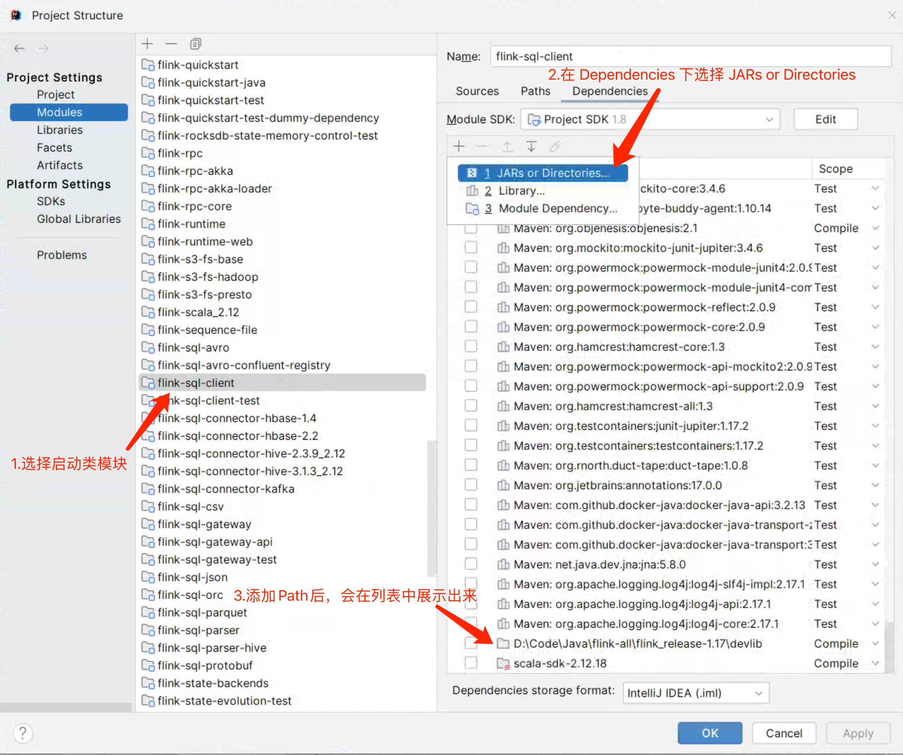

# Flink SQL - 搭建 SQL CLI 调试环境    

>Flink version: 1.17.2          

## 优化     
在之前的两篇 Blog `Flink 源码 - Standalone - 通过 CliFrontend 提交 Job 到 Standalone 集群` 和 `Flink 源码 - Standalone - 通过 CliFrontend 提交 Job 到 Standalone 集群` 中涉及到 Idea 配置启动项时手动对每个 devlib/下的 jar 添加到 classpath中，如下图：  
    

上述操作不是最优解，在 Idea 中打开项目的`Project Structure` 
   


## 引言   


## 了解 sql-client.sh 脚本 和 SqlClient 进程 
通过`/bin/sql-client.sh`脚本会启动一个 SqlClient 进程，可通过`jps`命令查看。   
```bash
[root@vm01 lib]# jps
118673 StandaloneSessionClusterEntrypoint
65489 QuorumPeerMain
118966 TaskManagerRunner
65993 Kafka
11770 SqlClient
15503 Jps
```     

像 SqlClient 常驻后台java 进程使用，省去了调试`sql-client.sh`脚本过程（例如添加脚本首尾添加 set -x、set +x 又或者修改脚本 添加 echo 打印完整脚本），可通过`ps -ef|grep SqlClient`命令查看进程启动的完整命令，内容如下：           
```shell
[root@vm01 lib]# ps -ef|grep SqlClient  
root      11770  62445 28 21:21 pts/0    00:00:05 /data/jdk1.8.0_391/bin/java -Dlog.file=/root/yzhou/flink/flink1172/flink-1.17.2/log/flink-root-sql-client-vm01.log -Dlog4j.configuration=file:/root/yzhou/flink/flink1172/flink-1.17.2/conf/log4j-cli.properties -Dlog4j.configurationFile=file:/root/yzhou/flink/flink1172/flink-1.17.2/conf/log4j-cli.properties -Dlogback.configurationFile=file:/root/yzhou/flink/flink1172/flink-1.17.2/conf/logback.xml -classpath /root/yzhou/flink/flink1172/flink-1.17.2/lib/flink-cep-1.17.2.jar:/root/yzhou/flink/flink1172/flink-1.17.2/lib/flink-connector-files-1.17.2.jar:/root/yzhou/flink/flink1172/flink-1.17.2/lib/flink-connector-jdbc-3.1.2-1.17.jar:/root/yzhou/flink/flink1172/flink-1.17.2/lib/flink-csv-1.17.2.jar:/root/yzhou/flink/flink1172/flink-1.17.2/lib/flink-json-1.17.2.jar:/root/yzhou/flink/flink1172/flink-1.17.2/lib/flink-scala_2.12-1.17.2.jar:/root/yzhou/flink/flink1172/flink-1.17.2/lib/flink-sql-connector-kafka-1.17.2.jar:/root/yzhou/flink/flink1172/flink-1.17.2/lib/flink-sql-connector-mysql-cdc-2.4.2.jar:/root/yzhou/flink/flink1172/flink-1.17.2/lib/flink-table-api-java-uber-1.17.2.jar:/root/yzhou/flink/flink1172/flink-1.17.2/lib/flink-table-planner-loader-1.17.2.jar:/root/yzhou/flink/flink1172/flink-1.17.2/lib/flink-table-runtime-1.17.2.jar:/root/yzhou/flink/flink1172/flink-1.17.2/lib/flink-udf-1.0-SNAPSHOT.jar:/root/yzhou/flink/flink1172/flink-1.17.2/lib/log4j-1.2-api-2.17.1.jar:/root/yzhou/flink/flink1172/flink-1.17.2/lib/log4j-api-2.17.1.jar:/root/yzhou/flink/flink1172/flink-1.17.2/lib/log4j-core-2.17.1.jar:/root/yzhou/flink/flink1172/flink-1.17.2/lib/log4j-slf4j-impl-2.17.1.jar:/root/yzhou/flink/flink1172/flink-1.17.2/lib/mysql-connector-j-8.0.33.jar:/root/yzhou/flink/flink1172/flink-1.17.2/lib/flink-dist-1.17.2.jar:/root/yzhou/flink/flink1172/flink-1.17.2/opt/flink-python-1.17.2.jar:/root/yzhou/flink/flink1172/flink-1.17.2/opt/flink-sql-gateway-1.17.2.jar::/opt/module/hadoop-3.1.3/etc/hadoop::/root/yzhou/flink/flink1172/flink-1.17.2/opt/flink-sql-client-1.17.2.jar org.apache.flink.table.client.SqlClient --jar /root/yzhou/flink/flink1172/flink-1.17.2/opt/flink-sql-client-1.17.2.jar      
```  

>特别注意，Idea 配置 SqlClient的调试环境，是基于之前 Blog `Flink 源码 - Standalone - 通过 CliFrontend 提交 Job 到 Standalone 集群`中`devcliconf`目录下的配置，例如将 devcliconf/ 目录 拷贝一份，命名为 devsqlclientconf，其目的是为了保证配置隔离开，避免在做一些测试时影响到其他服务调试。        

## 配置 Idea 启动 SqlClient      
首先，我们在项目根目录下创建一个 `devsqlclientconf` 文件夹，将 `devcliconf`下的文件 copy 到 devsqlclientconf 文件夹下。(具体内容可访问 https://github.com/xinzhuxiansheng/flink/tree/yzhou/release-1.17 查看 devsqlclientconf/  )      


### 1）配置 SqlClient 启动项    
配置启动类：`org.apache.flink.table.client.SqlClient`           
JDK: 1.8    
Module: `flink-sql-clients`   
VM options:   
```shell 
-Dlog.file=./log/flink-root-sql-client-local.log
-Dlog4j.configuration=./devsqlclientconf/log4j-cli.properties
-Dlog4j.configurationFile=./devsqlclientconf/log4j-cli.properties
-Dlogback.configurationFile=./devsqlclientconf/logback.xml
```

Main class: org.apache.flink.table.client.SqlClient     
Program arguments:  --jar [flink-sql-client 模块编译打包后的 jar], 下面是本人的示例路径：`D:\Code\Java\flink-all\flink_release-1.17\flink-table\flink-sql-client\target\flink-sql-client-1.17-SNAPSHOT.jar`    
Environment variables: FLINK_CONF_DIR=./devcliconf     
Modify classpath: 选择 `Include` 且指定 devlib 的目录下的`jar`。   `需特别注意, 选择目录无效，需分别添加 jar`                 

>注意：新增了 `Environment variables: FLINK_CONF_DIR=./devcliconf`, 在之前 启动 StandaloneSessionClusterEntrypoint(Jobmanager)、TaskManagerRunner(Taskmanager) 是在 main()方法 添加 `--configDir devconf`。 为啥会以环境变量方式添加？         

CLI 在提交作业之后，会调用 CliFrontend#getConfigurationDirectoryFromEnv() 方法获取 conf/flink-conf.yaml 配置，首先会从 `FLINK_CONF_DIR 环境变量`获取 conf/ 路径，其次是其他路径判断。（坑了我较长时间，因为不添加它时，console log 没有展示异常信息，凡是别慌，看下源码 (￣▽￣)σ" ）       


refer        
1.https://github.com/xinzhuxiansheng/flink/tree/yzhou/release-1.17    


1.https://nightlies.apache.org/flink/flink-docs-release-1.17/docs/dev/table/sqlclient/      
2.https://nightlies.apache.org/flink/flink-docs-release-1.17/docs/dev/table/functions/systemfunctions/   
3.https://nightlies.apache.org/flink/flink-docs-release-1.17/docs/dev/table/functions/udfs/      
4.https://nightlies.apache.org/flink/flink-docs-release-1.17/docs/dev/table/sql/overview/        

