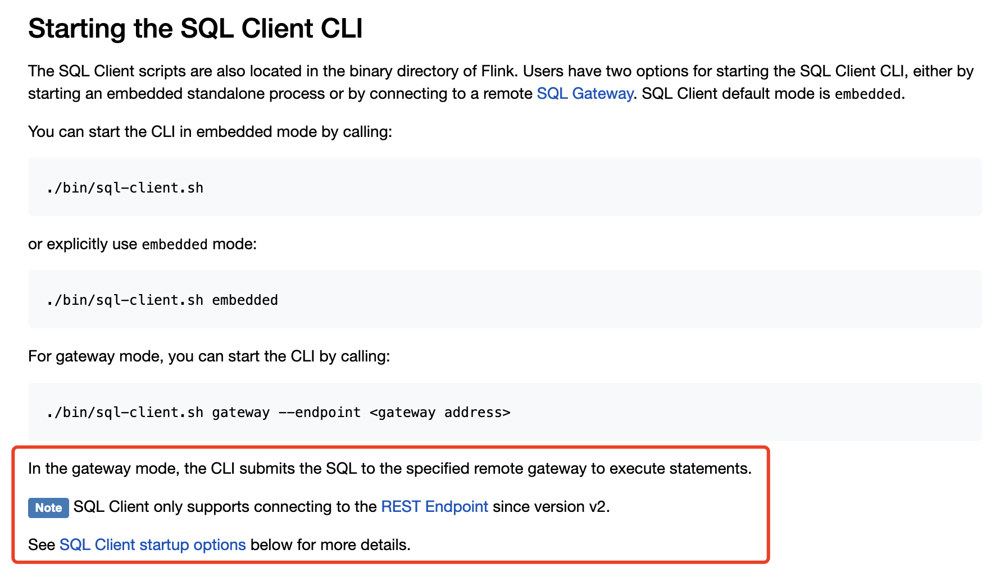
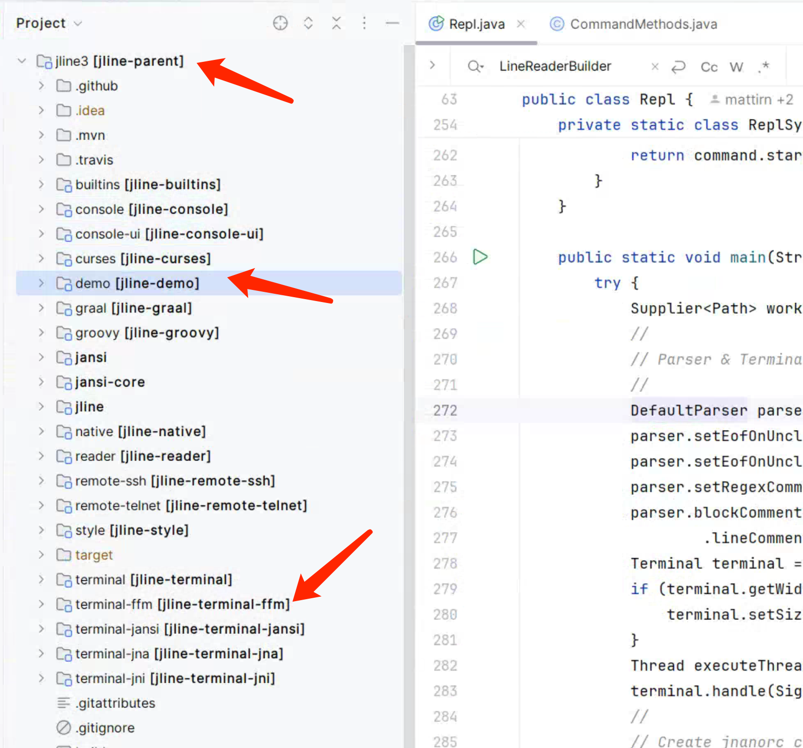
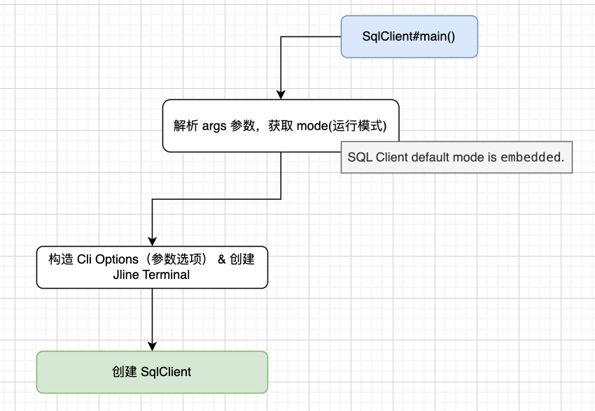
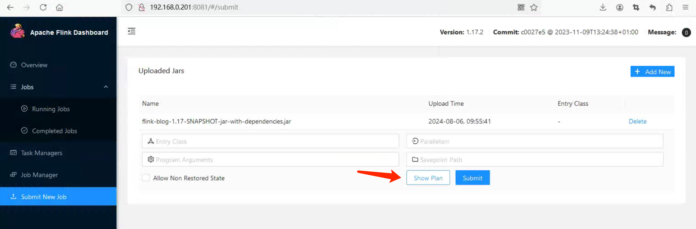
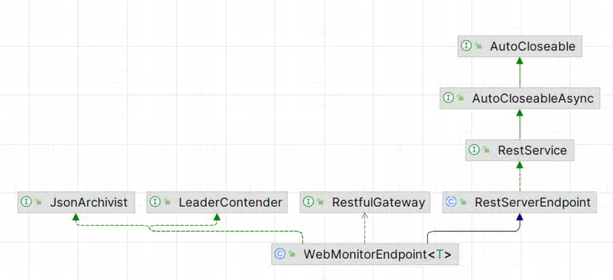
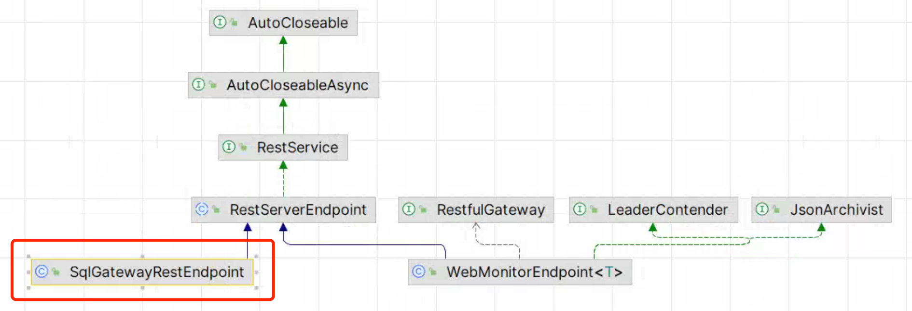

# Flink SQL - SQL Client - 探索 CLI 的实现逻辑     

>Flink version: 1.17.2       

## 引言   
该篇是基于之前 Blog `Flink SQL - SQL Client - 搭建 SQL CLI 调试环境`搭建的环境，所以下面`探索 CLI 的实现逻辑`与它的启动参数紧密相关，命令如下：   
```bash
/data/jdk1.8.0_391/bin/java  ......  /flink-sql-client-1.17.2.jar org.apache.flink.table.client.SqlClient --jar /root/yzhou/flink/flink1172/flink-1.17.2/opt/flink-sql-client-1.17.2.jar    
```  
>这样做的好处是避免看着看着就脱离了主干道 :)。            

## 查看 Log & 意外收货     
在 Linux 环境中使用`./sql-client.sh`时，我看到的是打印 Flink Logo 图案，并没有其他 log信息，注意我表达的是执行`./sql-client.sh`时终端，并不代表`log/flink-root-sql-client-xxx.log`，但log/ 目录很容易被人忽视掉，在写`Flink SQL - SQL Client - 搭建 SQL CLI 调试环境` Blog时，因为配置 log4j策略，控制台会打印出一些执行过程中的 log。如下所示,我做了一些省略标记：       
```bash
D:\Software\JDK\jdk-1.8\bin\java.exe       

[jvm 参数及classpath 区域] 

org.apache.flink.table.client.SqlClient --jar D:\Code\Java\flink-all\flink_release-1.17\flink-table\flink-sql-client\target\flink-sql-client-1.17-SNAPSHOT.jar
Connected to the target VM, address: '127.0.0.1:54952', transport: 'socket'

[Flink 全局参数加载 区域]  

2024-08-05 20:56:02,176 INFO  org.apache.flink.client.cli.CliFrontend                      [] - Loading FallbackYarnSessionCli
2024-08-05 20:56:02,182 WARN  org.apache.flink.core.plugin.PluginConfig                    [] - The plugins directory [plugins] does not exist.
2024-08-05 20:56:02,248 INFO  org.apache.flink.core.fs.FileSystem                          [] - Hadoop is not in the classpath/dependencies. The extended set of supported File Systems via Hadoop is not available.
2024-08-05 20:56:02,438 INFO  org.apache.flink.table.gateway.service.context.DefaultContext [] - Execution config: {execution.savepoint.ignore-unclaimed-state=false, execution.savepoint-restore-mode=NO_CLAIM, execution.attached=true, pipeline.jars=[file:/D:/Code/Java/flink-all/flink_release-1.17/flink-table/flink-sql-client/target/flink-sql-client-1.17-SNAPSHOT.jar, file:/D:/Code/Java/flink-all/flink_release-1.17/devlib/flink-python-1.17-SNAPSHOT.jar], execution.shutdown-on-attached-exit=false, pipeline.classpaths=[], execution.target=remote}
2024-08-05 20:56:04,177 INFO  org.apache.flink.configuration.Configuration                 [] - Config uses fallback configuration key 'rest.port' instead of key 'rest.bind-port'
2024-08-05 20:56:04,340 INFO  org.apache.flink.table.gateway.rest.SqlGatewayRestEndpoint   [] - Starting rest endpoint.
2024-08-05 20:56:07,562 INFO  org.apache.flink.table.gateway.rest.SqlGatewayRestEndpoint   [] - Rest endpoint listening at localhost:54959
2024-08-05 20:56:07,563 INFO  org.apache.flink.table.client.SqlClient                      [] - Start embedded gateway on port 54959
2024-08-05 16:57:48,596 INFO  org.apache.flink.table.client.gateway.ExecutorImpl           [] - Open session to localhost:54959 with connection version: V2.
八月 05, 2024 4:57:53 下午 org.jline.utils.Log logr
警告: Unable to create a system terminal, creating a dumb terminal (enable debug logging for more information)

2024-08-05 16:57:53,398 INFO  org.apache.flink.table.client.cli.CliClient                  [] - Command history file path: C:\Users\yzhou\flink-sql-history

[Flink icon 图标 区域]

        Welcome! Enter 'HELP;' to list all available commands. 'QUIT;' to exit.

Command history file path: C:\Users\yzhou\flink-sql-history

Flink SQL> 
```  

看到 log 确实让我有`1`处意外收获：  
**第一处**   
```bash 
2024-08-05 20:56:04,340 INFO  org.apache.flink.table.gateway.rest.SqlGatewayRestEndpoint   [] - Starting rest endpoint.
2024-08-05 20:56:07,562 INFO  org.apache.flink.table.gateway.rest.SqlGatewayRestEndpoint   [] - Rest endpoint listening at localhost:54959
2024-08-05 20:56:07,563 INFO  org.apache.flink.table.client.SqlClient                      [] - Start embedded gateway on port 54959
2024-08-05 16:57:48,596 INFO  org.apache.flink.table.client.gateway.ExecutorImpl           [] - Open session to localhost:54959 with connection version: V2.
```

它会启动一个内嵌的 `gateway`,并且它的链接版本是 V2，首先这让我意外的原因是：在工作中大多数使用的是 1.14.x 和 1.15.x，官网`SQL GateWay`组件是在1.16.x 发布的，学习其他 Blog 中多多少少会涉及到 SQL GateWay的集成，这也激发了我的好奇心，没想到在 Flink SQL Cli 遇到，SQL GateWay的出现给 Flink SQL 平台化增加了实现的多样性。（具体啥优势，后面接着探索）    

如果大家跟我一样不太清楚的话，可访问Flink 1.17 Flink SQL 官网`https://nightlies.apache.org/flink/flink-docs-release-1.17/docs/dev/table/sqlclient/#starting-the-sql-client-cli`, 它是有说明的。        
```bash
In the gateway mode, the CLI submits the SQL to the specified remote gateway to execute statements.
Note SQL Client only supports connecting to the REST Endpoint since version v2.
See SQL Client startup options below for more details.
``` 

   

接下来，我们接着探索`org.apache.flink.table.client.SqlClient#main()`的实现逻辑。     

>### Jline3   
Flink SQL Cli 终端交互是使用`Jline3`,在很多 Java开发的 Cli 项目中使用的是 Jline3或者 Jline（版本差异），它确实非常好用，大家可访问官网地址：https://github.com/jline/jline3，了解更多它的实现细节，上手的话，可从官网提供的 Demo 入手`https://github.com/jline/jline3/wiki/Demos`, 如果你要调试 Jline3 的 Demo (有2处需要注意：第一处jline-terminal-ffm 需要jdk 22，其他是 jdk1.8， 第二处：若是 使用Windows，建议使用 `JetBrains GateWay`开发工具对 Linux平台远程开发，避免不兼容 Windows)。

     

Jline3 仅是 SQL 输入方式和输出方式的一种实现，该篇 Blog 不会太多介绍如何输入，若将 Jline3换成 Web CLI 仅仅是输入、输出方式发生改变，但并不会影响其内部实现，关于 Jline3所关心的重心是 SQL 是从 Jline3的哪个方法读取出来的，针对多行是如何处理，怎么判断SQL输入结束。对于Jline3的使用，大多数是混个`脸熟`。   

          

## 入口 main   
`org.apache.flink.table.client.SqlClient#main()`是 Sql Cli 的入口 main()方法, 下面通过一个逻辑图快速的跳入`SqlClient#start()`方法。     
    

**SqlClient#start()**  
```java
private void start() {
    if (isGatewayMode) {
        
        省略部分代码 ......

    } else {
        DefaultContext defaultContext =
                DefaultContextUtils.buildDefaultContext(
                        (CliOptions.EmbeddedCliOptions) options);
        try (EmbeddedGateway embeddedGateway = EmbeddedGateway.create(defaultContext);
                Executor executor =
                        Executor.create(
                                defaultContext,
                                InetSocketAddress.createUnresolved(
                                        embeddedGateway.getAddress(),
                                        embeddedGateway.getPort()),
                                options.getSessionId())) {
            // add shutdown hook
            Runtime.getRuntime().addShutdownHook(new ShutdownThread(executor, embeddedGateway));
            openCli(executor);
        }
    }
}
```

解析`SqlClient#main()`传递的 args 参数，得到 mode是空字符串，所以 `isGatewayMode`是 false，会走 else语句，这段代码重要的部分是两个 create()方法。   

## 启动 Embedded Gateway   
```java
EmbeddedGateway embeddedGateway = EmbeddedGateway.create(defaultContext);     
```
`EmbeddedGateway.create()`创建了一个 HTTP Server 服务，因为它是内嵌模式，所以它的 host 值是`localhost`,其 port 是由`NetUtils#getAvailablePort()`方法随机生成的，因为它使用`ServerSocket serverSocket = new ServerSocket(0)`,当 ServerSocket 构造方法传入的是 0时，会请求系统分配一个空闲端口，还有特别的 `FileLock` 文件锁的处理逻辑。像 SqlClient进程，经常会出现在同一台机器上可能启动多个，它们都需要动态分配端口，那么文件锁可以确保在同一时间只有一个进程能够成功锁定一个特定的端口文件，确保端口唯一性和进程间的互斥访问。`这是个不错的解决方案`。     

       

```java
public static EmbeddedGateway create(DefaultContext defaultContext) {
        NetUtils.Port port = NetUtils.getAvailablePort();

        Configuration defaultConfig = defaultContext.getFlinkConfig();
        Configuration restConfig = new Configuration();
        // always use localhost
        restConfig.set(SqlGatewayRestOptions.ADDRESS, ADDRESS);
        restConfig.set(SqlGatewayRestOptions.PORT, port.getPort());  // 获取随机 Port端口
        defaultConfig.addAll(
                restConfig,
                getSqlGatewayOptionPrefix(SqlGatewayRestEndpointFactory.IDENTIFIER));
        SqlGateway sqlGateway =
                new SqlGateway(defaultConfig, new SingleSessionManager(defaultContext));
        try {
            sqlGateway.start();
            LOG.info("Start embedded gateway on port {}", port.getPort());
        } catch (Throwable t) {
            closePort(port);
            throw new SqlClientException("Failed to start the embedded sql-gateway.", t);
        }

        return new EmbeddedGateway(sqlGateway, port);
}
```

create()方法中创建 SqlGateway 对象，这里我们先忽略一些非主干的逻辑（当时认为的非主干，大多数用到，再去看会更深刻），通过`SqlGateway#start()`调用到`endpoint.start()`。    
  

**SqlGateway#start()**  
```java
public void start() throws Exception {
    sessionManager.start();

    SqlGatewayService sqlGatewayService = new SqlGatewayServiceImpl(sessionManager);
    try {
        endpoints.addAll(
                SqlGatewayEndpointFactoryUtils.createSqlGatewayEndpoint(
                        sqlGatewayService, defaultConfig));
        for (SqlGatewayEndpoint endpoint : endpoints) {
            endpoint.start();
        }
    } catch (Throwable t) {
        LOG.error("Failed to start the endpoints.", t);
        throw new SqlGatewayException("Failed to start the endpoints.", t);
    }
}
```

`SqlGatewayEndpointFactoryUtils.createSqlGatewayEndpoint()` 得到的是`SqlGatewayRestEndpoint`对象，在调用`endpoint.start()`方法时触发的是`RestServerEndpoint#start()`方法。     

如果你看过我之前 Blog`Flink 源码 - Standalone - 探索 Flink Stream Job Show Plan 实现过程 - 构建 StreamGraph`，内容中简单介绍过`Flink Web UI`的`WebMonitorEndpoint`的启动过程，Flink Web UI的 HTTP Server 是由`WebMonitorEndpoint`提供的（它是由 Netty实现的 Server），我在调试`Show Plan`功能时会频繁涉及到 Netty Handler的处理流程，如下图：   
     


 
那看下 `SqlGatewayRestEndpoint类图`：     
   

SqlGatewayRestEndpoint 和 WebMonitorEndpoint 同样继承 RestServerEndpoint，其实到这里，`盲猜`都可以理解到任何一个类继承了`RestServerEndpoint` 代表着会启动一个 Netty Server。 :)    

Netty Server 的 `Handlers` 才是 Server的处理核心,若这句话不太了解，强烈建议单独手写一个 Netty Server时有哪些步骤（**希望我没有说错**），说明这点是有目的的，因为 SqlGatewayRestEndpoint 和 WebMonitorEndpoint 必须要实现 `RestServerEndpoint#initializeHandlers()`方法，否则没有 Handlers，它定义了 Netty Server 可以接受到请求的 URL。在后面 Flink SQL 执行环节其实会发起一个 HTTP 请求到 Embedded Gateway  Server，后面会继续介绍 `SqlGatewayRestEndpoint`。    

到目前为止，我们知晓了`SqlGatewayRestEndpoint`的构造，那么接下来，了解 Jline3 是如何控制输入内容的。    

## Jline3 输入 Flink SQL      


启动 ./sql-client.sh 之后，编写 SQL，发现规律是回车换行并不代表输入结束，而是`;`


`;` + 回车换行  =  输入结束     


refer   
1.https://nightlies.apache.org/flink/flink-docs-release-1.17/docs/dev/table/sqlclient/  