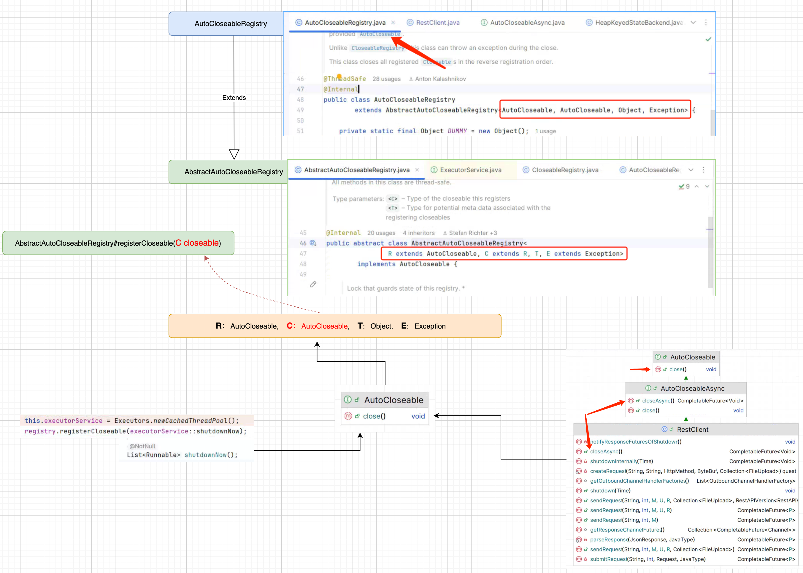

# Flink SQL - SQL Client - 探索 CLI 的实现逻辑 - 读取 SQL      

>Flink version: 1.17.2       

## 引言   
该篇是基于之前 Blog `Flink SQL - SQL Client - 搭建 SQL CLI 调试环境`搭建的环境，所以下面`探索 CLI 的实现逻辑`与它的启动参数紧密相关，命令如下：   
```bash
/data/jdk1.8.0_391/bin/java  ......  /flink-sql-client-1.17.2.jar org.apache.flink.table.client.SqlClient --jar /root/yzhou/flink/flink1172/flink-1.17.2/opt/flink-sql-client-1.17.2.jar    
```  
>这样做的好处是避免看着看着就脱离了主干道 :)。             

## 查看 Log & 意外收货     
在 Linux 环境中使用`./sql-client.sh`时，我看到的是打印 Flink Logo 图案，并没有其他 log信息，注意我表达的是执行`./sql-client.sh`时终端，并不代表`log/flink-root-sql-client-xxx.log`，但log/ 目录很容易被人忽视掉，在写`Flink SQL - SQL Client - 搭建 SQL CLI 调试环境` Blog时，因为配置 log4j策略，控制台会打印出一些执行过程中的 log。如下所示,我做了一些省略标记：       
```bash
D:\Software\JDK\jdk-1.8\bin\java.exe       

[jvm 参数及classpath 区域] 

org.apache.flink.table.client.SqlClient --jar D:\Code\Java\flink-all\flink_release-1.17\flink-table\flink-sql-client\target\flink-sql-client-1.17-SNAPSHOT.jar
Connected to the target VM, address: '127.0.0.1:54952', transport: 'socket'

[Flink 全局参数加载 区域]  

2024-08-05 20:56:02,176 INFO  org.apache.flink.client.cli.CliFrontend                      [] - Loading FallbackYarnSessionCli
2024-08-05 20:56:02,182 WARN  org.apache.flink.core.plugin.PluginConfig                    [] - The plugins directory [plugins] does not exist.
2024-08-05 20:56:02,248 INFO  org.apache.flink.core.fs.FileSystem                          [] - Hadoop is not in the classpath/dependencies. The extended set of supported File Systems via Hadoop is not available.
2024-08-05 20:56:02,438 INFO  org.apache.flink.table.gateway.service.context.DefaultContext [] - Execution config: {execution.savepoint.ignore-unclaimed-state=false, execution.savepoint-restore-mode=NO_CLAIM, execution.attached=true, pipeline.jars=[file:/D:/Code/Java/flink-all/flink_release-1.17/flink-table/flink-sql-client/target/flink-sql-client-1.17-SNAPSHOT.jar, file:/D:/Code/Java/flink-all/flink_release-1.17/devlib/flink-python-1.17-SNAPSHOT.jar], execution.shutdown-on-attached-exit=false, pipeline.classpaths=[], execution.target=remote}
2024-08-05 20:56:04,177 INFO  org.apache.flink.configuration.Configuration                 [] - Config uses fallback configuration key 'rest.port' instead of key 'rest.bind-port'
2024-08-05 20:56:04,340 INFO  org.apache.flink.table.gateway.rest.SqlGatewayRestEndpoint   [] - Starting rest endpoint.
2024-08-05 20:56:07,562 INFO  org.apache.flink.table.gateway.rest.SqlGatewayRestEndpoint   [] - Rest endpoint listening at localhost:54959
2024-08-05 20:56:07,563 INFO  org.apache.flink.table.client.SqlClient                      [] - Start embedded gateway on port 54959
2024-08-05 16:57:48,596 INFO  org.apache.flink.table.client.gateway.ExecutorImpl           [] - Open session to localhost:54959 with connection version: V2.
八月 05, 2024 4:57:53 下午 org.jline.utils.Log logr
警告: Unable to create a system terminal, creating a dumb terminal (enable debug logging for more information)

2024-08-05 16:57:53,398 INFO  org.apache.flink.table.client.cli.CliClient                  [] - Command history file path: C:\Users\yzhou\flink-sql-history

[Flink icon 图标 区域]

        Welcome! Enter 'HELP;' to list all available commands. 'QUIT;' to exit.

Command history file path: C:\Users\yzhou\flink-sql-history

Flink SQL> 
```  

看到 log 确实让我有`1`处意外收获：  
**第一处**   
```bash 
2024-08-05 20:56:04,340 INFO  org.apache.flink.table.gateway.rest.SqlGatewayRestEndpoint   [] - Starting rest endpoint.
2024-08-05 20:56:07,562 INFO  org.apache.flink.table.gateway.rest.SqlGatewayRestEndpoint   [] - Rest endpoint listening at localhost:54959
2024-08-05 20:56:07,563 INFO  org.apache.flink.table.client.SqlClient                      [] - Start embedded gateway on port 54959
2024-08-05 16:57:48,596 INFO  org.apache.flink.table.client.gateway.ExecutorImpl           [] - Open session to localhost:54959 with connection version: V2.
```

它会启动一个内嵌的 `gateway`,并且它的链接版本是 V2，首先这让我意外的原因是：在工作中大多数使用的是 1.14.x 和 1.15.x，官网`SQL GateWay`组件是在1.16.x 发布的，学习其他 Blog 中多多少少会涉及到 SQL GateWay的集成，这也激发了我的好奇心，没想到在 Flink SQL Cli 遇到，SQL GateWay的出现给 Flink SQL 平台化增加了实现的多样性。（具体啥优势，后面接着探索）    

如果大家跟我一样不太清楚的话，可访问Flink 1.17 Flink SQL 官网`https://nightlies.apache.org/flink/flink-docs-release-1.17/docs/dev/table/sqlclient/#starting-the-sql-client-cli`, 它是有说明的。        
```bash
In the gateway mode, the CLI submits the SQL to the specified remote gateway to execute statements.
Note SQL Client only supports connecting to the REST Endpoint since version v2.
See SQL Client startup options below for more details.
``` 

   

接下来，我们接着探索`org.apache.flink.table.client.SqlClient#main()`的实现逻辑。     

>### Jline3   
Flink SQL Cli 终端交互是使用`Jline3`,在很多 Java开发的 Cli 项目中使用的是 Jline3或者 Jline（版本差异），它确实非常好用，大家可访问官网地址：https://github.com/jline/jline3，了解更多它的实现细节，上手的话，可从官网提供的 Demo 入手`https://github.com/jline/jline3/wiki/Demos`, 如果你要调试 Jline3 的 Demo (有2处需要注意：第一处jline-terminal-ffm 需要jdk 22，其他是 jdk1.8， 第二处：若是 使用Windows，建议使用 `JetBrains GateWay`开发工具对 Linux平台远程开发，避免不兼容 Windows)。

     

Jline3 仅是 SQL 输入方式和输出方式的一种实现，该篇 Blog 不会太多介绍如何输入，若将 Jline3换成 Web CLI 仅仅是输入、输出方式发生改变，但并不会影响其内部实现，关于 Jline3所关心的重心是 SQL 是从 Jline3的哪个方法读取出来的，针对多行是如何处理，怎么判断SQL输入结束。对于Jline3的使用，大多数是混个`脸熟`。   

          

## 入口 main   
`org.apache.flink.table.client.SqlClient#main()`是 Sql Cli 的入口 main()方法, 下面通过一个逻辑图快速的跳入`SqlClient#start()`方法。     
    

**SqlClient#start()**  
```java
private void start() {
    if (isGatewayMode) {
        
        省略部分代码 ......

    } else {
        DefaultContext defaultContext =
                DefaultContextUtils.buildDefaultContext(
                        (CliOptions.EmbeddedCliOptions) options);
        try (EmbeddedGateway embeddedGateway = EmbeddedGateway.create(defaultContext);
                Executor executor =
                        Executor.create(
                                defaultContext,
                                InetSocketAddress.createUnresolved(
                                        embeddedGateway.getAddress(),
                                        embeddedGateway.getPort()),
                                options.getSessionId())) {
            // add shutdown hook
            Runtime.getRuntime().addShutdownHook(new ShutdownThread(executor, embeddedGateway));
            openCli(executor);
        }
    }
}
```

解析`SqlClient#main()`传递的 args 参数，得到 mode是空字符串，所以 `isGatewayMode`是 false，会走 else语句，这段代码重要的部分是两个 create()方法。   

## 启动 Embedded Gateway,第一个 create()   
```java
EmbeddedGateway embeddedGateway = EmbeddedGateway.create(defaultContext);     
```
`EmbeddedGateway.create()`创建了一个 HTTP Server 服务，因为它是内嵌模式，所以它的 host 值是`localhost`,其 port 是由`NetUtils#getAvailablePort()`方法随机生成的，因为它使用`ServerSocket serverSocket = new ServerSocket(0)`,当 ServerSocket 构造方法传入的是 0时，会请求系统分配一个空闲端口，还有特别的 `FileLock` 文件锁的处理逻辑。像 SqlClient进程，经常会出现在同一台机器上可能启动多个，它们都需要动态分配端口，那么文件锁可以确保在同一时间只有一个进程能够成功锁定一个特定的端口文件，确保端口唯一性和进程间的互斥访问。`这是个不错的解决方案`。     

       

```java
public static EmbeddedGateway create(DefaultContext defaultContext) {
        NetUtils.Port port = NetUtils.getAvailablePort();

        Configuration defaultConfig = defaultContext.getFlinkConfig();
        Configuration restConfig = new Configuration();
        // always use localhost
        restConfig.set(SqlGatewayRestOptions.ADDRESS, ADDRESS);
        restConfig.set(SqlGatewayRestOptions.PORT, port.getPort());  // 获取随机 Port端口
        defaultConfig.addAll(
                restConfig,
                getSqlGatewayOptionPrefix(SqlGatewayRestEndpointFactory.IDENTIFIER));
        SqlGateway sqlGateway =
                new SqlGateway(defaultConfig, new SingleSessionManager(defaultContext));
        try {
            sqlGateway.start();
            LOG.info("Start embedded gateway on port {}", port.getPort());
        } catch (Throwable t) {
            closePort(port);
            throw new SqlClientException("Failed to start the embedded sql-gateway.", t);
        }

        return new EmbeddedGateway(sqlGateway, port);
}
```

create()方法中创建 SqlGateway 对象，这里我们先忽略一些非主干的逻辑（当时认为的非主干，大多数用到，再去看会更深刻），通过`SqlGateway#start()`调用到`endpoint.start()`。    
  

**SqlGateway#start()**  
```java
public void start() throws Exception {
    sessionManager.start();

    SqlGatewayService sqlGatewayService = new SqlGatewayServiceImpl(sessionManager);
    try {
        endpoints.addAll(
                SqlGatewayEndpointFactoryUtils.createSqlGatewayEndpoint(
                        sqlGatewayService, defaultConfig));
        for (SqlGatewayEndpoint endpoint : endpoints) {
            endpoint.start();
        }
    } catch (Throwable t) {
        LOG.error("Failed to start the endpoints.", t);
        throw new SqlGatewayException("Failed to start the endpoints.", t);
    }
}
```

`SqlGatewayEndpointFactoryUtils.createSqlGatewayEndpoint()` 得到的是`SqlGatewayRestEndpoint`对象，在调用`endpoint.start()`方法时触发的是`RestServerEndpoint#start()`方法。     

如果你看过我之前 Blog`Flink 源码 - Standalone - 探索 Flink Stream Job Show Plan 实现过程 - 构建 StreamGraph`，内容中简单介绍过`Flink Web UI`的`WebMonitorEndpoint`的启动过程，Flink Web UI的 HTTP Server 是由`WebMonitorEndpoint`提供的（它是由 Netty实现的 Server），我在调试`Show Plan`功能时会频繁涉及到 Netty Handler的处理流程，如下图：   
     


 
那看下 `SqlGatewayRestEndpoint类图`：     
   

SqlGatewayRestEndpoint 和 WebMonitorEndpoint 同样继承 RestServerEndpoint，其实到这里，`盲猜`都可以理解到任何一个类继承了`RestServerEndpoint` 代表着会启动一个 Netty Server。 :)    

Netty Server 的 `Handlers` 才是 Server的处理核心,若这句话不太了解，强烈建议单独手写一个 Netty Server时有哪些步骤（**希望我没有说错**），说明这点是有目的的，因为 SqlGatewayRestEndpoint 和 WebMonitorEndpoint 必须要实现 `RestServerEndpoint#initializeHandlers()`方法，否则没有 Handlers，它定义了 Netty Server 可以接受到请求的 URL。在后面 Flink SQL 执行环节其实会发起一个 HTTP 请求到 Embedded Gateway  Server，后面会继续介绍 `SqlGatewayRestEndpoint`。    

到目前为止，我们知晓了`SqlGatewayRestEndpoint`的构造，那么接下来，了解 Jline3 是如何控制输入内容的。    

## 初始化网络 Seesion 会话,第二个 create()   
```java
省略部分代码 ......

        Executor executor =
                Executor.create(
                        defaultContext,
                        InetSocketAddress.createUnresolved(
                                embeddedGateway.getAddress(),
                                embeddedGateway.getPort()),
                        options.getSessionId())) {

省略部分代码 ......   
```

下面图片展示的是`Executor.create()` 的核心流程。     
     

首先是创建线程池用于初始化`RestClient`（后续网络是由 RestClient 发起），拼接`v2/seesion`请求，首次进行网络请求，参数中包含 sessionName 和 flink 配置参数，其中 sessionName 默认是"default"，SqlGatewayRestEndpoint 的 `OpenSessionHandler#handleRequest()`方法来处理`v2/seesion`请求，它会返回一个唯一的 UUID，作为当前 Seesion 标识；     

若首次请求成功后，会再创建一个定时线程池，每间隔 60s 发起一次心跳请求，url 为`/sessions/:session_handle/heartbeat`, url中的`:session_handle`参数是请求`v2/seesion`获取的。    

在`ExecutorImpl#ExecutorImpl()`构造方法中，大家会多次看到`registry.registerCloseable()`方法调用,这点也不难理解，当线程或者进程关闭时，我们希望相关的资源也可以被关闭，最常见的资源例如文件句柄，网络链接，线程池，这样可以避免资源浪费或者占用。      
**ExecutorImpl#ExecutorImpl()**    
```java
@VisibleForTesting
ExecutorImpl(
        DefaultContext defaultContext,
        InetSocketAddress gatewayAddress,
        String sessionId,
        long heartbeatInterval) {
    this.registry = new AutoCloseableRegistry();
    try {
        
        ...

        registry.registerCloseable(executorService::shutdownNow);
        this.restClient = new RestClient(defaultContext.getFlinkConfig(), executorService);
        registry.registerCloseable(restClient);
        
        ...

        this.sessionHandle = new SessionHandle(UUID.fromString(response.getSessionHandle()));
        registry.registerCloseable(this::closeSession);

        // heartbeat
        ScheduledExecutorService heartbeatScheduler =
                Executors.newSingleThreadScheduledExecutor();
        registry.registerCloseable(heartbeatScheduler::shutdownNow);
        
        ...
}
```

不知道大家看到`registry.registerCloseable()`方法有没有其他疑惑，例如下面两行代码：  
```java
registry.registerCloseable(executorService::shutdownNow);  
registry.registerCloseable(restClient);   
```

在之前 Blog`Flink 源码 - Standalone - 通过 StreamWordCount 探索 ValueState`介绍过根据 type 创建对应的 State，若读者看过之后，暂时没有印象，可回去阅读 Blog`Flink 源码 - Standalone - 通过 StreamWordCount 探索 ValueState`。        
如下图所示：    
     

`executorService::shutdownNow`与 `(StateCreateFactory) HeapValueState::create`使用略微有些不同，在之前 Blog`Flink 源码 - Standalone - 通过 StreamWordCount 探索 ValueState`介绍`(StateCreateFactory) HeapValueState::create`的时候，强调过`StateCreateFactory`接口的`createState()`方法与`HeapValueState::create`方法的返回值和形参是一模一样，但`executorService::shutdownNow`并不是，它返回的是`List<Runnable>`, 我自己当时看到的时候也很懵逼，这块大家可以这么理解：
    
 
首先，方法引用会被自动转换为一个符合目标函数式接口的实例,当`executorService::shutdownNow` 被传递给 `registerCloseable()`方法时，它期待一个 AutoCloseable 实例。而 AutoCloseable 接口只有一个方法：   
```java
void close() throws Exception;
```

虽然 `shutdownNow()` 方法的确返回一个`List<Runnable>`，但在这种情况下，这个返回值并不重要。Java 编译器允许将 `executorService::shutdownNow` 作为 AutoCloseable 的实现，因为在 close() 方法中，shutdownNow 的返回值会被忽略。 
具体来说，方法引用被看作是：                
```java
AutoCloseable closeable = () -> { executorService.shutdownNow(); };
```

以上两个主要的 create()方法介绍完成后，进入 Jline3的构造。    

## Jline3 输入 Flink SQL        
我想你应该有使用过`./sql-client.sh`，若还没有，建议可实操它，`真实的实操可以带给你一些现象或者结论`;       

在`sql-client.sh`实践中，关于 cli，可得到以下结论：    
* 支持多行    
* 输入以`;`为结尾       

接下来我们探索`openCli(executor)`方法；        
**SqlClient#openCli()**
```java
private void openCli(Executor executor) {
    Path historyFilePath;
    if (options.getHistoryFilePath() != null) {
        historyFilePath = Paths.get(options.getHistoryFilePath());
    } else {
        historyFilePath =
                Paths.get(
                        System.getProperty("user.home"),
                        SystemUtils.IS_OS_WINDOWS ? "flink-sql-history" : ".flink-sql-history");
    }

    boolean hasSqlFile = options.getSqlFile() != null;
    boolean hasUpdateStatement = options.getUpdateStatement() != null;
    if (hasSqlFile && hasUpdateStatement) {
        throw new IllegalArgumentException(
                String.format(
                        "Please use either option %s or %s. The option %s is deprecated and it's suggested to use %s instead.",
                        CliOptionsParser.OPTION_FILE,
                        CliOptionsParser.OPTION_UPDATE,
                        CliOptionsParser.OPTION_UPDATE.getOpt(),
                        CliOptionsParser.OPTION_FILE.getOpt()));
    }

    try (CliClient cli = new CliClient(terminalFactory, executor, historyFilePath)) {
        if (options.getInitFile() != null) {
            boolean success = cli.executeInitialization(readFromURL(options.getInitFile()));
            if (!success) {
                System.out.println(
                        String.format(
                                "Failed to initialize from sql script: %s. Please refer to the LOG for detailed error messages.",
                                options.getInitFile()));
                return;
            } else {
                System.out.println(
                        String.format(
                                "Successfully initialized from sql script: %s",
                                options.getInitFile()));
            }
        }

        if (!hasSqlFile && !hasUpdateStatement) {
            cli.executeInInteractiveMode();   // 核心  
        } else {
            cli.executeInNonInteractiveMode(readExecutionContent());
        }
    }
}
```

`SqlClient#openCli()`方法中的大部分逻辑比较好理解，因为很大一部分的篇幅在于参数解析参数和构造`CliClient`, 而参数部分，可以使用`./sql-client.sh -h`来查看参数帮助doc。 命令如下：     
```bash
[root@vm01 bin]# ./sql-client.sh -h
./sql-client [MODE] [OPTIONS]

The following options are available:

Mode "embedded" (default) submits Flink jobs from the local machine.

  Syntax: [embedded] [OPTIONS]
  "embedded" mode options:
     -f,--file <script file> 

  省略部分 doc ......
```

`cli.executeInInteractiveMode();`是我们要重点关注的方法，获取Jline3 `terminal`,创建`LineReader`对象读取输入的 SQL 内容;      

若你和我一样，对 Jline3 没有深入了解过，我觉得也没必要过多补它的知识点，因为 Jline3 它的几个核心类负责的功能模块划分的挺清晰的（可以把 Jline3 源码中demo 示例跑一跑），例如： LineReader 负责读取输入内容，但它在`CliClient#getAndExecuteStatements()`方法中依然是通过`While(true)`来拼接输入内容。       
   

```java
LineReader lineReader = createLineReader(terminal, ExecutionMode.INTERACTIVE_EXECUTION);     
```
`createLineReader()`方法创建了 Jline3的核心类，它负责读取输入的内容，这里特别注意`SqlMultiLineParser`,它会作为 LineReader对象的一部分，负责对输入的内容进行解析。它继承了`Jline3 的 DefaultParser`，它是一种默认实现（在 Jline3 源码中Repl demo示例中直接使用了`DefaultParser`）  
**Jline3 源码 org.jline.demo.Repl#main()**  
      

**SqlMultiLineParser#parse()**  
```java   
 @Override
public ParsedLine parse(String line, int cursor, ParseContext context) {
    if (context != ParseContext.ACCEPT_LINE) {
        return parseInternal(line, cursor, context);
    }
    if (!line.trim().endsWith(STATEMENT_DELIMITER)) {
        throw new EOFError(-1, -1, "New line without EOF character.", NEW_LINE_PROMPT);
    }
    try {
        parseException = null;
        Command command = parser.parseStatement(line).orElse(null);
        if (command == null) {
            throw new EOFError(-1, -1, "New line without EOF character.", NEW_LINE_PROMPT);
        }
        switch (command) {
            case QUIT:
                printer = Printer.createQuitCommandPrinter();
                break;
            case CLEAR:
                printer = Printer.createClearCommandPrinter();
                break;
            case HELP:
                printer = Printer.createHelpCommandPrinter();
                break;
            default:
                {
                    if (mode == CliClient.ExecutionMode.INITIALIZATION) {
                        executor.configureSession(line);
                        printer = Printer.createInitializationCommandPrinter();
                    } else {
                        StatementResult result = executor.executeStatement(line);
                        ReadableConfig sessionConfig = executor.getSessionConfig();
                        if (mode == CliClient.ExecutionMode.NON_INTERACTIVE_EXECUTION
                                && result.isQueryResult()
                                && sessionConfig.get(SqlClientOptions.EXECUTION_RESULT_MODE)
                                        != ResultMode.TABLEAU) {
                            throw new SqlExecutionException(
                                    String.format(
                                            "In non-interactive mode, it only supports to use %s as value of %s when execute query. "
                                                    + "Please add 'SET %s=%s;' in the sql file.",
                                            TABLEAU,
                                            EXECUTION_RESULT_MODE.key(),
                                            EXECUTION_RESULT_MODE.key(),
                                            TABLEAU));
                        }
                        printer = Printer.createStatementCommandPrinter(result, sessionConfig);
                    }
                    break;
                }
        }
    } catch (SqlExecutionException e) {
        if (e.getCause() instanceof SqlParserEOFException) {
            throw new EOFError(-1, -1, "The statement is incomplete.", NEW_LINE_PROMPT);
        }
        // cache the exception so that we can print details in the terminal.
        parseException = e;
        throw new SyntaxError(-1, -1, e.getMessage());
    }
    return parseInternal(line, cursor, context);
}
```   

在`SqlMultiLineParser#parse()`方法中，下面几行特殊的代码，判断 line 是否已`;`结果，若不是，则抛出一个异常，此时在`SqlMultiLineParser#parse()`方法中并没有捕获`EOFError`异常，而该异常是由 LineReader 的实现类`LineReaderImpl#acceptLine()`方法中捕获的；  
```java
if (!line.trim().endsWith(STATEMENT_DELIMITER)) {
    throw new EOFError(-1, -1, "New line without EOF character.", NEW_LINE_PROMPT);
}
```

**LineReaderImpl#acceptLine()**     
```java
protected boolean acceptLine() {
    this.parsedLine = null;
    int curPos = 0;
    if (!this.isSet(Option.DISABLE_EVENT_EXPANSION)) {
        try {
            String str = this.buf.toString();
            String exp = this.expander.expandHistory(this.history, str);
            if (!exp.equals(str)) {
                this.buf.clear();
                this.buf.write(exp);
                if (this.isSet(Option.HISTORY_VERIFY)) {
                    return true;
                }
            }
        } catch (IllegalArgumentException var5) {
        }
    }

    try {
        curPos = this.buf.cursor();
        this.parsedLine = this.parser.parse(this.buf.toString(), this.buf.cursor(), ParseContext.ACCEPT_LINE);
    } catch (EOFError var6) {
        EOFError e = var6;
        StringBuilder sb = new StringBuilder("\n");
        this.indention(e.getOpenBrackets(), sb);
        int curMove = sb.length();
        if (this.isSet(Option.INSERT_BRACKET) && e.getOpenBrackets() > 1 && e.getNextClosingBracket() != null) {
            sb.append('\n');
            this.indention(e.getOpenBrackets() - 1, sb);
            sb.append(e.getNextClosingBracket());
        }

        this.buf.write(sb.toString());
        this.buf.cursor(curPos + curMove);
        return true;
    } catch (SyntaxError var7) {
    }

    this.callWidget("callback-finish");
    this.state = LineReaderImpl.State.DONE;
    return true;
}
```

在`LineReaderImpl#acceptLine()`方法捕获了`catch (EOFError var6)`，通过这里，你应该可以了解到 Flink SQL CLI的多行处理依赖于 `SqlMultiLineParser#parse()`抛出的异常，动态拼接`\n`，若不是`;`结尾，则写入到 buf中。 （`Jline3的LineReaderImpl`的 Buffer buf 用于存放的CLI输入的内容，这里并不是重点，暂时不做延伸了）      

## 总结   
现在我们已经知道 SQL内容了，那它又是如何执行的呢？ 在后面的 Blog 会继续介绍集成 `Embedded Gateway`后 Flink SQL 执行逻辑。   

Blog 过长后，自己会感觉到无法凸出一些重点。     

refer      
1.https://nightlies.apache.org/flink/flink-docs-release-1.17/docs/dev/table/sqlclient/     