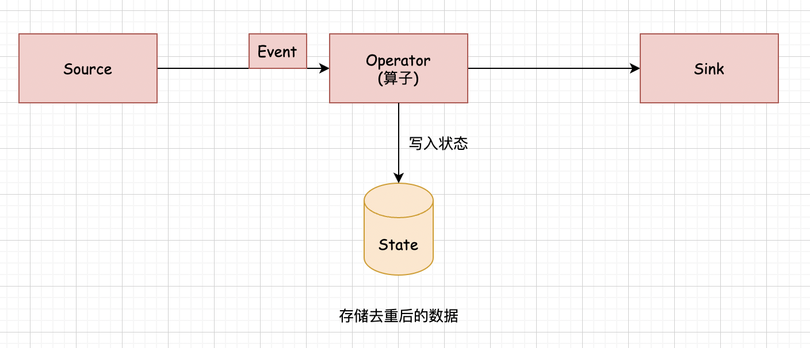
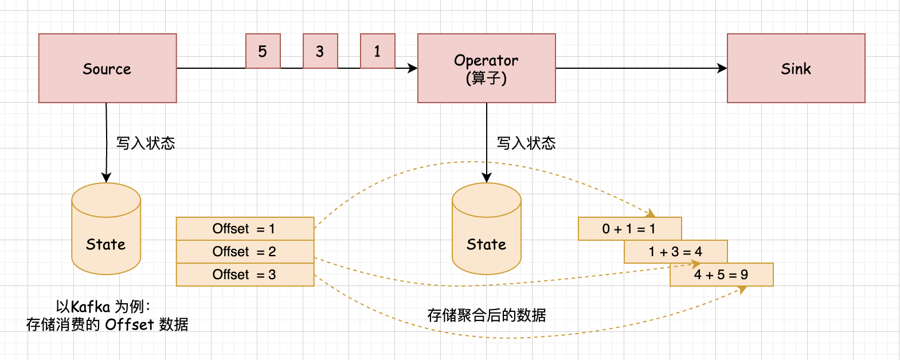

## 什么是 State (状态)   

### 引言    
状态是非常重要的！！！  下面来分析一下什么是状态, 比较官方一点的定义是这样的：当前流计算任务执行过程中需要用到之前的数据，那么这些之前的数据就可以称之为 状态, 所以说针对流计算任务中的状态, 其实可以理解为历史流数据。     

我们举个生活中的例子,就是我们每个人的大脑中存储的昨天，前天的信息也可以认为是状态.      

状态在代码层面体现，其实就是一种存储数据的数据结构，类似于Java中的 List, map 之类的数据结构，它（状态）的出现主要是为了解决流计算中的两大问题:      
* 第一个问题：解决流计算中需要使用流数据的问题, 例如一些流计算的去重场景,当然你在流计算中实现去重操作也可以借助于外部存储系统来实现去重, 但是状态的引入可以实现不依赖于外部存储系统来存储中间数据，最终实现去重操作。       

* 第二个问题：解决流计算中数据一致性的问题。但是注意： 单纯使用状态是解决不了的，需要结构 Checkpoint 机制一起实现。例如： 金融数据的流计算场景,它对结果的准确度要求比较高，需要保证任务故障重启后结果数据依然是准确的, 不能出现重复或者数据丢失的情况。         

下面我们来通过两个图加深一下理解:   
  

上图中里面显示了 Flink 实现流计算去重的业务流程，这里面的 Source 组件,它会接入实时数据流，中间在具体的算子中对实时数据进行去重,在这里面去重的时候，它借助于 State 实现去重也就是将 Source 传输过来的数据通过算子存储到 State 中, 在 State 中只保留不重复的数据，最后通过 Sink 组件将需要的结果数据写出去，刚才我们说了这里其实也可以通过外部存储系统来实现去重, 就把这个 State 替换为外部存储系统也是可以的，例如：我们可以通过 Redis 实现数据去重的效果，但是有点大材小用了，引入外部存储系统会增加 Flink 任务的复杂度, 那在里面使用 State 这个轻量级解决方案是比较合适的，那大家可能还有一个疑问, 针对这里面实现的这个去重功能，那我在 Flink 中直接 new 一个基于内存的 Set 集合来存储历史接受到的数据，这样是不是也可以实现数据去重的效果。 是可以的。这样也可以实现数据去重重要效果，但是如果任务发生了异常，它重启之后基于内存中的 Set 集合中的数据就没了,这样会导致任务重启后数据无法恢复到之前的样子 State存储的数据默认也是在内存中, 不过 State 它借助于 Checkpoint 机制，可以将内存中的数据持久化到 HDFS 中，这样可以实现任务重启后 State 数据的恢复。  

### 示例 
接下来我们来看一下第二个图：    
      

上图里面显示了 Flink 在对金融数据实现实时累加求和时的业务场景, 这个 Source 组件，它对接的是 Kafka 中的数据，中间通过算子实现数据累加求和, 将聚合后的结果数据存储在 State 中，最终通过 Sink 组件将聚合后的结果数据写出去，这里我们为了保证数据累加求和计算任务失败重启后数据的准确性。除了需要在 State 中去维护每次累加求和后的中间结果, 还需要维护消费者对应的 Offset 偏移量信息。  

在这个图里面:   
* 当 Source 组件它消费到第一条数据1的时候,此时 Offset 偏移量会等于1，后面的算子接受到第一条数据1的时候会对它进行累加求和，那产生的结果还是1， 此时 Source 组件会在 State 中去写入 Offset = 1， 同时算子也会在它对应的 State 中去写入累加后的结果 1, 所以说这个 Offset和对应的这个结果，他们两个是一一对应的, 都会同时维护到这个对应的状态里面，假设这个时候触发了 Checkpoint 操作,就会把状态中维护的这些数据持久化到 HDFS中，便于后期状态的时候使用,        

* 当 Source 组件消费到第二条数据3的时候,此时 Offset 偏移量会等于2，后面的算子接受到第二条数据3的时候,也会和上一次的结果累加求和，所以产生的结果是 1 + 3 = 4，此时 Source 组件会在状态去写入 Offset = 2,同时算子也会在它对应的这个状态中去写入累加后的结果4, 那假设这个时候，也触发了Checkpoint 操作，那么也会把这个状态中存储的这些数据持久化到HDFS中， 

* 当 Source 组件消费到第三条数据5的时候，此时Offset 偏移量会等于3，后面的算子接受到第三条数据5的时候，也会和之前的数据去累加求和，结果等于9，那假设这个时候也触发了 Checkpoint 操作,它也会把状态中存储的数据持久化到HDFS中      

后面再来新数据的话，也是按照这个流程去执行, 那如果 Flink 任务这个时候将第四条数据给它消费出来了, 并且把这条数据发送给后面的算子去计算，但是在计算的时候,由于网络异常出现了问题导致任务异常结束，当网络恢复正常后，我们重启任务,此时可以基于上一次 Checkpoint 持久化的数据去恢复任务中的这个状态, 就是把状态里面维护的这些数据给它恢复出来，这样就可以将消费者的 Offset 重置到3，算子中累加的这个结果给它重置为9，那接下来你可以继续正常去消费第4条数据进行计算。    

这样是不是就可以保证数据的准确性了， 注意： 如果使用的是 Java 中的 map 或者 list 来存储这个 Offset 偏移量以及算子中的这个中间结果， 那 Checkpoint的 时候,它是无法将这些数据持久化到 HDFS 里面的，只有状态中的数据才可以, 这是 Flink 框架默认实现的机制，并不是所有的数据都可以被 Checkpoint 持久化的, 正因为如此，在这种场景下面，我们才需要使用这个 State, 也就是状态。        

