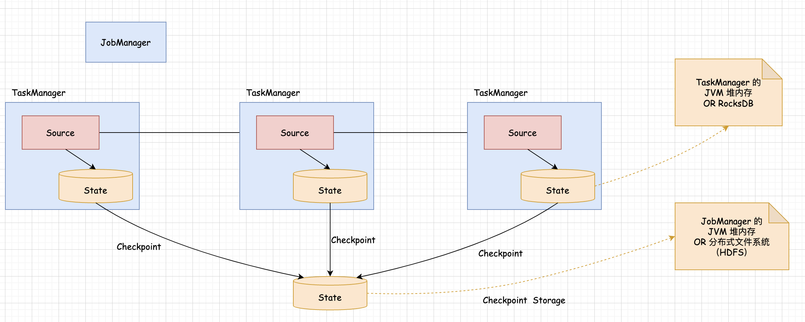

## State 相关概念整体概览       

## 引言 
针对 State 涉及到相关概念比较多，所以在这里面我们首先从全局层面分析一下这些概念, 这样可以构建一个全局观，便于后面的深入理解，看下图：   
          

首先看这个图里面蓝色的这些方框，主要包含 JobManager 和 TaskManager, JobManager 对应的是 Flink 集群的主节点，TaskManager 对应的是 Flink 集群的从节点, 假设我们想 Flink 集群中提交了一个流计算任务，这个任务包含了 Source，map 和 Sink 这三块，其中 Source 负责从 Kafka 中消费数据, 为了保证任务重启后的数据准确性，Source 组件会把消费到的 Offset 数据保存到 State 中。map 算子也会把计算的中间结果数据保存到 State 中, Sink 也会把某些数据保存到 State 中，这样可以便于后期的数据恢复保证数据的准确性。 

默认情况在 Source,map 和 Sink 写入到 State 中的数据会存储在 TaskManager 节点的 JVM 堆内存中， 官方也可以支持将这些 State 数据存储到 RocksDB 这个内嵌数据库中。 RocksDB 数据库中的数据会存储在对应节点的本地磁盘文件中,它是一个内嵌的本地数据库，当满足一定时机的情况下 Flink 任务会触发 Checkpoint 操作, 当执行 Checkpoint 操作的时候，它会将默认存储 TaskManager 节点, JVM 堆内存中的这些 State 数据保存到另外一个地方，统一全部都保存到这个地方, 这个地方可以是 TaskManager 的 JVM 堆内存中，也可以是分布式文件系统中, 例如 HDFS，初始的这些 State 数据，它的存储位置是由 StateBackend 这个功能控制，Checkpoint 的 State 数据的存储位置是由 Checkpoint Storage 这个功能控制的，这就涉及到状态的 Flink 任务的整体执行流程以及 Checkpoint 时的大致流程。        