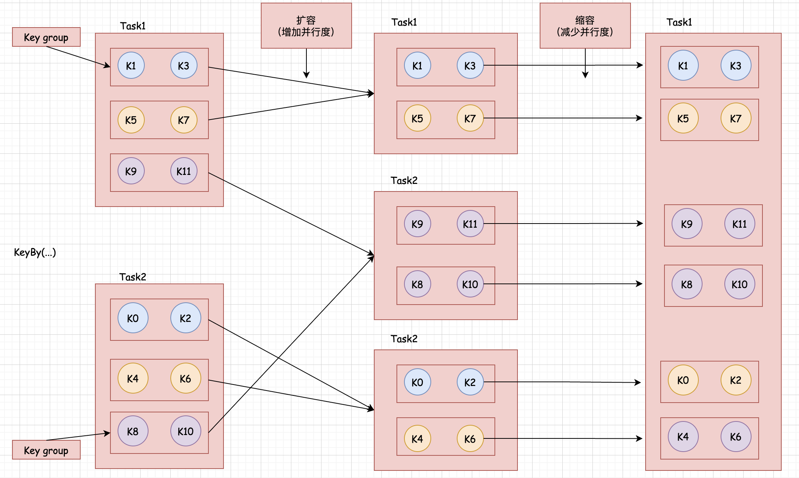
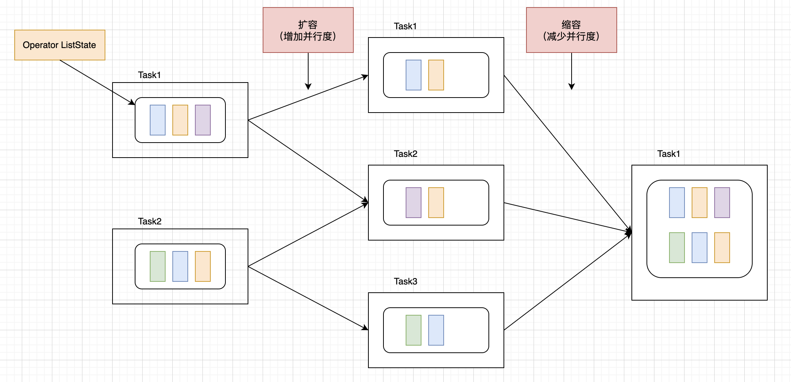
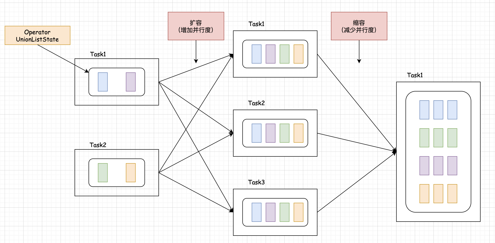
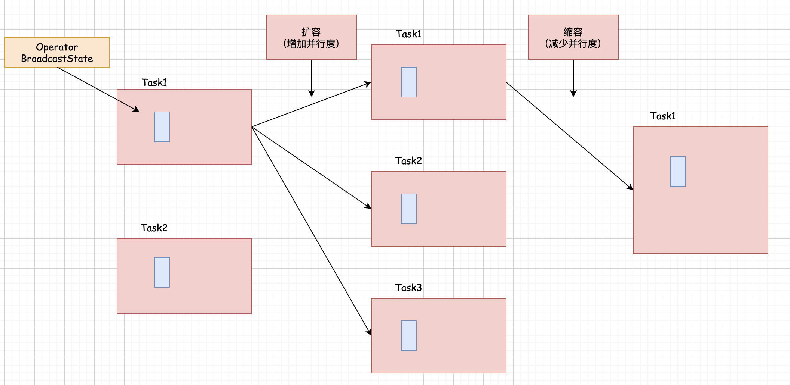

## State（状态）的类型      

### 引言    
前面我们对状态有了基本的了解，其实状态对应就是数据，这些数据会涉及到存储和恢复，任务正常运行的时候会向状态中写入数据, 在任务重启的时候会涉及到状态的恢复。      

### 状态类别    
Flink 从管理层面对这些状态进行了划分：      
* 一种是 Raw State, 中文翻译为原生状态      
* 另外一种是 Managed State, 中文翻译为托管状态          

那这两种类型的状态有什么区别吗？        

下面来详细分析一下，看这个表格，这里面我们从三个角度进行分析:       

|           |    Raw State  |  Managed State  |
| :-------- | --------:| :--: |
| 管理方式   |  开发者自己管理，需要自己进行序列化 |  Flink Runtime 托管，自动存储，自动恢复   |
| 数据结构   |  只支持字节数组： byte[] |  支持多种数据结构：MapState,ListState,ValueState 等 |
| 使用场景   |  在自定义 Operator 时 | 所有数据流场景中  |      

原生状态主要在自定义 Operator 时使用，Operator 是 DataSource,Transform 以及 DataSink 这三块的统称。 
托管状态在所有数据流场景中都是可以使用的。                  

### 托管状态（Managed State）的类型     
从作用域层面进行划分，还可以细分为两种类型，一种是 KeydedState, 还有一种是 OperatorState ，这两种类型的 State 支持的数据结构是不一样的。        

| Keyed State |  Operator State  |  
| :-------- | --------:| 
| ValueState   |  ListState   |
| ListState   |  UnionListState  |
| ReducingState   |  BroadcastState  | 
| AggregatingState   |    | 
| MapState   |    |   

接下来，我们从4个角度进行分析:      

|           |    Keyed State  |  Operator State  |
| :-------- | --------:| :--: |
| 使用场景   |  基于 keyedStream 数据流 |  基于任何数据流   |
| 分配方式   |  每个相同的 Key 共享一个 State |  算子的同一个子任务共享一个 State |
| 创建方式   |  getRuntimeContext | context  | 
| 扩缩容模式   |  以 KeyGroup 为单位重分配 | 均匀分配或者广播分配  |            

### 扩缩容模式  
针对 扩缩容模式，下面有几个图，来看一下：       

#### 针对 Keyed State类型的状态的扩缩容模式     
          

看上图，左边的 task1 和 task2 表示的是 keyBy 后面连接的某个算子的2个并行实例,表示这个算子的并行度为2，中间的 task1，task2 和 task3 表示任务重启后将 keyBy 后面那个算子的并行度改为了3，右边的 task1 表示任务又一次重启后, 将 keyBy 后面那个算子的并行度又改为了1，这个图里面显示的是 Flink 任务的同一个算子在任务重启后算子并行度发生变化时状态的分配情况，基于 Keyed State 类型状态的算子在扩缩容时会根据新的算子并行度数量对状态重新分配, 不过为了降低状态数据在不同任务之间的迁移成本，Flink 对这些状态做了分组, 会按照所有状态的 key 进行分组，划分成多个 keyGroup, 每个 keyGroup 内部包含一部分 key 的状态，以 keyGroup 为单位重新分配状态数据。 

在上图里面，最开始这个算子的并行度为2，它会产生 2个 task，task1 和 task2，其中 task1 里面 K1 和 K3 的状态被划分到了1个 keyGroup 里面， K5 和 K7 的状态被划分到另1个 keyGroup, K9 和 K11 的状态被划分到了一个 keyGroup Task2 里面的也是类似这样而效果,也划分出了一些 keyGroup 此时当这个任务异常结束，重新启动的时候,我们对这个算子的并行度进行了调整，改成了3，相当于增加了并行度, 那么这个时候，算子在运行时会产生3个 task，分别是这里面的 task1，task2 和 task3, 这个时候，在对状态数据进行恢复的时候，就需要将之前2个 task 产生的状态数据恢复到最新的3个task 里面，那这些状态数据它就会按照 keyGroup 为单位, 均匀分发到这3个 task 中，当这个任务重启运行了一段时间之后，由于某些异常情况导致任务又停止，那我们重新再启动的时候, 将算子的并行度改成1，相当于 减少并行度，此时这个算子在运行的时候只会产生1个task。 这个时候在对状态进行恢复的时候，就需要将之前3个 task 产生的状态数据恢复到这1个task 中，这些状态数据，会按照 keyGroup为单位分配到这个1个task 中, 这就是 keyed State 类型的状态在任务重启,并行度发生了变化时状态的分配方式。 

那接下来我们来看一下 Operator State 类型的状态的扩缩容模式，在这里需要针对 Operator State 中的不同数据结构进行单独分析， 首先针对 ListState 这种数据类型:       
  

如果算子中使用到了 Operator State 类型中的 ListState 这种状态，那么算子在扩缩容时会对 ListState 中的数据重新分配，它的大致流程如下：    
这个算子的所有并行运行的task 中的 ListState 数据会被统一收集起来，然后均匀分配给更多的task或者更少的task,在上图里面最开始这些ListState中的数据在2个task中维护, 那后面任务重启了并行度变成了3以后 它会将之前的状态数据均匀分配给这3个task,当后面任务再重启,并行度又发生了变化,变成1的时候,它那会将之前的状态数据都分配给这1个task。  

加下来看下图中，Operator State中的UnionListState：  
 

UnionListState底层其实就是ListState,唯一的区别扩缩容时状态数据分配策略不一样，UnionListState 会把状态全部广播发送给新任务, 最开始这些状态数据在2个task中维护,后面的任务重启之后并行度变成了3，之前task1和task2维护的状态数据都会分配给这3个task, 就是每个人都会收到一份完整的数据,当后面任务又重启了,并行度变成1以后 前面3个task都会将数据分配给这1个task 针对UnionListState这种方式,任务重启恢复状态数据的时候,每个子任务都会收到所有的数据, 但是这个子任务它可以根据一定的策略选择操作部分状态数据, 它收到了所有的但是它也不一定非要用到所有的,它可以根据一定的策略, 每个子任务只使用一部分。当然这个具体就是根据你的业务需求。   

最后一个是OperatorState中的BroadcastState 看这个图 BroadcastState： 
  

在扩缩容时会把状态广播发送给所有的新任务,那这种方式和UnionListState有什么区别吗? 针对UnionListState这种方式 假设算子A的并行度为2, 那么会产生2个task,这2个task中维护的状态数据是不一样的 当任务重启之后, 如果并行度发生了变化,那么算子A的每个子任务都可以接收到之前2个task中维护的状态数据, 而针对BroadcastState这种方式, 假设算子A的并行度为2,那么这2个task中的数据是完全一样的 当务重启之后 如果并行度增加了, 只需要基于某一个task中的状态数据复制到新的task中即可, 如果任务重启后并行度减少了, 只需要简单的去掉多余的task即可,这就是BroadcastState在扩缩容时状态的分配方式。          
