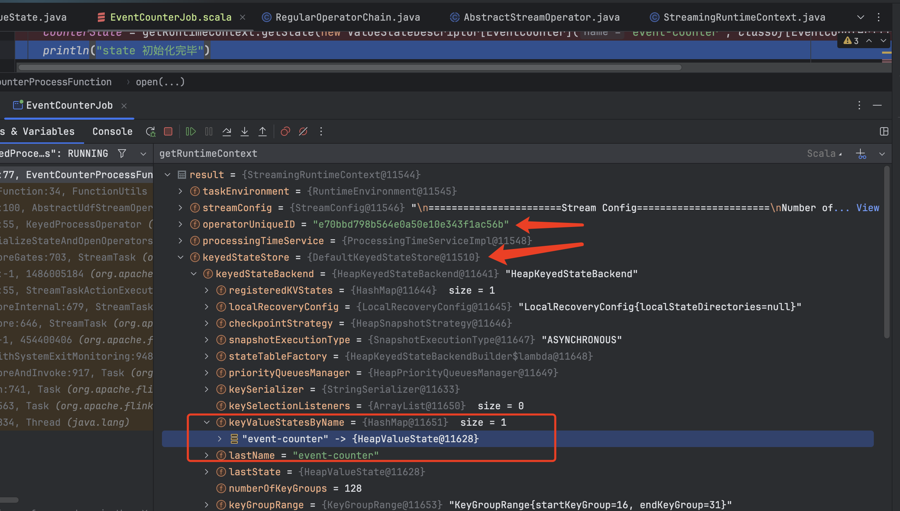

## Flink State HashMapStateBackend 存储介绍 & ValueState 案例分析  

### 引言  
根据上一篇 Blog《Flink 使用 LocalStreamEnvironment（IDEA 开发环境） 验证 State & 从 Checkpoint 恢复 State》了解到`ValueState`的使用以及从Checkpoint 恢复 State数据，接下来探讨 `State 存在在 HashMapStateBackend中相关原理` 。    

### HashMapStateBackend 存储在哪儿？  
参考Flink 官网对 state backends文档 https://nightlies.apache.org/flink/flink-docs-release-1.15/docs/ops/state/state_backends/   

> HashMapStateBackend
在 HashMapStateBackend 内部，数据以 Java 对象的形式存储在堆中(Java 的 heap 上)。 Key/value 形式的状态和窗口算子会持有一个 hash table，其中存储着状态值、触发器。     
HashMapStateBackend 的适用场景：    
* 有较大 state，较长 window 和较大 key/value 状态的 Job。     
* 所有的高可用场景。    
建议同时将 managed memory 设为0，以保证将最大限度的内存分配给 JVM 上的用户代码。          
与 EmbeddedRocksDBStateBackend 不同的是，由于 HashMapStateBackend 将数据以对象形式存储在堆中，因此重用这些对象数据是不安全的。       

根据官网介绍可了解到 `HashMapStateBackend` 是将数据以对象形式存储在堆（jvm 堆内存）中，TaskManager 是 Flink Job 的工作进程，那 HashMapStateBackend 是存储在 TaskManager JVM 的堆内存中。    

### TaskManager JVM 大小如何配置？  
参考Flink 官网对 TaskManger JVM 文档 https://nightlies.apache.org/flink/flink-docs-release-1.15/zh/docs/deployment/memory/mem_setup_tm/   

>注意：如果你是在本地运行 Flink（例如在 IDE 中）而非创建一个集群，那么本文介绍的配置并非所有都是适用的，详情请参考本地执行。 https://nightlies.apache.org/flink/flink-docs-release-1.15/zh/docs/deployment/memory/mem_setup_tm/#local-execution     

因 HashMapStateBackend 是将 state 数据存放在 JVM 堆内存中， 具体调整参数，请参考上面文档即可    

### 案例中 ValueState 存储流程 （不涉及很底层源码处理） 

#### 1.处理函数中定义 ValueState      
在《Flink 使用 LocalStreamEnvironment（IDEA 开发环境） 验证 State & 从 Checkpoint 恢复 State》的代码示例中，通过 Debug 可知：     
  

* counterState 是  HeapValueState;     
  我们设置 statebackend 是 HashMapStateBackend & ValueState 的定义是在 `KeyedProcessFunction`的派生类 `EventCounterProcessFunction`； 
* getRuntimeContext 返回的是 StreamingRuntimeContext；  
  从上图中非常明显看出 `counterState` 是 StreamingRuntimeContext `operatorUniqueID` 算子下以 `HeapkeyStateBackend` 作为存储类别, key 为 “event-counter” 的 HeapValueState 对象。  

* new ValueStateDescriptor() 是用于创建 `ValueState` 对象关键要素。   

>注意，不涉及 State 原理层，目前处于从外到内了解，一边学习，一边总结。      

通过 EventCounterProcessFunction#open() 方法，了解到 `ValueState`的创建（必须从 getRuntimeContext 中定义 ）。 

>注意： 大家会好奇会什么会用 `ValueState`， 其实这里非常像学习 Redis时，我想放一些数据到 Redis ，那我该使用什么数据结构存放呢？ 同理，你需要了解的是`哪种数据结构能满足你的场景，换句话说就是哪种结构适合你的检索`。 任何结构都能存，但这不意味着都适合你的数据`检索`。     

#### 2.ValueState(HeapKeyedStateBackend) 数据结构   
在 Java 开发中，我们常用 Map，List，Array 等等用来存放数据，那 HeapValueState 又如何存储数据呢？   

refer 
1.https://nightlies.apache.org/flink/flink-docs-release-1.15/docs/ops/state/state_backends/   
2.https://nightlies.apache.org/flink/flink-docs-release-1.15/zh/docs/deployment/memory/mem_setup_tm/    
3.https://nightlies.apache.org/flink/flink-docs-release-1.15/zh/docs/deployment/memory/mem_setup_tm/#local-execution    

