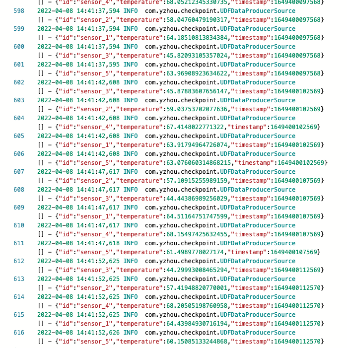

## Job的log time少了8小时

环境：Flink on Kubernetes Application Mode Jar作业，flink v: 1.14.4 
背景：使用DataSteam API开发 消费Kafka再写入CK
问题：Job运行后，发现TaskManager打印的log time少8小时。

### 错误日志
TaskManager Pod日志 



### 问题解决
在Flink的conf/flink-conf.yaml 添加以下内容即可: 
```
env.java.opts.jobmanager: -Duser.timezone=GMT+08
env.java.opts.taskmanager: -Duser.timezone=GMT+08
```