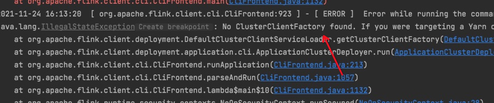
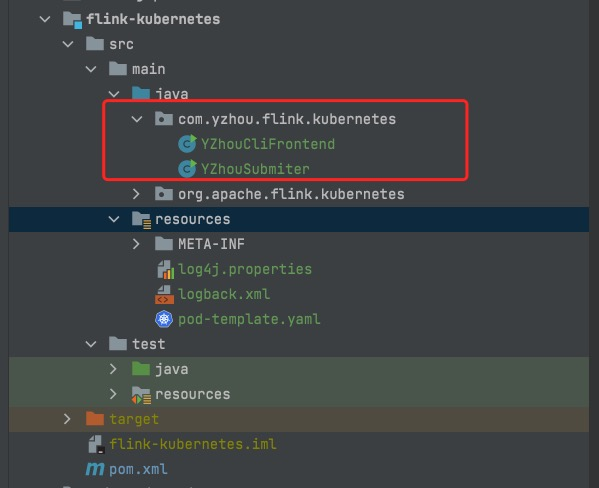

# Native Kubernetes作业提交源码环境搭建

## 定义入口类

**背景介绍**        
参考官网'https://nightlies.apache.org/flink/flink-docs-release-1.14/docs/deployment/resource-providers/native_kubernetes/', 介绍`Native Kubernetes`使用Application Mode提交作业，命令如下: 
```shell
$ ./bin/flink run-application \
    --target kubernetes-application \
    -Dkubernetes.cluster-id=my-first-application-cluster \
    -Dkubernetes.container.image=custom-image-name \
    local:///opt/flink/usrlib/my-flink-job.jar
```
从启动命令可知，入口脚本是flink安装包里的bin/flink，它里面执行语句是调用`org.apache.flink.client.cli.CliFrontend(在flink-clients模块中)`,  

```shell
exec "${JAVA_RUN}" $JVM_ARGS $FLINK_ENV_JAVA_OPTS "${log_setting[@]}" -classpath "`manglePathList "$CC_CLASSPATH:$INTERNAL_HADOOP_CLASSPATHS"`" org.apache.flink.client.cli.CliFrontend "$@"
```

>注意: 以上分析过程，很容易将读者带入到在flink-clients模块中调试，这样会存在class找不到的问题。     

原因是: flink-cients模块的`resources`没有添加`KubernetesClusterClientFactory`的SPI实现。所以会出现找不到此类。报错如下:   
    


>根据以上所述，需要在flink-kubernetes模块中调试。具体操作如下   

### 创建入口类
创建`YZhouCliFrontend.java`，内容如下:  
```java
public class YZhouCliFrontend extends CliFrontend {
    public YZhouCliFrontend(
            Configuration configuration,
            List<CustomCommandLine> customCommandLines) {
        super(configuration, customCommandLines);
    }
}
```     
创建`YZhouSubmiter.java`, 内容如下: 
```java
public class YZhouSubmiter extends YZhouCliFrontend {
    private static Logger logger = LoggerFactory.getLogger(YZhouSubmiter.class);
    public YZhouSubmiter(Configuration configuration, List<CustomCommandLine> customCommandLines) {
        super(configuration, customCommandLines);
    }


    public static void main(String[] args) {
        logger.info("作业启动!");
        // 1. find the configuration directory
        final String configurationDirectory = getConfigurationDirectoryFromEnv();

        // 2. load the global configuration
        final Configuration configuration =
                GlobalConfiguration.loadConfiguration(configurationDirectory);

        // 3. load the custom command lines
        final List<CustomCommandLine> customCommandLines =
                loadCustomCommandLines(configuration, configurationDirectory);

        YZhouSubmiter submiter = new YZhouSubmiter(configuration, customCommandLines);
        try {
            //启动
            submiter.runApplication(args);
        } catch (Exception e) {
            e.printStackTrace();
        }
    }
}
```     

具体目录结构，请参考下图    
    

现在用`YZhouSubmiter`当做入口类即可，main()参数，可参考官网中使用flink脚本添加的参数。


## Idea控制台日志配置
idea启动后，配置打印出日志，以下是具体配置内容: 

### 添加logback相关依赖
在pom.xml中添加logback相关依赖并配置properties
```xml
<logback.version>1.2.3</logback.version>
<log4j-over-slf4j.version>1.7.30</log4j-over-slf4j.version>

<dependency>
    <groupId>ch.qos.logback</groupId>
    <artifactId>logback-core</artifactId>
    <version>${logback.version}</version>
</dependency>
<dependency>
    <groupId>ch.qos.logback</groupId>
    <artifactId>logback-access</artifactId>
    <version>${logback.version}</version>
</dependency>
<dependency>
    <groupId>ch.qos.logback</groupId>
    <artifactId>logback-classic</artifactId>
    <version>${logback.version}</version>
</dependency>
<dependency>
    <groupId>org.slf4j</groupId>
    <artifactId>log4j-over-slf4j</artifactId>
    <version>${log4j-over-slf4j.version}</version>
</dependency>
```

### 配置logback.xml 
```xml
<configuration>
	<property name="CONSOLE_LOG_PATTERN"
			  value="%yellow(%d{yyyy-MM-dd HH:mm:ss.SSS}) [%blue(%thread)] %highlight(%-5level) %green(%logger{60}) %blue(%file:%line) %X{sourceThread} - %cyan(%msg%n)"/>
	<appender name="console" class="ch.qos.logback.core.ConsoleAppender">
		<encoder>
			<!--            <pattern>%d{yyyy-MM-dd HH:mm:ss.SSS} [%thread] %-5level %logger{60} %X{sourceThread} - %msg%n</pattern>-->
			<pattern>${CONSOLE_LOG_PATTERN}</pattern>
			<!-- 设置字符集 -->
			<charset>UTF-8</charset>
		</encoder>
	</appender>

	<!-- This affects logging for both user code and Flink -->
	<root level="INFO">
		<appender-ref ref="console"/>
	</root>

	<!-- Uncomment this if you want to only change Flink's logging -->
	<!--<logger name="org.apache.flink" level="INFO">-->
	<!--<appender-ref ref="console"/>-->
	<!--</logger>-->

	<!-- The following lines keep the log level of common libraries/connectors on
		 log level INFO. The root logger does not override this. You have to manually
		 change the log levels here. -->
	<logger name="akka" level="INFO">
		<appender-ref ref="console"/>
	</logger>
	<logger name="org.apache.kafka" level="INFO">
		<appender-ref ref="console"/>
	</logger>
	<logger name="org.apache.hadoop" level="INFO">
		<appender-ref ref="console"/>
	</logger>
	<logger name="org.apache.zookeeper" level="INFO">
		<appender-ref ref="console"/>
	</logger>

	<!-- Suppress the irrelevant (wrong) warnings from the Netty channel handler -->
	<logger name="org.apache.flink.shaded.akka.org.jboss.netty.channel.DefaultChannelPipeline" level="ERROR">
		<appender-ref ref="console"/>
	</logger>
</configuration>
``` 

以上配置完，可以在本地Idea环境调试Native Kubernetes提交Application Mode作业了。     