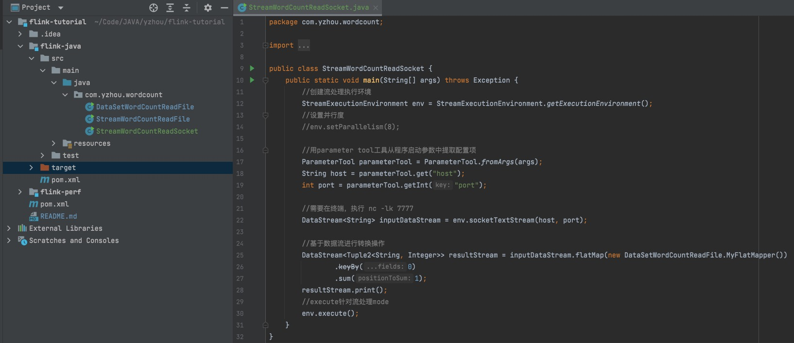
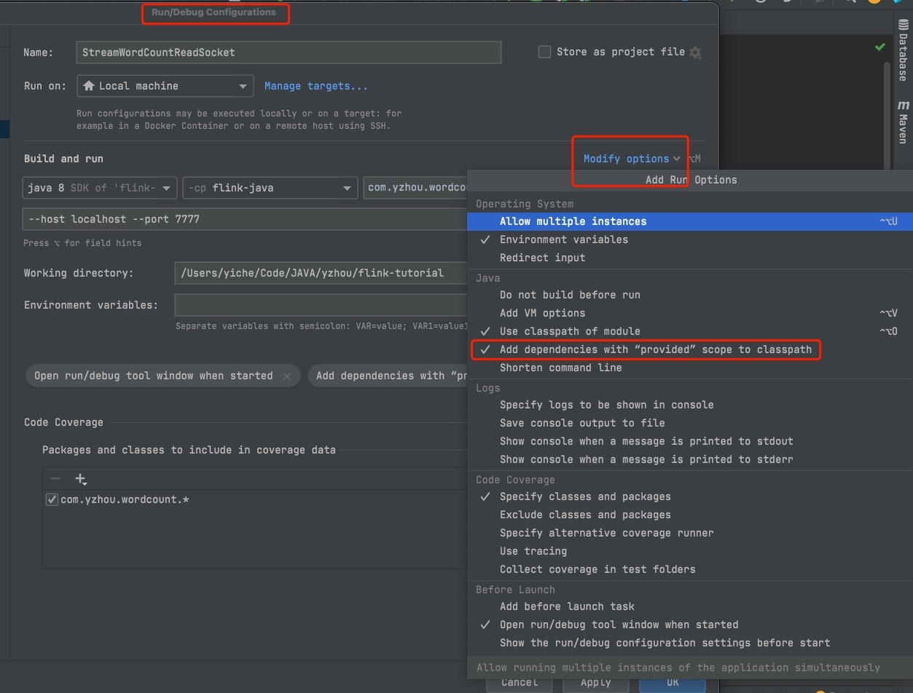
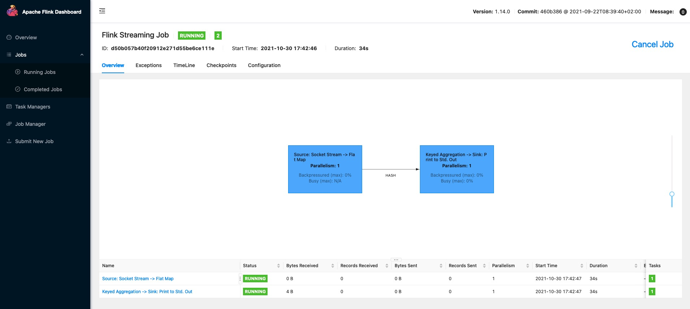
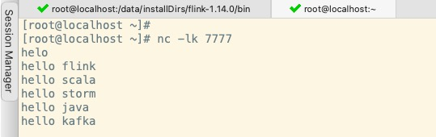
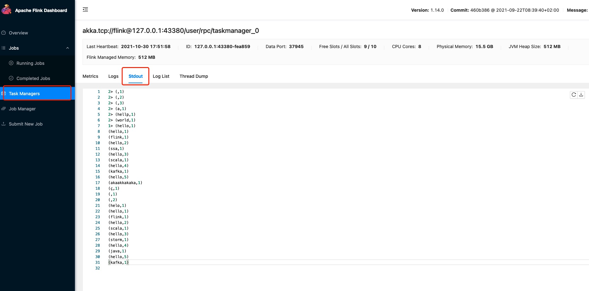

> 若没有特殊说明,Flink的默认版本是1.14.0        

## Idea搭建入门Flink程序        

### pom.xml添加依赖包

`Flink相关`
```xml
<dependency>
    <groupId>org.apache.flink</groupId>
    <artifactId>flink-java</artifactId>
    <version>1.14.0</version>
</dependency>
<dependency>
    <groupId>org.apache.flink</groupId>
    <artifactId>flink-streaming-java_2.12</artifactId>
    <version>1.14.0</version>
    <scope>provided</scope>
</dependency>
<dependency>
    <groupId>org.apache.flink</groupId>
    <artifactId>flink-clients_2.12</artifactId>
    <version>1.14.0</version>
</dependency>
``` 

`Log4j相关` 
```xml
<!-- LOGGING begin -->
<dependency>
    <groupId>org.slf4j</groupId>
    <artifactId>slf4j-api</artifactId>
    <version>1.7.32</version>
</dependency>
<dependency>
    <groupId>org.slf4j</groupId>
    <artifactId>slf4j-ext</artifactId>
    <version>1.7.32</version>
</dependency>
<!-- 代码直接调用commons-logging会被桥接到slf4j -->
<dependency>
    <groupId>org.slf4j</groupId>
    <artifactId>jcl-over-slf4j</artifactId>
    <version>1.7.32</version>
</dependency>
<!-- 代码直接调用java.util.logging会被桥接到slf4j -->
<dependency>
    <groupId>org.slf4j</groupId>
    <artifactId>jul-to-slf4j</artifactId>
    <version>1.7.32</version>
</dependency>
<dependency>
    <groupId>org.apache.logging.log4j</groupId>
    <artifactId>log4j-api</artifactId>
    <version>2.14.0</version>
</dependency>
<dependency>
    <groupId>org.apache.logging.log4j</groupId>
    <artifactId>log4j-core</artifactId>
    <version>2.14.0</version>
</dependency>
<!-- log4j-slf4j-impl(用于log4j2与slf4j集成) -->
<dependency>
    <groupId>org.apache.logging.log4j</groupId>
    <artifactId>log4j-slf4j-impl</artifactId>
    <version>2.14.0</version>
</dependency>
<!-- LOGGING end -->
``` 

### Main类
MyFlatMapper静态，将socket传输的内容，用空格分割成字典结构形成(key,1)的集合；
inputDataStream.flatMap()方法将集合根据字典中的0下标的字段作为分组String `keyBy(0)`，最后通过sum将分组，计算字典中的1下标的字段求和，计算出每个word出现的次数。
```java
public class StreamWordCountReadSocket {
    public static void main(String[] args) throws Exception {
        //创建流处理执行环境
        StreamExecutionEnvironment env = StreamExecutionEnvironment.getExecutionEnvironment();
        //设置并行度
        //env.setParallelism(8);

        //用parameter tool工具从程序启动参数中提取配置项
        ParameterTool parameterTool = ParameterTool.fromArgs(args);
        String host = parameterTool.get("host");
        int port = parameterTool.getInt("port");

        //需要在终端，执行 nc -lk 7777
        DataStream<String> inputDataStream = env.socketTextStream(host, port);

        //基于数据流进行转换操作
        DataStream<Tuple2<String, Integer>> resultStream = inputDataStream.flatMap(new MyFlatMapper())
                .keyBy(0)
                .sum(1);
        resultStream.print();
        //execute针对流处理mode
        env.execute();
    }
}

public static class MyFlatMapper implements FlatMapFunction<String, Tuple2<String, Integer>> {

        @Override
        public void flatMap(String s, Collector<Tuple2<String, Integer>> collector) throws Exception {
            //按空格分词
            String[] words = s.split(" ");
            for (String word : words) {
                collector.collect(new Tuple2<>(word, 1));
            }
        }
    }
```

**项目整理结构如图:**   
  

> 这里特别需要说明 maven dependency的scope(生命周期) ，在Flink作业部署在FLink环境中，有些Flink jar不需要打入包中(具体哪些jar不需要打入包中，后续文章会说明)，所以会将scope设置为provided。
但也存在特殊情况，例如在Idea本地运行Flink程序，仍然需要将jar设置为runtime生命周期中，这里有个Idea的 tips

操作：添加Main方法的 `Run/Debug Configurations` --> `Modify options` ---> `Add dependencies with "provided" scope to classpath`;        


>通过maven打包即可: mvn clean package

### Flink环境搭建(standalone模式)
下载`Apache Flink 1.14.0 for Scala 2.12` https://flink.apache.org/zh/downloads.html 

**本地部署**    
```shell
# 解压安装包
# 配置flink-conf.yaml的 taskmanager.numberOfTaskSlots参数，此参数用于TaskManager最多可容纳的slots数
# vim conf/flink-conf.yaml
taskmanager.numberOfTaskSlots: 10()

# cd bin/
# 启动Flink
./start-cluster.sh

# 关闭Flink
./stop-cluster.sh
```

**访问Flink Dashboard**
Dashboard默认端口是8081， localhost:8081  

`提交Flink作业` 
* 打开终端执行 nc -lk 7777 (nc没有安装，centos：yum install -y nc)
* 打开`Submit New Job` ,上传jar包，配置运行参数
Entry class: main方法的全限定类名   
Parallelism: 1 (不能大于taskmanager.numberOfTaskSlots参数值)
Program Arguments: --host localhost --port 7777 
* 提交作业，点击 Submit按钮 

`作业运行`  
  

`终端输入`  
  

`Stdout输出(日志查看)`  
 


>以上操作完成后，入门篇(1)-跑通作业已完成.....