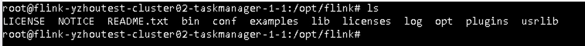

## Flink on Native Kubernetes Pod目录介绍

> 若没有特殊说明,Flink的默认版本是1.14.0

## Flink镜像 Dockfile
自定义打包Flink作业镜像, $FLINK_HOME = /opt/flink
```
FROM flink:1.14.0-scala_2.12-java8
RUN mkdir -p $FLINK_HOME/usrlib
COPY xxxxxxx/JAVA/yzhou/flink-tutorial/flink-perf/target/flink-perf-1.0-SNAPSHOT.jar $FLINK_HOME/usrlib/flink-perf-1.0-SNAPSHOT.jar
```   
Pod目录 对应的是Flink的目录


| Item      |    Value |
| :-------- | --------:|
|  usrlib  | 存放你的作业jar |
|  log     |  运行日志 | 