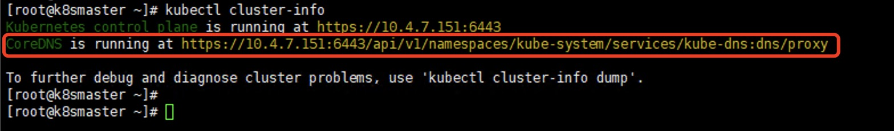

## Flink on Native Kubernetes   

> 若没有特殊说明,Flink的默认版本是1.14.0

### Flink 对 Kubernetes环境的要求
```
The Getting Started section assumes a running Kubernetes cluster fulfilling the following requirements:

* Kubernetes >= 1.9.
* KubeConfig, which has access to list, create, delete pods and services, configurable via ~/.kube/config. You can verify permissions by running kubectl auth can-i <list|create|edit|delete> pods.
* Enabled Kubernetes DNS.
* default service account with RBAC permissions to create, delete pods.

If you have problems setting up a Kubernetes cluster, then take a look at how to setup a Kubernetes cluster.
``` 

**验证**
* Kubernetes version >= 1.9         

* 检查是否list，create，delete，edit pods和services的权限满足   
```shell
kubectl auth can-i list pods
yes
kubectl auth can-i create pods
yes
kubectl auth can-i edit pods
yes
kubectl auth can-i delete pods
yes
kubectl auth can-i list services
yes
kubectl auth can-i create services
yes
kubectl auth can-i edit services
yes
kubectl auth can-i delete services
yes
``` 

* Enabled Kubernetes NDS
  

* 具有创建、删除pod的RBAC权限的默认服务账号
请参考: https://nightlies.apache.org/flink/flink-docs-release-1.14/zh/docs/deployment/resource-providers/native_kubernetes/#rbac
这里对官网文档做出一些补充：  
1.创建namespace (命名自己定义)  
2.创建serviceaccount (命名自己定义) 一定要加上 -n namespace 
3.创建clusterrolebinding (命名自己定义) 

`下面给出示例参考:`
```shell
kubectl create namespace yzhou
kubectl create serviceaccount flink -n yzhou
kubectl create clusterrolebinding flink-role-binding-flink -n yzhou  --clusterrole=edit --serviceaccount=yzhou:flink
```

>注意，这里创建的信息，会在后面的 Application Mode提交Flink Job用到


### 打包Flink作业镜像
请参考: https://nightlies.apache.org/flink/flink-docs-release-1.14/zh/docs/deployment/resource-providers/native_kubernetes/#application-mode    
这里对官网文档做出一些补充：    
1.官网是FROM flink,这里博主加上了版本及java版本 
2.在flink官方镜像中$FLINK_HOME=/opt/flink/, COPY是将本地的jar拷贝到flink镜像的路径中  
3.flink-perf-1.0-SNAPSHOT.jar  请参考我的github https://github.com/xinzhuxiansheng/flink-tutorial 
```
FROM flink:1.14.0-scala_2.12-java8
RUN mkdir -p $FLINK_HOME/usrlib
COPY xxxxxxx/JAVA/yzhou/flink-tutorial/flink-perf/target/flink-perf-1.0-SNAPSHOT.jar $FLINK_HOME/usrlib/flink-perf-1.0-SNAPSHOT.jar
``` 

**docker打包相关命令**
```shell
# cd到Dockerfile文件目录下
docker build -t="xxxxxx/flinkperf:v1" .
# 上传到私有Harbor或者Docker Hub
docker push xxxxxx/flinkperf:v1
```

>保证镜像打包好

### 运行Flink Job on Kubernetes 

**1.下载Flink**
下载`Apache Flink 1.14.0 for Scala 2.12` https://flink.apache.org/zh/downloads.html     
解压 tar -zxf xxxxxx.tgz

**2.Application Mode提交Job**   
1.-Dkubernetes.namespace=yzhou 指定namespace  
2.-Dkubernetes.cluster-id 集群名称  
3.-Dkubernetes.service-account=flink 这个是上文中创建的service-account  
4.-Dkubernetes.container.image=xxxxxx/flinkperf:v1  指定你的镜像  
5.local:///opt/flink/usrlib/flink-perf-1.0-SNAPSHOT.jar   镜像中已经包含了jar，这里的local是当做参数，告诉镜像执行哪个jar，所以路径要按照$FLINK_HOME      

```shell
./bin/flink run-application -p 8 -t kubernetes-application \
  -Dkubernetes.namespace=yzhou \
  -Dkubernetes.cluster-id=flink-yzhoutest-cluster \
  -Dkubernetes.service-account=flink \
  -Dtaskmanager.memory.process.size=4096m \
  -Dkubernetes.taskmanager.cpu=2 \
  -Dtaskmanager.numberOfTaskSlots=4 \
  -Dkubernetes.container.image=hub.xxxxx.com/library/yzhouflinkperf:v1.2 \
  local:///opt/flink/usrlib/flink-perf-1.0-SNAPSHOT.jar 
``` 

**3.查看Flink Dashboard**
Flink Dashboard默认端口是8081，查看端口映射关系
示例   
```shell
kubectl get all -n yzhou
```
>根据以下示例： 8081:31548/TCP ,所以访问 IP:31548 即可  

```
[root@l82-15-p-pbs flink-1.14.0]# kubectl get all -n yzhou
NAME                                           READY   STATUS    RESTARTS   AGE
pod/flink-yzhoutest-cluster-67774ff55c-stfbn   1/1     Running   0          71m
pod/flink-yzhoutest-cluster-taskmanager-1-1    1/1     Running   0          70m
pod/flink-yzhoutest-cluster-taskmanager-1-2    1/1     Running   0          70m

NAME                                   TYPE           CLUSTER-IP     EXTERNAL-IP   PORT(S)             AGE
service/flink-yzhoutest-cluster        ClusterIP      None           <none>        6123/TCP,6124/TCP   93m
service/flink-yzhoutest-cluster-rest   LoadBalancer   10.106.90.85   <pending>     8081:31548/TCP      93m

NAME                                      READY   UP-TO-DATE   AVAILABLE   AGE
deployment.apps/flink-yzhoutest-cluster   1/1     1            1           93m

NAME                                                 DESIRED   CURRENT   READY   AGE
replicaset.apps/flink-yzhoutest-cluster-67774ff55c   1         1         1       76m
replicaset.apps/flink-yzhoutest-cluster-6d84b5dcc9   0         0         0       93m
```