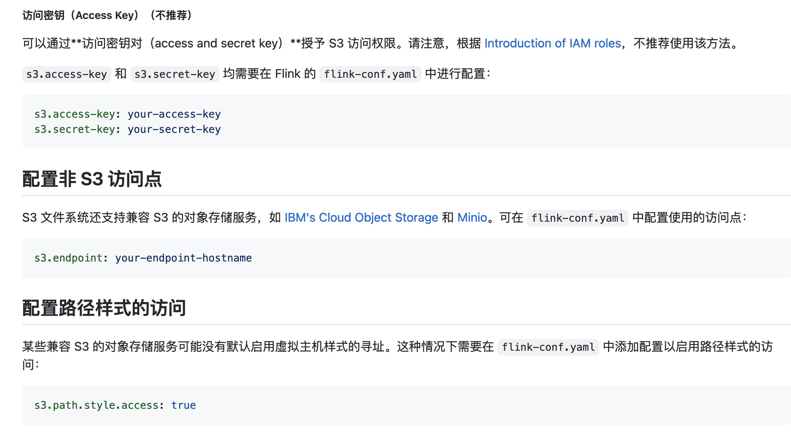
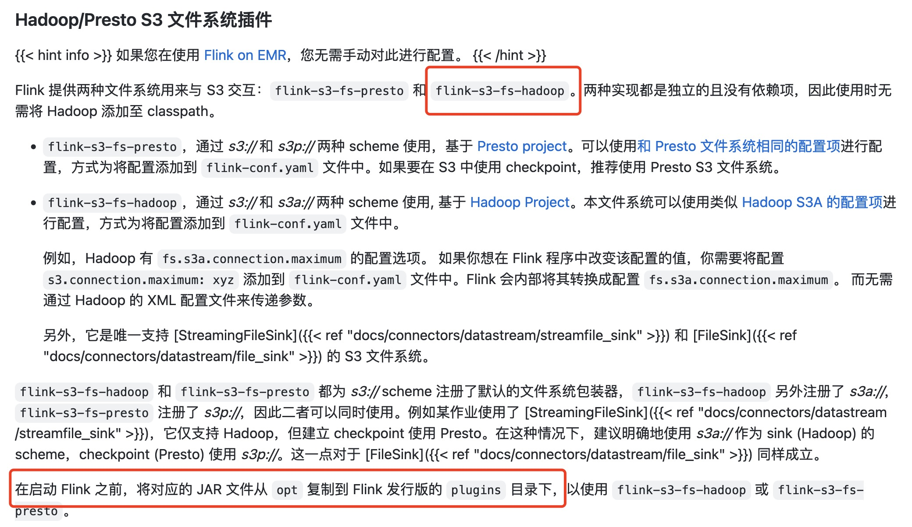
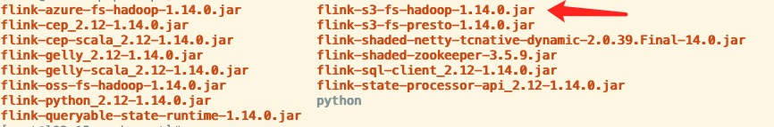

## Flink on Native Kubernetes HA

> 若没有特殊说明,Flink的默认版本是1.14.0

### 如何搭建 on Native Kubernetes HA？
参考：https://nightlies.apache.org/flink/flink-docs-release-1.14/docs/deployment/ha/kubernetes_ha/  
这里对官网文档做出一些补充：  
从doc可知，Flink on Native Kubernetes HA，需要配置一下参数（required）: 
```
high-availability: org.apache.flink.kubernetes.highavailability.KubernetesHaServicesFactory
high-availability.storageDir: s3://flink/recovery
kubernetes.cluster-id: cluster1337
```   
以上参数配置可在提交作业时指定，后面会在"如何提交 on Native kubernetes HA 作业"介绍 ......  

* high-availability是固定值，所以忽略。
* high-availability.storageDir 配置的File Systems路径，这里请参考官网的 `File Systems`菜单介绍。  
**以下给出基于S3（腾讯云的COS）的配置项: **
step01: 
在fink安装目录中，配置`flink-conf.yaml`, 请参考flink Github：https://github.com/apache/flink/blob/5559d3d98d76b7fe982631ade7fcef520e2eb66c/docs/content.zh/docs/deployment/filesystems/s3.md  



* Hadoop/Presto S3文件系统插件


> 在使用S3作为HA的存储介质，需要配置flink-s3-fs-hadoop插件，这里需要提醒，Flink v1.14.0的安装目录下的`opt`文件包含该插件,故不用下载，至于如何配置参考后面 "如何提交 on Native kubernetes HA 作业"介绍。 



`flink-conf.yaml`
```
s3.access-key: your-access-key
s3.secret-key: your-secret-key
s3.endpoint: your-endpoint-hostname
s3.path.style.access: true
```

### 如何提交 on Native Kubernetes HA 作业？
参考：https://flink.apache.org/2021/02/10/native-k8s-with-ha.html   
这里对该博主文档做出一些补充：  
文档给出的样例启动命令: 
```
./bin/flink run-application \
    --detached \
    --parallelism 4 \
    --target kubernetes-application \
    -Dkubernetes.cluster-id=k8s-ha-app-1 \
    -Dkubernetes.container.image=<user-image> \
    -Dkubernetes.jobmanager.cpu=0.5 \
    -Dkubernetes.taskmanager.cpu=0.5 \
    -Dtaskmanager.numberOfTaskSlots=4 \
    -Dkubernetes.rest-service.exposed.type=NodePort \
    -Dhigh-availability=org.apache.flink.kubernetes.highavailability.KubernetesHaServicesFactory \
    -Dhigh-availability.storageDir=s3://flink-bucket/flink-ha \
    -Drestart-strategy=fixed-delay \
    -Drestart-strategy.fixed-delay.attempts=10 \
    -Dcontainerized.master.env.ENABLE_BUILT_IN_PLUGINS=flink-s3-fs-hadoop-1.12.1.jar \
    -Dcontainerized.taskmanager.env.ENABLE_BUILT_IN_PLUGINS=flink-s3-fs-hadoop-1.12.1.jar \
    local:///opt/flink/usrlib/my-flink-job.jar
```

>这里，有很多参数在 Flink入门篇(2)-Flink on Native Kubernetes实操提到 

```shell
# HA配置
-Dhigh-availability=org.apache.flink.kubernetes.highavailability.KubernetesHaServicesFactory
-Dhigh-availability.storageDir=s3://flink-bucket/flink-ha

# 重启策略 Restart strategy 该博文中 还缺少restart-strategy.fixed-delay.delay
-Drestart-strategy=fixed-delay
# 间隔重启指的事在一次失败的执行之后，并不会立即重新开始另一执行，而是在一段间隔之后再开始，当程序与外部系统进行交互，比如连接或待定事务需要在Flink尝试重新执行之前超时，该方法有帮助的
#-Drestart-strategy.fixed-delay.delay=2s 
# 在作业宣布失败之前Flink尝试重启的次数
-Drestart-strategy.fixed-delay.attempts=10  
# 假如 delay=1s,attempts=1,那么重启的策略就为每2秒尝试重启一次，要么重启成功，要么失败进入下一次重启尝试，如果累计重试次数达到3次但是任然没有成功，那么这个task重启就算失败

# Hadoop S3文件系统插件 (该配置是复制该博客，请参考Flink v1.14.0的具体版本)
-Dcontainerized.master.env.ENABLE_BUILT_IN_PLUGINS=flink-s3-fs-hadoop-1.12.1.jar
-Dcontainerized.taskmanager.env.ENABLE_BUILT_IN_PLUGINS=flink-s3-fs-hadoop-1.12.1.jar


# 以下是本人补充
# 配置jobmanager的副本为2，默认值为1。
-Dkubernetes.jobmanager.replicas=2
```

### 如何验证jobmanager