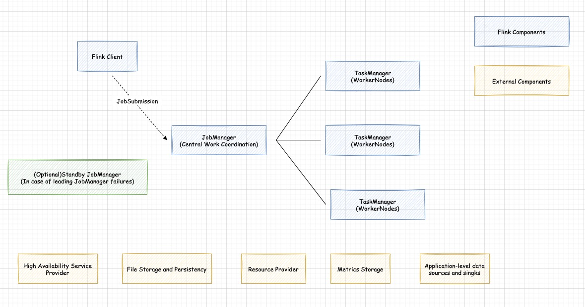
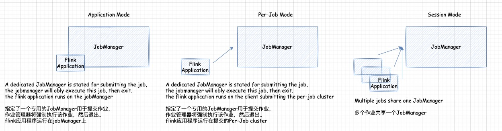

## 概述和参考架构
下图展示了每个Flink集群的构建块。总是有客户端在运行。它获取Flink应用程序的代码，将其转换为JobGraph并提交给JobManager。JobManager将工作分配到TaskManagers上，在那里运行实际的操作符(例如 sources，transformations and sinks)。   
在部署Flink时，每个构建块通常有多个选项可用。我们在图下方的表格中累出它们。
 

| Component      | Purpose | Implementations  |
| :-------- | --------| :-- |
| Flink Client  | 将批或流应用程序编译成数据流图，然后将其提交给JobManager |  命令行界面、REST API、SQL Client、Python REPL、Scala REPL |
| JobManager     |   JobManager是Flink的中心工作协调组件，它具有针对不同资源提供者的实现，这些实现在高可用性、资源分配行为和支持的作业提交方面有所不同  * Application Mode：专为一个应用运行的集群。作用的主要方法(或客户端)在JobManager执行。支持在应用程序中多次调用’execute/executeAsync‘   * Per-Job Mode：专门为一项作业运行的集群创建之前运行。  * Seesion ModeL: 一个JobManager实例管理共享同一个TaskManager集群的多个作业 | * Standalone (this is the barebone mode that requires just JVMs to be launched. Deployment with Docker, Docker Swarm / Compose, non-native Kubernetes and other models is possible through manual setup in this mode)   * Kubernetes   * YARN  |
| TaskManager      | TaskManager是实际执行Flink作业工作的服务 |   |
| TaskManager      | TaskManager是实际执行Flink作业工作的服务 |   |

## 部署模式
Flink可以通过以下三种方式执行应用程序： 
* Application Mode  
* Per-Job Mode  
* Seesion Mode      
以上模式的区别在于: 
* 集群生命周期和资源隔离保证    
* 应用程序的main()方法在客户端还是集群上执行        
     

### Application Mode
在所有其他模式中，应用程序的main()方法在客户端执行。此过程包括在本地下载应用程序的依赖项，执行main()以提取 Flink 的运行时可以理解的应用程序表示（即JobGraph），并将依赖项和JobGraph(s)传送到集群。这使得客户端成为大量资源消耗者，因为它可能需要大量网络带宽来下载依赖项并将二进制文件传送到集群，并且需要 CPU 周期来执行 main(). 当客户端在用户之间共享时，这个问题会更加明显。

基于这个观察，Application Mode为每个提交的应用程序创建一个集群，但这一次，main()应用程序的方法是在 JobManager 上执行的。为每个应用程序创建一个集群可以看作是创建一个仅在特定应用程序的作业之间共享的会话集群，并在应用程序完成时拆除。使用这种架构，应用程序模式提供与Per-Job模式相同的资源隔离和负载平衡保证，但以整个应用程序的粒度。执行main()在 JobManager 上允许保存所需的 CPU 周期，但也保存本地下载依赖项所需的带宽。此外，它允许更均匀地分布网络负载以下载集群中应用程序的依赖项，因为每个应用程序有一个 JobManager。

在应用程序模式下，在main()集群上执行，而不是在客户端上执行，就像在其他模式下一样。这可能会对您的代码产生影响，例如，您在环境中使用 注册的任何路径都registerCachedFile()必须可由应用程序的 JobManager 访问。
与Per-Job模式相比，Application Mode允许提交由多个作业组成的应用程序。作业执行的顺序不受部署模式的影响，而是受用于启动作业的调用的影响。使用execute()阻塞，建立一个顺序，它将导致“下一个”作业的执行被推迟，直到“这个”作业完成。使用executeAsync()，这是非阻塞的，将导致“下一个”作业在“此”作业完成之前开始。

应用程序模式允许多个execute()应用程序，但在这些情况下不支持高可用性。应用程序模式下的高可用性仅支持单一execute()应用程序。

此外，当应用程序模式下多个正在运行的作业（例如使用 提交 executeAsync()）中的任何一个被取消时，所有作业都将停止并且 JobManager 将关闭。支持定期作业完成（通过源关闭）。

### Per-Job Mode
Per-Job模式旨在提供更好的资源隔离保证，使用可用的资源提供者框架（例如 YARN、Kubernetes）为每个提交的作业启动一个集群。此集群仅可用于该作业。作业完成后，集群将被拆除并清除所有遗留资源（文件等）。这提供了更好的资源隔离，因为行为不端的作业只能关闭它自己的 TaskManager。此外，它将簿记负载分散到多个 JobManager 中，因为每个作业有一个。由于这些原因，Per-Job资源分配模型是许多生产原因的首选模式。

### Seesion Mode
Seesion Mode假设一个已经在运行的集群并使用该集群的资源来执行任何提交的应用程序。在同一（会话）集群中执行的应用程序使用并因此竞争相同的资源。这样做的优点是您无需为每个提交的作业支付启动完整集群的资源开销。但是，如果其中一个作业行为不当或关闭了 TaskManager，那么在该 TaskManager 上运行的所有作业都将受到故障的影响。除了对导致失败的作业的负面影响之外，这意味着潜在的大规模恢复过程，所有重新启动的作业同时访问文件系统并使其对其他服务不可用。此外，让单个集群运行多个作业意味着 JobManager 的负载更大，

### 总结 
在Session Mode下，集群生命周期独立于集群上运行的任何作业的生命周期，并且资源在所有作业之间共享。在每个作业方式支付旋转起来为每个提交的作业集群的价格，但这种带有更好的隔离保证的资源不能跨岗位共享。在这种情况下，集群的生命周期与作业的生命周期绑定。最后， Application Mode为每个应用程序创建一个会话集群，并main() 在集群上执行应用程序的方法。

