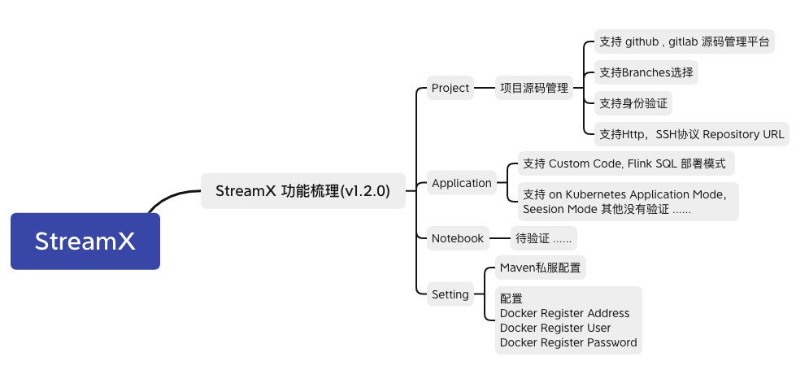

# 环境配置

>根据上一篇《安装部署.md》，StreamX平台已经可以查看Web UI，但不等于可以提交作业....   :)


## StreamX菜单介绍      

    


|  菜单项   |    描述 | 
| :-------- | --------|
| Project  | 通过项目源码仓库管理,来管控后续作业提交的jar包管理 |
| Application  | 配置Flink Job的类型  |
| Notebook      |  略 |
| Setting      | 在StreamX运行节点配置Maven，配置Docker |


## StreamX运行节点配置

StreamX的v1.2.0的运行节点依赖：Node v14.18.1，Flink 1.14.0 scala2.11，Jdk 1.8, Docker。

### 环境变量配置

```shell
NODE_HOME=/root/nodejs/node-v14.18.1-linux-x64
FLINK_HOME=/data/flink-1.14.0
MAVEN_HOME=/data/apache-maven-3.8.4
JAVA_HOME=/data/jdk1.8.0_291
JRE_HOME=/data/jdk1.8.0_291/jre
PATH=$PATH:$JAVA_HOME/bin:$JRE_HOME/bin:$MAVEN_HOME/bin:$FLINK_HOME/bin:$NODE_HOME/bin
CLASSPATH=.:$JAVA_HOME/lib/dt.jar:$JAVA_HOME/lib/tools.jar:$JRE_HOME/lib
export JAVA_HOME JRE_HOME PATH CLASSPATH MAVEN_HOME FLINK_HOME NODE_HOME
```
>Node，Flink，Jdk配置较为简单，Docker安装较复杂，以下特别说明:  

**Docker的配置**

首先配置一下Docker的阿里yum源   

```
cat >/etc/yum.repos.d/docker.repo<<EOF
[docker-ce-edge]
name=Docker CE Edge - \$basearch
baseurl=https://mirrors.aliyun.com/docker-ce/linux/centos/7/\$basearch/edge
enabled=1
gpgcheck=1
gpgkey=https://mirrors.aliyun.com/docker-ce/linux/centos/gpg
EOF
```

然后yum方式安装docker   

```
# yum安装
yum -y install docker-ce

# 查看docker版本
docker --version  

# 启动docker
systemctl enable docker
systemctl start docker
```

配置docker的镜像源 
在/etc/docker/daemon.json文件（没有请自行创建）添加如下配置： 
//一般不需要配置 ：   "exec-opts": ["native.cgroupdriver=systemd"],
```
{
  "insecure-registries": ["hub.xxxxx.com"]
}
```
然后重启Docker

```shell
systemctl daemon-reload
systemctl restart docker
``` 

**配置Docker registries**
vim /etc/docker/daemon.json
```
{
  "insecure-registries": ["hub.xxxxx.com"]
}
```

systemctl daemon-reload
systemctl restart docker

**Docker登录 Harbor**
docker login hub.xxxxx.com


### 环境校验

#### Maven测试
StreamX平台，在Project模块默认配置了`streamx-quickstart`, 这个项目依赖streamx的v1.2.0相关的jar包，而仓库中目前推送了 1.1.0,1.0.0 版本，所以clone streamx v1.2.0源码，在当前Streamx运行节点，将streamx v1.2.0的jar安装到本地maven仓库中去。      
```shell
git clone https://github.com/streamxhub/streamx.git
cd Streamx
mvn clean install -DskipTests -Denv=prod
```

成功即可

#### Docker测试
```shell
# verify access
docker login --username=<your_username> <your_register_addr>
# verify push permission
docker pull busybox
docker tag busybox <your_register_addr>/streamx/busybox
docker push <your_register_addr>/streamx/busybox
# verify pull permission
docker pull <your_register_addr>/streamx/busybox
```     

#### Kubernetes链接配置
StreamX 直接使用系统 ～/.kube/config 作为 Kubernetes 集群的连接凭证，最为简单的方式是直接拷贝 Kubernetes 节点的 .kube/config 到 StreamX 节点用户目录，各云服务商 Kubernetes 服务也都提供了相关配置的快速下载。当然为了权限约束，也可以自行生成对应 k8s 自定义账户的 config。            


#### Setting菜单配置Docker Register Address/User/Password
配置即可        


#### FLINK_HOME下的Flink的conf配置

1. nfs秘钥的配置，例如s3 如下：
```
s3.access-key: AKIDjxxxxxx
s3.secret-key: Z6NNcdxxxxx
s3.endpoint: cos.xxxxx.com
s3.path.style.access: true
```

2. metrics上报配置,例如 
```
metrics.reporter.promgateway.class: org.apache.flink.metrics.prometheus.PrometheusPushGatewayReporter
metrics.reporter.promgateway.host: xxx.xxx.com
metrics.reporter.promgateway.port: 80
metrics.reporter.promgateway.jobName: flinkonk8s_test
metrics.reporter.promgateway.randomJobNameSuffix: false
metrics.reporter.promgateway.deleteOnShutdown: false
metrics.reporter.promgateway.groupingKey: _token=xxxxx;_step=60
metrics.reporter.promgateway.interval: 60
```


>以上环境配置就绪，即可摩拳擦掌了。:)

## Flink 作业在StreamX的提交流程        


作业表单的信息填写对应的是flink run的命令参数，例如：  

```shell

  ./bin/flink run-application \
    --detached \
    -p 4 -t kubernetes-application \
    -Dkubernetes.namespace=yzhou \
    -Dkubernetes.cluster-id=flink-yzhoutest-cluster03 \
    -Dkubernetes.service-account=flink \
    -Dtaskmanager.memory.process.size=10240m \
    -Dkubernetes.taskmanager.cpu=2 \
    -Dtaskmanager.numberOfTaskSlots=4 \
    -Dkubernetes.container.image=hub.xxxxx.com/library/yzhouflinkperf:v1.3.5 \
    -Dkubernetes.rest-service.exposed.type=NodePort \
    -Dhigh-availability=org.apache.flink.kubernetes.highavailability.KubernetesHaServicesFactory \
    -Dhigh-availability.storageDir=s3://xxxx/flink-ha \
    -Drestart-strategy=fixed-delay \
    -Drestart-strategy.fixed-delay.attempts=10 \
    -Dcontainerized.master.env.ENABLE_BUILT_IN_PLUGINS=flink-s3-fs-hadoop-1.14.0.jar \
    -Dcontainerized.taskmanager.env.ENABLE_BUILT_IN_PLUGINS=flink-s3-fs-hadoop-1.14.0.jar \
    -Dkubernetes.jobmanager.replicas=2 \
    -c com.yzhou.perf.KafkaProducerPerfTestJob \
    local:///opt/flink/usrlib/flink-perf-1.0-SNAPSHOT.jar \
    --bootstrapServers 10.xxx.xxx.xx:9092 \
    --topic yzhoutp01 
```     

-D的动态动态参数，填入： `Dynamic Option`       
程序参数 --   填入：`Program Args`

注意： -Dkubernetes.container.image 配置的是 包含程序的jar的镜像， 而StreamX会帮我们打好镜像传入Harbor中，所以在表单的 `Flink Base Docker Image` 填写的FLink的镜像或者自定义的FLink镜像 并不包含要运行的jar，例如： `flink:1.14.0-scala_2.11-java8`     

