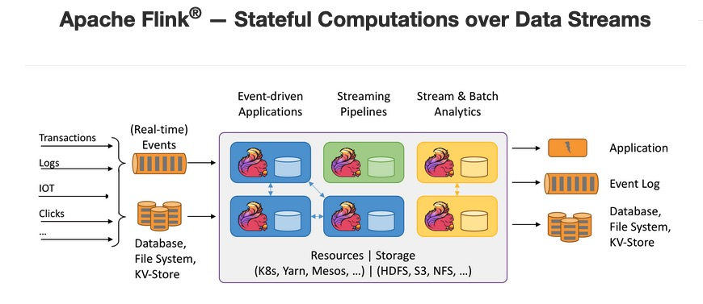

## Flink ? 

首先了解：
https://nightlies.apache.org/flink/flink-docs-release-1.14/zh/docs/learn-flink/overview/

### 并行度和Slot
请参考： https://cwiki.apache.org/confluence/display/FLINK/Data+exchange+between+tasks

### Timestamp

### State

### Checkpoint And Savepoint

refer:

Flink官网
https://flink.apache.org/

Flink中文社区
https://flink-learning.org.cn/

优秀的Flink平台开源项目
StreamX  https://github.com/streamxhub/streamx
Dlink  https://github.com/DataLinkDC/dlink

源码调试
https://cloud.tencent.com/developer/article/1955146

FAQ
1.Flink Checkpoint问题排查实用指南
《Apache Flink十大技术难点实战》
2.如何分析及处理Flink反压？
《Apache Flink十大技术难点实战》