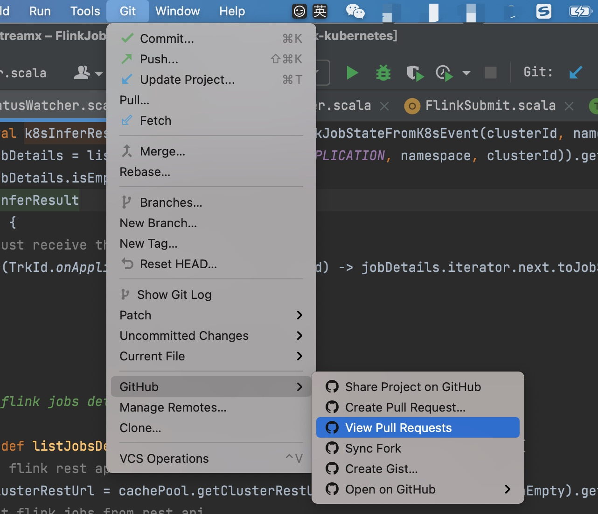
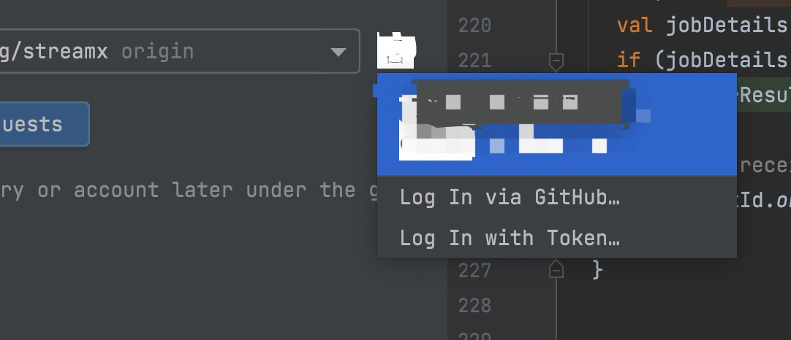

## Idea中Code Review操作

### 1. 操作步骤    
`Git --> GitHub --> View Pull Request`  

                

### 2. 配置Token，登录GitHub   
`Log In Witch Token`    
     

登录GitHub生成Token     
`Settings --> Developer settings --> Personal access tokens`            
生成Token后，将Token配置在Idea中即可。

